# Step 2: Run the Common Pipelines Patterns

Use `02_pipeline` in the Engineering Development workspace to demonstrate how FabricOps reads from files, Lakehouse tables and Query Warehouse tables and write to them respectively.


```text
Demo Includes: 

Files → Lakehouse and Warehouse
Lakehouse → transformation → Warehouse
Warehouse → SQL query → Lakehouse
```

## Before you begin

Complete [Step 0B: Set up the operating environment](00B-run-environment-setup.md) before running this notebook.

Confirm that `00_env_config` defines these medallion layers. 

| Layer | Item type | Purpose |
| --- | --- | --- |
| `source` | Lakehouse | Stores the four source files and receives the final Demo 3 output |
| `unified` | Lakehouse | Receives the Lakehouse table created in Demo 1 |
| `product` | Warehouse | Receives the Warehouse tables created in Demo 1 and Demo 2 |

For simplicity we use `demo` schema for all managed Lakehouse and Warehouse tables.

## 0. Upload the demo files

In the Source Lakehouse, upload the four files into the following folder:

```text
Files/DemoData/
├── excel_file_demo.xlsx
├── lakehouse_data_demo.csv
├── parquet_file.parquet
└── warehouse_data_demo.csv
```

You can download it from here if you havent already done so [`templates/DemoData/`](../../templates/DemoData/).

Then go to your soruce lakehouse , click get data and upload files 

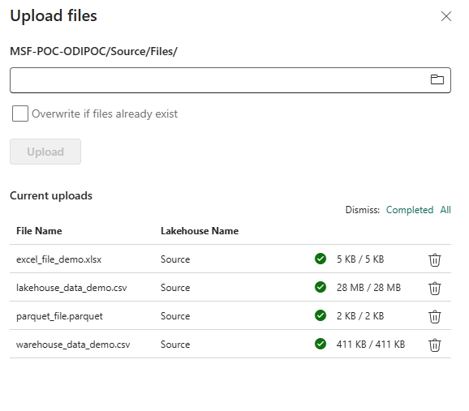


## 1. Open `02_pipeline`

Open `02_pipeline` in the Engineering Development workspace.

Attach the same Fabric Environment used by `00_env_config`, then restart the notebook session if the Environment or installed FabricOps package changed.

## 2. Import the FabricOps IO functions

Run the notebook setup cell from the template first. Then import the IO functions used in this demonstration.

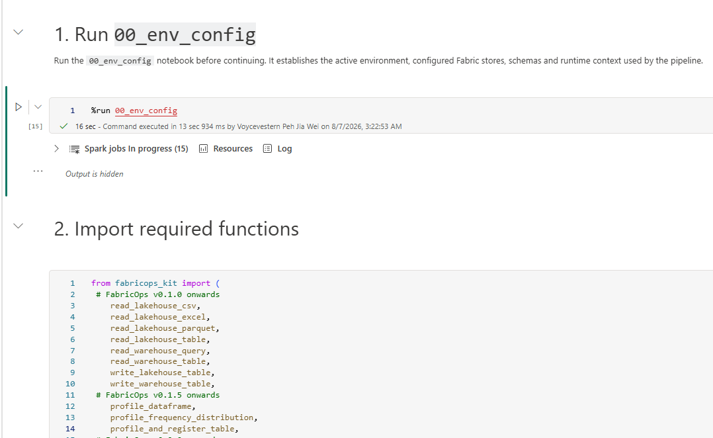


### 3. Read the excel_file_demo.xlsx

Use `read_lakehouse_excel()` for an Excel workbook stored in the Source Lakehouse `Files` area. 

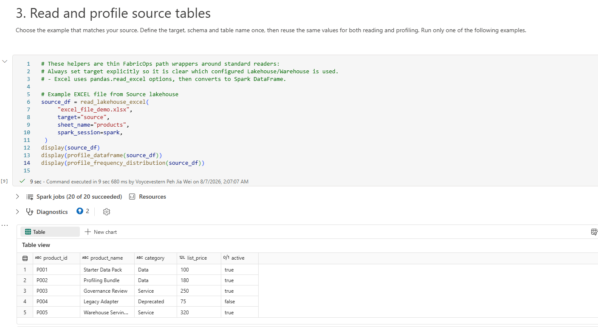
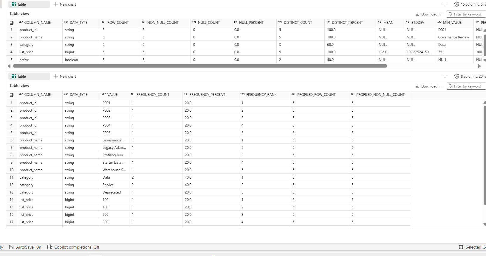
This reads the first worksheet and returns a Spark DataFrame.

### 4. Read the parquet_file_demo.parquet

Use `read_lakehouse_parquet()` for the Parquet file stored in the Source Lakehouse `Files` area. 

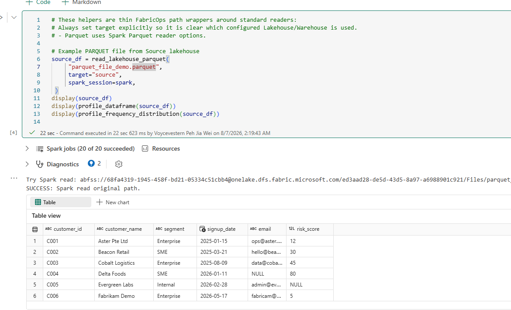

## 5. Read the Lakehouse_data_demo.csv & write it to a Lakehouse

Use `read_lakehouse_csv()` to read the CSV file intended for the Lakehouse Demo.

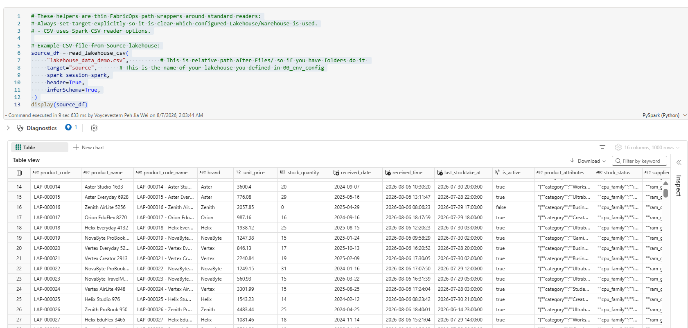

Scroll all the way down in the 02 Pipeline template where you see `5. User define transformation` here you are able to do whatever transformation on the source dataframes you ingested earlier . `Pro tip:` Just use Ms Copilot and define what you want to achieve its preety decent at writing code.

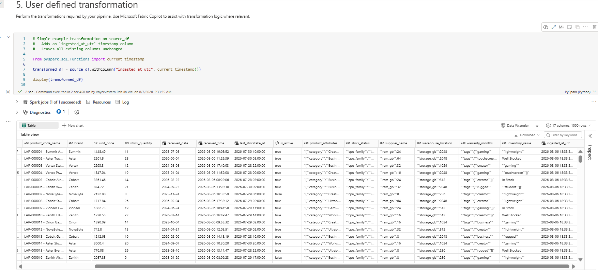

Scroll all the way down in the 02 Pipeline template where you see `7. Write and profile the target (Lakehouse)` Run this to write to the Unified Lakehouse, 

Note that we have commented out the partion_by and repartion_by parameters? 
`Pro tip` You can use that to do parallel processing with pyspark its faster but takes up more compute , `be sure to use it on a proper partion column like date not datetime `else you will end up with a `multiple small files` problem which end up making the write and table read extremely slow.

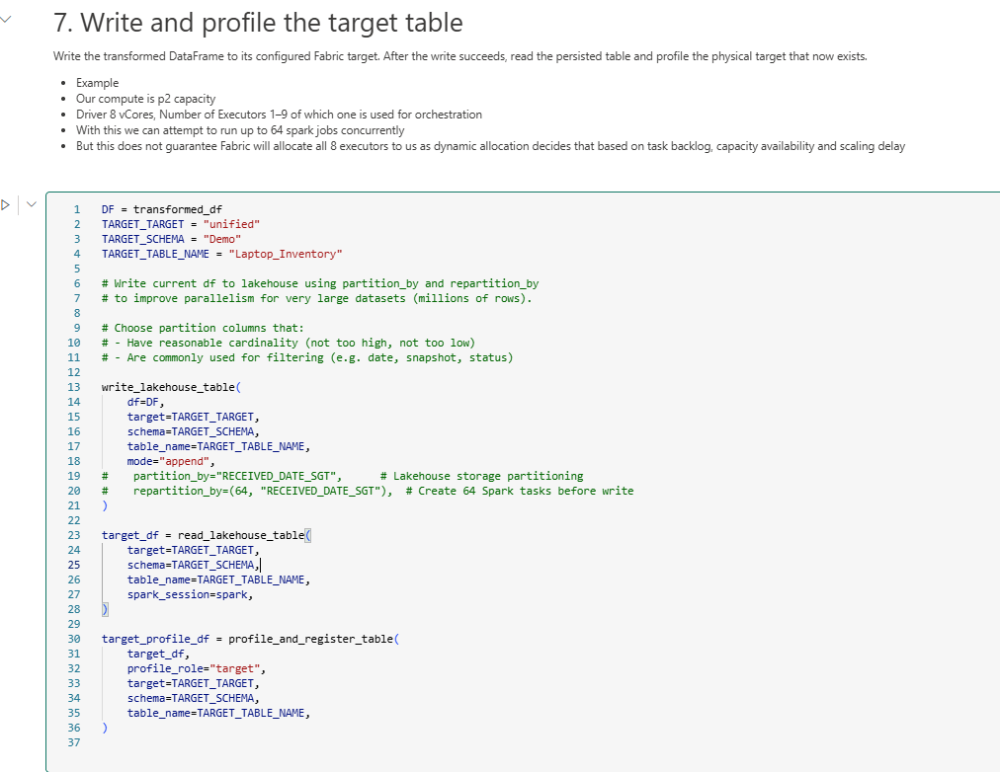

If you noticed we have written to 3 tables

Optional: You can also display what we have just written `Note` frequency rows for columns with lesser than 80% distinct rate are being created and saved automatically; `display(target_profile_df)` just shows the compact summary.

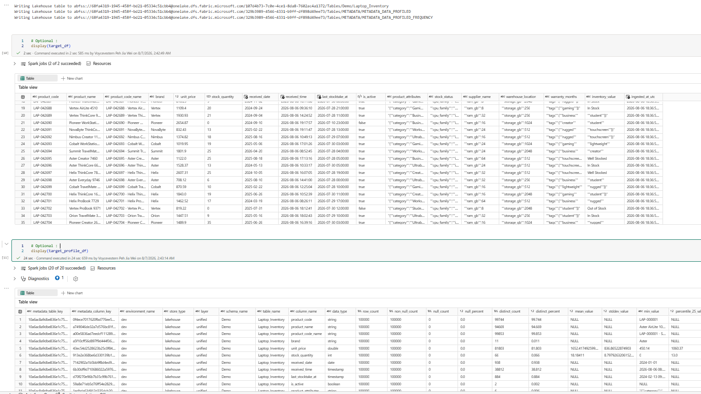

## 6. Read the Warehouse_data_demo.csv & write it to a warehouse

Use read_lakehouse_csv() to read the CSV file intended for the Warehouse Demo.

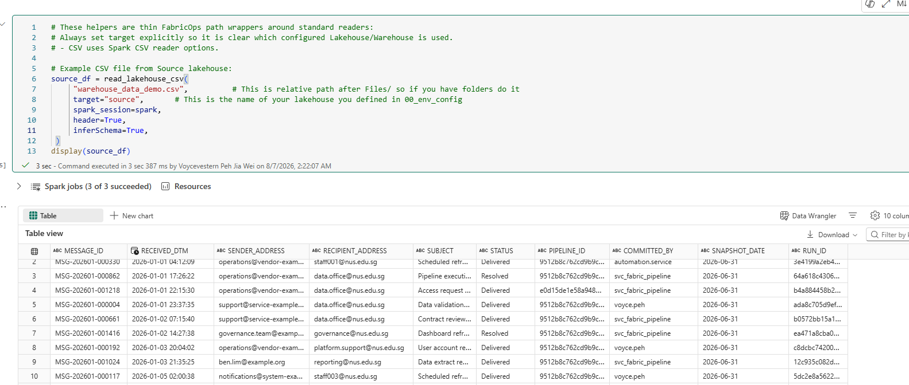

Unlike Lakehouse before we can write to a Warehouse schema it need to be created via SQL first. So go to your warehouse and run `Create Schema demo`

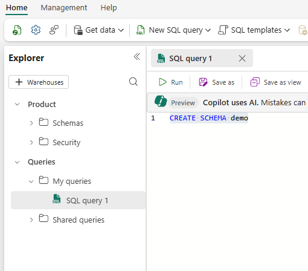

Go back and Scroll all the way down in the 02 Pipeline template where you see `Alternative 7. Write and profile the target (Warehouse)` Run this to write to the warehouse, for simplicity we will just write the source_df directly to warehouse without transformation.

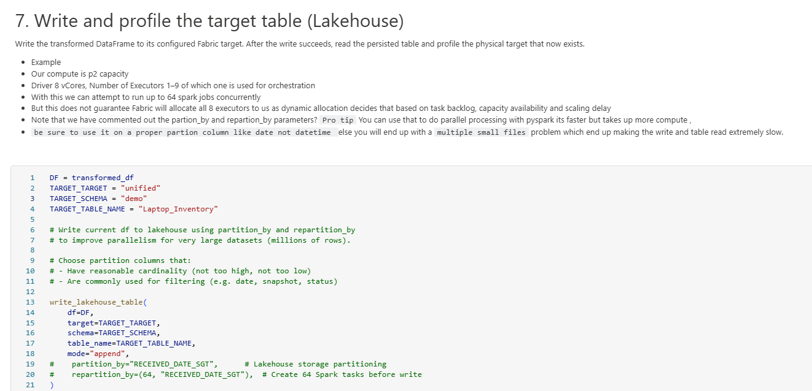


## 7. Read a table from the Warehouse via a query & write it into a lakehouse via parallel processing

Use `read_warehouse_query` or `read_warehouse_table` which you can think of it as simply select * to read the warehouse table we loaded in earlier 

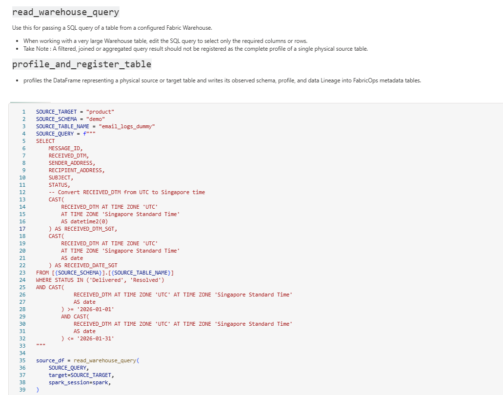

Note that as we focus on using pyspark, reading from warehouse means we need to convert spark to sql and back... 
so lakehouse provide us with much better performance especially when data gets bigger, 

A test I carried out was reading 35 million rows of data via warehouse via this `read_warehouse_query` method , tooks ~5+ mins but if the data is already in a lakehouse it just takes ~9 seconds. `Pro tip` wherever possible store the data into lakehouse for your processing needs especially if you need to do heavy processing then you can leverage on pyspark parallel processing.

Ok , Scroll all the way down in the 02 Pipeline template where you see `7. Write and profile the target (Lakehouse)` lets change a few parameters now, then run it just to showcase how to run in parallel processing.

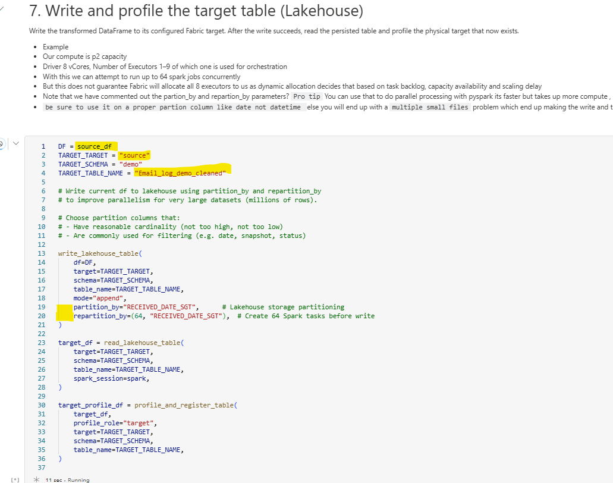

`Pro tip` parallel processing only make sense when data is big , ie for this small demo dataset it is actually slower because it needs to split the files and store them seperately (37 seconds - parallel process vs 21 seconds single processing). `Feel free to experiment and see what works but rule of thumb the bigger the dataset the better parallel processing becomes`

## Conclusion

This demonstration covers the FabricOps functions used for file ingestion, Lakehouse and Warehouse data movement, data profiling, frequency analysis, and metadata registration.

| Function  | Available since  | Demonstrated purpose            |
| ------------------- | ---------------- | ------------------------------- |
| `read_lakehouse_csv()`             | FabricOps v0.1.0 | Read CSV files from a configured Lakehouse `Files` area                                     |
| `read_lakehouse_excel()`           | FabricOps v0.1.0 | Read an Excel worksheet from a configured Lakehouse `Files` area                            |
| `read_lakehouse_parquet()`         | FabricOps v0.1.0 | Read Parquet files from a configured Lakehouse `Files` area                                 |
| `read_lakehouse_table()`           | FabricOps v0.1.0 | Read a managed Lakehouse table                                                              |
| `write_lakehouse_table()`          | FabricOps v0.1.0 | Write a Spark DataFrame as a managed Lakehouse table                                        |
| `read_warehouse_table()`           | FabricOps v0.1.0 | Read a complete named Warehouse table                                                       |
| `read_warehouse_query()`           | FabricOps v0.1.0 | Execute caller-provided SQL against a Warehouse                                             |
| `write_warehouse_table()`          | FabricOps v0.1.0 | Write a Spark DataFrame to a Warehouse table                                                |
| `profile_dataframe()`              | FabricOps v0.1.5 | Generate column-level profiling statistics for a DataFrame                                  |
| `profile_frequency_distribution()` | FabricOps v0.1.5 | Generate value-frequency distributions for selected DataFrame columns                       |
| `profile_and_register_table()`     | FabricOps v0.1.5 | Profile a table and register the resulting profile metadata in the FabricOps metadata model |


After completing this step, continue to [Step 3: Review catalogue evidence and define guardrails](03-enrich-guardrails.md).
