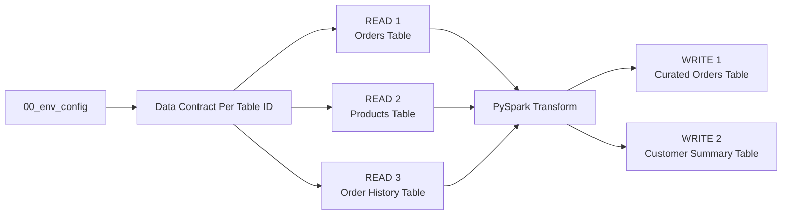
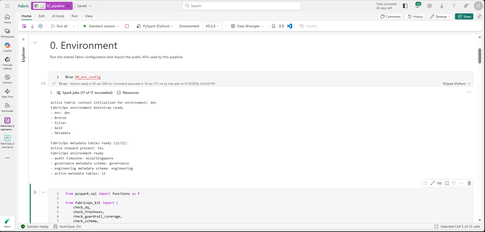

# Step 2. Build and run the ETL

Run the `02_pipeline` template in the Engineering Development Workspace.

We are building of the foundation of [Step 00C. Prepare the demo data](00C-prepare-demo-data.md) and the demo files are expected to be landed in the respective lakehouse and warehouse tables

For simplicity, this walkthrough **reads the full source tables into DataFrames** before transformation and writes.

For watermark-based incremental reads, incremental writes, partition-aware processing, and related advanced patterns, see the **Advanced Incremental Read and Write Guide**.


By the end of this step, you will:

* Read three tables,
* Transform the source data with normal PySpark,
* Write two tables

You will also see how FabricOps
* Skip guardrails (checks) before a Data Contract exists,
* Profile and store table level pipeline lineage,
* Creates the data catalogue that will be consumed by Step 3 of the demo that goverance will use

The standard **full read** pipeline shape is:



## Load the shared environment notebook that we set up in 00B & Import required pipeline functions



## 2. Run the Data Contract selection

Run the **Data Contract** section:

```python
CONTRACTS = widget_select_data_contract(spark_session=spark)
```


This is expected. There is no Data Contract yet because Governance has not authored one. We will revisit this in [Step 04. Select and validate the Data Contract](04-run-pipeline-with-guardrails.md).

In Development, when no Data Contract is selected, guardrail checks return skipped instead of requiring you to comment them out.

This means the same 02_pipeline notebook can be used both before and after Governance is introduced.

## 3. Read these tables

The template contains three independent Read blocks.

| Read | Store | Schema | Table |
| --- | --- | --- | --- |
| Orders | `Bronze` Lakehouse | `demo` | `orders` |
| Products | `Bronze` Lakehouse | `demo` | `products` |
| Order History | `Gold` Warehouse | `demo` | `order_history` |

### **Each Read Code Block is designed to be clonable** 
You can just clone the whole block and edit the variables to point to a different source
```python
READ_NAME = "orders"
READ_STORE = "Bronze"
READ_SCHEMA = "demo"
READ_TABLE = "orders"
READ_QUERY = None
```

### What the whole READ block does
Each Read block is intentionally split into **READ → CHECK → PROFILE → KEEP** so you can see exactly where the data becomes available and where FabricOps governance begins.

#### Read.1 :  Define the source
- `READ_NAME` gives the source a reusable name in the notebook.
- `READ_STORE`, `READ_SCHEMA`, and `READ_TABLE` identify the physical source.
- `READ_QUERY` optionally supplies a SQL query for Warehouse reads.

!!! tip "Warehouse SQL pushdown"
    `READ_QUERY = None` reads the full table.

    The Order History example deliberately supplies SQL so projection and filtering happen in the Warehouse before the result reaches Spark:

    ```python
    READ_QUERY = """
    SELECT
        historical_order_id,
        customer_id,
        order_datetime,
        net_amount
    FROM demo.order_history
    WHERE order_datetime >= '2025-01-01'
    """
    ```

    The demo predicate preserves the canonical `order_history` fixture while still showing the pushdown path.

    When `READ_QUERY` is supplied, `pipeline_read()` routes the request to `read_warehouse_query()` and pushes the SQL down to the underlying Warehouse.

#### Read.2 The actual READ to get the DataFrame

`pipeline_read()` is an orchestration function that resolves whether the requested source is a Lakehouse or Warehouse, reads it through the appropriate FabricOps I/O function, and returns the Spark DataFrame together with its canonical FabricOps `table_id`.


```python
source = pipeline_read(
    store=READ_STORE,
    schema=READ_SCHEMA,
    table_name=READ_TABLE,
    query=READ_QUERY,
    spark_session=spark,
)

df = source["dataframe"]
table_id = source["table_id"]
```

**You can stop here if you only want to read the data.** At this point `df` already exists and can be used in normal PySpark or displayed:

```python
# display(df)
```

The later CHECK, PROFILE, and KEEP stages are separate FabricOps pipeline steps. A failure in one of those later stages does not mean that `pipeline_read()` failed.

#### Read 3. CHECK — run Guardrails
- `check_freshness()` checks whether the source is recent enough based on the selected Data Contract.
- `check_schema()` checks whether the columns and data types match the contract.
- `check_dq()` runs the configured Data Quality rules.
- These checks run after the DataFrame has already been read.
- In the first Development run, when no Data Contract is selected yet, contract-backed checks safely return `skipped`.

Optional check outputs can be inspected with:

```python
# display(dq_df)
# display(dq_failed_values)
```

#### Read 4. PROFILE — refresh the saved source profile
- `profile_table()` profiles the DataFrame that was already read above, so FabricOps does not read the same source table a second time.
- The physical source coordinates are supplied so the first Development run can register the table in the Catalogue even when no Catalogue row exists yet.
- Profiling results are saved to `METADATA_DATA_PROFILED`.
- Frequency profiling, when generated, is saved to `METADATA_DATA_PROFILED_FREQUENCY`.

```python
profile_result = profile_table(
    dataframe=df,
    store=READ_STORE,
    schema=READ_SCHEMA,
    table_name=READ_TABLE,
    spark_session=spark,
)

display(profile_result["profile"])
display(profile_result["frequency_profile"])
```

#### Read 5. KEEP — make the source available downstream
- `sources[READ_NAME] = source` adds the completed source flow to the `sources` dictionary.
- The Transform and Write sections can then reuse both its DataFrame and `table_id`.
- This happens after the checks so a source that fails a required Guardrail is not silently treated as an approved downstream input.

## 4. Transformation

After reading the data from the Lakehouse or Warehouse into PySpark DataFrames, use normal PySpark in this section to perform your project-specific transformation logic, such as:

- joining DataFrames,
- filtering rows,
- aggregating data,
- deriving new columns,
- reshaping or selecting the final output structure.

For common examples, see the [PySpark transformation cheat sheet](../reference/engineering-cheat-sheet.md#pyspark-transformation-cheat-sheet).

You can also use Copilot, ChatGPT, Calude , or other AI coding tools to help draft the PySpark transformation. Always validate the generated logic and resulting DataFrame against your actual data before writing.

## 5. Write the tables

The template contains two independent Write blocks.

| Write | Store | Schema | Table | Load strategy |
| --- | --- | --- | --- | --- |
| Curated Orders | `Silver` | `demo` | `curated_orders` | `overwrite` |
| Customer Summary | `Gold` | `demo` | `customer_summary` | `overwrite` |

### **Each Write Code Block is designed to be clonable** 
You can just clone the whole block and edit the variables to point to a different source

```python
WRITE_NAME = "curated_orders_lakehouse"
WRITE_DATAFRAME = transformed_df
WRITE_SOURCE_NAMES = ("orders", "products", "history")
WRITE_STORE = "Silver"
WRITE_SCHEMA = "demo"
WRITE_TABLE = "curated_orders"
WRITE_LOAD_STRATEGY = "overwrite"
```

### What the whole WRITE block does

Each Write block is split into **PREPARE → CHECK → WRITE → PROFILE → KEEP** so the physical publication boundary is obvious.

#### Write 1. Define the target
- `WRITE_DATAFRAME` identifies the transformed DataFrame to publish.
- `WRITE_STORE`, `WRITE_SCHEMA`, and `WRITE_TABLE` identify the destination.
- `WRITE_LOAD_STRATEGY` controls how the target is written, such as `overwrite`, `append`, `SCD1`, or `SCD2`.
- `WRITE_REPARTITION_BY` optionally controls Spark write parallelism before publication.
- `WRITE_SOURCE_NAMES` identifies the exact source reads that produced this target.

!!! tip "Load strategy"
    `WRITE_LOAD_STRATEGY` controls how FabricOps applies incoming data to the target.

    Supported strategies include `overwrite`, `append`, `SCD1`, and `SCD2`.

!!! tip "Spark write parallelism"
    `WRITE_REPARTITION_BY` optionally repartitions the DataFrame before writing.

    For example, `64` allows up to 64 write tasks, subject to the Spark capacity available to the session.

    Rule of thumb:
    - Leave it as `None` for small or normal writes.
    - Under ~1 million rows → usually leave as `None`.
    - Around 1–10 million rows → consider repartitioning if the write is slow.
    - Above ~10 million rows → write parallelism is more likely to help.

#### Write 2. PREPARE — resolve the target and source lineage
- `write_sources` selects only the source reads used by this target.
- `resolve_table_id()` resolves the canonical target `table_id`.
- The target DataFrame already exists before anything is written.

You can inspect the outgoing DataFrame here without publishing the target:

```python
# display(WRITE_DATAFRAME)
```

#### Write 3. CHECK — validate before publication
- `check_schema()` validates the output columns and data types.
- `check_sensitive_data()` applies configured masking, redaction, hashing, or tokenization and returns `prepared_df`.
- `check_source_drift()` checks each source against the last successfully accepted state for this target.
- `check_dq()` runs the target Data Quality rules.
- `check_guardrail_coverage()` confirms that all required Guardrails for the publication were evaluated.
- In the first Development run, when no Data Contract is selected yet, contract-backed checks safely return `skipped`.

Optional check outputs can be inspected before publication:

```python
# display(prepared_df)
# display(target_dq_df)
# display(target_dq_failed_values)
# display(support_mapping_df)
```

#### Write 4. The actual Write of the Dataframe

`pipeline_write()` is the orchestration function that resolves whether the target is a Lakehouse or Warehouse and performs the physical publication through the appropriate FabricOps I/O function.


```python
write_result = pipeline_write(
    prepared_df,
    store=WRITE_STORE,
    schema=WRITE_SCHEMA,
    table_name=WRITE_TABLE,
    load_strategy=WRITE_LOAD_STRATEGY,
    source_table_ids=[source["table_id"] for source in write_sources],
    repartition_by=WRITE_REPARTITION_BY,
    spark_session=spark,
)
```

After this succeeds, the target has been physically written and FabricOps records the associated catalogue, lineage, and source observation state handled by the publication flow.

#### Write 5. PROFILE — profile what was actually written
- `profile_table()` reads the persisted target and refreshes its saved profile.
- This is intentionally after `pipeline_write()` so the profile represents the published table.

```python
# display(write_profile["profile"])
```

#### Write 6. KEEP — retain the completed write result
- `writes[WRITE_NAME] = write_result` stores the completed publication result for later notebook use.
- It is kept after publication and profiling succeed so the `writes` dictionary represents completed target flows.


**Next:** [Step 3. Author and freeze the Data Contract](03-enrich-guardrails.md)
