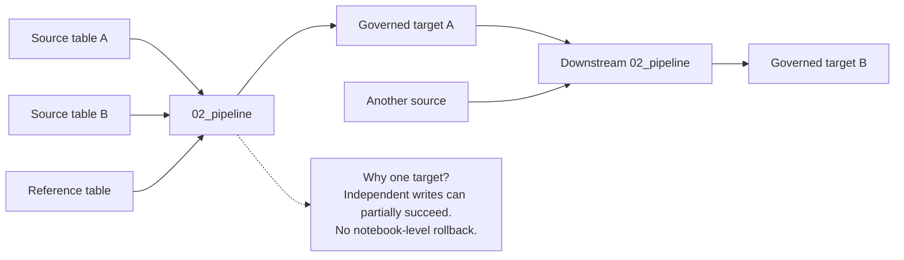

# Unit 1: Understand the `02_pipeline` template

**`02_pipeline` is the reusable Engineering template for a complete FabricOps ETL run.**

You do not assemble the FabricOps lifecycle by calling every framework function yourself. The template already provides the standard structure around your project-specific ETL logic.

FabricOps deliberately uses the notebook as the visible governed engineering unit, while native Fabric Pipelines can orchestrate it when scheduling or dependencies are required. Read more in [Notebook first — vs Pipeline vs Dataflow Gen2](../../reference/engineering-cheat-sheet.md#notebook-first).

## What the template does

The notebook follows one visible engineering flow:

```text
Environment → Extract → Transform → Load
```

FabricOps supplies the surrounding operational behaviour such as configured IO, profiling, metadata registration, lineage, governed processing preparation, and checkpoint handling where those capabilities are configured.

Your project mainly supplies:

1. the source configuration,
2. the transformation logic,
3. the target configuration,
4. the processing strategy when incremental behaviour is required.

## Pipeline design rule

A FabricOps governed pipeline may consume one or many upstream sources, but it publishes exactly one governed target table.

Multi-target fan-out is technically possible through the individual writer functions, but the governed pipeline pattern deliberately avoids it because independent physical writes can partially succeed. If another persisted output is required, create a separate downstream pipeline.

Keep dependencies directional and acyclic. A pipeline should not use its own target as an engineer-authored source. Persisted intermediate stages should be explicit outputs of upstream pipelines and inputs to separate downstream pipelines.



## Why Guardrails are not required yet

At this point in the learning path, no Guardrails or Data Contract have been created for the demo table.

That is intentional. The same `02_pipeline` template can complete the ETL without those enforcement layers. In later modules you will add governance around this same pipeline rather than build a different pipeline.

```text
Step 2: run ETL and write Catalogue / Profiled / Lineage metadata
        ↓
Step 3: read Catalogue + Profiled; write Enrichment + Guardrail
        ↓
Step 4: rerun the same ETL and validate current authoring
        ↓
Step 5: save an immutable Data Contract, select and test it, then activate the selected version
        ↓
Step 6: run the same ETL in Production against the active contract
```

## What stays project-owned

FabricOps does not hide business transformations. Joins, filters, derivations, aggregations, enrichment, and reshaping remain visible in the **User defined transformation** section of the notebook.

This separation lets the framework standardise the pipeline boundary while keeping business logic explicit and reviewable.

**Previous:** [Module 2 overview](../02-run-pipeline.md)  
**Next:** [Unit 2: Run the baseline ETL](run-baseline-etl.md)
