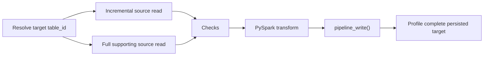

# Step 2A. Run an incremental pipeline

Use the `03_incremental_pipeline` template after you understand the full-read flow in [Step 2. Build and run the ETL](02-run-pipeline.md).

The incremental template is **target-aware**. FabricOps resolves the unconsumed scope of an incremental source relative to a specific target, so the target identity must be known before the incremental read starts.

This walkthrough focuses on the behaviour that differs from the full-read pipeline:

- define the target before reading an incremental source,
- read only the unconsumed source scope,
- mix incremental and full supporting sources in the same target flow,
- skip publication safely when there is no new source data,
- publish with an appropriate append, SCD1, SCD2, or partition-scoped overwrite strategy,
- profile partial batches and complete persisted tables deliberately.

The standard target-aware shape is:



## 1. Define the target first

Incremental progress is tracked for a specific source → target relationship. Resolve the target before calling `pipeline_read(..., read_mode="incremental")`.

```python
TARGET_STORE = "Silver"
TARGET_SCHEMA = "demo"
TARGET_TABLE = "curated_orders"

target_table_id = resolve_table_id(
    store=TARGET_STORE,
    schema=TARGET_SCHEMA,
    table_name=TARGET_TABLE,
)
```

## 2. Read the incremental driving source

```python
orders = pipeline_read(
    store="Bronze",
    schema="demo",
    table_name="orders",
    read_mode="incremental",
    target_table_id=target_table_id,
    spark_session=spark,
)

orders_df = orders["dataframe"]
```

On the first run, FabricOps bootstraps from the complete available source when no committed source → target baseline exists. Later runs return only the unconsumed watermark or changed-partition scope.

`orders["should_process"]` tells the target flow whether there is new work to publish.

!!! tip "Profiling backend"
    FabricOps profiles the data you give it.

    When `profile_table()` is called with only a governed table identity, FabricOps profiles the complete persisted table using the backend closest to the data:

    - Lakehouse → PySpark
    - Warehouse → Warehouse SQL pushdown

    When a DataFrame is supplied, FabricOps profiles that exact DataFrame in PySpark.

    This distinction becomes important for incremental pipelines: the incremental read returns only the current batch, so profiling that batch uses PySpark rather than re-reading and profiling the complete Warehouse table.

For an incremental source, decide whether you need a **batch profile** or the **canonical complete-table profile**.

To inspect only the current incremental batch:

```python
batch_profile = profile_table(
    dataframe=orders_df,
    spark_session=spark,
)
```

That profile describes only the DataFrame returned for this run. Because no governed identity is supplied, FabricOps keeps this batch profile in memory and does not persist it as the canonical governed table profile.

To profile the complete persisted source instead:

```python
complete_source_profile = profile_table(
    table_id=orders["table_id"],
    spark_session=spark,
)
```

For a Warehouse source, the identity-only call keeps the statistical work in Warehouse SQL. For a Lakehouse source, FabricOps uses PySpark against the persisted Lakehouse table.

## 3. Mix in full supporting sources

A target flow can combine one incremental driving source with full supporting sources.

```python
products = pipeline_read(
    store="Bronze",
    schema="demo",
    table_name="products",
    read_mode="full",
    target_table_id=target_table_id,
    spark_session=spark,
)

products_df = products["dataframe"]
```

A full supporting source remains eligible for canonical complete-table profiling:

```python
products_profile = profile_table(
    table_id=products["table_id"],
    spark_session=spark,
)
```

## 4. Check and transform the returned scope

Run the normal FabricOps checks against the source DataFrames returned for this target flow, then use ordinary PySpark for the transformation.

```python
check_freshness(orders["table_id"])
check_schema(orders_df, table_id=orders["table_id"])
orders_dq = check_dq(orders_df, table_id=orders["table_id"])

check_source_drift(
    orders["table_id"],
    target_table_id=target_table_id,
    raise_on_failure=True,
)
```

Freshness and Source Drift use the complete physical Source Observation captured by `pipeline_read()`; the transformation DataFrame can still be only the incremental scope.

## 5. Publish only when there is work

```python
if orders["should_process"]:
    target_df = (
        orders_dq.get("dataframe", orders_df)
        .join(products_df, on="product_id", how="left")
    )

    write_result = pipeline_write(
        target_df,
        store=TARGET_STORE,
        schema=TARGET_SCHEMA,
        table_name=TARGET_TABLE,
        load_strategy="append",
        source_table_ids=[orders["table_id"], products["table_id"]],
        spark_session=spark,
    )
else:
    print("No unconsumed Orders data; publication and progress commit skipped.")
```

No-new-data is a safe skip. FabricOps does not perform a physical write and does not advance source → target progress when there is nothing to process.

## 6. Profile the complete persisted target after the write

After publication, profile the target by identity:

```python
target_profile = profile_table(
    table_id=write_result["table_id"],
    spark_session=spark,
)

# display(target_profile["profile"])
# display(target_profile["frequency_profile"])
```

This intentionally profiles the **complete persisted target**, not just the incremental DataFrame that was written during the current run.

That gives the target Catalogue profile one stable meaning across full and incremental pipelines.

## 7. Choose the write strategy deliberately

Read mode and write strategy are separate decisions.

- `append` adds new rows.
- `SCD1` updates the current representation of keyed rows.
- `SCD2` preserves keyed history.
- partition-scoped `overwrite` replaces only governed changed partitions.

FabricOps rejects an incremental partial source when it would destructively replace a whole target. An append bootstrap is also allowed only when the target is new or empty; a populated target without committed source → target state fails safely rather than duplicating the complete source.

The maintained `03_incremental_pipeline` template contains two independent target flows so you can see that source progress is target-specific and each successful `pipeline_write()` is its own publication boundary.

**Next:** return to [Step 3. Author and freeze the Data Contract](03-enrich-guardrails.md) when you are ready to govern the pipeline.
