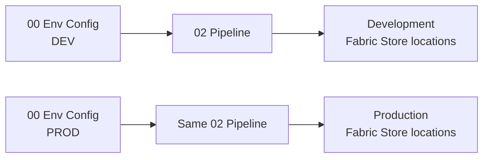
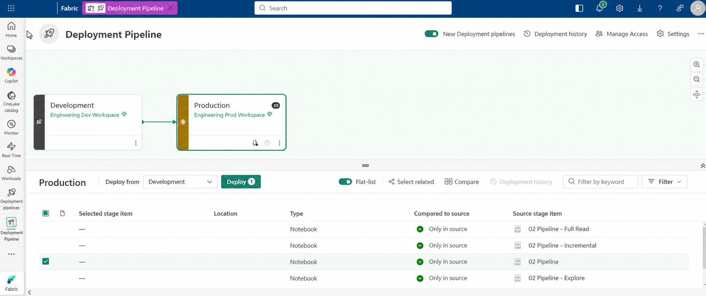
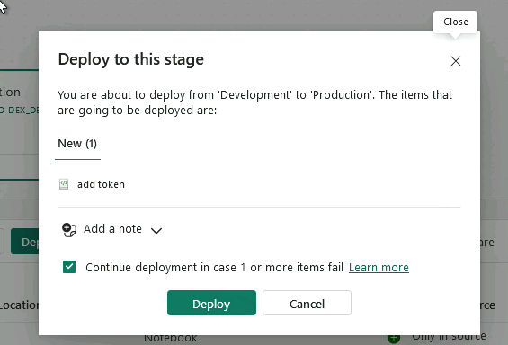

# Step 5. Activate the Data Contract and promote to Production

**Approve the tested Data Contract in Governance, then deploy the validated engineering artifact from Development to Production.**

Step 5 closes the Development loop. Governance makes the validated contract the active Production definition, and Engineering promotes the same tested pipeline through the Fabric Deployment Pipeline.

## 1. Select the tested Data Contract version

Return to `01_governance` and select the exact frozen Data Contract version that passed Step 4.

Do not activate a different draft or an untested version simply because it is newer.

## 2. Link the Data Agreement

Select the exact Data Agreement version created in Step 1 that governs this producer-to-consumer relationship.

The approval path is now:

```text
Data Steward context
        ↓
Data Agreement
        ↓
real table_id from Engineering
        ↓
frozen Data Contract version
        ↓
Development validation
        ↓
Agreement linkage + activation
```

## 3. Activate the Data Contract

Review the selected `table_id`, tested Data Contract version, and linked Data Agreement version, then activate it.

Activation tells FabricOps which immutable contract version Production must resolve for that governed table.

## 4. Promote the validated pipeline

`00_env_config` owns the environment-specific resolution. `02_pipeline` owns the pipeline definition.

That separation means Engineering promotes the same `02_pipeline` from Development to Production while `00_env_config` maps logical Fabric Stores such as Bronze, Silver, Gold, and Metadata to their environment-specific Fabric locations.



In the Fabric Deployment Pipeline, select the tested notebook or engineering artifact from Development and deploy it to the Production stage.

FabricOps does not require one specific deployment mechanism. The important part is that the same validated `02_pipeline` reaches the next environment unchanged. You can do that manually, including downloading and importing the notebook, or through your organisation's normal CI/CD process.

A Fabric-native option is **Deployment pipelines**. Set up a deployment pipeline, assign the Development and Production workspaces to its stages, then use it to promote `02_pipeline` between them. See [Microsoft Learn: Get started with deployment pipelines](https://learn.microsoft.com/en-us/fabric/cicd/deployment-pipelines/get-started-with-deployment-pipelines) for the current setup instructions.



Review the deployment selection and complete the deployment.



The important boundary is:

* activate the tested Data Contract for Production
* promote the validated engineering artifact
* keep environment-specific workspace IDs, item IDs, paths, schemas, and SQL endpoints in `00_env_config`
* do not move Development output data or draft governance state into Production

## Expected result

The tested Data Contract is active for the governed table, and the validated pipeline artifact is deployed to Engineering Production.

**Next:** [Step 6. Run the pipeline in Production](06-run-production.md)
