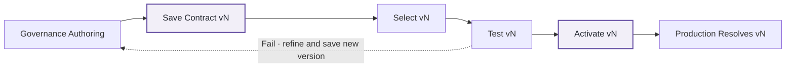

# Step 5: Save, test, and activate the Data Contract

**Use `01_governance` to save one immutable Data Contract version for one governed table, select and test that exact saved version in Engineering Development, then activate the selected version Production should resolve.**

!!! info "Key concepts for this step"

    **Data Agreement**, **Data Contract**, **Guardrails**, and **Governance as Code** explain what is being saved and why Production should resolve an immutable version rather than mutable authoring.

    A Data Agreement records the provider-to-recipient Data Steward relationship. A Data Contract is table-centric: one contract lifecycle is tied to one governed `table_id` under one exact Data Agreement version. Hover over a glossary term for its canonical definition, or open the [Glossary](../glossary.md) for the full entry.

## Save, select, test, then activate

Saving a Data Contract and promoting a notebook are separate lifecycle concerns. `widget_register_data_contract()` saves a new immutable Data Contract version. Engineering Development then uses `widget_select_data_contract()` to select and test that exact saved version. Governance can complete its required sign-off process before using `widget_activate_data_contract()` to designate the version Production should resolve.

**Save** creates an immutable Data Contract version. **Select** chooses the exact saved version Development should use. **Test** validates that selected version in Engineering Development. **Activate** designates the saved version Production may resolve. **Promote** moves the validated notebook/runtime artefact into Engineering Production using the organisation's deployment process; FabricOps does not currently perform that deployment step.

!!! important "Test and sign-off are workflow practice, not an activation gate"

    FabricOps recommends testing the saved version and completing governance sign-off before activation. The current implementation does not technically require a recorded passing test or approval state before `widget_activate_data_contract()` can activate a saved version.

## Before you begin

Confirm that the relevant Data Agreement exists, the table is registered in the Data Catalogue, Enrichment has been added where needed, and Guardrails plus target load strategy and parameters have been authored and re-validated in Engineering Development.

???+ success "Live — Save a versioned Data Contract"

    1. Open `01_governance` in the Governance workspace.
    2. Run `00_env_config`.
    3. Open `widget_register_data_contract()`.
    4. Select the exact Data Agreement version and one governed table.
    5. Review the contract preview, including table structure, Enrichment, Guardrails, target load strategy and parameters, Data Stewards, and governed usages.
    6. Save the Data Contract. FabricOps appends a new immutable draft version for that table lifecycle.

### What a saved Data Contract captures

`widget_register_data_contract()` assembles the contract from the current `METADATA_DATA_AGREEMENT`, `METADATA_DATA_STEWARD`, `METADATA_DATA_CATALOGUE`, `METADATA_ENRICHMENT`, and active `METADATA_GUARDRAIL` records for the selected table.

| Saved item | What is captured |
| --- | --- |
| Exact Data Agreement version | Agreement identity and version plus its name, domain, business purpose, validity dates, provider and recipient Steward IDs, and approved usages. |
| Provider and recipient Data Stewards | The selected Stewards' IDs, names, roles, and contacts. |
| Governed `table_id` and physical identity | The canonical `table_id` plus environment, store type, layer, schema, and table name from `METADATA_DATA_CATALOGUE`. |
| Table structure / schema | The active Catalogue columns with their `column_id`, column name, and data type. |
| Enrichment | Current table- and column-level `METADATA_ENRICHMENT` values, including enrichment level, type, and value. |
| Active Guardrails | Active `METADATA_GUARDRAIL` rules, including the exact Guardrail version, type, rule identity, severity, and rule parameters. |
| Target load strategy | The Catalogue `load_strategy`, such as `overwrite`, `append`, `scd1`, or `scd2`, when configured. |
| Load-strategy parameters | The configured `load_strategy_parameters_json` values required by the selected target strategy. |
| Governed usages | The selected approved-usage subset, which must remain within the parent Data Agreement's approved usages. |

Runtime records are not part of the saved immutable definition. `METADATA_GUARDRAIL_RESULTS`, `METADATA_GUARDRAIL_ROW_RESULTS`, source observations, successful-processing checkpoints, and run/audit state continue to describe individual executions rather than the contract itself.

???+ success "Live — Understand the one-table contract boundary"

    Each Data Contract lifecycle governs one canonical `table_id`. Multiple historical versions may exist for that table, and one Data Agreement can support multiple table-level Data Contracts.

    Saving a new version does not mutate historical versions. The saved contract contains the exact governed definition shown above for that point in the lifecycle.

??? info "Preview — Select and test the saved version in Development"

    After the contract exists, return to `02_pipeline` in Engineering Development and use `widget_select_data_contract()` for the same table.

    **Current authoring** uses mutable Governance Guardrails plus the Development-authored target load strategy and parameters.

    **Data Contract vN** makes the same checks and target-write preparation use the saved immutable Guardrails, target load strategy, and load-strategy parameters from that exact contract version.

    Run the pipeline and confirm the selected contract behaves as expected. The selector is read only. It does not activate or change the Data Contract.

??? info "Preview — Complete governance sign-off and activate the selected version"

    After the saved version has been tested in Development and any required governance sign-off has been completed, open `widget_activate_data_contract()` and activate that exact saved version for Production.

    Manual activation is the current lifecycle mechanism. It selects the saved version FabricOps Production runtime should resolve, but it does not copy notebooks, move data, or implement the external approval/promotion workflow.

    The activation widget does not currently verify a recorded Development test result or governance approval state. Those checks remain part of the operating process around the activation action.

??? note "Planned — Notebook/runtime promotion"

    FabricOps currently separates Data Contract saving, Development testing, governance sign-off, and activation from promotion into Engineering Production. The standardised promotion mechanism is planned and may use Fabric deployment or pipeline approval, Git-based CI/CD, or a controlled manual approval-and-ferry process.

## Expected result

You should now understand the Data Contract lifecycle as **save immutable version → select and test the saved version → activate the selected version**. Governance sign-off can sit between testing and activation as an operating requirement, but the current FabricOps implementation does not enforce it as a technical activation gate. Notebook/runtime promotion remains a separate lifecycle concern.

**Previous:** [Step 4: Validate with Guardrails / Data Contract](04-run-pipeline-with-guardrails.md)  
**Next:** [Step 6: Promote and run Production with the active Data Contract](06-promote-to-production.md)

See also: [`widget_register_data_contract()`](../api/reference/widget_register_data_contract.md), [`widget_activate_data_contract()`](../api/reference/widget_activate_data_contract.md), and [METADATA_DATA_CONTRACT](../reference/metadata/metadata_data_contract.md).
