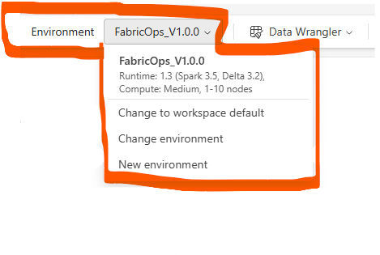
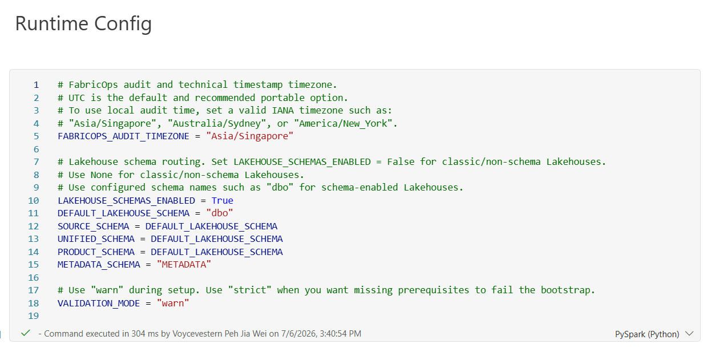
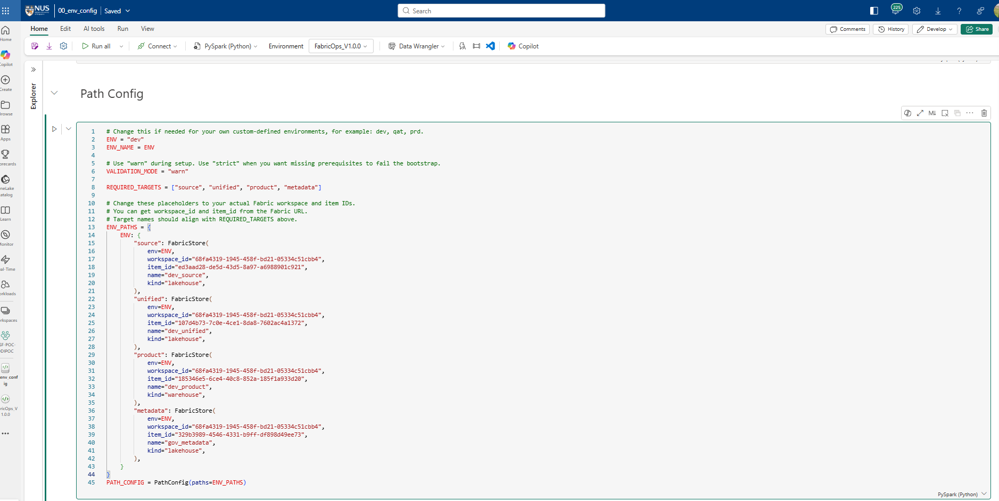
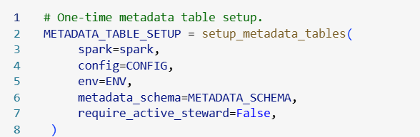
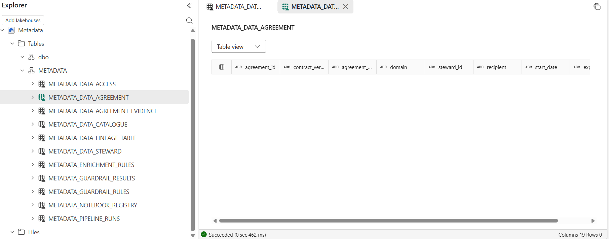

# Run Environment Setup 

## 1.Open`00_env_config` 

After uploading the template files in your workspace 

## 2. Attach the Environment to notebooks

You need to do this for all the template notebooks , unless someone has already set the default environment to be one that already have our FabricOps custom library setup.

A notebook must be attached to the Environment before it can import the custom library. Restart the session after attachment or library changes so the runtime loads the published Environment.

## 3 Setup Runtime config

Things like the timezone all the functions and widgets will write in 

The default schema that the fuctions will read from / write to in your lakehouse 

## 4. Setup Path config

This is where you pre-define all the path to the respective lakehouse/warehouses that you will use within this environment, you get this from the url of the lakehouse/warehouses which is essentially the ABFS (Azure Blob Filesystem) path

## 5. Widget Specific config

If you are utilizing our widgets that we have created you may customize the values in certain dropdown columns or get it to store extra columns via custom Json column

## 6. One time setup of metadata tables 

We have a funciton to help you pre define the schema and create all the metatda tables you will need to use for the widgets 

Just run it once and then freeze this code block

Completed creation of the tables 

## Expected result

You have a FabricOps `00_env_config` file that you will call and run within every other notebook tempaltes.

Next, continue to [your first hands on notebook](run-io-and-profiling-demo.md).
