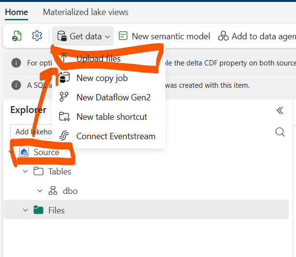
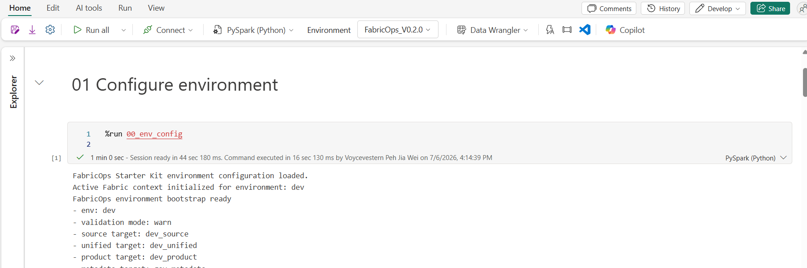

# Run exploration notebook template 

## Why this exists

Fabric notebooks allow you to attach a Lakehouse or Warehouse and kind of drag and drop the table or files you want to read quickly through the native UI.

However there is a technical limitation as per writing 2026 July a notebook can only attach a single warehouse/lakehouse to it.

The problem surfaces when you needs to work across more than one Lakehouse or Warehouse, or when users do not have broad item-level access but are expected to work through approved table, schema, or configured target access.

FabricOps standardizes that access pattern. Instead of relying on whichever item is attached to the notebook, the IO helpers resolve the configured Lakehouse or Warehouse target from `00_env_config`. Users call the same functions every time, and the notebook can read or write through the approved target without hardcoding paths, switching attachments, or rethinking the access pattern.

## Key idea

Run `00_env_config` once. Then IO helpers resolve the correct Lakehouse or Warehouse target from `CONFIG` and `FABRIC_CONTEXT`. Users call the same helper functions every time, using the configured targets prepared in `00_env_config`.

## Key functions that support this notebook flow

| Helper | What it demonstrates |
| --- | --- |
| `read_lakehouse_csv`, `read_lakehouse_excel`, `read_lakehouse_parquet` | Read raw files from configured Lakehouse Files. |
| `write_lakehouse_table`, `read_lakehouse_table` | Write and read Delta tables through configured Lakehouse Tables. |
| `write_warehouse_table`, `read_warehouse_table`, `read_warehouse_query` | Write and read Warehouse tables through configured Warehouse targets. |
| `profile_dataframe` | Profile a Spark dataframe returned from either Lakehouse or Warehouse reads. |

## 1. Download the demo dataset which consist of 

| File | Used for |
| --- | --- |
| [`orders.csv`](../assets/demo-data/io-profile/orders.csv) | CSV file-read smoke test with simple order facts. |
| [`products.xlsx`](../assets/demo-data/io-profile/products.xlsx) | Excel file-read smoke test with product reference data. |
| [`customers.parquet`](../assets/demo-data/io-profile/customers.parquet) | Parquet file-read smoke test with customer attributes. |

## 2. Upload these files into your source lakehouse root files section

.png)

## 3. Open`99_explore` remember to attach the environment if not done yet

This notebook will proves that FabricOps can read, write, and profile data across configured Lakehouse and Warehouse targets after environment setup.

## 4.  

## Why Spark

Spark lets the same pattern work for small files and larger datasets. The demo starts with simple CSV, Excel, and Parquet files, then uses `spark.range` and repartitioning to show that the same IO pattern can scale to larger parallel processing workloads.

The notebook defaults are intentionally modest. Increase `ROW_COUNT` only after the basic run passes in your Fabric capacity.

## Expected evidence

You should see:

1. CSV, Excel, and Parquet dataframes displayed.
2. A Lakehouse table created and read back.
3. A Warehouse table created and read back.
4. Profile rows generated from the Lakehouse read dataframe.
5. Profile rows generated from the Warehouse read dataframe.
6. A final PASS summary table.

## Notes

This smoke test intentionally does not call metadata setup. It is designed to run after `00_env_config` and before agreement registration so teams can confirm configured IO targets and profiling behavior independently from metadata table creation.
