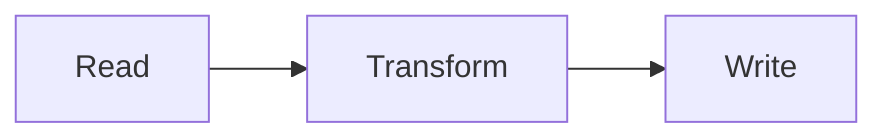
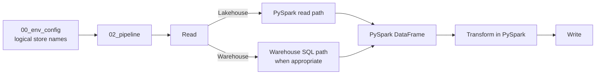
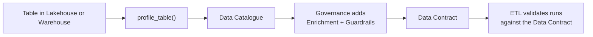
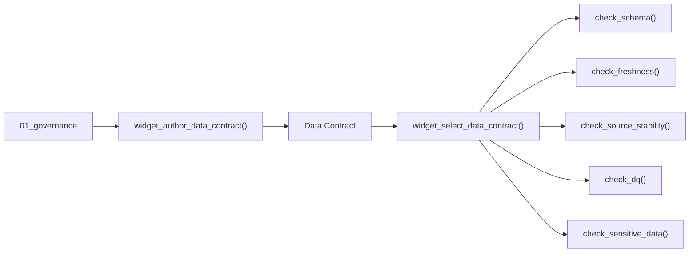

# How FabricOps works

<style>
.md-typeset .fabricops-section-block {
  margin: 1.25rem 0;
  padding: 1.1rem 1.2rem;
  border: 1px solid var(--md-default-fg-color--lightest);
  border-radius: 0.4rem;
  background-color: var(--md-default-bg-color);
  box-shadow: 0 0.12rem 0.45rem rgba(0, 0, 0, 0.04);
}

.md-typeset .fabricops-section-block > :first-child {
  margin-top: 0;
}

.md-typeset .fabricops-section-block > :last-child {
  margin-bottom: 0;
}
</style>

The FabricOps overview video introduces the story. This page goes deeper into how the pieces fit together and why the workflow is structured this way.

[Want to run it yourself? Follow the Guided Demo.](guided-demo.md)

<div class="fabricops-section-block" markdown>

## What problem is FabricOps solving?

**Microsoft Fabric gives the platform. FabricOps gives the operating practice.**

Fabric already gives teams notebooks, Lakehouses, Warehouses, pipelines, environments, AI capabilities, and many other building blocks. The harder question is how a team uses those building blocks repeatedly without every project inventing a different engineering and governance pattern.

FabricOps packages that operating pattern around four reusable notebooks:

| Notebook | Role |
| --- | --- |
| [`00_env_config`](https://github.com/Voycepeh/FabricOps-Starter-Kit/blob/main/templates/notebooks/00_env_config.ipynb) | Defines the active environment and configured Fabric stores. |
| [`01_governance`](https://github.com/Voycepeh/FabricOps-Starter-Kit/blob/main/templates/notebooks/01_governance.ipynb) | Authors the governance context and versioned Data Contracts. |
| [`02_pipeline`](https://github.com/Voycepeh/FabricOps-Starter-Kit/blob/main/templates/notebooks/02_pipeline.ipynb) | Performs project-specific engineering, records technical metadata, and enforces governed expectations. |
| [`99_explore`](https://github.com/Voycepeh/FabricOps-Starter-Kit/blob/main/templates/notebooks/99_explore.ipynb) | Lets project-specific workspaces consume approved Production data without recreating the Production engineering workflow. |

The notebooks are supported by the FabricOps package: reusable public functions and widgets provide the repeatable pieces, while the project keeps its own transformation logic.

#### See the whole operating model

**Questions this diagram answers:**

- Where do Governance, Engineering Development, Engineering Production, and project-specific consumers sit?
- Which notebooks belong in each workspace?
- Where does the shared Metadata Lakehouse fit?
- What is promoted to Production?
- Where are approved outputs consumed from?


Read it from top to bottom. Governance defines and versions governed expectations. Engineering Development builds and validates the implementation. The validated `02_pipeline` is promoted to Engineering Production, where active contracts are resolved and governed outputs are produced. Project-specific consumers then use approved Production data through `99_explore`.

The rest of this page zooms into that picture without changing the story.

</div>

<div class="fabricops-section-block" markdown>

## How does Engineering actually run across Fabric stores?

Fabric notebooks work very well when a notebook only needs its **single default attached Lakehouse or Warehouse**. You can browse that store naturally and work with its files or tables without repeatedly describing where the data lives.

The difficulty starts when the pipeline needs **two or more Fabric stores**, which is normal for ETL. One pipeline may read from a source Lakehouse, enrich from a Warehouse, and publish to another target store. Without another abstraction, the notebook starts accumulating workspace IDs, item IDs, ABFSS paths, SQL endpoints, or attachment-specific logic.

FabricOps uses [`00_env_config`](https://github.com/Voycepeh/FabricOps-Starter-Kit/blob/main/templates/notebooks/00_env_config.ipynb) to solve that wiring problem. Each Fabric store gets a stable logical name such as `source`, `unified`, or `product`. `02_pipeline` refers to those logical names, while FabricOps resolves the physical resource for the current environment.

That lets the notebook itself stay deliberately simple:



FabricOps standardizes the repeatable plumbing around the Read and Write boundaries. The transformation in the middle stays yours.

The configuration layer also lets FabricOps choose the execution path that matches the underlying store. Lakehouse access naturally uses the PySpark path. Warehouse sources can use the Warehouse SQL path when source-side SQL is the better execution option. In both cases, the pipeline returns to a **PySpark DataFrame** for project transformation.



#### Read

A Read block describes one source and calls [`pipeline_read()`](api/reference/pipeline_read.md). FabricOps then resolves the configured store from `00_env_config`, the canonical `table_id`, the physical Fabric item, and the correct lower-level reader.

Each Read block is designed to be **fully clonable**. Copy the whole block, change the small set of variables at the top such as the store, schema, table, or optional Warehouse query, and the same structure works for the next source.

After the source is read, the Read block keeps the governed checks and profiling explicit:

- enforce Freshness with [`check_freshness()`](api/reference/check_freshness.md)
- enforce Schema with [`check_schema()`](api/reference/check_schema.md) and Data Quality with [`check_dq()`](api/reference/check_dq.md)
- profile the governed table or supplied DataFrame with [`profile_table()`](api/reference/profile_table.md)
- if [`check_dq()`](api/reference/check_dq.md) returns a caller-owned DQ failure DataFrame, optionally persist it with [`write_lakehouse_table()`](api/reference/write_lakehouse_table.md) or [`write_warehouse_table()`](api/reference/write_warehouse_table.md)
- optionally inspect the resulting Data Catalogue and profile metadata with [`widget_view_catalogue()`](api/reference/widget_view_catalogue.md)

The routing stays hidden underneath the public functions. [`pipeline_read()`](api/reference/pipeline_read.md) dispatches governed table reads to [`read_lakehouse_table()`](api/reference/read_lakehouse_table.md), [`read_warehouse_table()`](api/reference/read_warehouse_table.md), or [`read_warehouse_query()`](api/reference/read_warehouse_query.md) according to the resolved store and source definition. Raw Lakehouse files continue to use the foundational file readers directly.

For a Lakehouse table, PySpark is the natural execution path. For a Warehouse, project-owned SQL can be pushed down through `query=...` so filtering, aggregation, projection, or other source-side work happens in the Warehouse before the result enters the Spark workflow. That avoids unnecessarily translating more Warehouse data into Spark than the pipeline needs.

#### Transform

Once the Read blocks return Spark DataFrames, FabricOps gets out of the way. **Project transformations are ordinary PySpark DataFrame transformations.**

Join, filter, aggregate, derive columns, reshape data, or apply whatever business logic the project requires. This keeps the transformation readable to engineers instead of hiding it inside a framework-specific DSL.

That also means engineers can use **Microsoft Fabric Copilot** to help write or refine PySpark transformation code while the FabricOps Read and Write boundaries stay standardized.

#### Write

A Write block publishes the prepared DataFrame through [`pipeline_write()`](api/reference/pipeline_write.md). Like the Read block, it is designed to be **fully clonable**: copy the complete block, change the target variables at the top, and reuse the same governed publication structure for another target.

The target identity is resolved with [`resolve_table_id()`](api/reference/resolve_table_id.md). The Write block is where the Data Contract becomes operational: FabricOps resolves the selected or active Data Contract and uses its governed processing definition to determine how the target is published.

The surrounding Write block keeps the important target decisions explicit and in sequence:

- enforce target Schema with [`check_schema()`](api/reference/check_schema.md)
- enforce Sensitive Data Guardrails with [`check_sensitive_data()`](api/reference/check_sensitive_data.md); when tokenization returns a caller-owned `support_mapping` DataFrame, optionally persist that mapping as project-owned support data
- enforce Source Stability with [`check_source_stability()`](api/reference/check_source_stability.md) once the governed source-to-target relationship is known
- enforce Data Quality with [`check_dq()`](api/reference/check_dq.md)
- if [`check_dq()`](api/reference/check_dq.md) returns a caller-owned DQ failure DataFrame, optionally persist it with [`write_lakehouse_table()`](api/reference/write_lakehouse_table.md) or [`write_warehouse_table()`](api/reference/write_warehouse_table.md)
- publish the prepared DataFrame with [`pipeline_write()`](api/reference/pipeline_write.md), which resolves the governed load strategy and the correct Lakehouse or Warehouse path, adds FabricOps technical audit columns, persists the resolved load strategy and parameters in Catalogue, and commits successful Lineage plus lightweight Source Observation state only after the physical write succeeds
- profile the persisted target with [`profile_table()`](api/reference/profile_table.md)
- optionally inspect the resulting Data Catalogue and profile metadata with [`widget_view_catalogue()`](api/reference/widget_view_catalogue.md)

This gives `02_pipeline` a consistent shape without turning it into a black box: **configure stores once in `00_env_config`, clone the Read and Write blocks, change the variables, and keep the project transformation in the middle as normal PySpark.**

??? info "Read more: how FabricOps routes work across Lakehouse and Warehouse"

    FabricOps public functions give the notebook stable interfaces while resolving the correct Lakehouse or Warehouse implementation underneath.

    [`pipeline_read()`](api/reference/pipeline_read.md) routes governed table reads to the Lakehouse table, Warehouse table, or Warehouse query implementation. Raw Lakehouse files remain explicit file reads through the foundational file readers.

    [`profile_table()`](api/reference/profile_table.md) uses Spark for a supplied DataFrame or Lakehouse table, and can use Warehouse-native SQL when profiling a physical Warehouse table.

    [`pipeline_write()`](api/reference/pipeline_write.md) resolves the governed target and routes publication through the correct Lakehouse or Warehouse path while applying the Data Contract load strategy.

</div>

<div class="fabricops-section-block" markdown>

## Where does Governance enter the engineering flow?

**Engineering produces the physical table. Profiling makes that table visible to Governance, and the Data Contract turns Governance decisions back into executable checks.**

[`profile_table()`](api/reference/profile_table.md) profiles the actual table in its Lakehouse or Warehouse and writes the observed structure and statistics into the **Data Catalogue** and profiling metadata.



Governance reads the actual governed table through its Data Catalogue entry, adds **Enrichment** and **Guardrails**, and authors the versioned **Data Contract** against that real `table_id`. Engineering then uses the contract so the ETL can validate real runs against the governed definition.

`01_governance` can also establish the **Data Steward** and **Data Agreement** around that governed asset. Fabric AI Functions can optionally use the Catalogue and profiling context to suggest descriptions and classifications, which Governance reviews and edits before they become part of the governed definition.

</div>

<div class="fabricops-section-block" markdown>

## What is a Data Contract in FabricOps?

**The Data Contract is the versioned governance definition for a governed table, not passive documentation beside the pipeline.**

Governance authors it through [`widget_author_data_contract()`](api/reference/widget_author_data_contract.md) in `01_governance`. The widget works from the selected `table_id` and brings together:

- **Enrichment** for descriptive table and column metadata and information classification
- **Guardrails** for enforceable expectations such as Schema, Freshness, Source Stability, Data Quality, and Sensitive Data requirements
- the governed target processing definition, including its load strategy and parameters
- the logical notebook ownership that identifies which pipeline owns the governed write

Engineering sets the contract context in `02_pipeline` through [`widget_select_data_contract()`](api/reference/widget_select_data_contract.md). In Development, an engineer can select an eligible immutable version for each linked `table_id`; in Production, FabricOps ignores overrides and resolves exactly one active version automatically.

The selected or active Data Contract is then **enforced in Engineering through the FabricOps Guardrail functions**:

- [`check_schema()`](api/reference/check_schema.md) enforces Schema Guardrails
- [`check_freshness()`](api/reference/check_freshness.md) enforces Freshness Guardrails
- [`check_source_stability()`](api/reference/check_source_stability.md) enforces Source Stability Guardrails
- [`check_dq()`](api/reference/check_dq.md) enforces Data Quality Guardrails
- [`check_sensitive_data()`](api/reference/check_sensitive_data.md) enforces Sensitive Data Guardrails before governed publication



That is the core **Governance as Code** idea in FabricOps: Governance authors the definition once, Engineering explicitly selects or resolves it, and the pipeline functions execute those governed expectations against the real data flow.

??? info "Read more: what exactly is authored and activated?"

    ```mermaid
    flowchart LR
        TABLE["table_id"] --> AUTHOR["widget_author_data_contract()"]
        AUTHOR --> CONTRACT["Data Contract version<br/>Enrichment · Guardrails · Processing"]
        CONTRACT --> ACTIVATE["widget_activate_data_contract()"]
        AGREEMENT["Data Agreement version"] --> ACTIVATE
        ACTIVATE --> ACTIVE["ACTIVE for Production"]
    ```

    **Enrichment** is descriptive. It helps people and downstream systems understand what the table and columns mean and how the information is classified.

    **Guardrails** are enforceable expectations. Examples include Schema, Freshness, Source Stability, Data Quality, and Sensitive Data handling. A Guardrail can use a **Warn** or **Block** action.

    Activation links the approved Data Contract version to the relevant Data Agreement version so Production has one explicit governed definition to resolve.

</div>

<div class="fabricops-section-block" markdown>

## How does the whole FabricOps workflow run?

**The seven stages below are the core operating flow. They connect the Governance and Engineering responsibilities shown in the workflow image to the metadata written behind the scenes.**

#### See the Governance and Engineering workflow


Read the seven stages as one lifecycle:

1. **Governance establishes the people and agreement context.** [`widget_render_data_steward()`](api/reference/widget_render_data_steward.md) writes Data Steward records, and [`widget_render_data_agreement()`](api/reference/widget_render_data_agreement.md) writes Data Agreement records.
2. **Engineering Development builds the ETL and produces the governed table.** `02_pipeline` reads, transforms, writes, profiles, and records the technical context around the real table. [`profile_table()`](api/reference/profile_table.md) keeps the Data Catalogue and profiling metadata aligned with what Engineering actually produced.
3. **Governance authors the Data Contract for that `table_id`.** [`widget_author_data_contract()`](api/reference/widget_author_data_contract.md) brings together Enrichment, Guardrails, and the governed processing definition for the table.
4. **Engineering Development selects a contract version and validates the real pipeline.** [`widget_select_data_contract()`](api/reference/widget_select_data_contract.md) sets the selected contract per linked `table_id`, and the Guardrail functions execute its expectations against the real data flow.

**Steps 3 ↔ 4 are intentionally iterative.** Governance authors the next contract version; Engineering selects that immutable version and reruns the pipeline against it. If the expectation needs refinement or the implementation does not satisfy the intended rule, the flow returns to Governance for another version and then back to Engineering for another validation run. The loop continues until the governed definition and the real engineering implementation agree.

5. **Governance activates the tested definition.** [`widget_activate_data_contract()`](api/reference/widget_activate_data_contract.md) links the exact Data Agreement version and makes the selected Data Contract the one active version for that `table_id`. Development stays flexible: it can select any eligible immutable version, including frozen, active, or superseded versions. Draft and rejected versions are not selectable. Production is strict: it must resolve exactly one active version for each linked `table_id`.
6. **Engineering promotes and runs the same pipeline in Production.** The promoted `02_pipeline` resolves Production stores through `00_env_config`, automatically resolves the active Data Contract, applies the same Guardrail functions, and publishes the governed output. Successful writes commit the associated runtime Lineage and Source Observation state.
7. **Project teams consume the approved Production result.** `99_explore` provides the reusable read-only exploration entry point without recreating the Production ETL in every consumer workspace.

</div>

<div class="fabricops-section-block" markdown>

## What does the workflow write into FabricOps metadata?

**The metadata model is the storage view of the same seven-step workflow above.** The workflow explains when Governance and Engineering act; this diagram shows where those definitions, observations, and runtime results are persisted.

#### See the metadata ownership model


The main public functions line up with the metadata model like this:

| Workflow activity | Public function(s) | Main metadata written |
| --- | --- | --- |
| Establish Governance context | [`widget_render_data_steward()`](api/reference/widget_render_data_steward.md), [`widget_render_data_agreement()`](api/reference/widget_render_data_agreement.md) | `METADATA_DATA_STEWARD`, `METADATA_DATA_AGREEMENT` |
| Register and profile real tables | [`profile_table()`](api/reference/profile_table.md) | `METADATA_DATA_CATALOGUE`, `METADATA_DATA_PROFILED`, `METADATA_DATA_PROFILED_FREQUENCY` |
| Register pipeline participation | [`pipeline_read()`](api/reference/pipeline_read.md), [`pipeline_write()`](api/reference/pipeline_write.md) | `METADATA_DATA_LINEAGE` |
| Commit source observation state after successful publication | successful [`pipeline_write()`](api/reference/pipeline_write.md) | `METADATA_SOURCE_OBSERVATION` |
| Author the governed definition | [`widget_author_data_contract()`](api/reference/widget_author_data_contract.md) | `METADATA_DATA_CONTRACT`, `METADATA_ENRICHMENT`, `METADATA_GUARDRAIL` |
| Activate the Production definition | [`widget_activate_data_contract()`](api/reference/widget_activate_data_contract.md) | lifecycle and Data Agreement linkage in `METADATA_DATA_CONTRACT` |
| Enforce Guardrails at runtime | [`check_schema()`](api/reference/check_schema.md), [`check_freshness()`](api/reference/check_freshness.md), [`check_source_stability()`](api/reference/check_source_stability.md), [`check_dq()`](api/reference/check_dq.md), [`check_sensitive_data()`](api/reference/check_sensitive_data.md) | `METADATA_GUARDRAIL_RESULTS` |
| Optional access observation | `scan_workspace_access()` | `METADATA_DATA_ACCESS` when persistence is used |

The purple Governance area therefore stores authored definitions. The blue Engineering area stores what the pipeline discovers, profiles, observes, and enforces while it runs. `table_id` is the bridge between the real physical table and both sides of that metadata model.

??? info "Read more: caller-owned Guardrail output DataFrames"

    Some Guardrail functions also return **row-level support DataFrames** alongside the summary written to `METADATA_GUARDRAIL_RESULTS`.

    - [`check_dq()`](api/reference/check_dq.md) returns the DQ failure evidence DataFrame as `failed_values`, so the project can inspect the individual failed values and rows behind the summary result.
    - [`check_sensitive_data()`](api/reference/check_sensitive_data.md) returns the treated business DataFrame and, when tokenization is used, an optional caller-owned `support_mapping` DataFrame containing the PII/token mapping needed to preserve token assignments across runs.

    These support DataFrames are **not written to any FabricOps metadata table automatically**. They stay with the caller so the project can decide whether they should remain in memory or be persisted as normal physical data.

    When persistence is required, the project can write the DataFrame itself through the existing write APIs: [`pipeline_write()`](api/reference/pipeline_write.md), [`write_lakehouse_table()`](api/reference/write_lakehouse_table.md), or [`write_warehouse_table()`](api/reference/write_warehouse_table.md), depending on whether the output is a governed pipeline target or caller-owned support data in a Lakehouse or Warehouse.

    `METADATA_GUARDRAIL_RESULTS` therefore remains the lightweight runtime summary and continuation record, while detailed DQ failures and PII/token mappings remain project-owned physical data.

    [What exactly is stored in each metadata table?](reference/metadata.md)

</div>

<div class="fabricops-section-block" markdown>

## Where to go next

- [How do I run the workflow myself?](guided-demo.md)
- [Why does FabricOps make these engineering choices?](reference/engineering-cheat-sheet.md)
- [What exactly is stored in FabricOps metadata?](reference/metadata.md)
- [What does each FabricOps function do?](reference/index.md)
- [Where are the reusable notebook templates?](notebook-templates.md)

</div>