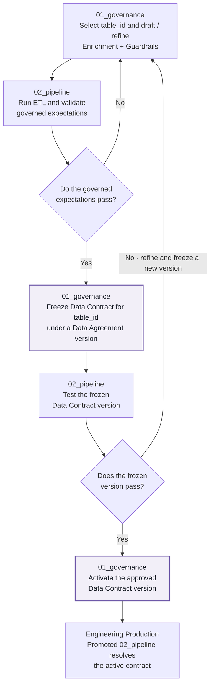

# How FabricOps works

**FabricOps connects Governance, Engineering Development, Engineering Production, and project-specific consumer workspaces through one governed workflow.**

The shared Metadata Lakehouse carries FabricOps metadata between Governance and Engineering. Governance defines and approves the governed expectations, Engineering Development builds and validates the pipeline against them, Engineering Production resolves the active Data Contract at runtime, and project-specific consumer workspaces consume approved Production data.

<!-- VIDEO SLOT: Main How FabricOps Works overview -->

## The workflow at a glance

FabricOps is built around four reusable notebooks that work together as one operating practice:

| Notebook | Role in the workflow |
| --- | --- |
| `00_env_config` | Defines the active environment and the configured Fabric items used by the workflow. |
| `01_governance` | Creates Data Stewards and Data Agreements, enriches governed tables, defines Guardrails, and manages Data Contract versions. |
| `02_pipeline` | Performs project-specific engineering, records technical metadata, validates governed expectations, and runs the governed Production pipeline. |
| `99_explore` | Lets project-specific consumer workspaces use approved Production data without recreating the Production engineering workflow. |

For the deeper engineering reasoning behind `00_env_config`, FabricOps I/O functions, Lakehouse/Warehouse choices, PySpark, incremental processing, and the detailed `02_pipeline` structure, use the [FabricOps Engineering Guide](reference/engineering-cheat-sheet.md).

## The Governance and Engineering loop

FabricOps deliberately loops between Governance and Engineering Development before the approved pipeline runs in Production.

<!-- VIDEO SLOT: Governance and Engineering loop -->

### 1. Governance creates Data Stewards and a Data Agreement in `01_governance`

In `01_governance`, Governance creates the provider and recipient **Data Stewards** and a **Data Agreement** between them.

The Data Agreement establishes the governed sharing context: who is providing and receiving the data, the business purpose, approved usages, validity, and other agreement-level governance information.

### 2. Engineering builds the ETL pipeline within `02_pipeline`

Engineering Development uses `02_pipeline` to read one or more configured sources, perform project-specific transformations, and write governed target tables to the configured Lakehouse or Warehouse.

Each governed target is identified by a canonical `table_id`. Engineering then records the technical context around that table, including:

- **Data Catalogue metadata** — the governed table and column structure used as the canonical technical identity for the target.
- **Data Profiled records** — observed characteristics of the data that help Engineering and Governance understand what is actually present.
- **Data Profiled Frequency**, where applicable — the recorded frequency distribution for profiled values where that deeper profile is useful.
- **Data Lineage** — the relationship between the source data used by the pipeline and the governed target it produces.

The `table_id` is the shared identity that lets the rest of the FabricOps workflow refer to the same governed table.

#### Opinionated engineering choices behind FabricOps

FabricOps makes several engineering choices so projects do not need to redefine the same foundations every time. This page only introduces them; use each link to jump into the deeper Engineering Guide explanation.

- **[Configuration-driven engineering](reference/engineering-cheat-sheet.md#config-driven-engineering)** — separate reusable `02_pipeline` logic from environment-specific Fabric item identities through `00_env_config` and FabricOps I/O resolution.
- **[Code-first engineering](reference/engineering-cheat-sheet.md#notebook-first)** — keep governed transformation logic explicit, reviewable, and versionable in code, with `02_pipeline` as the primary engineering implementation.
- **[PySpark-first transformation](reference/engineering-cheat-sheet.md#pyspark-first)** — use PySpark DataFrames for the main transformation path, with T-SQL for efficient Warehouse-side operations before data enters Spark.
- **[Lakehouse-first engineering](reference/engineering-cheat-sheet.md#lakehouse-first)** — prefer Lakehouse for substantial or repeated Spark engineering while still supporting Warehouse as a relational source or curated serving layer.
- **[Governance as Code](reference/metadata.md)** — keep FabricOps self-contained in Fabric by recording Catalogue, Profile, Lineage, Enrichment, Guardrails, results, Agreements, and Contracts in shared metadata tables centred on the canonical `table_id`.
- **[Medallion architecture implementation](reference/engineering-cheat-sheet.md#medallion-architecture)** — implement progressive data layers where they add architectural value without forcing unnecessary copies or fixed layer names.
- **[Incremental load implementation](reference/engineering-cheat-sheet.md#full-vs-incremental)** — use full, watermark, or partition-based processing according to source behaviour, scale, and recovery requirements.

The exact ETL implementation stays project-specific. FabricOps standardizes the environment, I/O boundaries, metadata capture, validation, and governed hand-offs around that engineering work.

### 3. Governance selects the `table_id` in `01_governance` and drafts the governed Data Contract definition

Back in `01_governance`, Governance selects the same canonical `table_id` from the Data Catalogue and reads the Catalogue and Profile information produced by Engineering.

Governance can then add:

- **Enrichment**, such as business meaning, sensitivity classification, PII classification, and other table- or column-level context
- **Guardrails**, such as schema, freshness, and Data Quality expectations
- the governed target **load strategy** and its parameters, such as overwrite, append, SCD1, or SCD2, as part of the table definition that will be frozen into the Data Contract

Together, these records form the draft governed definition for that `table_id`. Governance can refine this definition before it is frozen into an immutable Data Contract version.

### 4. Engineering runs the governed definition in `02_pipeline` and validates that it works

Engineering Development reruns the same `02_pipeline` using the authored Guardrails or a selected frozen Data Contract.

The pipeline evaluates the governed expectations against the real ETL and writes Guardrail Results, plus row-level results where applicable.

If the expectations do not yet work, the workflow returns to `01_governance` so Governance can refine the definition before Engineering validates it again.

### 5. Governance freezes the `table_id` into a Data Contract, links it to the Data Agreement, and activates it in `01_governance`

Once the governed definition is ready, Governance uses `01_governance` to freeze an immutable Data Contract version for one canonical `table_id` under one exact Data Agreement version.

That frozen version captures the approved governed context for the table, including its Catalogue/schema, Enrichment, active Guardrails, governed usages, target load strategy and load-strategy parameters, and the relevant Data Agreement and Steward context.

Engineering Development tests the frozen version in `02_pipeline`. After governance sign-off, Governance activates the approved frozen version in `01_governance` so Engineering Production is allowed to resolve it.

<!-- VIDEO SLOT: Data Agreement and Data Contract lifecycle -->

!!! important "Data Contract activation and pipeline promotion are separate"

    **Activate** in `01_governance` selects the approved frozen Data Contract version that Production may resolve.

    **Promote** moves the validated `02_pipeline` notebook into Engineering Production using the organisation's deployment process.

### 6. Engineering promotes `02_pipeline` to Production and runs it with the active Data Contract for each `table_id`

Engineering promotes the validated `02_pipeline` into the Engineering Production workspace using the organisation's deployment process.

At runtime, the Production `02_pipeline` resolves the active Data Contract for each governed `table_id` and executes the pipeline against those frozen expectations.

### 7. Consumers use `99_explore` to consume approved Production data only

Project-specific consumer workspaces use `99_explore` to read approved data from Engineering Production for Power BI, AI, data science, exploration, and other downstream project work.

Consumer workspaces do not recreate the Production pipeline or maintain their own Production copy of the engineering workflow. Engineering Production remains the trusted Production source.

<!-- VIDEO SLOT: Development to Production to Consumer -->

## The core loop: draft in `01_governance`, validate in `02_pipeline`, then activate for Production

The heart of FabricOps is the iterative loop between Governance and Engineering Development:

This is how FabricOps makes Governance executable: Governance decisions authored in `01_governance` become structured metadata, Guardrails, and Data Contracts that `02_pipeline` can directly resolve and validate before Production uses the approved version.

<!-- VIDEO SLOT: Governance as Code / core loop -->

## Shared metadata carries the context

**The Data Catalogue sits at the centre of the FabricOps metadata model.**

Engineering and Governance write different metadata around the same governed `table_id` in the shared Metadata Lakehouse. Engineering records technical observations such as Catalogue, Profile, and Lineage context. Governance reads that context and adds Enrichment, Guardrails, Data Agreements, and Data Contracts.

The important point is not the number of metadata tables. It is that Governance and Engineering work from the same structured context instead of maintaining separate copies of the definition.

<!-- VIDEO SLOT: Shared metadata model -->

For exact table schemas, ownership, and field definitions, use the [Metadata Tables reference](reference/metadata.md).

## Where to go next

- **Run the workflow yourself:** [FabricOps Guided Demo](guided-demo.md)
- **Understand the engineering choices:** [FabricOps Engineering Guide](reference/engineering-cheat-sheet.md)
- **Inspect the shared metadata model:** [Metadata Tables](reference/metadata.md)
- **Browse reusable notebook-facing functions:** [FabricOps Functions](reference/index.md)
- **Download the notebooks:** [Notebook Templates](notebook-templates.md)

