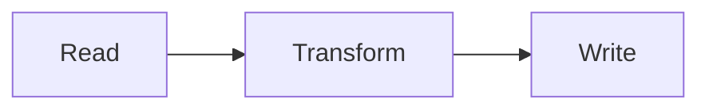
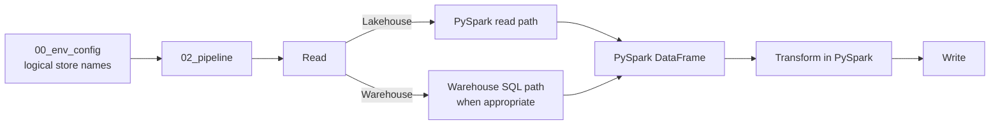
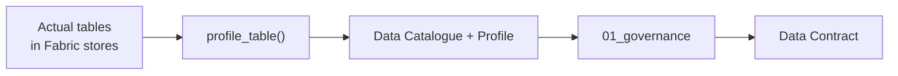

# How FabricOps works

<style>
.md-typeset .fabricops-section-block {
  margin: 1.25rem 0;
  padding: 1.1rem 1.2rem;
  border: 1px solid var(--md-default-fg-color--lightest);
  border-radius: 0.4rem;
  background-color: var(--md-default-bg-color);
  box-shadow: 0 0.12rem 0.45rem rgba(0, 0, 0, 0.04);
}

.md-typeset .fabricops-section-block > :first-child {
  margin-top: 0;
}

.md-typeset .fabricops-section-block > :last-child {
  margin-bottom: 0;
}
</style>

The FabricOps overview video introduces the story. This page goes deeper into how the pieces fit together and why the workflow is structured this way.

[Want to run it yourself? Follow the Guided Demo.](guided-demo.md)

<div class="fabricops-section-block" markdown>

## What problem is FabricOps solving?

**Microsoft Fabric gives the platform. FabricOps gives the operating practice.**

Fabric already gives teams notebooks, Lakehouses, Warehouses, pipelines, environments, AI capabilities, and many other building blocks. The harder question is how a team uses those building blocks repeatedly without every project inventing a different engineering and governance pattern.

FabricOps packages that operating pattern around four reusable notebooks:

| Notebook | Role |
| --- | --- |
| [`00_env_config`](https://github.com/Voycepeh/FabricOps-Starter-Kit/blob/main/templates/notebooks/00_env_config.ipynb) | Defines the active environment and configured Fabric stores. |
| [`01_governance`](https://github.com/Voycepeh/FabricOps-Starter-Kit/blob/main/templates/notebooks/01_governance.ipynb) | Authors the governance context and versioned Data Contracts. |
| [`02_pipeline`](https://github.com/Voycepeh/FabricOps-Starter-Kit/blob/main/templates/notebooks/02_pipeline.ipynb) | Performs project-specific engineering, records technical metadata, and enforces governed expectations. |
| [`99_explore`](https://github.com/Voycepeh/FabricOps-Starter-Kit/blob/main/templates/notebooks/99_explore.ipynb) | Lets project-specific workspaces consume approved Production data without recreating the Production engineering workflow. |

The notebooks are supported by the FabricOps package: reusable public functions and widgets provide the repeatable pieces, while the project keeps its own transformation logic.

#### See the whole operating model

**Questions this diagram answers:**

- Where do Governance, Engineering Development, Engineering Production, and project-specific consumers sit?
- Which notebooks belong in each workspace?
- Where does the shared Metadata Lakehouse fit?
- What is promoted to Production?
- Where are approved outputs consumed from?


Read it from top to bottom. Governance defines and versions governed expectations. Engineering Development builds and validates the implementation. The validated `02_pipeline` is promoted to Engineering Production, where active contracts are resolved and governed outputs are produced. Project-specific consumers then use approved Production data through `99_explore`.

The rest of this page zooms into that picture without changing the story.

</div>

<div class="fabricops-section-block" markdown>

## How does Engineering actually run across Fabric stores?

Fabric notebooks work very well when a notebook only needs its **single default attached Lakehouse or Warehouse**. You can browse that store naturally and work with its files or tables without repeatedly describing where the data lives.

The difficulty starts when the pipeline needs **two or more Fabric stores**, which is normal for ETL. One pipeline may read from a source Lakehouse, enrich from a Warehouse, and publish to another target store. Without another abstraction, the notebook starts accumulating workspace IDs, item IDs, ABFSS paths, SQL endpoints, or attachment-specific logic.

FabricOps uses [`00_env_config`](https://github.com/Voycepeh/FabricOps-Starter-Kit/blob/main/templates/notebooks/00_env_config.ipynb) to solve that wiring problem. Each Fabric store gets a stable logical name such as `source`, `unified`, or `product`. `02_pipeline` refers to those logical names, while FabricOps resolves the physical resource for the current environment.

That lets the notebook itself stay deliberately simple:



FabricOps standardizes the repeatable plumbing around the Read and Write boundaries. The transformation in the middle stays yours.

The configuration layer also lets FabricOps choose the execution path that matches the underlying store. Lakehouse access naturally uses the PySpark path. Warehouse sources can use the Warehouse SQL path when source-side SQL is the better execution option. In both cases, the pipeline returns to a **PySpark DataFrame** for project transformation.



#### Read

A Read block describes one source and calls [`pipeline_read()`](api/reference/pipeline_read.md). FabricOps then resolves the configured store from `00_env_config`, the canonical `table_id`, the physical Fabric item, and the correct lower-level reader.

Each Read block is designed to be **fully clonable**. Copy the whole block, change the small set of variables at the top such as the store, schema, table, or optional Warehouse query, and the same structure works for the next source.

Under the Read block, Engineering can keep the more advanced source work explicit when it is needed:

- inspect the persisted source with [`observe_table()`](api/reference/observe_table.md)
- enforce Freshness with [`check_freshness()`](api/reference/check_freshness.md) and Source Stability with [`check_source_stability()`](api/reference/check_source_stability.md) once the target relationship is known
- enforce Schema with [`check_schema()`](api/reference/check_schema.md) and Data Quality with [`check_dq()`](api/reference/check_dq.md)
- profile the governed table or supplied DataFrame with [`profile_table()`](api/reference/profile_table.md)

The routing stays hidden underneath the public functions. [`pipeline_read()`](api/reference/pipeline_read.md) dispatches governed table reads to [`read_lakehouse_table()`](api/reference/read_lakehouse_table.md), [`read_warehouse_table()`](api/reference/read_warehouse_table.md), or [`read_warehouse_query()`](api/reference/read_warehouse_query.md) according to the resolved store and source definition. Raw Lakehouse files continue to use the foundational file readers directly.

For a Lakehouse table, PySpark is the natural execution path. For a Warehouse, project-owned SQL can be pushed down through `query=...` so filtering, aggregation, projection, or other source-side work happens in the Warehouse before the result enters the Spark workflow. That avoids unnecessarily translating more Warehouse data into Spark than the pipeline needs.

#### Transform

Once the Read blocks return Spark DataFrames, FabricOps gets out of the way. **Project transformations are ordinary PySpark DataFrame transformations.**

Join, filter, aggregate, derive columns, reshape data, or apply whatever business logic the project requires. This keeps the transformation readable to engineers instead of hiding it inside a framework-specific DSL.

That also means engineers can use **Microsoft Fabric Copilot** to help write or refine PySpark transformation code while the FabricOps Read and Write boundaries stay standardized.

#### Write

A Write block publishes the prepared DataFrame through [`pipeline_write()`](api/reference/pipeline_write.md). Like the Read block, it is designed to be **fully clonable**: copy the complete block, change the target variables at the top, and reuse the same governed publication structure for another target.

The target identity is resolved with [`resolve_table_id()`](api/reference/resolve_table_id.md). The Write block is where the Data Contract becomes operational: FabricOps resolves the selected or active Data Contract and uses its governed processing definition to determine how the target is published.

The surrounding Write block keeps the important target decisions explicit:

- enforce target Schema with [`check_schema()`](api/reference/check_schema.md) and Data Quality with [`check_dq()`](api/reference/check_dq.md)
- enforce Sensitive Data Guardrails with [`check_sensitive_data()`](api/reference/check_sensitive_data.md)
- publish the prepared DataFrame with [`pipeline_write()`](api/reference/pipeline_write.md), which resolves the governed load strategy and the correct Lakehouse or Warehouse path
- add FabricOps technical audit columns to the target data
- persist the resolved load strategy and parameters in Catalogue
- commit successful Lineage and Source Observation metadata only after the physical write succeeds

This gives `02_pipeline` a consistent shape without turning it into a black box: **configure stores once in `00_env_config`, clone the Read and Write blocks, change the variables, and keep the project transformation in the middle as normal PySpark.**

??? info "Read more: how FabricOps routes work across Lakehouse and Warehouse"

    FabricOps public functions give the notebook stable interfaces while resolving the correct Lakehouse or Warehouse implementation underneath.

    [`pipeline_read()`](api/reference/pipeline_read.md) routes governed table reads to the Lakehouse table, Warehouse table, or Warehouse query implementation. Raw Lakehouse files remain explicit file reads through the foundational file readers.

    [`profile_table()`](api/reference/profile_table.md) uses Spark for a supplied DataFrame or Lakehouse table, and can use Warehouse-native SQL when profiling a physical Warehouse table.

    [`pipeline_write()`](api/reference/pipeline_write.md) resolves the governed target and routes publication through the correct Lakehouse or Warehouse path while applying the Data Contract load strategy.

</div>

<div class="fabricops-section-block" markdown>

## Where does Governance enter the engineering flow?

**Engineering produces the actual data first. FabricOps then turns what it observes into governance context.**

In `02_pipeline`, Engineering reads the source data, transforms it, and writes the actual target table. FabricOps keeps the physical output tied to its governed `table_id`, Lineage, and runtime context.

[`profile_table()`](api/reference/profile_table.md) profiles the actual governed tables in their respective Fabric data stores and updates the **Data Catalogue** plus profiling metadata.



Governance reads from the **Data Catalogue**, which represents the actual governed tables in their respective Fabric data stores. This gives Governance the real `table_id`, column structure, data types, and profiling context for the tables Engineering produced.

Governance then authors the Data Contract against that governed table identity rather than against a separate or manually recreated definition.

`01_governance` can also establish the **Data Steward** and **Data Agreement** around that governed asset. Fabric AI Functions can optionally use the Catalogue and profiling context to suggest descriptions and classifications, which Governance reviews and edits before they become part of the governed definition.

</div>

<div class="fabricops-section-block" markdown>

## What is a Data Contract in FabricOps?

**The Data Contract is the versioned governance definition for a governed table, not passive documentation beside the pipeline.**

Governance selects the `table_id` and authors a table-centric Data Contract in `01_governance`. The contract brings together the definition Engineering is expected to run against, including:

- **Enrichment** for descriptive table and column metadata and information classification
- **Guardrails** for enforceable expectations such as schema, freshness, Source Stability, Data Quality, and Sensitive Data requirements
- the governed target processing definition, including its load strategy
- the logical notebook ownership needed to keep the governed write relationship unambiguous

Governance reviews that definition and freezes an immutable version for Development validation.

The important point is what happens next: **Engineering selects that frozen contract and FabricOps check functions enforce its Guardrails against the real pipeline.** Guardrails can continue with a warning or block governed write continuation according to the authored action.

```text
Governance authors
      ↓
Data Contract version
      ↓
Freeze
      ↓
Engineering selects
      ↓
FabricOps check functions enforce Guardrails
      ↓
Guardrail Results
```

That is the core **Governance as Code** idea in FabricOps. Governance definitions are connected to executable engineering behavior through the Data Contract rather than remaining a separate policy document.

??? info "Read more: what exactly is authored and activated?"

    ```mermaid
    flowchart LR
        subgraph AUTHOR[Author]
            TABLE["table_id"] --> CONTRACT["Data Contract version"]
            CONTRACT --> ENRICH["Enrichment<br/>Description + Classification"]
            CONTRACT --> RULES["Guardrails<br/>Schema · Freshness · Source Stability<br/>Data Quality · Sensitive Data"]
            CONTRACT --> SNAPSHOT["Immutable schema / processing definition"]
        end
        subgraph ACTIVATE[Activate]
            TESTED["Tested frozen Data Contract version"] --> LINK["Explicit linkage"]
            AGREEMENT["Data Agreement version"] --> LINK
            LINK --> ACTIVE["ACTIVE for Production"]
        end
    ```

    **Enrichment** is descriptive. It helps people and downstream systems understand what the table and columns mean and how the information is classified.

    **Guardrails** are enforceable expectations. Examples include schema expectations, freshness, Source Stability, Data Quality, and Sensitive Data handling. A Guardrail can use a **Warn** or **Block** action.

    Authoring and activation are deliberately separate Governance decisions. A frozen version gives Engineering Development an immutable definition to test. Only after the selected frozen version has been tested does Governance explicitly link the exact Data Agreement version and activate the contract for Production.

</div>

<div class="fabricops-section-block" markdown>

## Why do Governance and Engineering loop before Production?

**Because a governed expectation should be tested against the real engineering implementation before it becomes the active Production definition.**

#### See the Governance and Engineering loop

**Questions this diagram answers:**

- What happens first in Governance and Engineering Development?
- Where is the Data Contract authored?
- Why do steps 3 and 4 repeat?
- What is activated before Production runs?
- What is promoted into Engineering Production?
- Where do consumers enter the flow?


Read the numbered stages as one controlled feedback loop:

1. Governance establishes the Data Stewards and Data Agreement.
2. Engineering Development builds the ETL, produces the governed table, and records Catalogue, profiling, Lineage, and runtime observations.
3. Governance selects the `table_id`, authors the Data Contract, and freezes a version.
4. Engineering Development selects that frozen version and validates its Guardrails against the real pipeline.
5. When the definition needs refinement, Governance and Engineering repeat the author-and-validate loop.
6. Governance links the tested contract to the Data Agreement and activates it.
7. Engineering promotes the validated `02_pipeline`, Production runs against the active contract, and consumers use the approved result.

This is not Governance handing Engineering a document once. It is a controlled feedback loop between what Governance expects and what Engineering actually observes and executes.

??? info "Read more: how Development and Production resolve contracts"

    ```mermaid
    flowchart LR
        NB["notebook_id"] --> LIN["METADATA_DATA_LINEAGE"]
        LIN --> T["linked table_id values"]
        T --> DEV["Development<br/>select frozen version per table_id"]
        T --> PROD["Production<br/>resolve active version per table_id"]
    ```

    Development uses notebook Lineage to discover linked `table_id` values and lets the developer select one exact frozen contract version for each governed table being validated.

    Production uses the same governed identities but removes manual version choice: each linked `table_id` must resolve to exactly one active contract. Zero or multiple active versions fail resolution rather than silently choosing one.

??? info "Read more: Source Observation and successful writes"

    Source Observation records relationship-scoped evidence around the logical notebook, source `table_id`, and target `table_id`. A successful physical target write advances the accepted committed observation and successful target Lineage. A failed write does not advance that accepted baseline.

    This keeps runtime evidence aligned with what was actually written rather than claiming a successful lineage or observation state before the governed output exists.

</div>

<div class="fabricops-section-block" markdown>

## What changes when the pipeline reaches Production?

**The operating pattern does not get rebuilt for Production. The validated pipeline is promoted and resolves Production configuration plus active governance at runtime.**

Engineering promotes the validated `02_pipeline` into the Engineering Production workspace using the organisation's deployment process. Production resolves its own configured Fabric stores through `00_env_config`, discovers the governed `table_id` values through the pipeline's Lineage, and resolves the single active Data Contract for each linked table.

```text
validated 02_pipeline
        +
Production 00_env_config
        +
active Data Contract(s)
        ↓
governed Production run
```

The contract and pipeline remain separate controls. **Activate** determines which Data Contract version Production may resolve. **Promote** moves the validated engineering implementation into Production. FabricOps keeps those decisions explicit rather than treating a notebook deployment as governance approval.

</div>

<div class="fabricops-section-block" markdown>

## How do project teams consume the result?

**Project-specific consumer workspaces consume approved Production outputs instead of recreating the Production engineering workflow.**

`99_explore` is the reusable read-only exploration entry point. A project can use approved Production data for Power BI, AI, data science, exploration, and other downstream work while Engineering Production remains the trusted source.

The consumer workspace does not need its own copy of the governed ETL just to use the result. This keeps the responsibility clear: Engineering produces the approved physical output; project-specific consumers use it.

</div>

<div class="fabricops-section-block" markdown>

## Where is the shared governance and engineering state kept?

**The Metadata Lakehouse carries the shared FabricOps context, with a clear ownership boundary between Governance definitions and Engineering/runtime evidence.**

#### See the metadata ownership model

**Questions this diagram answers:**

- Which metadata belongs to the Governance schema?
- Which metadata is written by Engineering/runtime?
- How does `table_id` connect the governed asset across both sides?
- How do Data Contracts own Enrichment and Guardrails?
- Where do profiling, Lineage, Source Observation, access, and Guardrail Results live?


The purple Governance area contains authoritative definitions: Data Stewards, Data Agreements, Data Contracts, Enrichment, and Guardrails. The blue Engineering area contains what Engineering discovers or records while the workflow runs: Catalogue, profiles, Lineage, Source Observation, access, and Guardrail Results.

The bridge between those areas is the governed asset identity. `table_id` anchors the physical table in Engineering metadata and lets the selected Data Contract attach the governed definition to that same asset.

Engineering can read Governance definitions during pipeline execution without taking ownership of them. The governed output table itself is project-owned physical data rather than FabricOps metadata.

??? info "Read more: what is not stored as FabricOps metadata"

    Optional support data such as Data Quality failed rows or Sensitive Data token mappings remains caller-owned. FabricOps does not automatically turn failing business rows into metadata records or prescribe a mandatory persistence location for that support data.

    `METADATA_GUARDRAIL_RESULTS` stores runtime summaries and continuation decisions, not copies of the failing business rows.

    [What exactly is stored in each metadata table?](reference/metadata.md)

</div>

<div class="fabricops-section-block" markdown>

## So what is the complete FabricOps story?

**Configure once per environment, engineer against reusable foundations, observe the data, turn those observations into a versioned Data Contract, enforce that contract in code, activate the tested definition, promote the same engineering pattern to Production, and let projects consume only the approved output.**

```text
Configure
   ↓
Engineer + Observe
   ↓
Author Data Contract
   ↓
Freeze ↔ Validate
   ↓
Link + Activate
   ↓
Promote + Run Production
   ↓
Consume approved output
```

That is the operating practice the overview video introduces. This page explains how the pieces connect.

[How do I run the complete workflow myself?](guided-demo.md)

</div>

<div class="fabricops-section-block" markdown>

## Where to go next

- [How do I run the workflow myself?](guided-demo.md)
- [Why does FabricOps make these engineering choices?](reference/engineering-cheat-sheet.md)
- [What exactly is stored in FabricOps metadata?](reference/metadata.md)
- [What does each FabricOps function do?](reference/index.md)
- [Where are the reusable notebook templates?](notebook-templates.md)

</div>