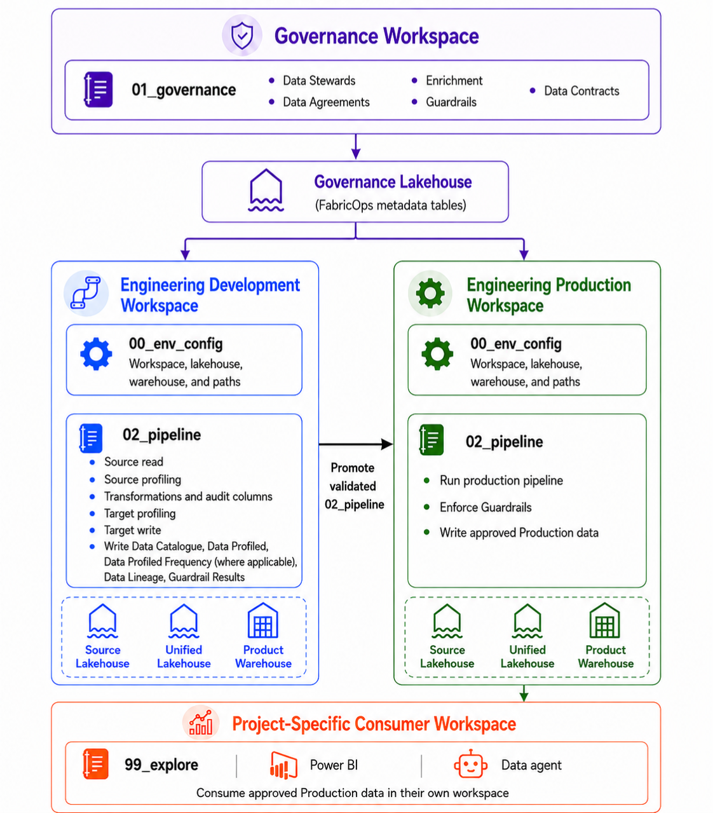

# How FabricOps works

**FabricOps connects Governance, Engineering Development, Engineering Production, and project-specific consumer workspaces through one governed workflow.**

The shared Metadata Lakehouse carries FabricOps metadata between Governance and Engineering. Governance authors and freezes the governed definition, Engineering Development tests it, and Engineering Production resolves the active Data Contract when the approved pipeline runs. Project-specific consumer workspaces consume only approved Production data and do not recreate the Production engineering workflow.

## Four ideas to know before you start

**FabricOps Starter Kit** is a governed Data Engineering and Data Governance practice for Microsoft Fabric. It gives teams a repeatable operating workflow, notebook templates, reusable functions, and shared metadata rather than asking every project to invent its own engineering and governance pattern.

**Metadata** is the information FabricOps carries through that workflow so Governance and Engineering are working from the same definition of the data. It includes technical structure and Profiles as well as business meaning, ownership, Guardrails, lineage, Data Agreements, and Data Contracts.

**Governance as Code** means governance decisions are captured in structured metadata, rules, and contracts that the engineering workflow can directly use. Governance does not only describe expectations in documents; FabricOps turns those expectations into Data Agreements, Enrichment, Guardrails, and Data Contracts that `02_pipeline` can resolve, validate, and enforce during execution.

**Configuration-driven Engineering** keeps reusable pipeline code separate from environment-specific Fabric item identities and repeatable processing choices. `00_env_config` defines the active environment and logical stores, while FabricOps I/O functions resolve those logical names to the correct Lakehouse or Warehouse. The same `02_pipeline` can therefore move from Development to Production without hard-coding different workspace paths and item IDs throughout the notebook.

Read more about [Config-driven engineering and why FabricOps has I/O functions](reference/engineering-cheat-sheet.md#config-driven-engineering). Hover over a glossary term when you only need the short definition, or use the [FabricOps Glossary](glossary.md) for the full terminology reference.

## Workspace model

| Workspace | Primary Purpose | Main Fabric Stores |
| --------- | --------------- | ------------------ |
| Governance | Manage Data Stewards, Data Agreements, Data Contracts, Catalogue Enrichment, and Guardrails | Shared FabricOps Metadata Lakehouse |
| Engineering Development | Explore data and develop, profile, test, and review repeatable pipelines | Configured Development data layers using Lakehouses, Warehouses, or both |
| Engineering Production | Run governed and stable Production pipelines on the required operational schedule | Configured Production data layers using Lakehouses, Warehouses, or both |
| Project-Specific Consumer | Support project-level exploration, AI, and BI consumption without duplicating the Production engineering workflow | Consumes approved data from the Engineering Production workspace via `99_explore` |

??? info "Read more about the workspace model"

    **Core workspaces**

    Governance, Engineering Development, and Engineering Production establish the shared governance and engineering workflow used to create, validate, govern, and operate data pipelines. The Metadata Lakehouse is the shared hand-off point for FabricOps metadata between Governance and Engineering.

    **Project-Specific Consumer workspaces**

    Teams may create multiple project-specific consumer workspaces for exploration, AI, data science, and BI consumption. Each workspace uses `99_explore` to read approved governed data directly from Engineering Production for its own project work.

    **Trusted Production source**

    Consumer workspaces do not reproduce the Production pipeline or maintain their own Production copies of the governed data layers. Engineering Production remains the trusted Production source.

### Data layers and Medallion Architecture

FabricOps is compatible with the familiar **Bronze → Silver → Gold** pattern, but it does not require those literal store names or a fixed number of persisted layers. Projects define their logical stores in `00_env_config` and use only the layers their architecture actually needs.

Read more about [Medallion architecture in FabricOps](reference/engineering-cheat-sheet.md#medallion-architecture) and [Lakehouse first — and when Warehouse fits](reference/engineering-cheat-sheet.md#lakehouse-first).

## The governance and engineering loop workflow

**FabricOps uses a loop between Governance and Engineering Development to validate a pipeline and its governed definition before the approved pipeline runs in Engineering Production.**

Read the [Guided Demo](guided-demo.md) to execute the workflow. Download the notebooks from [Notebook Templates](notebook-templates.md).

??? info "Read the workflow step by step"

    **0A. Prepare Fabric artifacts**

    Create the Governance, Engineering Development, and Engineering Production workspaces, the required Lakehouses and Warehouses, attach the Fabric Environment, and copy the notebook templates.

    **0B. Set up the operating environment**

    Run `00_env_config` in Governance, Engineering Development, and Engineering Production, then create or validate the Governance metadata tables.

    **1. Governance: Create Data Stewards and a Data Agreement**

    In `01_governance`, create the provider and recipient Data Stewards and establish the Data Agreement between them.

    **2. Engineering Development: ETL, profile, and catalogue**

    Run `02_pipeline` to perform ETL and write `METADATA_DATA_CATALOGUE`, `METADATA_DATA_PROFILED`, `METADATA_DATA_PROFILED_FREQUENCY` where applicable, and `METADATA_DATA_LINEAGE` records.

    **3. Governance: Enrich the Data Catalogue and define Guardrails**

    Return to `01_governance` to read `METADATA_DATA_CATALOGUE` and `METADATA_DATA_PROFILED`, write `METADATA_ENRICHMENT`, and author `METADATA_GUARDRAIL` records for the governed table or column.

    **4. Engineering Development: Validate with Guardrails or a Data Contract**

    Rerun `02_pipeline` with current authored Guardrails, or with Guardrails from a selected frozen Data Contract. Engineering evaluates the rules and writes `METADATA_GUARDRAIL_RESULTS` plus `METADATA_GUARDRAIL_ROW_RESULTS` where row-level failures are recorded.

    **5. Governance and Development: Freeze, test, and activate a Data Contract**

    In `01_governance`, save one immutable Data Contract version for one governed `table_id` under one exact Data Agreement version. Test that frozen version in Engineering Development. After governance sign-off, activate the approved frozen version for Production.

    **6. Engineering Production: Promote and run the validated pipeline**

    Promote the validated `02_pipeline` into Engineering Production using the organisation's deployment process. The Production run resolves the active Data Contract and executes the governed pipeline against its frozen expectations.

    **7. Consumer: Consume approved Production data**

    Use `99_explore` in the project-specific consumer workspace to consume approved Engineering Production data for Power BI, AI, data science, exploration, or other downstream project use without recreating the Production pipeline.

## Development and Production

### Engineering Development

Engineering Development is used for exploration, development, profiling, testing, and review. `02_pipeline` performs ETL and writes `METADATA_DATA_CATALOGUE`, `METADATA_DATA_PROFILED`, `METADATA_DATA_PROFILED_FREQUENCY` where applicable, and `METADATA_DATA_LINEAGE` records.

Governance reads `METADATA_DATA_CATALOGUE` and `METADATA_DATA_PROFILED`, then writes `METADATA_ENRICHMENT` and `METADATA_GUARDRAIL`. `02_pipeline` reads those Guardrails, evaluates them, and writes `METADATA_GUARDRAIL_RESULTS` plus `METADATA_GUARDRAIL_ROW_RESULTS` where applicable. Development can validate current authoring or test a selected frozen Data Contract before Governance activates it for Production.

Development data and temporary notebooks may be cleaned regularly, so teams should avoid treating the workspace as durable Production storage.

### Data Agreement and Data Contract

A Data Agreement is created between one provider Data Steward and one recipient Data Steward. It establishes the governed sharing relationship, including business purpose, approved usages, validity, supporting documents, and other governance context.

A Data Contract is for one canonical `table_id` under one exact Data Agreement version. Each saved version is immutable. Development can select and test a frozen version before it is active. Activation chooses which frozen version Production can resolve.

#### Data Contract lifecycle

The Data Contract moves through one approval and deployment lifecycle before Production relies on it.

| Action | What it means |
| --- | --- |
| **Freeze** | Save an immutable Data Contract version. |
| **Test** | Run the frozen version in Engineering Development and confirm the governed expectations pass. |
| **Activate** | Choose the approved frozen version Production is allowed to resolve. |
| **Promote** | Move the validated `02_pipeline` notebook into Engineering Production using the organisation's deployment process. |

Activation and promotion are deliberately separate. Activation selects the governed contract Production may resolve; promotion moves the validated engineering implementation that will run against it.

#### What a Data Contract freezes

`widget_register_data_contract()` builds the contract from the current `METADATA_DATA_AGREEMENT`, `METADATA_DATA_STEWARD`, `METADATA_DATA_CATALOGUE`, `METADATA_ENRICHMENT`, and active `METADATA_GUARDRAIL` records for the selected table.

| Frozen item | What is captured |
| --- | --- |
| Exact Data Agreement version | Agreement identity and version plus its name, domain, business purpose, validity dates, provider and recipient Steward IDs, and approved usages. |
| Provider and recipient Data Stewards | The selected Stewards' IDs, names, roles, and contacts. |
| Governed `table_id` | The canonical table identity used to match the same governed table across Development and Production. |
| Recorded table location | The contract payload records the environment, store type, layer, schema, and table name from `METADATA_DATA_CATALOGUE` when the version is frozen. Production still resolves its own configured physical table and uses the canonical `table_id` to find the active contract. |
| Table structure / schema | The active Catalogue columns with their `column_id`, column name, and data type. |
| Enrichment | Current table- and column-level `METADATA_ENRICHMENT` values, including enrichment level, type, and value. |
| Active Guardrails | Active `METADATA_GUARDRAIL` rules, including the exact Guardrail version, type, rule identity, severity, and rule parameters. |
| Target load strategy | The Catalogue `load_strategy`, such as `overwrite`, `append`, `scd1`, or `scd2`, when configured. |
| Load-strategy parameters | The configured `load_strategy_parameters_json` values required by the selected target strategy. |
| Governed usages | The selected approved-usage subset, which must remain within the parent Data Agreement's approved usages. |

`METADATA_GUARDRAIL_RESULTS`, `METADATA_GUARDRAIL_ROW_RESULTS`, source observations, successful-processing checkpoints, and run/audit fields are not frozen. They record what happened during individual runs.

A Data Agreement covers the provider-to-recipient sharing relationship. A Data Contract freezes the approved definition for one table under one exact Data Agreement version.

In Production, `02_pipeline` resolves the active Data Contract for the table and uses its frozen Guardrails, target load strategy, and load-strategy parameters.

### Engineering Production

Engineering Production contains governed, stable, recurring pipelines and durable outputs. The validated `02_pipeline` is promoted into this workspace through the organisation's deployment process. At runtime, the Production pipeline resolves and uses the active Data Contract for each governed table.

A recurring Production pipeline may run on any required operational schedule, including annually, when the process needs to remain stable and repeatable.

!!! important "Production rule"

    A Production `02_pipeline` should use the active Data Contract for each governed table it reads or writes. Activating a contract does not copy or deploy the notebook; promotion is a separate deployment action.

## The ETL model inside `02_pipeline`

FabricOps standardizes the boundaries around ETL with a simple operating model:

**0. Environment → E. Extract → T. Transform → L. Load**

**0. Environment** establishes whether the notebook is running in Development or Production and loads the configured Fabric targets.

**E. Extract** reads one or more governed sources and resolves the applicable contract, Guardrails, source state, and checks.

**T. Transform** contains the project-specific engineering logic. FabricOps governs the inputs and outputs rather than hiding the business transformation.

**L. Load** publishes one governed target table using the applicable Data Contract, Guardrails, and load strategy.

The detailed engineering choices deliberately live in the Engineering Guide rather than on this operating-model page. Read more about [Full vs incremental processing](reference/engineering-cheat-sheet.md#full-vs-incremental), [Lakehouse first — and when Warehouse fits](reference/engineering-cheat-sheet.md#lakehouse-first), and [PySpark first — and where T-SQL fits](reference/engineering-cheat-sheet.md#pyspark-first).

## Metadata stored supporting the workflow

**The Data Catalogue sits at the centre of the FabricOps metadata model.**

Metadata is the broader information used to describe, understand, manage, and govern the data. The individual FabricOps metadata tables record the specific Governance and Engineering context used by the operating workflow. They are shared through the Metadata Lakehouse rather than copied into separate Governance and Engineering metadata stores.

??? info "Read how the metadata records connect"

    **Governance records**

    [FabricOps metadata tables](reference/metadata.md) carry Governance information through the workflow. A Data Agreement records the relationship between one provider Data Steward and one recipient Data Steward. A Data Contract then freezes the governed definition for one `table_id` under one exact Data Agreement version.

    **Engineering records**

    `METADATA_DATA_CATALOGUE` identifies each governed table and column and connects `METADATA_DATA_PROFILED`, `METADATA_DATA_PROFILED_FREQUENCY`, `METADATA_DATA_LINEAGE`, `METADATA_DATA_ACCESS`, `METADATA_ENRICHMENT`, `METADATA_GUARDRAIL`, and `METADATA_GUARDRAIL_RESULTS` records.

    **Contract relationship**

    A Data Contract is tied to one canonical `table_id`. It freezes the current Catalogue table/column identity and schema, target load strategy and parameters, Enrichment, active Guardrails and their versions, approved usages, and the relevant Data Agreement and Data Stewards. One Data Agreement can support multiple table-level Data Contracts.

    **Data Catalogue and Profiled records stay with Engineering**

    `02_pipeline` writes `METADATA_DATA_CATALOGUE` and `METADATA_DATA_PROFILED` into the shared metadata store. `01_governance` reads those records for `METADATA_ENRICHMENT`, `METADATA_GUARDRAIL`, and Data Contract preparation. Governance does not create a second copy of the Engineering-written records.

??? info "How the implemented pieces connect"

    **Engineering and Governance write different metadata tables around the same governed table identity.**

    `02_pipeline` performs ETL and writes `METADATA_DATA_CATALOGUE`, `METADATA_DATA_PROFILED`, `METADATA_DATA_PROFILED_FREQUENCY` where applicable, and `METADATA_DATA_LINEAGE`.

    `01_governance` reads `METADATA_DATA_CATALOGUE` and `METADATA_DATA_PROFILED`, then writes `METADATA_ENRICHMENT` and `METADATA_GUARDRAIL`. `02_pipeline` evaluates those Guardrails and writes `METADATA_GUARDRAIL_RESULTS` plus `METADATA_GUARDRAIL_ROW_RESULTS` where applicable.

    Governance freezes a Data Contract version for the table. Engineering Development tests that frozen version. Governance can then activate the approved frozen version Production should use. The validated `02_pipeline` is promoted into Engineering Production through the organisation's deployment process, where it resolves the active contract at runtime.

    Downstream users therefore receive more than a table. Where relevant, they can inspect its Data Catalogue, Profiles, Data Lineage, Enrichment, Guardrails, Guardrail Results, Data Agreement, and Data Contract context.

## Consumer workspaces

Project-specific consumer workspaces provide a separate environment for exploration, AI, data science, and BI consumption. Teams use `99_explore` in their own workspace to read approved governed data directly from Engineering Production without changing or duplicating the Production pipeline.

There may be multiple consumer workspaces, with each workspace aligned to a specific project, analytical product, or business use case. These workspaces consume only from Engineering Production; Development is not a downstream consumer source.

??? info "When consumer work should move into the governed pipeline"

    Important `99_explore` work should be preserved when reproducibility is required. Consumer notebooks support analysis and experimentation, but they should not become an alternative Production pipeline.

    Repeatable data preparation that needs to be operationalised should be incorporated into the governed Engineering Development and Engineering Production workflow.

