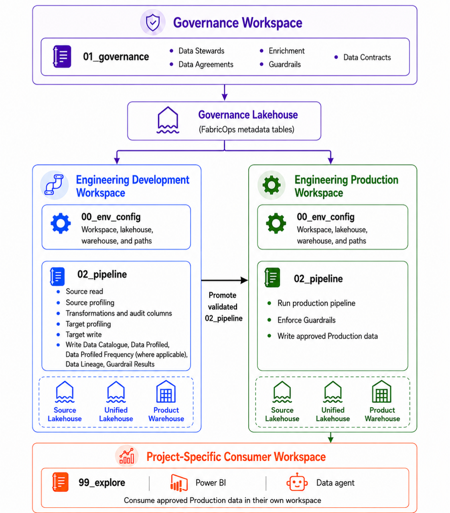
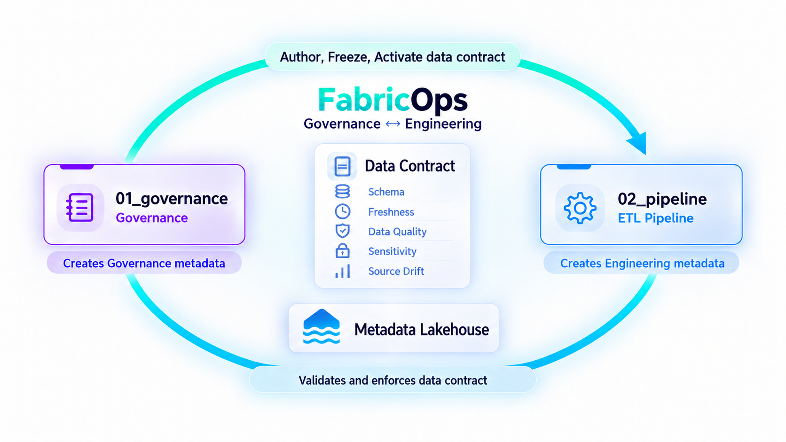
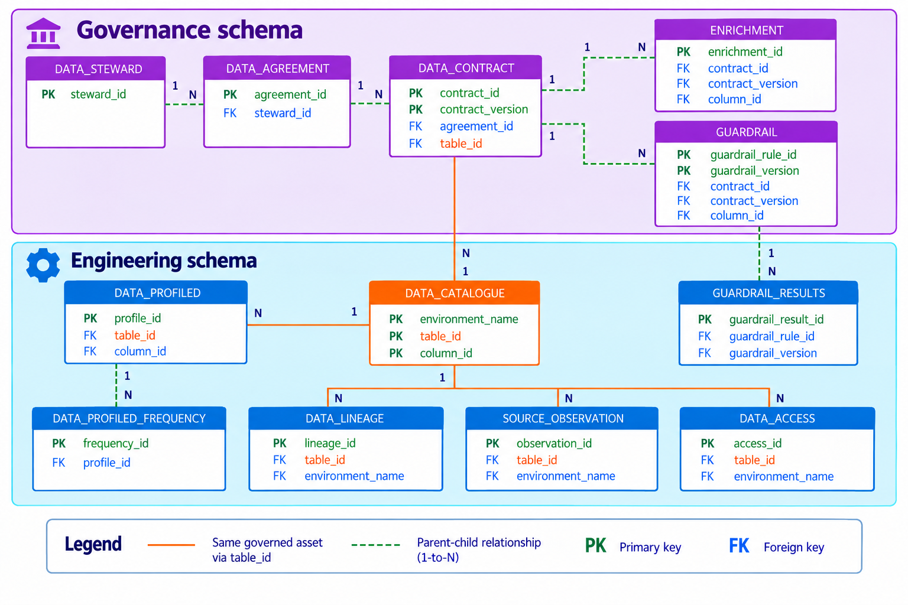
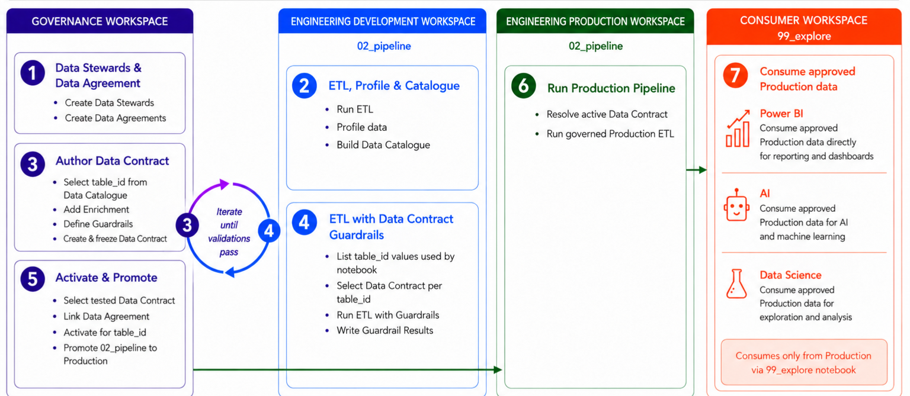

# How FabricOps works

**Understand the end-to-end operating model: how Governance and Engineering work together from contract authoring through validation, activation, promotion, and Production use.**

<style>
.md-typeset .fabricops-section-block {
  margin: 1.25rem 0;
  padding: 1.1rem 1.2rem;
  border: 1px solid var(--md-default-fg-color--lightest);
  border-radius: 0.4rem;
  background-color: var(--md-default-bg-color);
  box-shadow: 0 0.12rem 0.45rem rgba(0, 0, 0, 0.04);
}

.md-typeset .fabricops-section-block > :first-child {
  margin-top: 0;
}

.md-typeset .fabricops-section-block > :last-child {
  margin-bottom: 0;
}

.md-typeset .fabricops-big-picture {
  display: grid;
  grid-template-columns: minmax(0, 1fr) minmax(0, 1fr);
  gap: 1.5rem;
  align-items: start;
}

.md-typeset .fabricops-big-picture__visual img {
  width: 100%;
  height: auto;
  margin: 0;
}

.md-typeset .fabricops-assets-grid {
  display: grid;
  grid-template-columns: repeat(2, minmax(0, 1fr));
  gap: 1rem;
  margin: 1rem 0;
}

.md-typeset .fabricops-asset {
  padding: 1rem;
  border: 1px solid var(--md-default-fg-color--lightest);
  border-radius: 0.4rem;
  background-color: var(--md-default-bg-color);
}

.md-typeset .fabricops-asset > :first-child {
  margin-top: 0;
}

.md-typeset .fabricops-asset > :last-child {
  margin-bottom: 0;
}

@media (max-width: 1200px) {
  .md-typeset .fabricops-big-picture {
    grid-template-columns: 1fr;
  }
}

@media (max-width: 960px) {
  .md-typeset .fabricops-assets-grid {
    grid-template-columns: 1fr;
  }
}
</style>

<div class="fabricops-section-block" markdown="1">

## The Big Picture

<div class="fabricops-big-picture" markdown="1">

<div class="fabricops-big-picture__visual" markdown="1">



</div>

<div class="fabricops-big-picture__copy" markdown="1">

**Microsoft Fabric gives the platform. FabricOps gives the operating practice.**

Fabric already gives teams notebooks, Lakehouses, Warehouses, pipelines, environments, AI capabilities, and many other building blocks. The harder question is how a team uses those building blocks repeatedly without every project inventing a different engineering and governance pattern.

**How Governance and Engineering work hand in hand within Microsoft Fabric**

- **1. Governance Workspace**  
  Owns the governed definition of the data. `00_env_config` stores the Governance environment configuration and Fabric object paths. `01_governance` manages Data Agreements, Stewards, Enrichment, Guardrails, Data Contracts, and access metadata.

- **2. Shared Metadata Lakehouse**  
  Lives in the Governance Workspace and connects Governance with Engineering. It stores the shared FabricOps metadata used across the lifecycle, including Catalogue, profiling, contracts, lineage, Guardrail Results, and related governance metadata.

- **3. Engineering Development Workspace**  
  This is where the engineering implementation is built and validated. Its `00_env_config` points to the Development Lakehouses, Warehouses, schemas, and other Fabric object paths. `02_pipeline` reads and profiles data, applies transformations and audit columns, validates Guardrails, writes outputs, and records engineering metadata.

- **4. Promote the validated pipeline**  
  Once `02_pipeline` has been validated in Development against the frozen Data Contract, the validated notebook is promoted to the Engineering Production Workspace.

- **5. Engineering Production Workspace**  
  Runs the same promoted `02_pipeline` using Production configuration. Its own `00_env_config` points to the equivalent Production Lakehouses, Warehouses, schemas, and Fabric object paths, while the pipeline resolves the activated Data Contract and produces governed Production outputs.

- **6. Same data architecture across environments**  
  Bronze, Silver, and Gold stores exist within the Engineering workspaces across Development and Production. They can be implemented as Lakehouses or Warehouses. The physical Fabric objects differ by environment, but their logical roles and structure remain aligned 1:1 across environments.

- **7. Project-Specific Consumer Workspace**  
  Consumers use `99_explore` and read approved Production data only. Power BI, data agents, AI workloads, and other project-specific consumption should not connect to Engineering Development outputs or recreate the governed engineering pipeline.

- **Notebook ownership**  
  Governance owns `01_governance`. Engineering owns `02_pipeline`. Each operational workspace has its own environment-specific `00_env_config`, while project-specific consumer workspaces use `99_explore`.


</div>

</div>

</div>

<div class="fabricops-section-block" markdown="1">

## The Governance ↔ Engineering Loop



**Engineering produces the physical table. Profiling makes that table visible to Governance, and the Data Contract turns Governance decisions back into executable checks.**

[`profile_table()`](api/reference/profile_table.md) profiles the actual table in its Lakehouse or Warehouse and writes the observed structure and statistics into the **Data Catalogue** and profiling metadata.

Governance reads the actual governed table through its Data Catalogue entry, adds **Enrichment** and **Guardrails**, and authors the versioned **Data Contract** against that real `table_id`. Engineering then uses the contract so the ETL can validate real runs against the governed definition.

`01_governance` can also establish the **Data Steward** and **Data Agreement** around that governed asset. Fabric AI Functions can optionally use the Catalogue and profiling context to suggest descriptions and classifications, which Governance reviews and edits before they become part of the governed definition.

??? info "See the data handoff"

    ```mermaid
    flowchart LR
        TABLE["Table in Lakehouse or Warehouse"] --> PROFILE["profile_table()"]
        PROFILE --> CATALOGUE["Data Catalogue"]
        CATALOGUE --> GOVERNANCE["Governance adds<br/>Enrichment + Guardrails"]
        GOVERNANCE --> CONTRACT["Data Contract"]
        CONTRACT --> ETL["ETL validates runs<br/>against the Data Contract"]
    ```

</div>

<div class="fabricops-section-block" markdown="1">

## FabricOps Assets

FabricOps packages that operating pattern around five reusable notebooks:

<div class="fabricops-assets-grid" markdown="1">

<div class="fabricops-asset" markdown="1">

### Notebooks

| Notebook | Role |
| --- | --- |
| [`00_env_config`](https://github.com/Voycepeh/FabricOps-Starter-Kit/blob/main/templates/notebooks/00_env_config.ipynb) | Defines the active environment and configured Fabric stores. |
| [`01_governance`](https://github.com/Voycepeh/FabricOps-Starter-Kit/blob/main/templates/notebooks/01_governance.ipynb) | Authors the governance context and versioned Data Contracts. |
| [`02_pipeline`](https://github.com/Voycepeh/FabricOps-Starter-Kit/blob/main/templates/notebooks/02_pipeline.ipynb) | Provides the canonical Full Read Pipeline Template for complete-source engineering. |
| [`02B_incremental_append_pipeline`](https://github.com/Voycepeh/FabricOps-Starter-Kit/blob/main/templates/notebooks/02B_incremental_append_pipeline.ipynb) | Variant of `02_pipeline` for incremental reads published through append. |
| [`99_explore`](https://github.com/Voycepeh/FabricOps-Starter-Kit/blob/main/templates/notebooks/99_explore.ipynb) | Lets project-specific workspaces consume approved Production data without recreating the Production engineering workflow. |

[Browse the reusable notebook templates →](https://github.com/Voycepeh/FabricOps-Starter-Kit/tree/main/templates/notebooks)

</div>

<div class="fabricops-asset" markdown="1">

### Functions

The notebooks are supported by the FabricOps package: reusable public functions and widgets provide the repeatable pieces, while the project keeps its own transformation logic.

[See what each FabricOps function does →](reference/index.md)

[Explore the environment-aware pipeline pattern →](solutions/environment-aware-data-pipelines.md)

</div>

<div class="fabricops-asset" markdown="1">

### Data Contracts

**The Data Contract is the versioned governance definition for a governed table, not passive documentation beside the pipeline.**

Governance authors the definition once, Engineering explicitly selects or resolves it, and the pipeline functions execute those governed expectations against the real data flow.

[Explore AI-assisted Data Contract Authoring →](solutions/ai-assisted-data-contract-authoring.md)

[Explore Business Rules to Data Quality →](solutions/business-rules-to-data-quality.md)

</div>

<div class="fabricops-asset" markdown="1">

### Metadata

**The metadata model is the storage view of the same seven-step workflow above.** The workflow explains when Governance and Engineering act; this diagram shows where those definitions, observations, and runtime results are persisted.



[What exactly is stored in each metadata table? →](reference/metadata.md)

</div>

</div>

??? info "Detailed metadata ownership and runtime outputs"

    The main public functions line up with the metadata model like this:

    | Workflow activity | Public function(s) | Main metadata written |
    | --- | --- | --- |
    | Establish Governance context | [`widget_render_data_steward()`](api/reference/widget_render_data_steward.md), [`widget_render_data_agreement()`](api/reference/widget_render_data_agreement.md) | `METADATA_DATA_STEWARD`, `METADATA_DATA_AGREEMENT` |
    | Register and profile real tables | [`profile_table()`](api/reference/profile_table.md) | `METADATA_DATA_CATALOGUE`, `METADATA_DATA_PROFILED`, `METADATA_DATA_PROFILED_FREQUENCY` |
    | Register pipeline participation | [`pipeline_read()`](api/reference/pipeline_read.md), [`pipeline_write()`](api/reference/pipeline_write.md) | `METADATA_DATA_LINEAGE` |
    | Commit source observation state after successful publication | successful [`pipeline_write()`](api/reference/pipeline_write.md) | `METADATA_SOURCE_OBSERVATION` |
    | Author the governed definition | [`widget_data_contract()`](api/reference/widget_data_contract.md) | `METADATA_DATA_CONTRACT` |
    | Activate the Production definition | [`widget_data_contract()`](api/reference/widget_data_contract.md) | lifecycle and Data Agreement linkage in `METADATA_DATA_CONTRACT` |
    | Enforce Guardrails at runtime | [`check_schema()`](api/reference/check_schema.md), [`check_freshness()`](api/reference/check_freshness.md), [`check_source_drift()`](api/reference/check_source_drift.md), [`check_dq()`](api/reference/check_dq.md), [`check_sensitive_data()`](api/reference/check_sensitive_data.md) | `METADATA_GUARDRAIL_RESULTS` |
    | Optional access observation | `scan_workspace_access()`, `scan_onelake_access()`, `scan_sql_access()` | append-only snapshots in `METADATA_DATA_ACCESS` |

    The purple Governance area therefore stores authored definitions. The blue Engineering area stores what the pipeline discovers, profiles, observes, and enforces while it runs. `table_id` is the bridge between the real physical table and both sides of that metadata model.

    Some Guardrail functions also return **row-level support DataFrames** alongside the summary written to `METADATA_GUARDRAIL_RESULTS`.

    - [`check_dq()`](api/reference/check_dq.md) returns the DQ failure evidence DataFrame as `failed_values`, so the project can inspect the individual failed values and rows behind the summary result.
    - [`check_sensitive_data()`](api/reference/check_sensitive_data.md) returns the treated business DataFrame and, when tokenization is used, an optional caller-owned `support_mapping` DataFrame containing the PII/token mapping needed to preserve token assignments across runs.

    These support DataFrames are **not written to any FabricOps metadata table automatically**. They stay with the caller so the project can decide whether they should remain in memory or be persisted as normal physical data.

    When persistence is required, the project can write the DataFrame itself through the existing write APIs: [`pipeline_write()`](api/reference/pipeline_write.md), [`write_lakehouse_table()`](api/reference/write_lakehouse_table.md), or [`write_warehouse_table()`](api/reference/write_warehouse_table.md), depending on whether the output is a governed pipeline target or caller-owned support data in a Lakehouse or Warehouse.

    `METADATA_GUARDRAIL_RESULTS` therefore remains the lightweight runtime summary and continuation record, while detailed DQ failures and PII/token mappings remain project-owned physical data.

    [What exactly is stored in each metadata table?](reference/metadata.md)

</div>

<div class="fabricops-section-block" markdown="1">

## The 7-Step FabricOps Lifecycle

**The seven stages below are the core operating flow. They connect the Governance and Engineering responsibilities shown in the workflow image to the metadata written behind the scenes.**



| Step | What happens |
| --- | --- |
| **1. Establish Governance context** | Create Data Stewards and a Data Agreement. |
| **2. Build and run the ETL** | Choose the pipeline pattern for the workload and run the real Engineering Development flow. |
| **3. Author and freeze the Data Contract** | Select the real `table_id`, author Enrichment, Guardrails, and Processing, then freeze the contract version. |
| **4. Validate the frozen Data Contract** | Evaluate the exact frozen candidate against the real pipeline. |
| **5. Activate the Data Contract and promote** | Link the tested contract version to the Data Agreement, activate it for Production, then deploy the validated engineering artifact from Development to Production. |
| **6. Run the pipeline in Production** | Run the same validated Read → Transform → Write workflow again using Production configuration and the active Data Contract. |
| **7. Consume approved Production data** | Read approved Production outputs from the consumer workspace. |

**Steps 3 ↔ 4 are intentionally iterative.** Governance authors the next contract version; Engineering selects that immutable version and reruns the pipeline against it. The loop continues until the governed definition and the real engineering implementation agree.

[Run the full lifecycle yourself in the Guided Demo →](guided-demo.md)

</div>

<div class="fabricops-section-block" markdown="1">

## Explore deeper

- [Plug-and-Play, Environment-aware Data Pipelines](solutions/environment-aware-data-pipelines.md)
- [AI-assisted Data Contract Authoring](solutions/ai-assisted-data-contract-authoring.md)
- [Generate Enforceable Data Quality Rules from Business Rules](solutions/business-rules-to-data-quality.md)
- [Scan Effective Data Access](solutions/effective-data-access.md)

## Where to go next

- [How do I run the workflow myself?](guided-demo.md)
- [Why does FabricOps make these engineering choices?](reference/engineering-cheat-sheet.md)
- [What exactly is stored in FabricOps metadata?](reference/metadata.md)
- [What does each FabricOps function do?](reference/index.md)
- [Where are the reusable notebook templates?](https://github.com/Voycepeh/FabricOps-Starter-Kit/tree/main/templates/notebooks)

</div>
