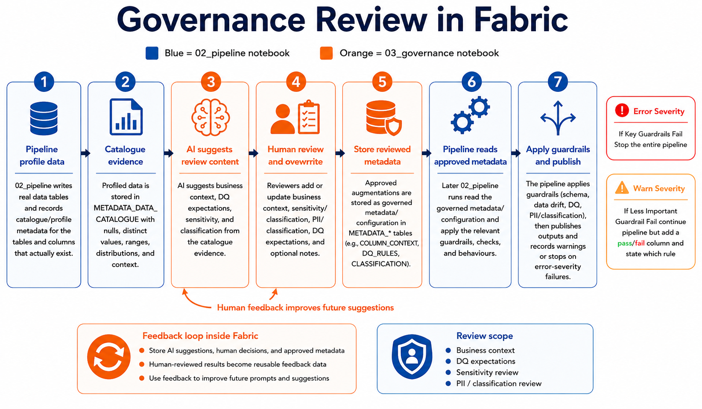

# 03 Governance Review

`03_governance` is the formal review layer that records governance decisions. It is where governance users review table enrichment and guardrail intent after pipeline profiling and authoring have produced metadata evidence.

## Selecting a guardrail target

Use [`widget_select_guardrail_target`](../api/reference/widget_select_guardrail_target.md) to select a table target from `METADATA_DATA_CATALOGUE`. The selector uses successful table profiles so review starts from observed evidence rather than free-text table names.

## Authoring combined guardrail rules

Use [`widget_author_guardrail_rules`](../api/reference/widget_author_guardrail_rules.md) in `03_governance` to render the combined guardrail authoring workflow. The wrapper returns two widget states:

- `schema_freshness_profile` from [`widget_author_schema_freshness_profile_rules`](../api/reference/widget_author_schema_freshness_profile_rules.md);
- `dq` from [`widget_author_dq_rules`](../api/reference/widget_author_dq_rules.md).

Guardrail records are appended to `METADATA_GUARDRAIL_RULES`. Schema, freshness, profile, and DQ behaviour is described in [02 Pipeline Execution](pipeline-execution.md) because runtime interpretation and enforcement happen when `02_pipeline` executes checks.

`METADATA_GUARDRAIL_RULES` contains authored rule intent and lifecycle state. `METADATA_GUARDRAIL_RESULTS` contains runtime outcomes written by pipeline execution. Review users can inspect runtime evidence from `METADATA_GUARDRAIL_RESULTS` alongside `METADATA_GUARDRAIL_RULES` and `METADATA_ENRICHMENT_RULES`; [`widget_review_table_governance`](../api/reference/widget_review_table_governance.md) can show runtime result context for guardrail records where matching results exist.

## Enrichment

Use [`widget_enrich_table_metadata`](../api/reference/widget_enrich_table_metadata.md) to author descriptive table and column enrichment. Enrichment intent is appended to `METADATA_ENRICHMENT_RULES`; it is separate from observed evidence in `METADATA_DATA_CATALOGUE` and separate from guardrail intent in `METADATA_GUARDRAIL_RULES`.

## Formal review

Use [`widget_review_table_governance`](../api/reference/widget_review_table_governance.md) for formal governance review. Governance users can inspect records that need review, currently active records, rejected or inactive records, and superseded history. Formal review can approve, approve and activate, reject, replace, deactivate, or view history depending on record state.

## Authoring lifecycle behaviour

The authoring lifecycle is append-only and records operational state separately from review state. Current lifecycle outcomes are:

| Action | Key fields written | Meaning |
| --- | --- | --- |
| Save draft | `activation_state="inactive"`, `review_state="draft"` | The record is saved but does not affect runtime. |
| Submit for governance review | For governed tables requiring approval: `activation_state="pending"`, `review_state="pending_governance_review"`, `requires_governance_review=true` | The record awaits formal review and is not consumed as active runtime intent. |
| Apply now | `activation_state="active"`, `review_state="active_pending_governance_review"`, `requires_governance_review=true`, `requires_post_review=true`, `approval_bypassed=true`, `activation_reason="engineering_apply_now"` | The record is operationally active immediately, but remains marked for post-review. |

Active guardrail records can be consumed by `02_pipeline`; pending, draft, rejected, inactive, and superseded records are excluded from active runtime consumption.

## Review state and metadata control

| State/control | Meaning | Where it is stored |
| --- | --- | --- |
| `draft` / pending review | Authored intent exists but is not yet approved for normal runtime use. | `METADATA_GUARDRAIL_RULES` or `METADATA_ENRICHMENT_RULES`. |
| `approved` / active | Governance has approved the current record or it was allowed by configured policy. | Append-only lifecycle row with active state. |
| `rejected` | Governance reviewed the record and decided it should not become active. | Append-only lifecycle row with decision and comment fields. |
| `inactive` | Previously active intent is intentionally deactivated. | Append-only lifecycle row preserving history. |
| `superseded` | A newer rule/enrichment record replaces an older one. | Supersede/superseded columns link old and new records. |

Governance review should not rewrite runtime outcome evidence in `METADATA_GUARDRAIL_RESULTS` and should not move observed physical evidence out of `METADATA_DATA_CATALOGUE`. It controls approved intent and descriptive enrichment by appending lifecycle rows.

### Implementation guidance

- Start from [`widget_select_guardrail_target`](../api/reference/widget_select_guardrail_target.md) so review is anchored to profiled evidence.
- Use [`widget_review_table_governance`](../api/reference/widget_review_table_governance.md) for formal approve/reject/replace/deactivate/history workflows.
- Keep enrichment separate from executable checks: enrichment describes business context; guardrail rules drive enforcement.
- Use runtime result context to explain why a rule needs review, but write decisions to rule/enrichment metadata, not result rows.
