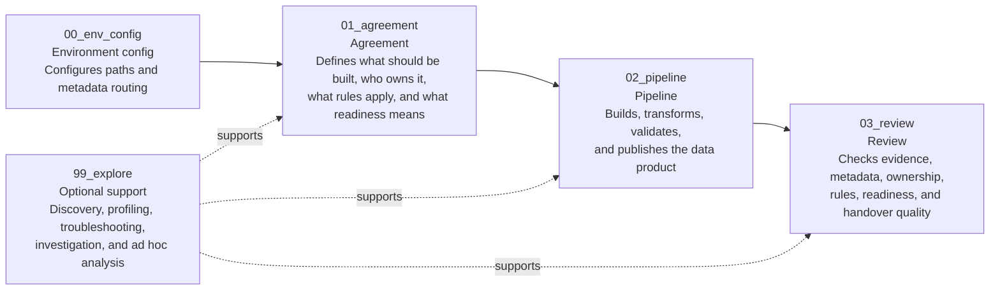

# How FabricOps Works

FabricOps uses notebook templates and shared metadata to support a workflow from agreement, to pipeline, to review.

FabricOps Starter Kit is not a full governance platform or a standalone data quality product. It gives Microsoft Fabric notebooks a shared pattern for pipeline metadata, guardrails, and review.

## Target workflow

The core delivery path is:

1. `01_agreement` defines what should be built, who owns it, what rules apply, and what readiness means.
2. `02_pipeline` builds, transforms, validates, and publishes the data product while capturing key metadata like data profile, lineage, schema, and data drift details.
3. `03_review` checks evidence, metadata, ownership, rules, readiness, and handover quality.

`99_explore` supports optional discovery, profiling, troubleshooting, investigation, and ad hoc analysis. It is not required before Agreement, Pipeline, or Review.

## Notebook responsibilities

| Notebook | Responsibility |
| --- | --- |
| `00_env_config` | Configures the environment and Fabric item paths. |
| `01_agreement` | Defines what should be built, who owns it, what rules apply, and what readiness means. |
| `02_pipeline` | Builds, transforms, validates, publishes, and captures key metadata. |
| `03_review` | Checks evidence, metadata, ownership, rules, readiness, and handover quality. |
| `99_explore` | Optional support for discovery, profiling, troubleshooting, investigation, and ad hoc analysis. |

`99_explore` is optional support and is intentionally placed at the end of the sequence.

## Metadata captured by `02_pipeline`

- Data profile
- Lineage
- Schema details
- Data drift details
- Pipeline outputs
- Run summary

## Metadata enhanced by `03_review`

- Business context
- Data quality rules
- Data sensitivity
- Classification

## Loop back into `02_pipeline`

The workflow does not stop at governance review. Reviewed and approved governance metadata becomes part of later pipeline runs when `02_pipeline` reads or implements the approved rules and classifications.

That keeps the review step connected to the pipeline: reviewers add context and rules, then `02_pipeline` uses the approved metadata with schema and data drift guardrails on later runs.

## What to read next

| Page | Use it for |
| --- | --- |
| [Workspace Operating Model](workspace-operating-model.md) | Understand workspace separation and pipeline promotion. |
| [Notebook Templates](notebook-templates.md) | Understand what each notebook template owns. |
| [Metadata Tables](metadata-tables.md) | Understand what metadata is stored and where. |
| [Pipeline Guardrails](../schema-and-data-drift.md) | Understand how `02_pipeline` checks schema, drift, and approved governance metadata. |
| [Governance Review](../data-quality-rules-system.md) | Understand how `03_review` adds reviewed governance metadata. |
| [Metadata Dashboard](metadata-dashboard.md) | Understand the planned visibility layer over collected metadata. |
