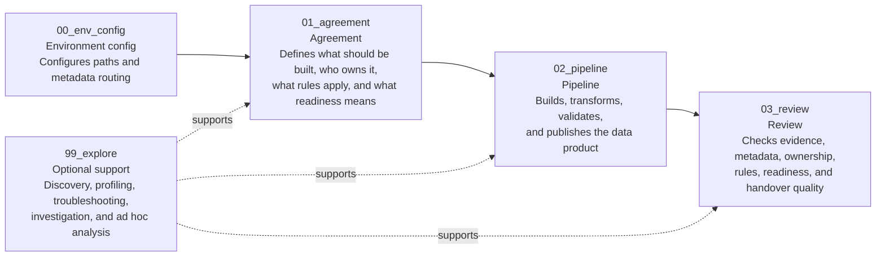

# How FabricOps Works

FabricOps Starter Kit uses notebook templates and shared metadata to support governed, quality-checked, AI-ready notebooks in Microsoft Fabric.
It is not a full governance platform or standalone data quality product; it gives Fabric notebooks a practical pattern for agreement, pipeline execution, review, promotion, and handover.

## Target workflow

The core delivery path is:

1. `01_agreement` defines what should be built, who owns it, what rules apply, and what readiness means.
2. `02_pipeline` builds, transforms, validates, publishes, and captures metadata such as profiling, lineage, schema, and drift details.
3. `03_review` checks evidence, ownership, rules, readiness, and handover quality.

`00_env_config` keeps paths and metadata routing explicit. `99_explore` supports discovery, profiling, troubleshooting, investigation, and ad hoc analysis, but it is not required before Agreement, Pipeline, or Review.

## Recommended workspace operating model

FabricOps Starter Kit is designed to stay self-contained within Microsoft Fabric while keeping governance metadata separate from development and production processing.
The recommended setup uses three workspaces:

| Workspace | Items | Purpose |
| --- | --- | --- |
| Governance workspace | `metadata_lakehouse` | Owns shared metadata, approved agreements, steward records, governance review outputs, and production notebook evidence. |
| Engineering Dev workspace | `source_lakehouse`, `unified_lakehouse`, `product_warehouse` | Supports exploration, profiling, transformation development, and proposed outputs. |
| Engineering Prod workspace | `source_lakehouse`, `unified_lakehouse`, `product_warehouse` | Runs approved repeatable pipelines and publishes production outputs. |

## Workspace roles and responsibilities

| Responsibility | Governance workspace | Engineering Dev workspace | Engineering Prod workspace |
| -------------- | -------------------- | ------------------------- | -------------------------- |
| Data Steward and agreement collection | `01_agreement` creates metadata. | `02_pipeline` consumes agreement metadata; optional `99_explore` may read it for support analysis. | `02_pipeline` consumes approved agreement metadata. |
| Optional exploration support | Not a required delivery step. | `99_explore` supports discovery, profiling, troubleshooting, investigation, and ad hoc analysis. | Use only for controlled production troubleshooting when approved locally. |
| Data transformation / pipeline | Not done here. | Development `02_pipeline`. | Production `02_pipeline`. |
| Governance review | `03_review` creates review outputs. | `02_pipeline` creates profiled outputs for review; optional `99_explore` can support investigation. | `02_pipeline` creates production evidence for review and handover. |

## Notebook responsibilities

| Notebook | Responsibility |
| --- | --- |
| `00_env_config` | Configures the environment, Fabric item paths, and metadata routing. |
| `01_agreement` | Defines what should be built, who owns it, what rules apply, and what readiness means. |
| `02_pipeline` | Builds, transforms, validates, publishes, and captures key metadata. |
| `03_review` | Checks evidence, metadata, ownership, rules, readiness, and handover quality. |
| `99_explore` | Optional support for discovery, profiling, troubleshooting, investigation, and ad hoc analysis. |

## Promotion principle

Production promotion should remain lightweight: promote the production-ready `02_pipeline` notebook from Engineering Dev to Engineering Prod, run it with the production `00_env_config`, and let the production notebook create production outputs in the production workspace.
Do not copy development outputs into production.

## What moves to production

| Item | Promotion approach |
| --- | --- |
| `00_env_config` | Recreate or maintain separately in each environment. Do not blindly promote it. |
| `02_pipeline` | Promote the production-ready transformation notebook from Engineering Dev to Engineering Prod. |
| Approved metadata | Promote or recreate through a controlled process. |
| Production outputs | Create by running the production notebook in Engineering Prod. |
| Draft metadata, dev paths, unreviewed rules | Do not promote. |

Production pipelines must read only production configuration and approved production metadata.

## Store production notebook evidence

Once a production `02_pipeline` is stable, store a copy of the final production notebook as a `.py` or `.ipynb` file in the Governance workspace metadata lakehouse file area.
This keeps handover and support material grounded in the actual production implementation.

Stored notebook evidence can support handover summaries, production support notes, data product explanations, and AI-assisted documentation drafts.
Review generated material before publishing it; people remain accountable for the approved metadata, production notebook, and published documentation.

## Metadata captured by `02_pipeline`

- Data profile
- Lineage
- Schema details
- Data drift details
- Pipeline outputs
- Run summary

## Metadata enhanced by `03_review`

- Business context
- Data quality rules
- Data sensitivity
- Classification

## Loop back into `02_pipeline`

The workflow does not stop at governance review. Reviewed and approved governance metadata becomes part of later pipeline runs when `02_pipeline` reads or implements the approved rules and classifications.
That keeps the review step connected to execution: reviewers add context and rules, then `02_pipeline` uses the approved metadata with schema and data drift guardrails on later runs.

## What to read next

| Page | Use it for |
| --- | --- |
| [Notebook Templates](notebook-templates.md) | Understand what each notebook template owns. |
| [Metadata Tables](metadata-tables.md) | Understand what metadata is stored and where. |
| [Pipeline Guardrails](../schema-and-data-drift.md) | Understand how `02_pipeline` checks schema, drift, and approved governance metadata. |
| [Governance Review](../data-quality-rules-system.md) | Understand how `03_review` adds reviewed governance metadata. |
| [Metadata Dashboard](metadata-dashboard.md) | Understand the planned visibility layer over collected metadata. |
