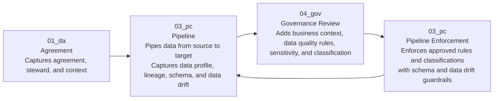

# How FabricOps Works

FabricOps uses notebook templates and shared metadata to support a workflow from agreement, to pipeline, to governance review, then back into pipeline enforcement.

FabricOps Starter Kit is not a full governance platform or a standalone data quality product. It gives Microsoft Fabric notebooks a shared pattern for pipeline metadata, guardrails, and review.

## Target workflow

The main loop is:

1. `01_da` captures the agreement, steward, and context.
2. `03_pc` pipes data from source to target while capturing key metadata like data profile, lineage, schema, and data drift details.
3. `04_gov` uses that metadata to add business context, data quality rules, data sensitivity, and classification.
4. Approved data quality rules, sensitivity rules, and classification rules are enforced in `03_pc` when the pipeline runs again, alongside schema and data drift guardrails.

## Notebook responsibilities

| Notebook | Responsibility |
| --- | --- |
| `01_da` | Captures agreement, steward, and context. |
| `03_pc` | Pipes data from source to target and captures key metadata. |
| `04_gov` | Adds business context, data quality rules, sensitivity, and classification. |
| `03_pc` rerun | Enforces approved rules and classifications with schema and data drift guardrails. |

`00_env_config` supports environment setup. `02_ex` is an optional example or exploration notebook and is not part of the main target workflow.

## Metadata captured by `03_pc`

- Data profile
- Lineage
- Schema details
- Data drift details
- Pipeline outputs
- Run summary

## Metadata enhanced by `04_gov`

- Business context
- Data quality rules
- Data sensitivity
- Classification

## Loop back into `03_pc`

The workflow does not stop at governance review. Reviewed and approved governance metadata becomes part of later pipeline runs when `03_pc` reads or implements the approved rules and classifications.

That keeps the review step connected to the pipeline: reviewers add context and rules, then `03_pc` uses the approved metadata with schema and data drift guardrails on later runs.

## What to read next

| Page | Use it for |
| --- | --- |
| [Workspace Operating Model](workspace-operating-model.md) | Understand workspace separation and pipeline promotion. |
| [Notebook Templates](notebook-templates.md) | Understand what each notebook template owns. |
| [Metadata Tables](metadata-tables.md) | Understand what metadata is stored and where. |
| [Pipeline Guardrails](../schema-and-data-drift.md) | Understand how `03_pc` checks schema, drift, and approved governance metadata. |
| [Governance Review](../data-quality-rules-system.md) | Understand how `04_gov` adds reviewed governance metadata. |
| [Metadata Dashboard](metadata-dashboard.md) | Understand the planned visibility layer over collected metadata. |
