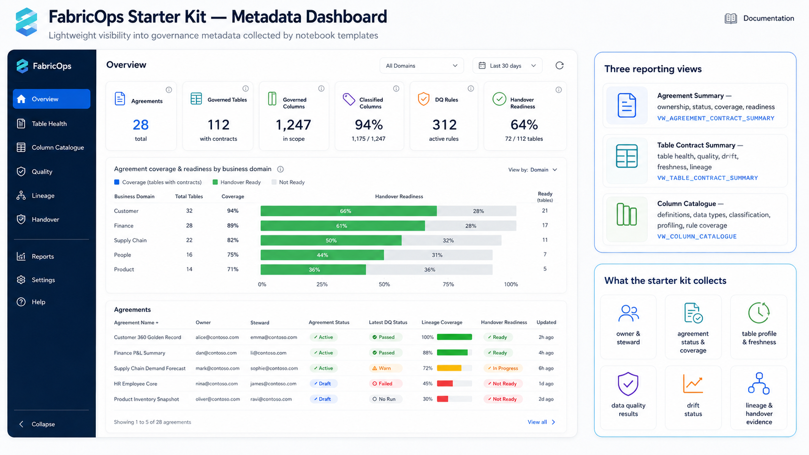

# Metadata Dashboard

The metadata dashboard is the visibility layer over the FabricOps metadata handshake. It helps users see the current governed state without opening every notebook or querying every metadata table manually.

*Figure: dashboard-style view over the same metadata tables written by the notebook handshake.*

## What users can see

A dashboard over the FabricOps metadata tables should expose:

- **Agreements** — steward, agreement, contract, and evidence context created from `01_agreement`.
- **Catalogue and profiles** — observed table and column evidence from `METADATA_DATA_CATALOGUE`.
- **Guardrail rules** — active, pending, draft, rejected, inactive, and superseded guardrail intent from `METADATA_GUARDRAIL_RULES`.
- **Guardrail results** — runtime pass, warning, fail, skipped, and continuation outcomes from `METADATA_GUARDRAIL_RESULTS`.
- **Pipeline run status** — run summaries from `METADATA_PIPELINE_RUNS`.
- **Lineage** — source-to-target relationships from `METADATA_DATA_LINEAGE_TABLE`.
- **Governance review state** — enrichment and guardrail lifecycle state, including records that need review and records active pending post-review.

## How to use it

Use the dashboard as a user-facing check on the notebook handshake:

1. Confirm `01_agreement` created the expected agreement and steward context.
2. Confirm `02_pipeline` wrote evidence, guardrail results, lineage, and run summaries.
3. Confirm `03_governance` review decisions are visible and distinguish active rules from pending or superseded history.
4. Use warning or failed guardrail results to decide which notebook and table target needs attention.

The dashboard should stay practical: it summarizes the governed state held in metadata tables; it is not the source of truth for changing rules or rewriting evidence.

## Implementation guidance

- Build dashboard visuals from metadata tables; do not let dashboard edits mutate governed evidence.
- Separate rule intent (`METADATA_GUARDRAIL_RULES`) from runtime results (`METADATA_GUARDRAIL_RESULTS`).
- Show lifecycle states distinctly so active, pending, rejected, inactive, and superseded records are not confused.
- Include drill-through links or labels back to notebook type, run id, agreement id, table name, and rule key where available.
