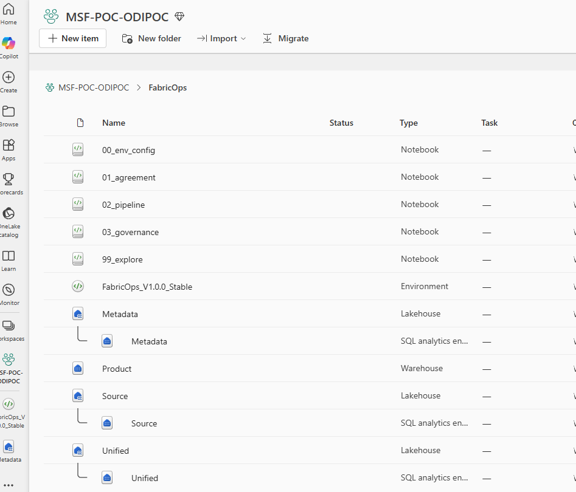

# Template Notebooks

Template notebooks are the practical implementation path for FabricOps. Use this page to decide which notebook to open, when to run it, who normally uses it, what it does, and what evidence it creates.

The core sequence is governed by shared metadata rather than notebook memory. `99_explore` is available for discovery and troubleshooting, but it is optional and does not replace the governed sequence.

## Core notebook guide

-   ## [`00_env_config`](https://github.com/Voycepeh/FabricOps-Starter-Kit/blob/main/templates/notebooks/00_env_config.ipynb)

    **Use this when**

    You are setting up a FabricOps workspace, runtime paths, metadata targets, schema names, Lakehouse or Warehouse names, and governance settings.

    **Who uses this**

    Project owner, engineer, or workspace administrator.

    **What you do**

    Set environment values, workspace items, metadata routing, table names, and runtime settings. Create or validate the metadata tables used by later notebooks.

    **What it creates**

    A validated `CONFIG` object, `ENV` values, metadata table registry, and runtime context.

    **What the next notebook receives**

    Stable workspace and metadata configuration that later notebooks can reuse.

    [Implementation guide](environment-config.md){ .md-button }

-   ## [`01_agreement`](https://github.com/Voycepeh/FabricOps-Starter-Kit/blob/main/templates/notebooks/01_agreement.ipynb)

    **Use this when**

    A data steward, agreement, source usage scope, or approved delivery context needs to be captured before pipeline work begins.

    **Who uses this**

    Governance user, data steward, project owner, or engineer supporting intake.

    **What you do**

    Register steward details, agreement information, approved context, and supporting evidence.

    **What it creates**

    Agreement metadata, steward records, and agreement evidence rows.

    **What the next notebook receives**

    Selectable agreement context for governed pipeline execution.

    [Implementation guide](agreement-setup.md){ .md-button }

-   ## [`02_pipeline`](https://github.com/Voycepeh/FabricOps-Starter-Kit/blob/main/templates/notebooks/02_pipeline.ipynb)

    **Use this when**

    You are ready to execute source to target data movement under an approved agreement context.

    **Who uses this**

    Engineer, analyst engineer, or data scientist implementing the delivery workflow.

    **What you do**

    Select agreement context, read configured sources, profile data, apply checks, write pipeline outputs, capture lineage, and publish run evidence.

    **What it creates**

    Profiles, guardrail results, lineage, pipeline output records, and pipeline run status.

    **What the next notebook receives**

    Evidence and proposed rules or enrichment context for governance review.

    [Implementation guide](pipeline-execution.md){ .md-button }

-   ## [`03_governance`](https://github.com/Voycepeh/FabricOps-Starter-Kit/blob/main/templates/notebooks/03_governance.ipynb)

    **Use this when**

    Rules, enrichment, sensitivity, classification, approval, rejection, replacement, deactivation, or lifecycle decisions need to be reviewed.

    **Who uses this**

    Governance user, data steward, reviewer, or engineer supporting review.

    **What you do**

    Review table or column context, inspect guardrail evidence, author or update rules, approve or reject enrichment, and append lifecycle decisions.

    **What it creates**

    Append only governance decisions, active rule state, enrichment lifecycle records, and review evidence.

    **What the next notebook receives**

    Active governed rules and review state that future pipeline runs can apply.

    [Implementation guide](governance-review.md){ .md-button }

-   ## [`99_explore`](https://github.com/Voycepeh/FabricOps-Starter-Kit/blob/main/templates/notebooks/99_explore.ipynb)

    **Use this when**

    You need discovery, profiling, troubleshooting, demo support, or smoke test analysis before adapting the governed templates.

    **Who uses this**

    Engineer, analyst, data scientist, or reviewer investigating source data or helper behavior.

    **What you do**

    Explore sources, test helper functions, profile data, inspect outputs, and troubleshoot without treating the notebook as a production workflow.

    **What it creates**

    Ad hoc investigation outputs or validation evidence, depending on how the notebook is used.

    **What the next notebook receives**

    Nothing required. This notebook is optional and does not replace the governed sequence.

## Sequencing guidance

1. Run `00_env_config` first.
2. Run `01_agreement` to define approved steward and agreement context.
3. Optionally use `99_explore` for discovery, profiling, troubleshooting, demos, or smoke checks.
4. Run `02_pipeline` for governed source to target execution.
5. Run `03_governance` for review, enrichment, approval, rejection, replacement, or lifecycle updates.
6. Use dashboard and reference pages to inspect evidence, metadata, and current state.

`99_explore` is optional. It can help teams understand data and helper behavior before `02_pipeline`, but it is not a replacement for `00_env_config`, `01_agreement`, `02_pipeline`, or `03_governance` in the governed notebook sequence.

## Optional example notebooks

These notebooks are release-specific validation aids. Optional examples are release validation, demo, and smoke test aids. They are not production workflow templates. Use them to validate helper behavior, generate deterministic demo scenarios, or test guardrail outcomes before adapting the core notebooks. The optional exploration notebook remains available at [`templates/notebooks/99_explore.ipynb`](https://github.com/Voycepeh/FabricOps-Starter-Kit/blob/main/templates/notebooks/99_explore.ipynb).

| Notebook | Purpose | Relevant helpers |
| --- | --- | --- |
| [`templates/notebooks/99_explore.ipynb`](https://github.com/Voycepeh/FabricOps-Starter-Kit/blob/main/templates/notebooks/99_explore.ipynb) | Optional discovery, profiling, troubleshooting, investigation, and ad hoc analysis support. | [`read_data`](../api/reference/read_data.md), [`profile_dataframe`](../api/reference/profile_dataframe.md) |
| [`templates/notebooks/example_pipeline_demo.ipynb`](https://github.com/Voycepeh/FabricOps-Starter-Kit/blob/main/templates/notebooks/example_pipeline_demo.ipynb) | Generates deterministic `demo_` source scenario tables for the real `02_pipeline` template to demonstrate happy path, schema, DQ, freshness, and load-behaviour guardrails. | [`write_data`](../api/reference/write_data.md) |
| [`templates/notebooks/example_dq_rule_smoke_test.ipynb`](https://github.com/Voycepeh/FabricOps-Starter-Kit/blob/main/templates/notebooks/example_dq_rule_smoke_test.ipynb) | Demonstrates DQ rule evaluation, warning behavior, and error blocking behavior using smoke-test data and rules. | [`write_data`](../api/reference/write_data.md), [`enforce_dq_rules`](../api/reference/enforce_dq_rules.md) |

## Implementation note

The starter notebooks intentionally call shared helper functions instead of hiding workflow behavior in large custom cells. This keeps setup, IO, profiling, guardrails, lineage, and review behavior reusable across notebooks while still letting users inspect the implementation through the generated [Function Reference](../reference/index.md).

Useful starting points include [setup_notebook](../api/reference/setup_notebook.md), [`read_data`](../api/reference/read_data.md), [`profile_dataframe`](../api/reference/profile_dataframe.md), [`prepare_pipeline_table_configs`](../api/reference/prepare_pipeline_table_configs.md), [`enforce_dq_rules`](../api/reference/enforce_dq_rules.md), [`write_pipeline_lineage`](../api/reference/write_pipeline_lineage.md), and [`widget_select_guardrail_target`](../api/reference/widget_select_guardrail_target.md).
