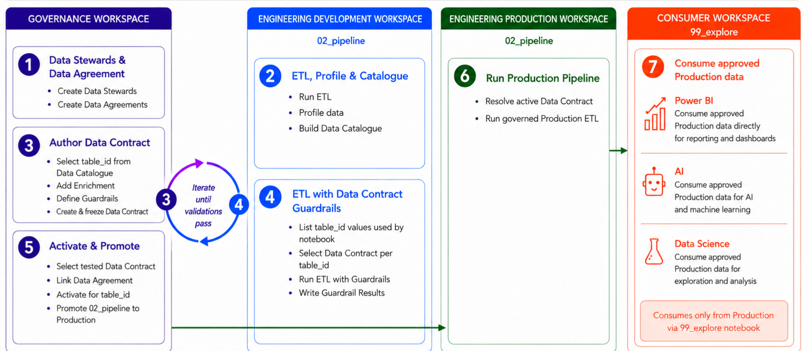

# Notebook Templates

FabricOps Starter Kit uses five notebook templates. Each notebook has a clear role in the workflow.

The notebook templates are available in the [`templates/notebooks`](https://github.com/Voycepeh/FabricOps-Starter-Kit/tree/main/templates/notebooks) folder.

!!! note "Notebook preview"
    The notebook templates are optimized for Microsoft Fabric execution. GitHub may not always render `.ipynb` previews reliably.

    If GitHub shows a notebook preview error, open the template in Microsoft Fabric or view it locally in VS Code or Jupyter.

    The `%run 00_env_config` bootstrap cell is intentionally active so the templates remain plug-and-play in Fabric. Do not manually edit the bootstrap cell unless you are intentionally customizing the template.

## Template overview

| Notebook | Main owner | Purpose |
| --- | --- | --- |
| `00_env_config` | Engineer | Defines workspace, lakehouse, warehouse, and metadata paths for each environment. |
| `01_da` | Governance | Maintains steward and data agreement records. |
| `02_ex` | Analyst or data scientist | Profiles data and proposes schema or transformation advice. |
| `03_pc` | Engineer | Builds repeatable transformations, runtime audit columns, catalogue evidence, output profiles, and lineage. |
| `04_gov` | Governance | Reviews business context, rules, classifications, and governance decisions. |

## Role-based notebook flow

{ .full-width }

| Step | Owner | Notebook or action | Result |
| --- | --- | --- | --- |
| 0 | Engineer | Configure `00_env_config`. | Environment-specific workspace, lakehouse, warehouse, and metadata paths are ready. |
| 1 | Governance| Use `01_da`. | Steward and data agreement records are stored in the Governance workspace metadata lakehouse. |
| 2 | Analyst or data scientist | Use `02_ex` in Engineering Dev. | Exploration profiles, notebook registration, and proposed schema or transformation advice are available. |
| 3 | Engineer | Build `03_pc` in Engineering Dev. | Repeatable transformations, runtime audit columns, source/output catalogue evidence, table-level lineage, profiles, and output tables are created without governance enforcement. |
| 4 | Governance | Use `04_gov`. | Business context, schema expectations, data quality rules, sensitivity rules, classification rules, and enforcement decisions are reviewed and stored. |
| 5 | Engineer | Rerun or enhance `03_pc` with approved metadata after `04_gov`. | The enhanced production pipeline can apply approved rules using actions such as warn, split, quarantine, or stop. |
| 6 | Engineer | Use stored production notebook evidence. | Human-readable support material can be generated from approved evidence. |

## What each template owns

### `00_env_config`

Configure this notebook first in each environment.

It stores workspace, lakehouse, warehouse, and metadata paths. Every other notebook reuses this configuration, so metadata operations use the configured metadata target rather than an attached or default lakehouse.

It also creates or checks the data agreement and steward metadata tables and reports whether active steward profiles are ready for agreement intake.

### `01_da`

Run this notebook in the Governance workspace.

Data stewards or data owners use its simplified widget UI to maintain steward and data agreement records in `metadata_lakehouse`. FabricOps currently supports two `01_da` layouts:

- **Option A** is a compact section switcher via `widget_render_agreement_intake_app(...)`.
- **Option B** is separate widget cells for Data Steward, Data Agreement, and Agreement Evidence through `widget_render_data_steward(...)`, `widget_render_data_agreement(...)`, and `widget_render_agreement_evidence(...)`. Use Option B if Fabric output scrolling feels jumpy or if users prefer rerunning one section at a time.

Agreement intake appends immutable agreement-version rows. Creating an agreement starts a new stable ID, while updating an explicitly selected agreement appends its next version.

Governance classification and review remain in `04_gov`.

### `02_ex`

Run this notebook in Engineering Dev.

Analysts or data scientists use it for less-structured exploration of source or unified data. It profiles data, registers the notebook, links the run to a selected agreement, and may propose an output schema or desired outcome table for engineers.

AI-assisted suggestions remain advisory until a human reviews and approves the relevant metadata.

### `03_pc`

Run this notebook in Engineering Dev and Engineering Prod.

Data engineers use it for repeatable source-to-output transformations. The base template registers the notebook, reads supported source types, profiles source data, writes reusable catalogue evidence, applies deterministic transformation logic, adds lightweight runtime audit columns inline before writing outputs, writes and reads back the target, profiles the output, writes output catalogue evidence, and records table-level lineage.

Audit columns are always useful: they identify the run, pipeline, environment, source, load time, notebook, and user or process that produced each row. Hash columns are only for deduplication, masked key comparison, slowly changing dimensions, or change detection. Datetime feature columns are analytics features, not audit fields. Bucket columns are only for advanced large-table layout or skew handling. For simple parallel data loading, use `repartition_by`; for physical Delta pruning, use `partition_by` with a natural column.

The base `03_pc` does not read DQ rules, quarantine records, fail fast on governance rules, or enforce sensitivity/classification/business decisions before governance has enhanced the metadata. `04_gov` remains the place where governance users approve business context, schema expectations, data quality rules, sensitivity rules, classification rules, and enforcement decisions. After `04_gov`, teams can create an enhanced production `03_pc` variant that loads approved metadata and applies standard enforcement actions such as warn, split, quarantine, or stop.

### `04_gov`

Run this notebook in the Governance workspace after relevant `03_pc` outputs are available.

Governance users enrich profiles with approved business context, data quality rules, sensitivity and PII classification, access classification, retention or export flags, exceptions, and review notes.

These decisions stay in the governance stage and are stored through the configured metadata target for downstream enforcement by an enhanced production pipeline after approval.

## Next step

Continue to [Metadata Tables](metadata-tables.md) to see how the notebook flow stores reusable evidence.
