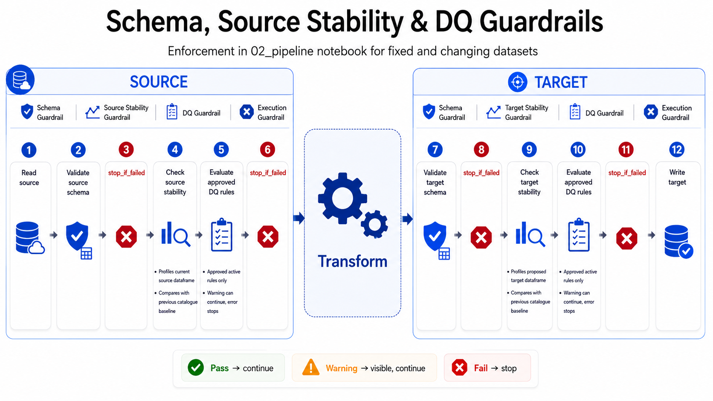
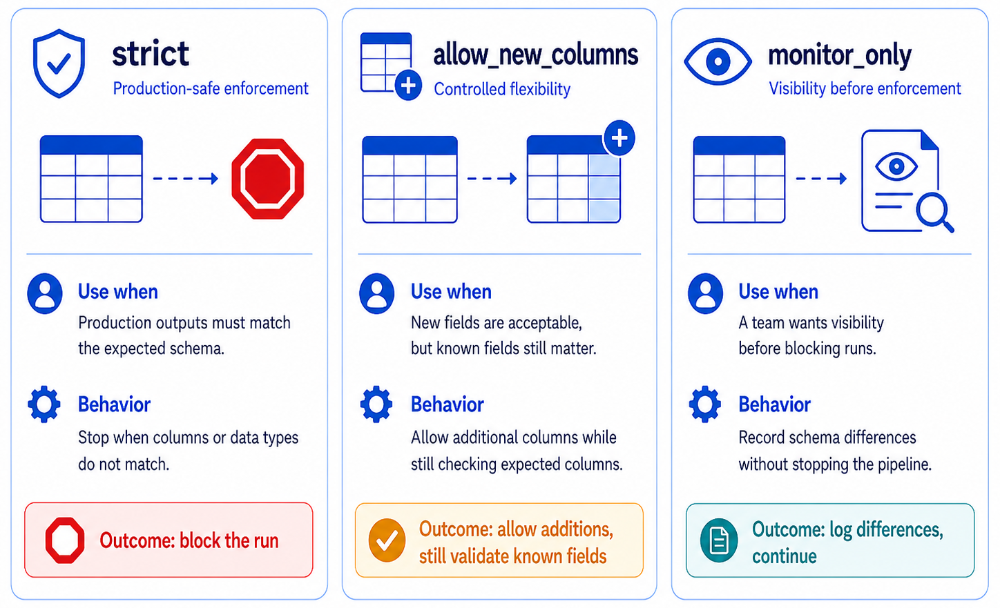
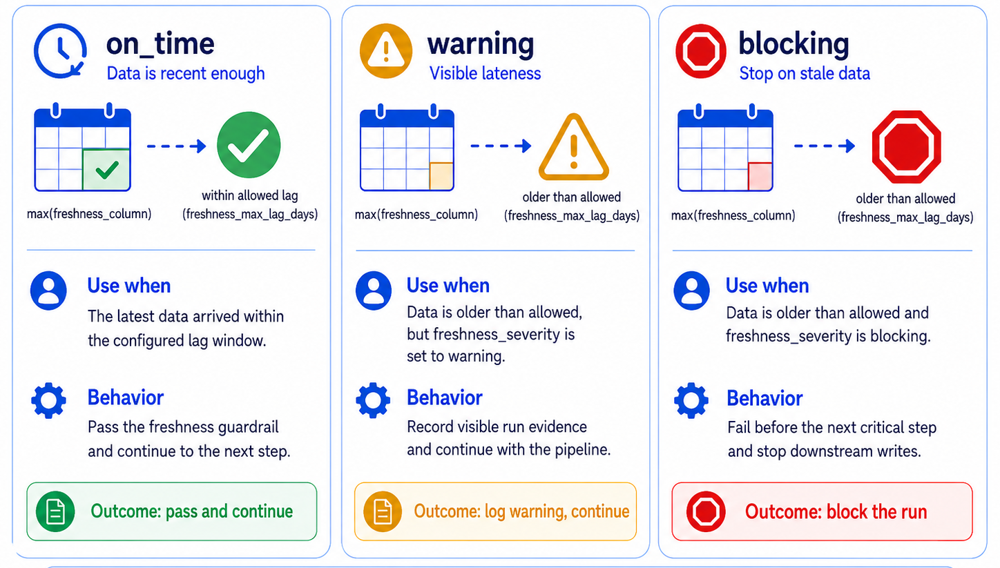
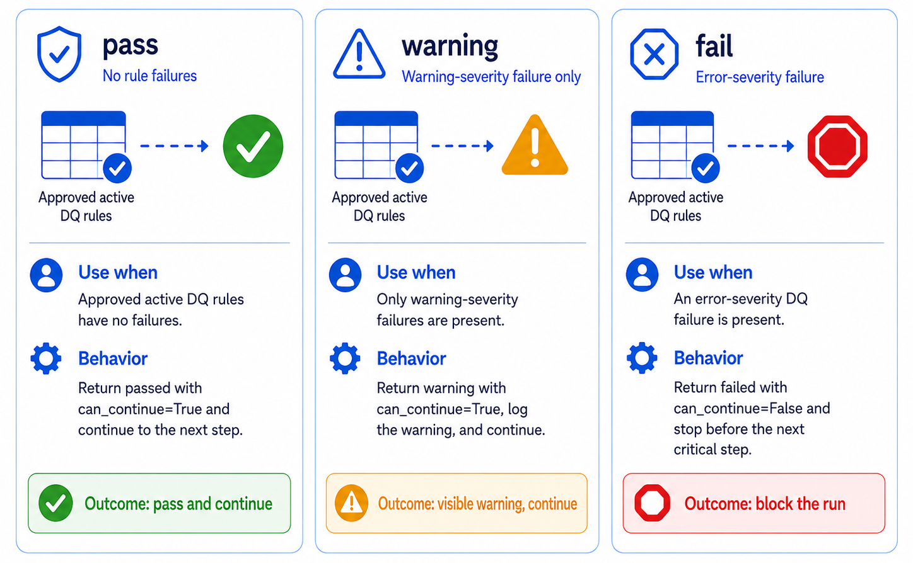

# 02 Pipeline Execution

`02_pipeline` is the executable delivery notebook. It starts a guided pipeline context, reads data, prepares source and target table configs, runs guardrails, writes outputs, and records evidence for support and governance review. The notebook flow is intentionally small: establish context once, keep table settings visible, call reduced-API helpers, and let active defaults carry shared run metadata downstream.

## Guided pipeline context startup

Start each `02_pipeline` run with [`widget_select_agreement`](../../api/reference/widget_select_agreement.md):

```python
AGREEMENT_CONTEXT = widget_select_agreement(
    notebook_type="02_pipeline",
    register_notebook=True,
)

AGREEMENT = AGREEMENT_CONTEXT.agreement
```

This single startup step captures the run id, audit timestamp, notebook metadata, and selected agreement context. It also stores active defaults for downstream helpers, so later pipeline calls can reuse the same run and agreement metadata without repeating those values in every function call.

## Source read

Use [`read_data`](../../api/reference/read_data.md) for source reads. The template keeps source table names and transformations visible so notebook users can understand what is being read and changed.

## Pipeline table config preparation

Use [`prepare_pipeline_table_configs`](../../api/reference/prepare_pipeline_table_configs.md) to enrich beginner-editable table settings into the config shape expected by guardrail and evidence helpers. The template prepares source configs before source profiling/checks and target configs before target profiling/checks.



## Guardrail execution

Use [`guardrail orchestration`](../../api/reference/run_table_guardrails.md) to evaluate table guardrails and write runtime evidence. Run profile checks before writes for non-blocking visibility, then run enforcement checks before publishing targets:

```python
source_profile_results = run_table_guardrails(
    SOURCE_TABLES,
    table_role="source",
    mode="profile",
)

target_profile_results = run_table_guardrails(
    TARGET_TABLES,
    table_role="target",
    mode="profile",
)

source_enforcement_results = run_table_guardrails(
    SOURCE_TABLES,
    table_role="source",
    mode="enforce",
)

target_enforcement_results = run_table_guardrails(
    TARGET_TABLES,
    table_role="target",
    mode="enforce",
)
```

`mode="profile"` is non-blocking by default, so the notebook can collect catalogue and guardrail visibility without stopping the run. `mode="enforce"` defaults `stop_on_failure=True`, so failed error-severity checks stop before unsafe target publication. Omitted `run_id`, `spark_session`, `pipeline_name`, `notebook_id`, `notebook_registry_id`, `agreement_id`, and `agreement_contract_version` values are resolved from the active agreement context created by `widget_select_agreement`.

Guardrail results are not just UI messages: they are evidence rows and continuation decisions. The dropdowns used during authoring save rule records in `METADATA_GUARDRAIL_RULES`; runtime interprets those saved records later.

### Schema mode

[`widget_author_schema_freshness_profile_rules`](../../api/reference/widget_author_schema_freshness_profile_rules.md) offers schema mode options `strict`, `relaxed`, and `skip`. Runtime maps those as follows:

| Widget option | Runtime preset | Runtime effect |
| --- | --- | --- |
| `strict` | `strict` | Blocks missing columns, datatype mismatches, and unexpected columns. |
| `relaxed` | `allow_new_columns` | Blocks missing columns and datatype mismatches. Unexpected columns are warnings and `can_continue` remains true. |
| `skip` | `monitor_only` | Reports differences as warnings when checks exist, but `can_continue` remains true. |

### Freshness

Freshness options are `enforce` and `skip`. `enforce` writes a `max_lag_days` rule with `freshness_column` and `max_lag_days`. `skip` writes a `skip` rule. At runtime, skip returns `skipped` with `can_continue=true`. Enforced freshness checks whether the latest value in the freshness column is older than the allowed lag; stale data fails or warns depending on rule severity.

### Profile mode

Profile mode options are `static_data`, `changing_data`, and `skip`. `static_data` profiles the full table as one baseline. `changing_data` requires `watermark_column` and profiles each distinct watermark value separately. `skip` returns `skipped` with `can_continue=true`.

When previous accepted evidence exists, current profiles is compared to previous approved `METADATA_DATA_CATALOGUE` evidence. If no previous evidence exists, the current profile establishes the baseline. If differences are found, status depends on severity.

### DQ rules

[`widget_author_dq_rules`](../../api/reference/widget_author_dq_rules.md) offers DQ severity options `warning` and `error`. Runtime loads DQ rules from `METADATA_GUARDRAIL_RULES`. Error-severity failures return `failed` and `can_continue=false`; warning-severity failures return `warning` and `can_continue=true`. Passing or absent DQ rules return `passed` and `can_continue=true`.

DQ does not quarantine rows, write row-level failure metadata, filter invalid rows, send alerts, or partially write targets. It records aggregate rule outcomes and continuation decisions.

## Target write

Use [`write_data`](../../api/reference/write_data.md) after enforcement guardrails allow the run to continue. The template keeps write mode and target routing visible so users understand what will be published, while active pipeline defaults keep shared run metadata consistent.

## Lineage writing

Use [`write_pipeline_lineage`](../../api/reference/write_pipeline_lineage.md) to append source-to-target lineage evidence to `METADATA_DATA_LINEAGE_TABLE`. The simplified flow writes lineage after successful target writes so the run summary can include lineage status.

## Pipeline run summary

Use [`write_pipeline_run_summary`](../../api/reference/write_pipeline_run_summary.md) to append run-level status to `METADATA_PIPELINE_RUNS`:

```python
runtime_summary_result = write_pipeline_run_summary(
    source_guardrail_results=source_enforcement_results,
    target_guardrail_results=target_enforcement_results,
    target_write_status=target_write_status,
    lineage_result=lineage_result,
)
```

The summary helper derives status, guardrail rollups, target write status, lineage status, and active agreement/run metadata from the result bundles and active pipeline context. Notebook authors should pass the result objects produced by the reduced flow instead of rebuilding summary fields manually.

## Guardrail result display

Use [`display_guardrail_results`](../../api/reference/display_guardrail_results.md) to show profile or enforcement outcomes in `summary`, `detailed`, or `debug` mode. The display mode changes presentation only; the runtime result bundles remain available for continuation checks and run summary writing.

## Optional enrichment and guardrail authoring

After profiling evidence exists, the simplified `02_pipeline` flow can still use [`widget_select_guardrail_target`](../../api/reference/widget_select_guardrail_target.md) to pick a profiled table, [`widget_author_schema_freshness_profile_rules`](../../api/reference/widget_author_schema_freshness_profile_rules.md) and [`widget_author_dq_rules`](../../api/reference/widget_author_dq_rules.md) to author guardrail intent, and [`widget_enrich_table_metadata`](../../api/reference/widget_enrich_table_metadata.md) to author descriptive enrichment. The template can also call [`widget_review_guardrail_governance`](../../api/reference/widget_review_guardrail_governance.md); formal table governance review is still owned by [03 Governance Review](governance-review.md).

## Guardrail evidence tables

| Evidence area | Metadata table | Why it matters during `02_pipeline` |
| --- | --- | --- |
| Profile/evidence | `METADATA_DATA_CATALOGUE` | Stores observed table/column profiles, profile hashes, watermark values, and run context for later comparison and review. |
| Rule intent | `METADATA_GUARDRAIL_RULES` | Stores schema, freshness, profile-behaviour, and DQ rules that enforcement loads. |
| Runtime results | `METADATA_GUARDRAIL_RESULTS` | Stores pass/warn/fail/skipped status, severity, continuation flag, reason, expected/actual values, and result payloads. |
| Run summary | `METADATA_PIPELINE_RUNS` | Summarizes source/target counts, guardrail rollups, lineage/catalogue write status, and JSON detail. |
| Lineage | `METADATA_DATA_LINEAGE_TABLE` | Records source-to-target relationships for handover, dashboarding, and review context. |







### Implementation guidance

- Start the notebook with [`widget_select_agreement`](../../api/reference/widget_select_agreement.md) using `register_notebook=True`, then rely on active defaults instead of repeating run and agreement metadata in every helper call.
- Keep source and target table config dictionaries beginner-editable, then let [`prepare_pipeline_table_configs`](../../api/reference/prepare_pipeline_table_configs.md) normalize them for runtime helpers.
- Treat `append` and `overwrite` as physical write modes only; profile behaviour uses `static_data`, `changing_data`, or `skip`.
- Use warning DQ rules for observability that should not block writes, and error DQ rules for checks that must stop publication.
- Do not reset baselines silently in `02_pipeline`; intentional changes should be reviewed by governance or represented by superseding rule/evidence history.
