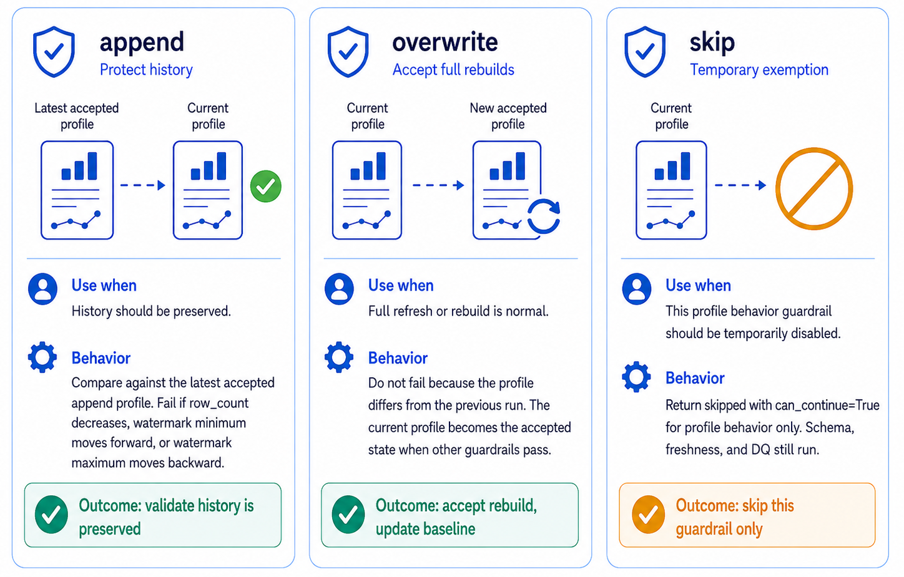

# Pipeline Guardrails

Pipeline guardrails are the runtime checks in `02_pipeline` that decide whether a run can continue, continue with warnings, or stop before writing governed outputs. They turn contract expectations into executable checks for schema, freshness, profile behavior, and data quality (DQ).

Read [How FabricOps Works](index.md) first for the standard `01_agreement` → `02_pipeline` → `03_governance` workflow. This page focuses on the guardrails enforced by `02_pipeline`.

{ .full-width }

## Contract expectation versus runtime enforcement

FabricOps keeps the responsibility split clear:

- **Data contract = expectation.** The contract describes what the data should look like, how fresh it should be, how it should behave over time, and which DQ expectations matter.
- **Guardrail = runtime enforcement.** A guardrail turns an expectation into a runtime pass, warning, fail, or skipped result.
- **`02_pipeline` = technical enforcement layer.** The pipeline validates schemas, freshness, profile behavior, and approved DQ rules before governed outputs are written.
- **`03_governance` = governance and business definition layer.** Governance review defines and approves business context, classifications, and DQ metadata; it does not replace runtime enforcement.

## Guardrail flow in `02_pipeline`

| Point in the run | What happens | Why it matters |
| --- | --- | --- |
| After source read | Validate source schema, freshness, profile behavior, and approved active source DQ rules. | Catch upstream structure, recency, behavior, and quality issues before transformation. |
| Transformation | Apply user-defined deterministic business logic. | Keep the output repeatable and explainable. |
| Before target write | Validate target schema, freshness, profile behavior, and approved active target DQ rules. | Avoid publishing stale, unexpected, or DQ-failing governed outputs. |
| After successful checks | Write the output, lineage, catalogue evidence, and run summary. | Keep governance review and support grounded in what actually ran. |

## Guardrail types

| Guardrail | Checks |
| --- | --- |
| Schema guardrail | Checks expected columns and data types. |
| Freshness guardrail | Checks whether `max(freshness_column)` is recent enough based on `freshness_max_lag_days`. |
| Profile behavior guardrail | Checks whether the current profile follows `load_behavior`: `append`, `overwrite`, or `skip`. |
| DQ guardrail | Checks approved active DQ rules from governance metadata. |

Each guardrail returns run evidence that can be displayed in the notebook and used to decide whether the next critical step can continue. Warning-severity failures can continue with evidence; Error-severity failure blocks before the next critical step, as do blocking failures.

## Callable references

Use these generated API references for the runtime helpers behind this guardrail flow:

- [run_table_guardrails](../api/reference/run_table_guardrails/) coordinates the table-level guardrail checks.
- [validate_schema](../api/reference/validate_schema/), [enforce_freshness](../api/reference/enforce_freshness/), [enforce_profile_behavior](../api/reference/enforce_profile_behavior/), and [enforce_dq_rules](../api/reference/enforce_dq_rules/) implement the main check types.
- [stop_if_failed](../api/reference/stop_if_failed/) is the compact notebook stop helper for failed guardrail results.
- [profile_dataframe](../api/reference/profile_dataframe/) and [write_catalogue_evidence](../api/reference/write_catalogue_evidence/) create the profile evidence that later checks and governance review use.

## Schema guardrails

Schema guardrails check whether a source or target table still matches the expected columns and data types. Use `schema_preset` separately from freshness, profile behavior, and DQ settings so structure checks stay easy to reason about.

{ .full-width }

| Preset | Use when | Guardrail behavior |
| --- | --- | --- |
| `strict` | Production outputs must match the expected schema. | Stop when required columns or data types do not match. |
| `allow_new_columns` | New fields are acceptable, but known fields still matter. | Allow additional columns while still checking expected columns. |
| `monitor_only` | A team wants visibility before blocking runs. | Record schema differences without stopping the pipeline. |

## Freshness guardrails

Freshness guardrails answer whether the expected latest data arrived on time. Freshness is separate from profile behavior: a table can follow its `load_behavior` and still be stale if the newest business date is too old.

Freshness applies to `append`, `overwrite`, and `skip`. Setting `load_behavior="skip"` skips only the profile behavior guardrail; schema, freshness, and DQ still run.

Configure freshness with the flat config fields:

```python
"freshness_column": "business_date",
"freshness_max_lag_days": 1,
"freshness_severity": "blocking"
```

For each configured table, `02_pipeline` checks whether `max(freshness_column)` is recent enough for the configured lag. For example, if the run date is `2026-06-11` and `freshness_max_lag_days=1`, the latest value must be at least `2026-06-10`.

{ .full-width }

## Profile behavior guardrails

Profile behavior guardrails use catalogue/profile evidence from `METADATA_DATA_CATALOGUE` and runtime guardrail profile snapshots from `METADATA_GUARDRAIL_PROFILES` to enforce the configured `load_behavior`. This guardrail is about expected table behavior over time; low-level storage edit detection is intentionally out of scope.

FabricOps reuses accepted catalogue evidence such as `row_count`, `column_name`, `min_value`, `max_value`, `profile_stage`, `profile_status`, `stability_status`, `freshness_status`, and `dq_status`.

{ .full-width }

| `load_behavior` | Use when | Guardrail behavior |
| --- | --- | --- |
| `append` | History should be preserved. | Compare against the latest accepted append profile. Fail if row count decreases, watermark minimum moves forward, or watermark maximum moves backward. |
| `overwrite` | Full refresh/rebuild is normal. | Do not fail because the profile differs from the previous run. Current profile becomes the accepted state when other guardrails pass. |
| `skip` | Temporary exemption. | Return skipped/`can_continue=True` for profile behavior only. Schema, freshness, and DQ still run. |

## DQ guardrails

DQ rules are defined and approved in `03_governance`, then enforced in `02_pipeline`. DQ is separate from schema, freshness, and profile behavior:

- schema checks validate structure;
- freshness checks validate recency;
- profile behavior checks validate expected load behavior;
- DQ checks validate approved business and quality rules.

This separation keeps failures easier to explain and makes handover evidence clearer for junior engineers.

{ .full-width }

## Metadata evidence

After guardrails run, FabricOps writes metadata evidence that describes what was checked and what happened:

| Metadata table | Evidence written |
| --- | --- |
| `METADATA_DATA_CATALOGUE` | Catalogue/profile discovery anchor: what exists and what was profiled. |
| `METADATA_GUARDRAIL_RULES` | What should be checked. DQ rows use `guardrail_type="dq"`; legacy `METADATA_DQ_RULES` rows are still readable during transition. |
| `METADATA_GUARDRAIL_PROFILES` | What was observed for a guardrail run, including watermark-grouped snapshots. |
| `METADATA_GUARDRAIL_RESULTS` | What passed, warned, failed, and whether the pipeline can continue. |
| `METADATA_GUARDRAIL_BASELINE_EVENTS` | What humans accepted, reset, approved, rejected, or blocked for baselines. |
| `METADATA_PIPELINE_RUNS` | Run-level summary showing the pipeline result and key execution details. |
| `METADATA_DATA_LINEAGE_TABLE` | Source-to-target lineage for the governed output. |

## How to choose settings

Use these settings independently so each guardrail has a clear purpose:

- Use `append` when old rows or history should remain.
- Use `overwrite` when the table is intentionally rebuilt.
- Use `skip` only when this profile behavior guardrail should be disabled.
- Configure freshness separately using `freshness_*` fields.
- Use `schema_preset` separately for schema strictness.
- Keep DQ controlled by approved governance rules and `dq_preset`.
