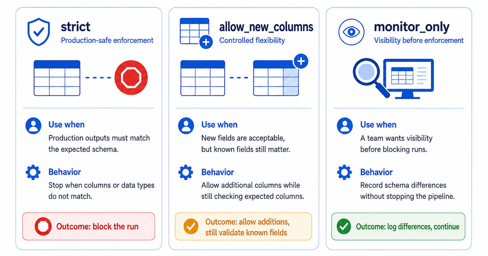
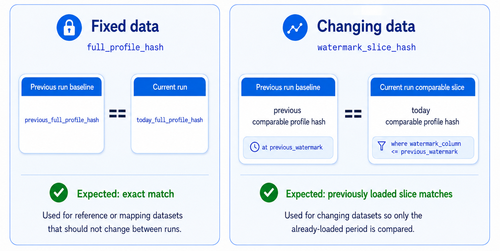
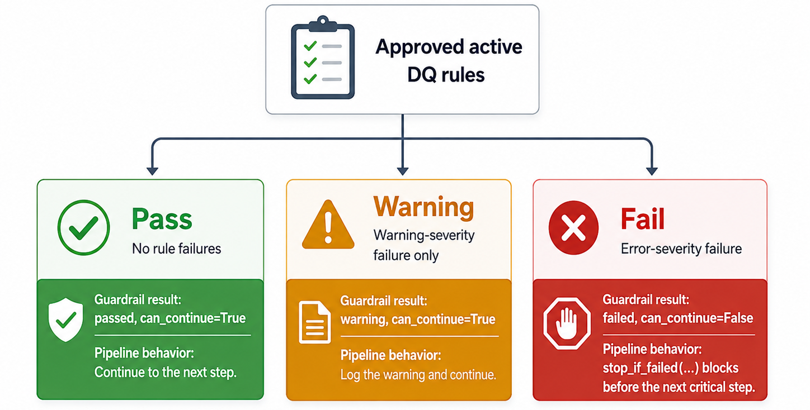

# Pipeline Guardrails

Pipeline guardrails are the checks inside `02_pipeline` that decide whether a run can continue, continue with warnings, or stop before writing governed outputs.

Read [How FabricOps Works](index.md) first for the standard `01_agreement` → `02_pipeline` → `03_governance` workflow. This page focuses only on the guardrails owned by `02_pipeline`.

{ .full-width }

## What guardrails protect

`02_pipeline` is where source data is read, transformed, checked, and written as governed output. Guardrails protect that path by checking:

1. whether the source or target schema still matches what the pipeline expects;
2. whether source or target profiles changed unexpectedly compared with previous catalogue evidence;
3. whether approved active DQ rules pass at the source or target stage.

The boundary is simple: `03_governance` can review and approve DQ metadata, but `02_pipeline` owns the runtime decision to continue, warn, or stop.

## Guardrail flow in `02_pipeline`

| Point in the run        | What happens                                                                   | Why it matters                                                            |
| ----------------------- | ------------------------------------------------------------------------------ | ------------------------------------------------------------------------- |
| After source read       | Validate source schema, source stability, and approved active source DQ rules. | Catch upstream structure, stability, and quality issues early.            |
| During transform        | Apply deterministic business logic.                                            | Keep the output repeatable.                                               |
| Before target write     | Validate target schema, target stability, and approved active target DQ rules. | Avoid publishing unexpected output changes or error-severity DQ failures. |
| After successful checks | Write outputs and metadata evidence.                                           | Keep governance review and support grounded in what actually ran.         |

## The three guardrail types

| Guardrail            | What it checks                                                                        | Typical behavior                                                            |
| -------------------- | ------------------------------------------------------------------------------------- | --------------------------------------------------------------------------- |
| Schema guardrails    | Whether the source or target structure still matches expected columns and data types. | Stop, warn, or monitor depending on the schema preset.                      |
| Stability guardrails | Whether the current profile matches previous append-only catalogue evidence.          | Catch silent reloads, backfills, and unexpected upstream mutations.         |
| DQ guardrails        | Whether approved active DQ rules pass at the source or target stage.                  | Warning failures can continue; error failures block the next critical step. |

Each guardrail returns a notebook result that can be printed as run evidence and passed to `stop_if_failed(...)` when it should block the run.

## Schema guardrails

Schema guardrails check whether the structure of a source or target table still matches what the pipeline expects.


| Preset              | Use when                                                  | Behavior                                                        |
| ------------------- | --------------------------------------------------------- | --------------------------------------------------------------- |
| `strict`            | Production outputs must match the expected schema.        | Stop when columns or data types do not match.                   |
| `allow_new_columns` | New fields are acceptable, but known fields still matter. | Allow additional columns while still checking expected columns. |
| `monitor_only`      | A team wants visibility before blocking runs.             | Record schema differences without stopping the pipeline.        |

## Stability guardrails

Stability guardrails compare deterministic profile evidence from the current run with previous evidence stored in `METADATA_DATA_CATALOGUE`.

FabricOps does not use the catalogue as a generic distribution drift monitor. Each run appends source and target profile evidence. The latest previous profile for the same dataset, table, and stage becomes the baseline for the next comparison.



| Setting                                                                       | Use when                                                                    | Behavior                                                                                             |
| ----------------------------------------------------------------------------- | --------------------------------------------------------------------------- | ---------------------------------------------------------------------------------------------------- |
| `data_behavior="fixed"` with `stability_check_type="full_profile_hash"`       | Reference, mapping, or other fixed datasets should not change between runs. | Compare today’s full deterministic profile hash with the previous full profile hash.                 |
| `data_behavior="changing"` with `stability_check_type="watermark_slice_hash"` | Tables receive new or changed periods over time.                            | Compare only the slice that already existed in the previous run, using the previous watermark value. |
| `stability_check_type="skip"`                                                 | A dataset is intentionally exempt during early build or investigation.      | Return a non-blocking skipped result while allowing other evidence to be written.                    |

For fixed data, the expected comparison is:

```text
today_full_profile_hash == previous_full_profile_hash
```

For changing data, the expected comparison is:

```text
today profile where watermark_column <= previous_watermark
==
previous stored comparable profile for that watermark
```

After the comparison, today’s profile and comparable hash are appended as the next baseline.

`METADATA_DATA_CATALOGUE` remains append-only. Each run writes new profile evidence rows, older rows remain readable, and skipped stability rows are not eligible as future baselines.

Technical runtime and annotation columns are excluded from schema hashes, profile hashes, and comparable profile evidence by default. This includes columns such as `_fabricops_run_id`, `_fabricops_pipeline_name`, `_fabricops_created_at`, `_dq_check_status`, and `_dq_failed_rules`, plus any column starting with `_fabricops_` or `_dq_`.

## DQ guardrails

DQ guardrails enforce human-approved expectations.

`03_governance` records reviewed DQ expectations in `METADATA_DQ_RULES`. `02_pipeline` reads active approved rules and evaluates them at the configured stage.

Source DQ rules can run after source read and before transformation. Target DQ rules can run after transformation and before the target write.



| Rule outcome                     | Guardrail result               | Pipeline behavior                                           |
| -------------------------------- | ------------------------------ | ----------------------------------------------------------- |
| No rule failures                 | `passed`, `can_continue=True`  | Continue to the next step.                                  |
| Warning-severity failure         | `warning`, `can_continue=True` | Log the warning and continue.                               |
| Error-severity failure           | `failed`, `can_continue=False` | `stop_if_failed(...)` blocks before the next critical step. |
| Mixed warning and error failures | `failed`, `can_continue=False` | Error severity wins and blocks the run.                     |

FabricOps keeps DQ enforcement lightweight. It does not create a separate invalid-row dataset, filter invalid rows out of the target, send alerts, or perform partial target writes.

For warning-level target failures, the written target can keep every row and add row-level technical annotations:

```text
_dq_check_status
_dq_failed_rules
```

## Evidence written

When guardrails run, the pipeline writes evidence into the existing metadata model.

| Evidence                   | Metadata table                | Purpose                                                     |
| -------------------------- | ----------------------------- | ----------------------------------------------------------- |
| Source and target profiles | `METADATA_DATA_CATALOGUE`     | Records profile evidence and stability hash fields.         |
| Lineage                    | `METADATA_DATA_LINEAGE_TABLE` | Records how data moved through the pipeline.                |
| Runtime summaries          | `METADATA_PIPELINE_RUNS`      | Records whether the run passed, warned, skipped, or failed. |

This evidence helps `03_governance`, support teams, and future maintainers understand what the pipeline checked and why it did or did not write outputs.
