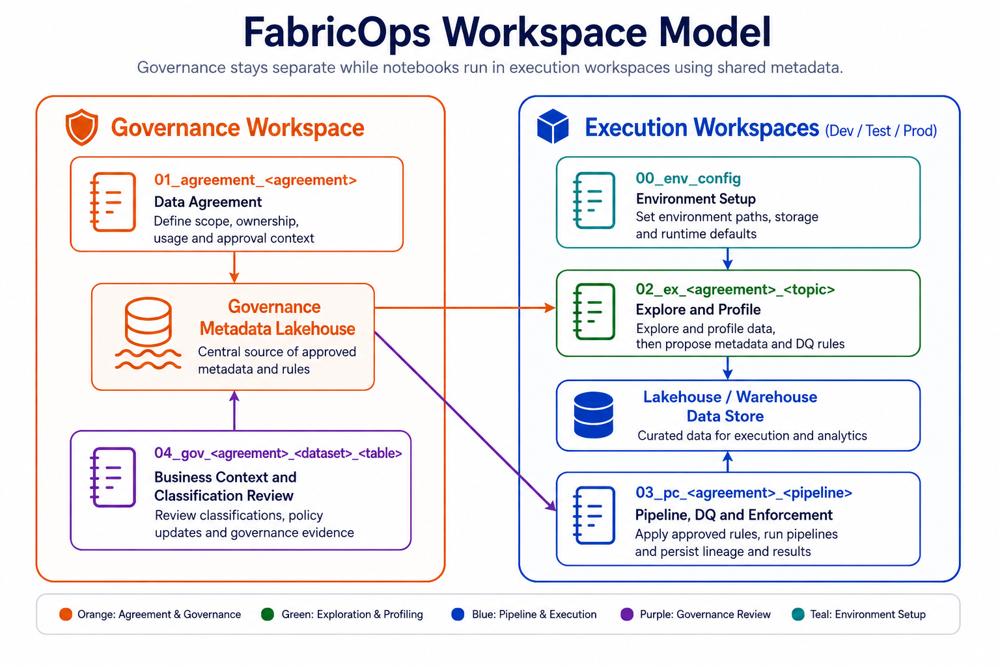

# FabricOps Starter Kit

FabricOps Starter Kit is a plug-and-play Fabric notebook starter kit that helps governance, analysts, scientists, and engineers work together using shared metadata, simple notebook templates, and lightweight enforcement.

It is intentionally small. The kit uses the Microsoft Fabric building blocks teams already know: workspaces, lakehouses, warehouses, notebook templates, and metadata tables. It is a practical starting point for governed, quality-checked, AI-ready notebooks, not a large enterprise platform.

[Start Quickly](quick-start.md){ .md-button .md-button--primary }
[How FabricOps Works](how-fabricops-works/index.md){ .md-button }

<figure markdown>
  { .full-width }
  <figcaption>FabricOps Starter Kit uses one config notebook, role-based templates, and shared metadata to coordinate governance and engineering delivery.</figcaption>
</figure>

## What the starter kit adds

| Building block | How FabricOps Starter Kit uses it |
| --- | --- |
| Fabric workspaces | Keep shared governance metadata separate from engineering development and production work. |
| Lakehouses and warehouses | Store source data, transformed data, product outputs, and shared metadata. |
| Notebook templates | Give each role a clear place to configure, document, explore, build, and govern. |
| Metadata tables | Keep agreements, profiles, lineage, rules, classifications, business context, and handover evidence reusable. |
| Lightweight enforcement | Let production notebooks consume approved metadata and apply repeatable checks without adding a heavy platform. |

## How it works

1. Configure the Fabric environment with `00_env_config`.
2. Create steward and agreement records with `01_da`.
3. Explore and profile data with `02_ex`.
4. Build repeatable transformations with `03_pc`.
5. Enrich and approve governance metadata with `04_gov`.
6. Rerun production pipelines with approved metadata and generate handover evidence.

The [How FabricOps Works](how-fabricops-works/index.md) section explains the workspace setup, notebook templates, metadata tables, assembled views, role handoffs, and production handover as one guided story.

## Start here

- [Quick Start](quick-start.md): install the helper wheel, copy the templates, and configure Fabric.
- [How FabricOps Works](how-fabricops-works/index.md): follow the complete lightweight story from workspace setup to handover.
- [Notebook Templates](notebook-structure.md): open the template-specific guides.
- [Data Quality Rules](data-quality-rules-system.md): apply approved checks in pipeline notebooks.
