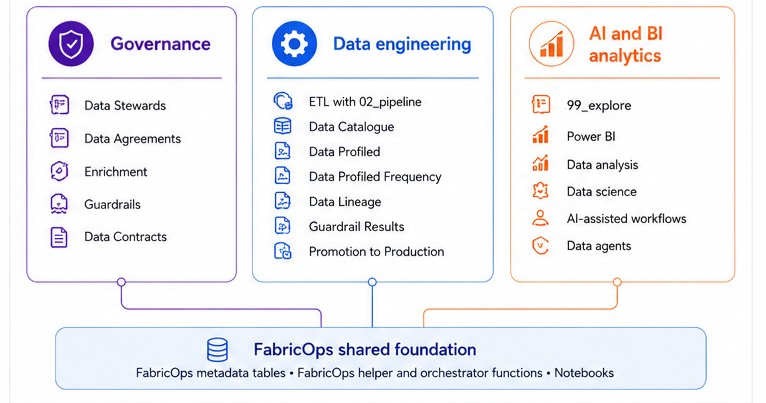

# FabricOps Starter Kit

FabricOps Starter Kit is a lightweight starter kit for data teams working in Microsoft Fabric.

It brings together reusable notebook templates, helper functions, metadata tables, guardrails, and guided demos so Fabric notebook projects can start with a clearer structure.

Teams can configure workspaces, run pipelines, track lineage, review data quality checks, and maintain pipeline run history without building every support piece from scratch.

<section class="fabricops-delivery-model" aria-labelledby="fabricops-workflow-model-heading" markdown="1">

## How FabricOps connects data teams { #fabricops-workflow-model-heading }

  

FabricOps helps governance, engineering, and analytics teams work from the same notebook flow.

Governance reviews agreement context, enrichment, and pipeline guardrail results.
Engineering configures the environment, runs notebooks, and writes metadata tables.
Analysts and data scientists consume trusted outputs for BI, AI, and exploration.

The shared metadata tables act as the handoff layer.
They record what was agreed, what ran, what passed, and what is ready for review.
They abstract the important but tedious work into a simplified plug and play workflow that makes handover easy, even for new team members.

</section>

## Choose where to begin

  <a class="fabricops-landing-card" href="guided-demo/">
    Guided Demo
    Build the wheel, set up Fabric artifacts, and run the first smoke test.
  </a>
  <a class="fabricops-landing-card" href="how-fabricops-works/">
    How FabricOps Works
    Understand the operating model and metadata flow.
  </a>
  <a class="fabricops-landing-card" href="releases/">
    Releases
    See current and past releases and download plug-and-play assets.
  </a>

## What is included

  <a class="fabricops-landing-card" href="notebook-templates-implementation-guide/">
    5 main notebook templates
    With step by step guide in guide in implementation guide.
  </a>

  <a class="fabricops-landing-card" href="reference/">
    <!-- FABRICOPS_PUBLIC_FUNCTION_COUNT --><strong>25</strong> public callable functions<!-- /FABRICOPS_PUBLIC_FUNCTION_COUNT -->
    <!-- FABRICOPS_CALLABLE_RECORD_COUNT -->Helper functions support the notebook templates and demo workflows, with supporting private functions, classes, and internal methods kept behind the scenes<!-- /FABRICOPS_CALLABLE_RECORD_COUNT -->.
  </a>

  <a class="fabricops-landing-card" href="reference/dq-rules/">
    23 Data quality rule types
    Suggested by AI and enforced in pipeline guardrails.
  </a>

  <a class="fabricops-landing-card" href="reference/metadata/">
    <!-- FABRICOPS_METADATA_TABLE_COUNT --><strong>11</strong>metadata tables<!-- /FABRICOPS_METADATA_TABLE_COUNT -->
    Stores data about agreements, catalogue entries, lineage, guardrail results, notebook registry entries, and pipeline runs.
  </a>

## For maintainers

FabricOps Starter Kit includes maintainer tooling to keep the project clean, explainable, and safe to refactor as it grows. Use the Public Function Call Flows Dashboard to review public API architecture, inspect the selected callable inventory, and export focused cleanup packets.

  <a class="fabricops-landing-card" href="assets/public-function-call-flows-dashboard.html">
    Public Function Call Flows Dashboard
    Review the public API shape, callable relationships, chain depth, fan out, source Python files, and architecture signals.
    Open Public Function Call Flows Dashboard
  </a>

  <a class="fabricops-landing-card" href="function-call-graph/">
    Function Call Graph Guide
    Read about the architecture and the motivation behind the function call graph dashboard.
    Open Function Call Graph Guide
  </a>

<small>Function metrics are generated from the selected callable inventory data.</small>

