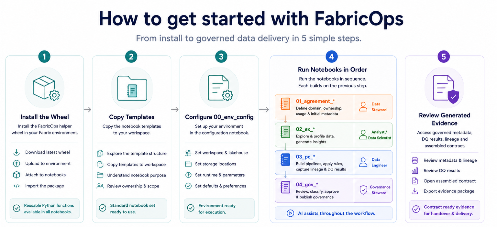

# FabricOps Starter Kit

A lightweight Microsoft Fabric notebook starter kit for governed, AI-assisted data delivery.

FabricOps Starter Kit helps teams start with notebooks, keep control decisions human-approved, and produce reusable handover evidence without adopting a heavy orchestration platform.

[Start Using Templates](quick-start.md){ .md-button .md-button--primary }
[Install Wheel](install.md){ .md-button }

<figure markdown>
  { .full-width }
  <figcaption>Install the helper wheel, copy the notebook templates, configure your environment, run the notebooks in sequence, and review the generated evidence.</figcaption>
</figure>

## Product at a glance

| Outcome | What the kit gives you |
| --- | --- |
| Start quickly in Fabric | Notebook-first templates you can copy, adapt, and run in sequence. |
| Keep implementation consistent | A reusable helper wheel for shared setup, metadata, quality, lineage, and handover logic. |
| Use AI with guardrails | AI-assisted suggestions are captured as inputs for human review, approval, and override. |
| Hand over with evidence | Runs produce metadata, DQ, lineage, and contract-ready artifacts that support governed delivery. |

## Who it is for

- Fabric teams that want a lightweight, notebook-first operating pattern.
- Data engineers and analysts who need reusable templates instead of one-off notebooks.
- Governance reviewers who need visible controls, evidence, and handover context.
- Junior engineers who benefit from a guided sequence and documented outputs.

## What to do first

1. [Install the helper wheel](install.md) in your Fabric environment.
2. [Start using templates](quick-start.md) by copying the notebook sequence.
3. Configure environment paths, then run the notebooks in order.
4. Review the generated metadata, DQ, lineage, and contract-ready evidence.

## Next actions

- **Primary:** [Start Using Templates](quick-start.md) or [Install Wheel](install.md).
- **Learn the workflow:** [Templates](notebook-structure.md) · [Workflow](lifecycle-operating-model.md) · [Governance evidence](metadata-and-contracts/index.md).
