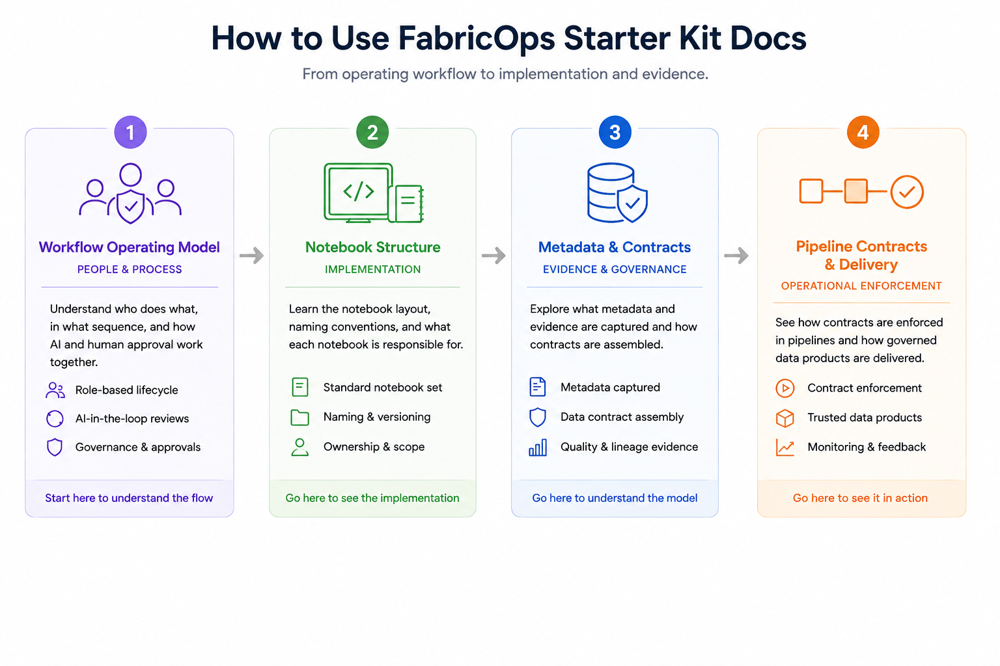

# Workflow Operating Model

This page is the people-and-process view of FabricOps Starter Kit. Use [Notebook Structure](notebook-structure.md) for implementation details and [Metadata & Contracts](metadata-and-contracts/) for evidence and contract assembly.

**Operating principle:** AI drafts and accelerates delivery, while human owners approve governance decisions and sign-off points.

{ .full-width }

## Operating flow

`agreement → exploration → approved metadata evidence → pipeline enforcement → handover`

## Stage checkpoints

| Stage | Owner | What happens | Approval point |
| --- | --- | --- | --- |
| Agreement and ownership setup | Governance + data owners | Define scope, ownership, and decision boundaries. | Humans approve initial agreement intent before downstream execution. |
| Exploration and evidence generation | Delivery team + reviewers | Run profiling and evidence-building work to validate business and technical fit. | Human reviewers approve evidence quality and readiness. |
| Metadata approval and contract assembly | Governance + platform stewards | Convert approved metadata and quality evidence into contract-ready outputs. | Human governance review confirms policy alignment before enforcement. |
| Pipeline enforcement and handover | Delivery + operations + governance | Enforce approved controls in pipelines and publish handover artifacts for traceability. | Human sign-off confirms operational acceptance and ownership transfer. |

## Implementation and evidence details

- [Notebook Structure](notebook-structure.md) for notebook boundaries, naming, and implementation ownership.
- [Metadata & Contracts](metadata-and-contracts/) for evidence outputs and contract assembly model.
- [Pipeline Contract Notebook (03_pc)](notebook-structure/03-pipeline-contract.md) for pipeline enforcement implementation details.
- [Quick Start](quick-start.md) to run the full flow in a new workspace.
