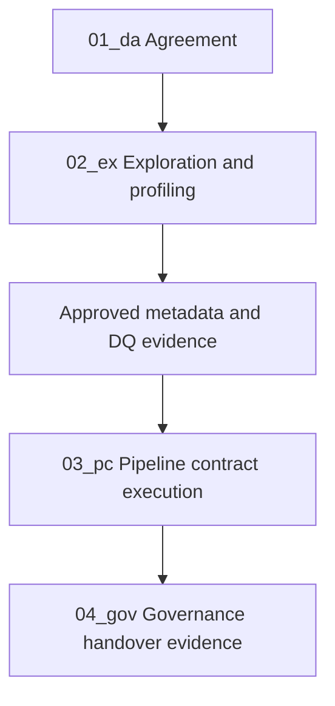

# Workflow lifecycle operating model

FabricOps Starter Kit runs as a governed notebook lifecycle in Microsoft Fabric:

`agreement → exploration → approved metadata → pipeline contract → handover`

## Lifecycle sequence

## Notebook mapping

- `00_env_config`: shared environment and metadata target routing.
- `01_da_<agreement>`: agreement scope, ownership, and approval context.
- `02_ex_<agreement>_<topic>`: exploration, profiling, and evidence preparation.
- `03_pc_<agreement>_<pipeline>`: approved rules and operational pipeline contract.
- `04_gov_<agreement>_<dataset>_<table>`: governance outputs and handover package.

## Go next

- [Quick Start](quick-start.md)
- [Notebook Structure](notebook-structure.md)
- [Function Reference](reference/index.md)
