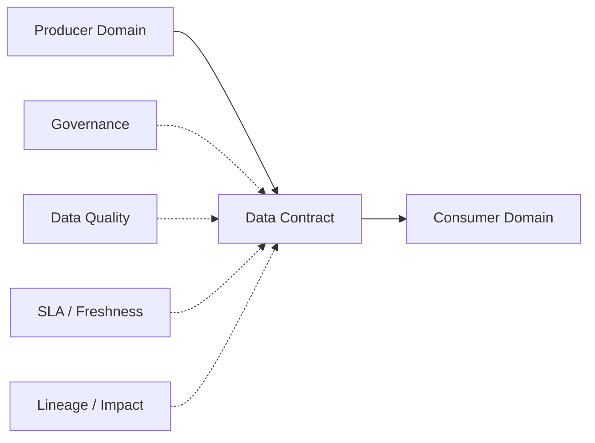
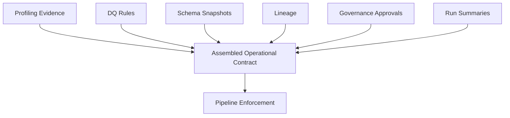
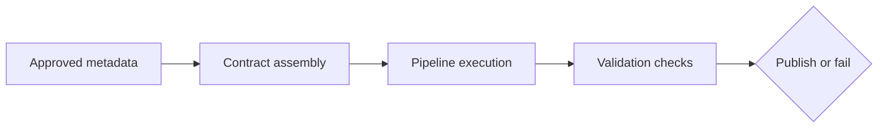

# Metadata and Contracts

## 1. The operational problem first

Teams can agree on a schema and still struggle in operations:

- “What is an active customer?”
- “Who approves schema changes?”
- “Who validates DQ alerts?”
- “Why did this dashboard suddenly break?”

A data contract is not just a JSON/YAML schema artifact. It is an operational agreement between producers and consumers that defines how data is owned, governed, validated, and changed.

## 2. What a data contract actually contains

A practical data contract includes:

- business definitions
- ownership and stewardship
- schema expectations
- data quality expectations
- SLAs and freshness
- access and usage rules
- change management expectations
- downstream consumer awareness

A contract should identify downstream consumers and expected impact paths so schema changes become coordinated rollouts instead of surprises.

## 3. Contracts are assembled from metadata evidence

> [!IMPORTANT]
> In FabricOps, a contract is assembled from governed metadata and runtime evidence. It is not maintained as one giant manually edited YAML file.

Evidence used in assembly includes:

- profiling evidence
- approved DQ rules
- schema snapshots
- lineage evidence
- governance approvals
- run summaries
- drift guardrails
- steward decisions
- pipeline behavior

## 4. Where the contract lives in FabricOps

| Notebook | Responsibility |
| --- | --- |
| 01_data_sharing_agreement | Business agreement, ownership, access, and SLA expectations |
| 02_ex_* | Profiling, discovery, AI-assisted suggestions, and metadata evidence |
| 03_pc_* | Executable pipeline contract enforcement |

The pipeline contract notebook is where approved governance decisions become executable enforcement.

## 5. How contracts are enforced

Contracts are enforced operationally, not only documented. Typical checks include:

- schema validation
- DQ rule execution
- required classification checks
- drift checks
- SLA validation
- consumer impact checks
- lineage capture
- run summaries
- CI/CD validation
- version checks

## 6. AI-in-the-loop governance and quality

AI assistance is useful but controlled:

- AI suggests DQ rules
- AI suggests glossary/business-term mappings
- AI helps generate metadata descriptions
- humans approve governance and quality decisions before enforcement

AI can amplify bad governance faster, so AI-ready data requires trusted operational contracts.

FabricOps keeps the operating model explicit: AI suggests, humans approve, pipelines enforce.

## 7. Data contracts are change management

The hard part is not writing a contract file. The hard part is operating change across teams:

- ownership and accountability during incidents
- escalation paths when contract checks fail
- versioning and compatibility windows
- deprecation discipline
- coordination across producer and consumer domains

Example operational sequence:

`customer_id` changes from `INT` to `STRING` → contract version bump required → consumers notified → migration window tracked → pipeline validation updated.

## 8. Metadata-backed source of truth

The metadata/contract store remains the source of truth for contract assembly and operational evidence:

- `contracts`
- `contract_columns`
- `contract_rules`
- `quality_results`
- `lineage_records`

## 9. Operational outcomes

When contracts are treated as governed operational agreements, teams get:

- faster onboarding
- fewer breaking changes
- clearer ownership
- safer AI outputs
- faster incident resolution
- reusable governance evidence

## 10. Related pages

- [Workflow](workflow.md)
- [Notebook Structure](notebook-structure.md)
- [Assembled Contract Model](metadata-and-contracts/contract-model.md)
- [Metadata Tables](metadata-and-contracts/metadata-tables.md)
