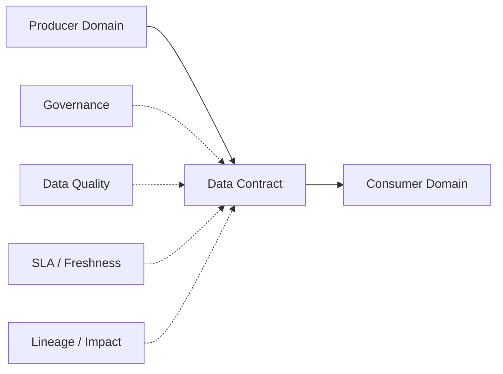
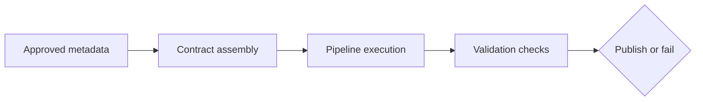

# Metadata and Data Contract Assembly

## 1. The operational problem first

Many teams align on a schema, but still end up in weekly escalation loops:

- “What is an active customer?”
- “Who approves schema changes?”
- “Who validates DQ alerts?”
- “Why did this dashboard suddenly break?”

A **data contract is not only a JSON/YAML schema artifact**. It is an **operational agreement** between producers and consumers that combines ownership, accountability, data quality expectations, service levels, and change behavior.

In FabricOps Starter Kit, that agreement is enforced in notebook execution and backed by governed metadata so teams can build trusted, AI-ready datasets with less ambiguity.

## 2. What a data contract actually contains

A practical data contract should cover:

- **Business definitions** (shared meaning for key fields and metrics)
- **Ownership and stewardship** (who owns, approves, and is on call)
- **Schema expectations** (required/optional fields, types, constraints)
- **Data quality expectations** (rules, thresholds, failure handling)
- **SLAs and freshness** (latency, timeliness, completeness expectations)
- **Access and usage rules** (approved use, privacy/classification boundaries)
- **Change management expectations** (versioning, deprecation, escalation)
- **Downstream consumer awareness** (known dependencies and impact paths)

## 3. Contracts are assembled from metadata evidence

FabricOps does **not** expect teams to manually maintain one giant contract YAML file.

Instead, the operational contract is assembled from governed evidence generated in notebook workflows, including:

- profiling evidence
- approved DQ rules
- schema snapshots
- lineage evidence
- governance approvals
- run summaries
- drift guardrails
- steward decisions
- pipeline behavior

This keeps the contract aligned with how the platform actually runs: contract state reflects approved metadata plus execution evidence, not documentation drift.

## 4. Where the contract lives in FabricOps

Contract responsibilities are distributed across notebook stages:

| Notebook | Responsibility |
| --- | --- |
| 01_data_sharing_agreement | Business agreement, ownership, access, and SLA expectations |
| 02_ex_* | Profiling, discovery, AI-assisted suggestions, and metadata evidence |
| 03_pc_* | Executable pipeline contract enforcement |

The **executable contract is enforced in `03_pc_*` notebooks**, where approved metadata is translated into runtime checks and publish decisions.

## 5. How contracts are enforced

Contracts are enforced operationally, not just documented. Typical enforcement includes:

- schema validation
- DQ rule execution
- required classification checks
- drift checks
- SLA validation
- consumer impact checks
- lineage capture
- run summaries
- CI/CD validation
- version checks

## 6. AI-in-the-loop governance and quality

FabricOps keeps AI assistance practical and controlled:

- AI suggests DQ rules.
- AI suggests glossary/business-term mappings.
- AI helps generate metadata descriptions.
- Humans approve governance and quality decisions before enforcement.
- Trusted contracts improve the reliability of AI-ready datasets.

This matches the project philosophy: **AI-assisted governance and DQ, with notebook-first execution and human accountability at approval boundaries**.

## 7. Data contracts are change management

The hardest part is rarely writing a contract file. The hard part is operating change across teams:

- ownership and accountability during incidents
- escalation paths when contract checks fail
- versioning and compatibility windows
- deprecation discipline
- coordination across producer and consumer domains

Treating contracts as change-management tooling reduces surprise breakage and shortens recovery time.

## 8. Metadata-backed source of truth

The metadata/contract store remains the source of truth for contract assembly and operational evidence:

- `contracts`
- `contract_columns`
- `contract_rules`
- `quality_results`
- `lineage_records`

## 9. Operational outcomes

When contracts are handled as governed operational agreements, teams get:

- faster onboarding
- fewer breaking changes
- clearer ownership
- safer AI outputs
- faster incident resolution
- reusable governance evidence

## 10. Related pages

- [Workflow](workflow.md)
- [Notebook Structure](notebook-structure.md)
- [Assembled Contract Model](metadata-and-contracts/contract-model.md)
- [Notebook Responsibilities](metadata-and-contracts/notebook-responsibilities.md)
- [Metadata Tables](metadata-and-contracts/metadata-tables.md)
