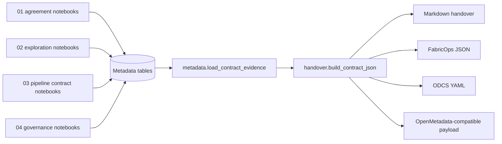

# Evidence to handover

## Purpose

FabricOps notebooks run separately, but they do not produce separate competing contracts. Each notebook writes reviewed evidence to shared metadata tables. The `metadata` module stores and loads that evidence, and the `handover` module assembles final contract-ready artifacts.

This keeps the source of truth in governed metadata evidence while still allowing practical exports such as Markdown, FabricOps JSON, ODCS YAML, and OpenMetadata-compatible payloads.

## Flow

## How it works

1. **Notebook templates run independently.** Agreement, exploration, pipeline contract, and governance notebooks can be run by different roles at different times.
2. **Each notebook writes evidence.** Approved rows are persisted to metadata tables rather than copied into a manually maintained contract file.
3. **`metadata` provides evidence storage and loading.** It owns stable keys, notebook registry rows, evidence persistence, and the future evidence-loading helpers used by handover.
4. **`handover` assembles artifacts.** It owns final assembly, rendering, and export of contract-ready handover artifacts.
5. **Exports are views over evidence.** Markdown, FabricOps JSON, ODCS YAML, and OpenMetadata payloads should be reproducible from approved metadata evidence.

## Module responsibility table

| Module | Responsibility in the contract story | Example evidence or output |
| --- | --- | --- |
| `metadata` | Evidence backbone for persistence, stable keys, notebook registry, and contract evidence loading. | Metadata table keys, column keys, evidence rows, notebook registry, loaded contract evidence bundle. |
| `handover` | Final handover assembly and contract artifact rendering/export. | Markdown handover, FabricOps contract JSON, ODCS YAML, OpenMetadata-compatible payload. |
| `data_profiling` | Deterministic profiling evidence for tables and columns. | Column name, data type, row count, nulls, distincts, min/max, profile timestamp. |
| `business_context` | Human-approved business meaning for tables and columns. | Approved description, reviewer notes, approval status, approval timestamp. |
| `data_governance` | Human-approved governance labels and sensitivity context. | PII classification, confidentiality label, governance reviewer notes, approved timestamp. |
| `data_quality` | DQ rule drafting, review, persistence, enforcement, and outcomes. | Accepted values, ranges, regex checks, severity, active lifecycle, failure/quarantine evidence. |
| `data_lineage` | Source-to-target and transformation evidence. | Upstream/downstream assets, transformation steps, confidence, lineage notes. |
| `drift` | Ongoing validity checks for schema, profile, and partition changes. | Drift status, drift details, monitoring evidence, action items. |

## Proposed function boundaries

These names define the intended architecture. They are implementation backlog items until added to the public API.

### `metadata` boundaries

| Proposed function | Purpose |
| --- | --- |
| `load_contract_evidence` | Load the approved evidence bundle for one agreement/dataset/table handover. |
| `load_column_catalogue_evidence` | Load row-per-column profile, business, governance, quality, lineage, and drift evidence for catalogue assembly. |
| `build_metadata_evidence_index` | Normalize evidence from multiple metadata tables into stable table/column/rule keys for handover assembly. |

### `handover` boundaries

| Proposed function | Purpose |
| --- | --- |
| `build_contract_json` | Build the canonical FabricOps JSON contract artifact from loaded metadata evidence. |
| `build_contract_handover` | Build the human handover model that combines narrative, status, action items, and contract evidence. |
| `render_contract_markdown` | Render a junior-friendly Markdown handover from the handover model. |
| `export_odcs_yaml` | Export an ODCS-style YAML representation from the FabricOps contract JSON. |
| `export_openmetadata_payload` | Export OpenMetadata-compatible table, column, quality, lineage, and classification payloads. |

## Implementation backlog

- Add `metadata.load_contract_evidence` and route all reads through the configured metadata target from `00_env_config`.
- Add `metadata.load_column_catalogue_evidence` for the row-per-column catalogue view.
- Add `metadata.build_metadata_evidence_index` to normalize table, column, rule, notebook, and evidence keys.
- Add `handover.build_contract_json` as the canonical assembled machine-readable artifact.
- Add `handover.export_odcs_yaml` and validate against the chosen ODCS version.
- Add `handover.export_openmetadata_payload` and validate payload shape against OpenMetadata ingestion expectations.
- Enhance `profile_dataframe` with safe top values, example values, and low-frequency counts.
- Enhance `business_context` review with optional `units` and `source_derivation` fields.

## Guardrail

Do not introduce a separate `contract_assembly` module unless the existing `metadata` and `handover` boundaries become insufficient. The intended split is simple: `metadata` loads approved evidence, and `handover` assembles and exports final artifacts.
