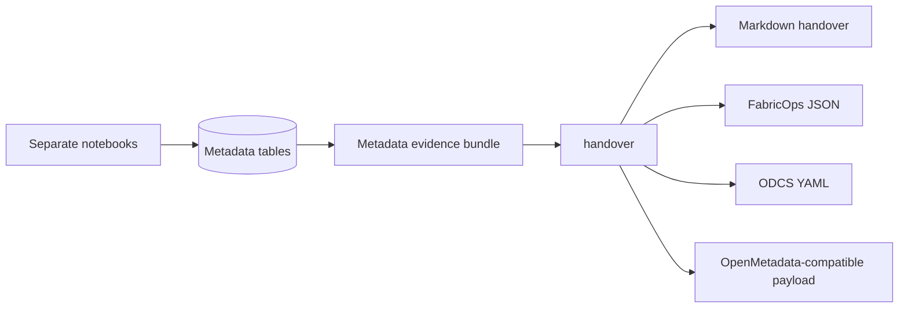

# Evidence to handover

FabricOps notebooks run separately, but they do not produce separate competing contracts. Each notebook collects governed evidence for its lifecycle stage, writes that evidence to shared metadata, and leaves final contract assembly to `handover`.

The workflow follows the same product framing across the metadata and contracts section:

```text
Separate notebooks.
Shared metadata evidence.
Curated decisions plus run observations.
Assembled handover contract.
Standards-compatible export.
```

## Workflow at a glance



## Notebook responsibilities

| Stage | Notebook family | Evidence captured | Why it matters for handover |
| --- | --- | --- | --- |
| Agreement | `01_agreement_*` | Agreement scope, dataset/table intent, owners, stewards, usage boundaries, access expectations, and review context. | Provides the contract scope anchor and ownership context. |
| Exploration | `02_ex_*` | Profiling, schema observations, business context review, AI-assisted suggestions, candidate DQ rules, and discovery evidence. | Captures what the data looks like and what humans agree it means. |
| Pipeline contract | `03_pc_*` | Approved-rule enforcement, pipeline controls, write expectations, execution outcomes, failure/quarantine behavior, and run results. | Shows whether governed expectations were enforced during execution. |
| Governance | `04_gov_*` | Classification reviews, sensitivity labels, governance notes, drift checks, monitoring evidence, and approval history. | Records ongoing oversight and risk context. |
| Handover | Export or handover step | Markdown, FabricOps JSON, ODCS YAML, and OpenMetadata-compatible payloads. | Assembles final outputs from approved evidence instead of duplicating source records. |

## Metadata and handover roles

`metadata` persists and loads the evidence. It is the evidence backbone for stable table keys, stable column keys, DQ rule keys, notebook registry rows, run traceability, and planned evidence-loading helpers.

`handover` assembles final outputs. It renders the loaded evidence bundle into human-readable Markdown, canonical FabricOps JSON, ODCS YAML, and OpenMetadata-compatible payloads.

This split keeps the rule clear:

```text
Standalone curated tables = human-owned decisions.
Collapsed fact/evidence tables = machine/run observations.
Views and exports = assembled outputs, not source of truth.
```

Agreement, classification, business meaning, and DQ rules are governed decisions. Profiling, drift, DQ execution, lineage, and run results are evidence observations. The final contract is assembled from both.

For the full table-level architecture, including which metadata should be standalone and which evidence should be collapsed into run facts, see [Metadata Architecture](metadata-architecture.md).

## Detailed flow

1. **`01_agreement_*` captures agreement and scope.** The agreement stage identifies the governed scope and captures ownership, usage, access, and handover expectations.
2. **`02_ex_*` captures discovery evidence.** Exploration collects profiling rows, business context, candidate rules, and discovery observations that can be reviewed before promotion.
3. **`03_pc_*` enforces approved rules.** Pipeline contract notebooks apply approved DQ rules and capture execution results, failures, warnings, and run outcomes.
4. **`04_gov_*` captures review and monitoring evidence.** Governance notebooks capture classification decisions, sensitivity reviews, drift monitoring evidence, and continuing approval context.
5. **`metadata` persists and loads evidence.** Metadata tables keep evidence joinable through stable agreement, table, column, rule, notebook, and run identifiers.
6. **`handover` assembles outputs.** Handover turns the evidence bundle into contract-ready artifacts without making the exported artifacts the only source of truth.

## Proposed function boundaries

These names describe intended architecture boundaries for future implementation PRs. They are planned unless already present in the public API.

### `metadata` boundaries

| Proposed function | Purpose |
| --- | --- |
| `load_contract_evidence` | Load the approved evidence bundle for one agreement, dataset, table, and optional run. |
| `load_column_catalogue_evidence` | Load row-per-column profile, business, governance, quality, lineage, and drift evidence for catalogue assembly. |
| `build_metadata_evidence_index` | Normalize evidence from multiple metadata tables into stable table, column, rule, notebook, and run keys. |

### `handover` boundaries

| Proposed function | Purpose |
| --- | --- |
| `build_contract_json` | Build the canonical FabricOps JSON contract artifact from loaded metadata evidence. |
| `build_contract_handover` | Build the human handover model that combines narrative, status, action items, and contract evidence. |
| `render_contract_markdown` | Render a junior-friendly Markdown handover from the handover model. |
| `export_odcs_yaml` | Export an ODCS-style YAML representation from the FabricOps contract JSON. |
| `export_openmetadata_payload` | Export OpenMetadata-compatible table, column, quality, lineage, and classification payloads. |

## Guardrail

Do not introduce a separate `contract_assembly` module unless the existing `metadata` and `handover` boundaries become insufficient. The intended split is simple: `metadata` loads approved evidence, and `handover` assembles and exports final artifacts.
