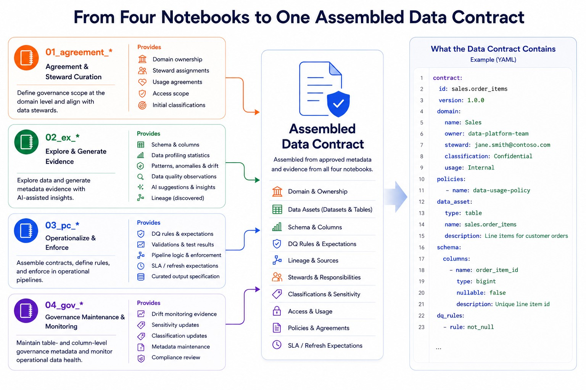

# Metadata and contracts

## What this is

FabricOps Starter Kit is a lightweight, plug-and-play starter kit for governed, quality-checked, AI-ready notebooks in Microsoft Fabric.

FabricOps assembles data contract outputs from notebook-collected metadata evidence. It does not ask teams to deploy a large metadata warehouse before they can start. Instead, each notebook records the evidence that belongs to its workflow responsibility, and FabricOps assembles the approved metadata into agreement-level, table-level, and column-level views for dashboarding, handover JSON, and standards export.

## Notebook-first contract assembly

<figure markdown>
  { .full-width }
  <figcaption>FabricOps data contracts are assembled from approved evidence across the notebook workflow.</figcaption>
</figure>

The metadata and contract workflow starts with notebooks. The simple story is:

```text
01 defines agreement.
02 profiles and discovers.
04 approves business context and classifications.
03 enforces rules and produces evidence.
All notebooks register traceability.
Handover assembles JSON/YAML payloads.
```

This notebook-first flow keeps the contract grounded in reviewed evidence instead of a disconnected documentation exercise. AI touchpoints can help draft descriptions, candidate rules, summaries, and handover text, but the overview begins with the operating workflow: collect evidence, approve it, enforce it, and assemble it into reusable outputs.

## What each notebook contributes

| Notebook | Contributes |
| --- | --- |
| 01 | Agreement metadata, including scope, owners, usage, restrictions, and service expectations. |
| 02 | Data catalogue and profile metadata from exploration and discovery. |
| 04 | Business context and governance metadata, including approved descriptions and classifications. |
| 03 | Data quality rules, data quality results, drift evidence, lineage, and handover preparation. |
| All | Notebook registry entries that preserve traceability across the workflow. |

## `01` agreement metadata capture

The `01_data_sharing_agreement` notebook captures human-approved agreement metadata before downstream evidence is collected. Human inputs are collected through widgets where practical, while derived fields stay out of the form. In particular, `agreement_status` is computed from `expiry_date` and stored with `status_as_of_date`; users do not select status manually.

`renewal_required` is a simple Yes/No value. `sensitivity_label` is always dropdown-driven and defaults to Public, Confidential, and Restricted unless a custom list is passed. `department` and `source_system` become dropdowns when option lists are supplied; otherwise they remain free text so the framework stays generic. Every committed agreement header, catalogue, and scope record includes `committed_by` and `committed_at`.

This agreement metadata becomes the anchor for later profiling, DQ rules, lineage, and pipeline contract evidence. This page intentionally does not rewrite the full metadata/data-contract story until the `01`, `02`, and `03` collection layers are all in place.

## Source metadata versus assembled views

FabricOps separates source metadata evidence from assembled contract views:

```text
9 source metadata tables → 3 assembled views
```

The 9 source metadata tables capture workflow evidence from the notebooks. The 3 assembled views organize approved evidence into agreement-level, table-level, and column-level outputs for downstream use. This page intentionally stays light; detailed source table columns live in [Metadata Architecture](metadata-architecture.md), and assembled view output fields live in [Assembled Views](metadata-columns.md).

## Handover and standards export

The final handover is generated from assembled views, not stored as another source metadata table. FabricOps renders reusable outputs from the same approved metadata and run evidence so exports remain reproducible.

Common generated outputs include:

1. Handover JSON
2. Markdown summary
3. ODCS YAML
4. OpenMetadata-compatible payload

ODCS YAML and OpenMetadata-compatible payloads are exports from the assembled views. They should be reproducible from the same approved metadata instead of becoming competing source-of-truth files.

## Related pages

| Page | Purpose |
| --- | --- |
| [Metadata Architecture](metadata-architecture.md) | Explains the 9 source metadata tables, their columns, examples, and how notebook evidence is captured. |
| [Assembled Views](metadata-columns.md) | Explains the agreement-level, table-level, and column-level views and their output fields. |
