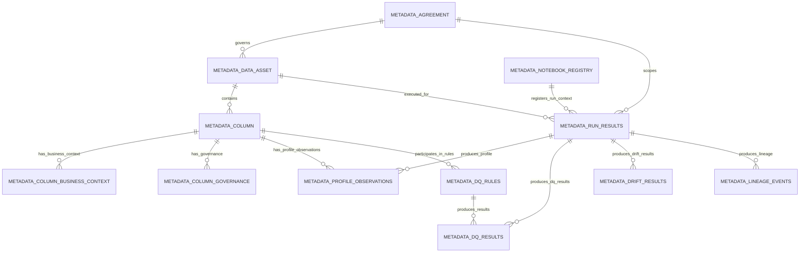

# Metadata architecture

FabricOps metadata is organized by ownership, lifecycle, and grain. The goal is contract assembly, not warehouse modelling for its own sake.

The architecture supports this product story:

```text
Separate notebooks.
Shared metadata evidence.
Curated decisions plus run observations.
Assembled handover contract.
Standards-compatible export.
```

## Purpose

FabricOps metadata is not one spreadsheet, one YAML file, or one giant JSON blob. Separate notebooks collect governed evidence at different lifecycle stages. Human-owned decisions are stored as curated metadata. Machine-generated observations are stored as run evidence. The `metadata` module is the evidence backbone. The `handover` module assembles final contract-ready outputs.

The goal is not to create one physical table for every metadata concept. The goal is to separate human-owned decisions from machine-observed evidence, keep stable keys across notebook runs, and assemble contract-ready views when needed.

Agreement, classification, business meaning, and DQ rules are governed decisions. Profiling, drift, DQ execution, lineage, and run results are evidence observations. The final contract is assembled from both.

## Design principle

| Category | Stored as | Reason |
| --- | --- | --- |
| Human-owned decisions | Standalone curated metadata tables | Users review, approve, amend, deactivate, and audit them. |
| Machine/run observations | Collapsed fact/evidence tables | They are generated repeatedly during profiling, pipeline runs, DQ checks, drift checks, and lineage capture. |
| Contract outputs | Views or exported artifacts | They should be reproducible from approved evidence, not manually maintained as the only source of truth. |

In short:

```text
Standalone curated tables = human-owned decisions.
Collapsed fact/evidence tables = machine/run observations.
Views and exports = assembled outputs, not source of truth.
```

## Architecture diagram

```mermaid
flowchart LR
    subgraph Curated["Curated metadata / human-owned decisions"]
        A[METADATA_AGREEMENT]
        B[METADATA_DATA_ASSET]
        C[METADATA_COLUMN]
        D[METADATA_COLUMN_BUSINESS_CONTEXT]
        E[METADATA_COLUMN_GOVERNANCE]
        F[METADATA_DQ_RULES]
        G[METADATA_NOTEBOOK_REGISTRY]
    end

    subgraph Evidence["Run evidence / machine observations"]
        H[METADATA_RUN_RESULTS]
        I[METADATA_PROFILE_OBSERVATIONS]
        J[METADATA_DQ_RESULTS]
        K[METADATA_DRIFT_RESULTS]
        L[METADATA_LINEAGE_EVENTS]
    end

    subgraph Views["Assembled views"]
        M[VW_COLUMN_CATALOGUE]
        N[VW_CONTRACT_EVIDENCE_BUNDLE]
    end

    subgraph Exports["Handover exports"]
        O[FabricOps JSON]
        P[ODCS YAML]
        Q[OpenMetadata-compatible payload]
        R[Markdown handover]
    end

    Curated --> Views
    Evidence --> Views
    Views --> Exports
```



## Source table overview

| Table | Type | Grain | Lifecycle owner | Why it is separate or collapsed |
| --- | --- | --- | --- | --- |
| `METADATA_AGREEMENT` | Dimension / curated | One row per agreement version | Data owner / steward | Standalone because agreement scope, usage, access, and ownership are contract anchors. |
| `METADATA_DATA_ASSET` | Dimension | One row per governed table or asset | Data engineer / steward | Standalone because asset identity is reused across profiling, DQ, lineage, drift, and handover. |
| `METADATA_COLUMN` | Dimension | One row per governed column | Data engineer / steward | Standalone because column identity joins profiling, business context, governance, and DQ. |
| `METADATA_COLUMN_BUSINESS_CONTEXT` | Dimension / curated SCD | One row per approved column business-context version | Steward / analyst | Standalone because descriptions, units, derivation, and glossary meaning are human-reviewed. |
| `METADATA_COLUMN_GOVERNANCE` | Dimension / curated SCD | One row per approved column governance version | Steward / governance reviewer | Standalone because classification, PII, confidentiality, and sensitivity are governed decisions. |
| `METADATA_DQ_RULES` | Dimension / curated SCD | One row per DQ rule version | Steward / data engineer | Standalone because DQ rules are human-approved executable contract expectations. |
| `METADATA_NOTEBOOK_REGISTRY` | Dimension / audit index | One row per registered notebook context | Notebook runtime / engineer | Standalone because it is the audit index for where evidence came from. |
| `METADATA_RUN_RESULTS` | Fact | One row per notebook or pipeline run | Runtime | Collapsed because it summarizes generated execution evidence. |
| `METADATA_PROFILE_OBSERVATIONS` | Fact | One row per table or column profile observation per run | Runtime / profiling function | Collapsed because profiling metrics are machine-generated observations. |
| `METADATA_DQ_RESULTS` | Fact | One row per rule execution per run | Runtime / DQ function | Collapsed because results are generated every run. |
| `METADATA_DRIFT_RESULTS` | Fact | One row per drift check per run | Runtime / drift function | Collapsed because drift checks are observations over time. |
| `METADATA_LINEAGE_EVENTS` | Fact | One row per source-target transformation event | Runtime / lineage function | Collapsed because lineage evidence is captured from transformation activity. |

## Relationship diagram



## Key strategy

| Key | Used in | Purpose |
| --- | --- | --- |
| `agreement_id` | Most metadata tables | Contract scope anchor. |
| `metadata_table_key` | Asset, column, profiling, DQ, run, lineage | Stable table/asset join key. |
| `metadata_column_key` | Column, business context, governance, profiling | Stable column join key. |
| `rule_key` | DQ rules and DQ results | Stable DQ rule join key. |
| `run_id` | Run, profile, DQ result, drift, lineage | Execution join key. |
| `notebook_registry_key` or notebook identifiers | Notebook registry and run results | Traceability back to notebook. |
| `version`, `is_active`, `status` | Curated decision tables | Approval lifecycle, current-state filtering, and rollback. |

Existing metadata helpers already support stable table, column, and DQ rule keys. This page does not claim every table below is implemented today; it defines the target shape future implementation PRs should converge toward.

## Implementation status

!!! note "Implementation status"
    This page describes the target metadata architecture. Some tables already exist or are partially represented by current metadata writers. Some are proposed normalized tables or views. The design is intentionally grain-aware, but it does not require one physical table per metadata concept.

| Architecture item | Current status | Current code/docs reality |
| --- | --- | --- |
| `METADATA_NOTEBOOK_REGISTRY` | Implemented | Current notebook registration writes agreement, notebook type, workspace, notebook URL, user, and registration timestamp. |
| `METADATA_COLUMN_BUSINESS_CONTEXT` / `METADATA_COLUMN_CONTEXT` | Implemented / naming to standardize | Business context review/write functions persist approved column descriptions and review evidence. |
| `METADATA_COLUMN_GOVERNANCE` | Implemented | Governance review/write functions persist PII/classification/confidentiality review evidence. |
| `METADATA_DQ_RULES` | Implemented / naming to standardize | DQ rule review/write functions persist approved rule lifecycle rows and `rule_json`. |
| `METADATA_PROFILE_OBSERVATIONS` | Partial | `profile_dataframe` produces profile rows; final table naming and extra fields need standardization. |
| `METADATA_AGREEMENT` | Planned / partial | Agreement selection exists, but a formal curated agreement metadata table should be documented and implemented. |
| `METADATA_DATA_ASSET` | Planned / partial | Asset identity can be derived today, but a formal asset table is planned. |
| `METADATA_COLUMN` | Planned / partial | Column identity can be derived from profile rows and keys, but a formal column table is planned. |
| `METADATA_RUN_RESULTS` | Partial | Handover summary contains run status fields; final run-results table needs standardization. |
| `METADATA_DQ_RESULTS` | Partial | `enforce_dq` returns structured outputs; persisted result table needs standardization. |
| `METADATA_DRIFT_RESULTS` | Partial | Drift module evidence exists conceptually; final table shape needs standardization. |
| `METADATA_LINEAGE_EVENTS` | Partial | Lineage module evidence exists conceptually; final table shape needs standardization. |
| `VW_COLUMN_CATALOGUE` | Planned | Should be assembled from column, profile, business, governance, DQ, and lineage evidence. |
| `VW_CONTRACT_EVIDENCE_BUNDLE` | Planned | Should be assembled for `handover` JSON/YAML/OpenMetadata export. |

## Detailed table catalogue

The following catalogue is implementation guidance, not a migration script. Status values mean:

- **Implemented**: represented by current writers or helpers.
- **Partial**: related evidence exists, but naming, grain, or persistence needs standardization.
- **Planned**: target architecture field for future implementation.

### `METADATA_AGREEMENT`

**Purpose:** Stores approved agreement scope, ownership, usage intent, access boundaries, and handover expectations.

**Grain:** One row per agreement version.

**Primary key:** `agreement_id`, `version`.

**Foreign keys:** Optional links to `metadata_table_key` through `METADATA_DATA_ASSET`; run-scoped evidence links back through `agreement_id`.

**Lifecycle:** Curated SCD-style table. Data owners or stewards approve new versions, mark the current version active, and retain inactive versions for audit.

| Column | Example | Status | Source notebook/function |
| --- | --- | --- | --- |
| `agreement_id` | `agr_customer_orders` | Partial | `01_agreement_*`; agreement selection helpers |
| `agreement_name` | `Customer orders agreement` | Planned / partial | `01_agreement_*` |
| `version` | `1` | Planned | `01_agreement_*` approval workflow |
| `status` | `approved` | Planned | `01_agreement_*` review workflow |
| `is_active` | `true` | Planned | `01_agreement_*` review workflow |
| `domain_name` | `Sales operations` | Planned | `01_agreement_*` |
| `data_owner` | `Data owner` | Planned | `01_agreement_*` |
| `data_steward` | `Data steward` | Planned | `01_agreement_*` |
| `usage_purpose` | `Operational reporting` | Planned | `01_agreement_*` |
| `access_notes` | `Approved analyst access only` | Planned | `01_agreement_*` |
| `handover_expectations` | `Review before downstream reuse` | Planned | `01_agreement_*` |
| `approved_by` | `steward@example.invalid` | Planned | `01_agreement_*` |
| `approved_at_utc` | `2026-01-31T12:00:00Z` | Planned | `01_agreement_*` |

### `METADATA_DATA_ASSET`

**Purpose:** Provides stable governed asset identity for a table, file, or Fabric lakehouse object in scope.

**Grain:** One row per governed table or asset.

**Primary key:** `metadata_table_key`.

**Foreign keys:** `agreement_id`.

**Lifecycle:** Curated identity table maintained when assets enter, change scope, or leave scope. Profile, DQ, drift, lineage, and handover evidence should join through this key.

| Column | Example | Status | Source notebook/function |
| --- | --- | --- | --- |
| `metadata_table_key` | `dev::sales::customer_orders` | Implemented key helper | `metadata.build_metadata_table_key` |
| `agreement_id` | `agr_customer_orders` | Planned / partial | `01_agreement_*`; metadata writes |
| `environment_name` | `dev` | Implemented key input | Notebook config / metadata key helpers |
| `dataset_name` | `sales` | Implemented key input | Notebook config / metadata key helpers |
| `table_name` | `customer_orders` | Implemented key input | Profiling, DQ, governance writers |
| `asset_type` | `delta_table` | Planned | `02_ex_*` or `03_pc_*` |
| `lakehouse_name` | `curated_lakehouse` | Planned | `00_env_config`; runtime context |
| `asset_path` | `Tables/customer_orders` | Planned | Fabric IO helpers |
| `owner` | `Data owner` | Planned | `01_agreement_*` |
| `steward` | `Data steward` | Planned | `01_agreement_*` |
| `status` | `active` | Planned | Asset review workflow |
| `registered_at_utc` | `2026-01-31T12:10:00Z` | Planned | `02_ex_*` or metadata writer |

### `METADATA_COLUMN`

**Purpose:** Provides stable column identity so profile observations, descriptions, governance labels, DQ rules, and lineage evidence can be assembled into one catalogue row.

**Grain:** One row per governed column.

**Primary key:** `metadata_column_key`.

**Foreign keys:** `agreement_id`, `metadata_table_key`.

**Lifecycle:** Identity table updated when schema changes are accepted. It should not duplicate every profile metric; those belong in profile observations.

| Column | Example | Status | Source notebook/function |
| --- | --- | --- | --- |
| `metadata_column_key` | `dev::sales::customer_orders::customer_id` | Implemented key helper | `metadata.build_metadata_column_key` |
| `metadata_table_key` | `dev::sales::customer_orders` | Implemented key helper | `metadata.build_metadata_table_key` |
| `agreement_id` | `agr_customer_orders` | Planned / partial | Agreement and metadata writers |
| `column_name` | `customer_id` | Partial | `data_profiling.profile_dataframe` |
| `ordinal_position` | `1` | Planned | Profiling/schema snapshot |
| `current_data_type` | `string` | Partial | Profiling/schema snapshot |
| `nullable` | `false` | Planned / partial | Profiling/schema snapshot |
| `is_active` | `true` | Planned | Schema acceptance workflow |
| `first_seen_run_id` | `run_20260131_001` | Planned | Profiling/run evidence |
| `last_seen_run_id` | `run_20260201_001` | Planned | Profiling/run evidence |

### `METADATA_COLUMN_BUSINESS_CONTEXT`

**Purpose:** Stores human-approved meaning for each column, including descriptions, units, glossary context, and derivation notes.

**Grain:** One row per approved column business-context version.

**Primary key:** `metadata_column_key`, `version`.

**Foreign keys:** `agreement_id`, `metadata_table_key`, `metadata_column_key`.

**Lifecycle:** Curated SCD-style review evidence. Analysts and stewards can approve, amend, deactivate, and audit business meaning without losing prior versions.

| Column | Example | Status | Source notebook/function |
| --- | --- | --- | --- |
| `metadata_column_key` | `dev::sales::customer_orders::customer_id` | Implemented key helper | `business_context.write_business_context`; metadata key helpers |
| `metadata_table_key` | `dev::sales::customer_orders` | Implemented key helper | `business_context.write_business_context`; metadata key helpers |
| `agreement_id` | `agr_customer_orders` | Partial | `02_ex_*`; business context writer |
| `column_name` | `customer_id` | Implemented | `business_context.review_business_context` |
| `approved_business_context` | `Unique customer identifier used for matching records.` | Implemented | `business_context.review_business_context`, `business_context.write_business_context` |
| `units` | `USD` | Planned | Future business context review field |
| `source_derivation` | `Derived from source status code.` | Planned / partial | Future business context review; lineage evidence |
| `glossary_term` | `Customer identifier` | Planned | Future stewardship review |
| `review_status` | `approved` | Implemented / partial | Business context review workflow |
| `reviewed_by` | `analyst@example.invalid` | Implemented / partial | Business context review workflow |
| `reviewed_at_utc` | `2026-01-31T12:20:00Z` | Implemented / partial | Business context writer |
| `version` | `2` | Planned | Future SCD standardization |
| `is_active` | `true` | Planned | Future SCD standardization |

### `METADATA_COLUMN_GOVERNANCE`

**Purpose:** Stores human-approved classification, PII, confidentiality, and sensitivity decisions.

**Grain:** One row per approved column governance version.

**Primary key:** `metadata_column_key`, `version`.

**Foreign keys:** `agreement_id`, `metadata_table_key`, `metadata_column_key`.

**Lifecycle:** Curated SCD-style governance evidence. Governance reviewers approve changes and retain historical versions for audit.

| Column | Example | Status | Source notebook/function |
| --- | --- | --- | --- |
| `metadata_column_key` | `dev::sales::customer_orders::customer_id` | Implemented key helper | `data_governance.write_governance`; metadata key helpers |
| `metadata_table_key` | `dev::sales::customer_orders` | Implemented key helper | `data_governance.write_governance`; metadata key helpers |
| `agreement_id` | `agr_customer_orders` | Partial | `04_gov_*`; governance writer |
| `column_name` | `customer_id` | Implemented | `data_governance.review_governance` |
| `pii_classification` | `direct_identifier` | Implemented | `data_governance.review_governance`, `data_governance.write_governance` |
| `confidentiality` | `confidential` | Implemented / partial | Governance review workflow |
| `sensitivity_label` | `restricted` | Partial | Governance review workflow |
| `field_classification` | `identifier` | Partial | Governance plus profiling-derived taxonomy |
| `handling_notes` | `Mask in examples and exports.` | Planned / partial | Governance review workflow |
| `review_status` | `approved` | Implemented / partial | Governance review workflow |
| `reviewed_by` | `reviewer@example.invalid` | Implemented / partial | Governance writer |
| `reviewed_at_utc` | `2026-01-31T12:25:00Z` | Implemented / partial | Governance writer |
| `version` | `1` | Planned | Future SCD standardization |
| `is_active` | `true` | Planned | Future SCD standardization |

### `METADATA_DQ_RULES`

**Purpose:** Stores approved DQ rules as executable contract expectations.

**Grain:** One row per DQ rule version.

**Primary key:** `rule_key`, `version`.

**Foreign keys:** `agreement_id`, `metadata_table_key`, optional `metadata_column_key` or `metadata_column_keys`.

**Lifecycle:** Curated SCD-style rules table. Stewards and engineers approve rules, deactivate superseded versions, and use active versions for enforcement.

| Column | Example | Status | Source notebook/function |
| --- | --- | --- | --- |
| `rule_key` | `dev::sales::customer_orders::customer_id::not_null` | Implemented key helper | `metadata.build_dq_rule_key`; `data_quality.review_dq_rules` |
| `agreement_id` | `agr_customer_orders` | Partial | `02_ex_*`, `03_pc_*` |
| `metadata_table_key` | `dev::sales::customer_orders` | Implemented | `data_quality.write_dq_rules`; metadata key helpers |
| `metadata_column_key` | `dev::sales::customer_orders::customer_id` | Partial | DQ rule review/write functions |
| `metadata_column_keys` | `["dev::sales::customer_orders::customer_id"]` | Implemented / partial | `data_quality` rule metadata attachment |
| `rule_name` | `customer_id_not_null` | Implemented / partial | `data_quality.draft_dq_rules` |
| `rule_type` | `not_null` | Implemented / partial | `data_quality.draft_dq_rules` |
| `rule_json` | `{"check": "not_null"}` | Implemented | `data_quality.write_dq_rules` |
| `severity` | `error` | Implemented / partial | DQ review workflow |
| `status` | `approved` | Implemented / partial | DQ review workflow |
| `is_active` | `true` | Implemented / partial | DQ write workflow |
| `approved_by` | `steward@example.invalid` | Implemented / partial | DQ review workflow |
| `approved_at_utc` | `2026-01-31T12:30:00Z` | Implemented / partial | DQ writer |
| `version` | `3` | Planned | Future SCD standardization |

### `METADATA_NOTEBOOK_REGISTRY`

**Purpose:** Records which notebook context produced or reviewed evidence.

**Grain:** One row per registered notebook context.

**Primary key:** `notebook_registry_key` or a deterministic notebook identifier plus registration timestamp.

**Foreign keys:** `agreement_id`; optional `run_id` through run results.

**Lifecycle:** Append-only audit index. Runtime or engineers register notebook evidence context so handover can trace where records came from.

| Column | Example | Status | Source notebook/function |
| --- | --- | --- | --- |
| `notebook_registry_key` | `agr_customer_orders::02_ex::workspace::notebook` | Implemented / partial | `metadata.register_notebook_metadata` |
| `agreement_id` | `agr_customer_orders` | Implemented / partial | `metadata.register_notebook_metadata` |
| `notebook_type` | `02_ex` | Implemented | `metadata.register_notebook_metadata` |
| `workspace_name` | `Fabric workspace` | Implemented / partial | Runtime context / registration helper |
| `notebook_name` | `02_ex_profile_customer_orders` | Planned / partial | Runtime context / registration helper |
| `notebook_url` | `https://example.invalid/notebook` | Implemented / partial | Runtime context / registration helper |
| `registered_by` | `engineer@example.invalid` | Implemented / partial | `metadata.register_notebook_metadata` |
| `registered_at_utc` | `2026-01-31T12:35:00Z` | Implemented | `metadata.register_notebook_metadata` |
| `notes` | `Exploration evidence registered.` | Planned / partial | Registration helper |

### `METADATA_RUN_RESULTS`

**Purpose:** Summarizes generated execution evidence for one notebook or pipeline run.

**Grain:** One row per notebook or pipeline run.

**Primary key:** `run_id`.

**Foreign keys:** `agreement_id`, `metadata_table_key`, `notebook_registry_key`.

**Lifecycle:** Append-only fact table. Runtime writes a run summary for each execution; handover can use the latest successful or selected run.

| Column | Example | Status | Source notebook/function |
| --- | --- | --- | --- |
| `run_id` | `run_20260131_001` | Partial | Pipeline/notebook runtime |
| `agreement_id` | `agr_customer_orders` | Planned / partial | Runtime context |
| `metadata_table_key` | `dev::sales::customer_orders` | Planned / partial | Runtime context / metadata key helpers |
| `notebook_registry_key` | `agr_customer_orders::03_pc::workspace::notebook` | Planned / partial | Notebook registry |
| `run_type` | `pipeline_contract` | Planned | `03_pc_*` |
| `run_status` | `success` | Partial | Handover summary / runtime result |
| `started_at_utc` | `2026-01-31T13:00:00Z` | Planned / partial | Runtime context |
| `ended_at_utc` | `2026-01-31T13:05:00Z` | Planned / partial | Runtime context |
| `row_count` | `1000` | Partial | Pipeline/profiling evidence |
| `error_count` | `0` | Partial | DQ enforcement results |
| `warning_count` | `2` | Partial | DQ enforcement results |
| `summary_json` | `{"dq_status": "passed"}` | Planned | Runtime summary writer |

### `METADATA_PROFILE_OBSERVATIONS`

**Purpose:** Stores machine-generated profile observations for tables and columns.

**Grain:** One row per table or column profile observation per run.

**Primary key:** `run_id`, `metadata_table_key`, optional `metadata_column_key`, `metric_name`.

**Foreign keys:** `agreement_id`, `metadata_table_key`, optional `metadata_column_key`, `run_id`.

**Lifecycle:** Append-only fact table. Profiling creates new observations repeatedly; the catalogue view selects the latest relevant observations.

| Column | Example | Status | Source notebook/function |
| --- | --- | --- | --- |
| `run_id` | `run_20260131_001` | Planned / partial | `02_ex_*`; profiling runtime |
| `agreement_id` | `agr_customer_orders` | Planned / partial | Notebook context |
| `metadata_table_key` | `dev::sales::customer_orders` | Implemented key helper | `data_profiling.profile_dataframe`; metadata key helpers |
| `metadata_column_key` | `dev::sales::customer_orders::status` | Implemented key helper / partial persistence | `data_profiling.profile_dataframe`; metadata key helpers |
| `column_name` | `status` | Implemented | `data_profiling.profile_dataframe` |
| `data_type` | `string` | Implemented | `data_profiling.profile_dataframe` |
| `row_count` | `1000` | Implemented / partial | `data_profiling.profile_dataframe` |
| `null_count` | `12` | Implemented | `data_profiling.profile_dataframe` |
| `null_percent` | `1.2` | Implemented | `data_profiling.profile_dataframe` |
| `distinct_count` | `5` | Implemented / partial | `data_profiling.profile_dataframe` |
| `min_value` | `2026-01-01` | Implemented / partial | `data_profiling.profile_dataframe` |
| `max_value` | `2026-01-31` | Implemented / partial | `data_profiling.profile_dataframe` |
| `example_values_json` | `["active", "inactive"]` | Planned | Future profiling enhancement |
| `top_values_json` | `[{"value":"active","count":920}]` | Planned | Future profiling enhancement |
| `low_frequency_count` | `3` | Planned | Future profiling enhancement |
| `observed_at_utc` | `2026-01-31T13:10:00Z` | Partial | Profiling runtime |

### `METADATA_DQ_RESULTS`

**Purpose:** Stores machine-generated results from executing approved DQ rules.

**Grain:** One row per rule execution per run.

**Primary key:** `run_id`, `rule_key`.

**Foreign keys:** `agreement_id`, `metadata_table_key`, optional `metadata_column_key`, `rule_key`, `run_id`.

**Lifecycle:** Append-only fact table. Results are generated every run and should not overwrite the approved rule definition.

| Column | Example | Status | Source notebook/function |
| --- | --- | --- | --- |
| `run_id` | `run_20260131_001` | Partial | `03_pc_*` |
| `rule_key` | `dev::sales::customer_orders::customer_id::not_null` | Implemented key helper | `data_quality.enforce_dq`; `metadata.build_dq_rule_key` |
| `agreement_id` | `agr_customer_orders` | Planned / partial | Runtime context |
| `metadata_table_key` | `dev::sales::customer_orders` | Implemented key helper / partial persistence | DQ functions |
| `metadata_column_key` | `dev::sales::customer_orders::customer_id` | Partial | DQ functions |
| `rule_name` | `customer_id_not_null` | Partial | DQ functions |
| `result_status` | `passed` | Partial | `data_quality.enforce_dq` |
| `failed_count` | `0` | Partial | `data_quality.enforce_dq` |
| `checked_count` | `1000` | Planned / partial | `data_quality.enforce_dq` |
| `severity` | `error` | Partial | Approved DQ rule row |
| `quarantine_action` | `none` | Planned / partial | Pipeline control notebook |
| `result_json` | `{"failed_count":0}` | Partial | `data_quality.enforce_dq` |
| `executed_at_utc` | `2026-01-31T13:15:00Z` | Planned / partial | Runtime context |

### `METADATA_DRIFT_RESULTS`

**Purpose:** Stores machine-generated schema, profile, or partition drift observations over time.

**Grain:** One row per drift check per run.

**Primary key:** `run_id`, `drift_check_key`.

**Foreign keys:** `agreement_id`, `metadata_table_key`, optional `metadata_column_key`, `run_id`.

**Lifecycle:** Append-only fact table. Drift checks are observations over time; approved decisions about how to respond should remain separate.

| Column | Example | Status | Source notebook/function |
| --- | --- | --- | --- |
| `drift_check_key` | `dev::sales::customer_orders::schema` | Planned / partial | `drift` module |
| `run_id` | `run_20260131_001` | Planned / partial | `04_gov_*` or pipeline runtime |
| `agreement_id` | `agr_customer_orders` | Planned / partial | Runtime context |
| `metadata_table_key` | `dev::sales::customer_orders` | Planned / partial | `drift` module; metadata key helpers |
| `metadata_column_key` | `dev::sales::customer_orders::status` | Planned / partial | Column-level drift checks |
| `drift_type` | `schema` | Partial | `drift` module evidence |
| `baseline_run_id` | `run_20260101_001` | Planned / partial | Drift baseline logic |
| `drift_status` | `no_drift` | Partial | `drift` module evidence |
| `drift_score` | `0.03` | Planned / partial | Drift calculation |
| `details_json` | `{"added_columns":[]}` | Partial | Drift evidence record |
| `observed_at_utc` | `2026-01-31T13:20:00Z` | Planned / partial | Runtime context |

### `METADATA_LINEAGE_EVENTS`

**Purpose:** Stores machine-observed source-target transformation events for traceability.

**Grain:** One row per source-target transformation event.

**Primary key:** `lineage_event_key`.

**Foreign keys:** `agreement_id`, `metadata_table_key`, optional `metadata_column_key`, `run_id`, `notebook_registry_key`.

**Lifecycle:** Append-only fact table. Lineage is captured from transformation activity and assembled into handover views.

| Column | Example | Status | Source notebook/function |
| --- | --- | --- | --- |
| `lineage_event_key` | `run_20260131_001::source_a::customer_orders` | Planned / partial | `data_lineage` module |
| `run_id` | `run_20260131_001` | Planned / partial | Runtime context |
| `agreement_id` | `agr_customer_orders` | Planned / partial | Runtime context |
| `metadata_table_key` | `dev::sales::customer_orders` | Planned / partial | Lineage writer / metadata key helpers |
| `metadata_column_key` | `dev::sales::customer_orders::status` | Planned | Column lineage enhancement |
| `source_asset` | `raw.customer_orders` | Partial | `data_lineage` module |
| `target_asset` | `curated.customer_orders` | Partial | `data_lineage` module |
| `transformation_name` | `standardize_status` | Partial | Pipeline or lineage handover function |
| `transformation_summary` | `Maps source status code to standard values.` | Partial | `data_lineage` module / notebook notes |
| `lineage_confidence` | `high` | Planned / partial | Lineage evidence review |
| `notebook_registry_key` | `agr_customer_orders::03_pc::workspace::notebook` | Planned / partial | Notebook registry |
| `captured_at_utc` | `2026-01-31T13:25:00Z` | Planned / partial | Runtime context |

## Assembled views

Views are assembled outputs. They are not the source of truth and should be reproducible from curated decisions plus run observations.

### `VW_COLUMN_CATALOGUE`

`VW_COLUMN_CATALOGUE` is the human-readable and export-ready row-per-column catalogue. It is a view, not a source-of-truth table.

Sources:

```text
METADATA_COLUMN
latest active METADATA_COLUMN_BUSINESS_CONTEXT
latest active METADATA_COLUMN_GOVERNANCE
latest METADATA_PROFILE_OBSERVATIONS
active METADATA_DQ_RULES
lineage evidence
```

| Output field | Source |
| --- | --- |
| `column_name` | `METADATA_COLUMN` |
| `description` | latest active `METADATA_COLUMN_BUSINESS_CONTEXT.approved_business_context` |
| `data_type` | `METADATA_COLUMN.current_data_type` or latest profile observation |
| `field_classification` | governance plus profiling-derived taxonomy |
| `units` | `METADATA_COLUMN_BUSINESS_CONTEXT.units` |
| `allowed_values` | active `METADATA_DQ_RULES.rule_json` |
| `example_values` | latest `METADATA_PROFILE_OBSERVATIONS.example_values_json` |
| `top_5_values` | latest `METADATA_PROFILE_OBSERVATIONS.top_values_json` |
| `low_frequency_count` | latest `METADATA_PROFILE_OBSERVATIONS.low_frequency_count` |
| `missing_data` | latest `METADATA_PROFILE_OBSERVATIONS.null_count`, `null_percent` |
| `source_derivation` | business context or lineage |
| `pii_sensitive` | latest active `METADATA_COLUMN_GOVERNANCE` |
| `business_rules` | active `METADATA_DQ_RULES` |

### `VW_CONTRACT_EVIDENCE_BUNDLE`

`VW_CONTRACT_EVIDENCE_BUNDLE` is the machine-readable evidence bundle used by `handover`. It combines the current curated decisions with the selected run observations needed for contract export.

| Output section | Source |
| --- | --- |
| `agreement` | `METADATA_AGREEMENT` |
| `asset` | `METADATA_DATA_ASSET` |
| `columns` | `VW_COLUMN_CATALOGUE` |
| `rules` | `METADATA_DQ_RULES` |
| `latest_run` | `METADATA_RUN_RESULTS` |
| `dq_results` | `METADATA_DQ_RESULTS` |
| `drift_results` | `METADATA_DRIFT_RESULTS` |
| `lineage` | `METADATA_LINEAGE_EVENTS` |
| `notebooks` | `METADATA_NOTEBOOK_REGISTRY` |

## How handover uses this model

The `metadata` module should load the evidence bundle by agreement, dataset, table, and optional run. The `handover` module should render that bundle into:

1. Markdown handover
2. FabricOps contract JSON
3. ODCS YAML
4. OpenMetadata-compatible payload

The exported files are not the governed source of truth. They are reproducible views over approved metadata evidence.

Planned function boundaries include:

| Planned boundary | Module | Purpose |
| --- | --- | --- |
| `metadata.load_contract_evidence` | `metadata` | Load agreement, asset, column, rule, run, DQ, drift, lineage, and notebook evidence for handover. |
| `metadata.load_column_catalogue_evidence` | `metadata` | Load the row-per-column catalogue slice from column identity, business context, governance, profile, rules, and lineage evidence. |
| `metadata.build_metadata_evidence_index` | `metadata` | Build a stable evidence index over agreement, table, column, rule, notebook, and run keys. |
| `handover.build_contract_json` | `handover` | Assemble the canonical FabricOps JSON contract artifact from the evidence bundle. |
| `handover.export_odcs_yaml` | `handover` | Export an ODCS-style YAML view over the FabricOps contract JSON. |
| `handover.export_openmetadata_payload` | `handover` | Export OpenMetadata-compatible payloads for metadata platform integration. |

These names are architecture guidance for future implementation PRs when they are not already available. Do not rename existing production functions to force this shape. Future work should adapt the implementation while preserving current public APIs unless a separate deprecation plan is approved.
