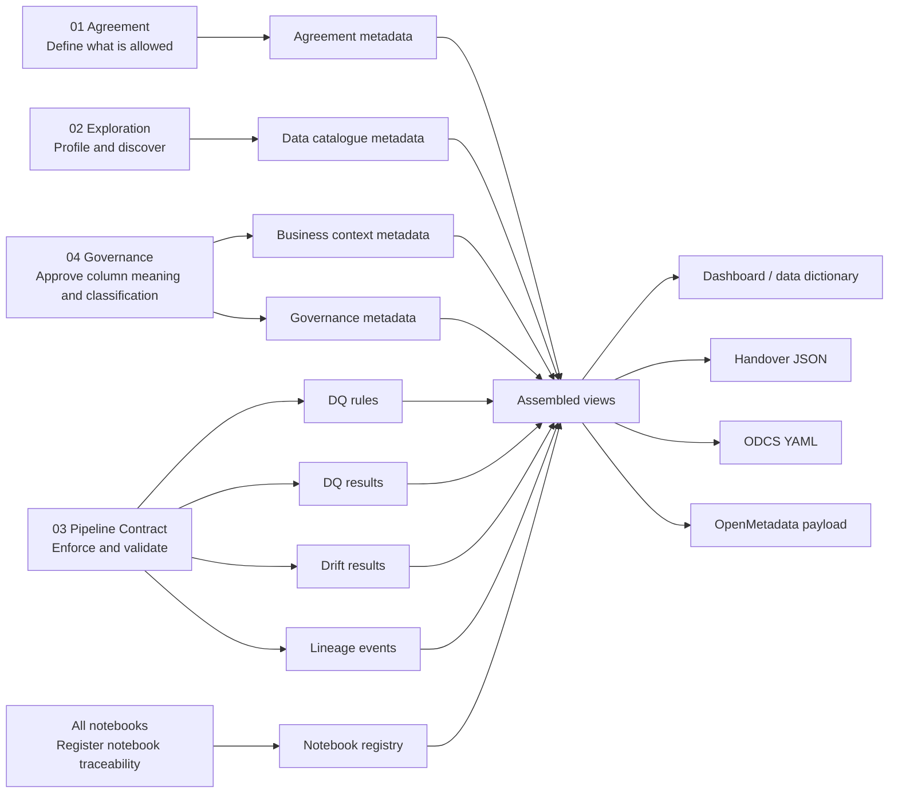

# Metadata architecture

FabricOps metadata is notebook-driven. The notebooks are the source of truth for how agreement, discovery, approval, enforcement, runtime evidence, and handover happen in Microsoft Fabric.

```text
01 defines agreement.
02 profiles and discovers.
04 approves column business context and classifications.
03 enforces rules and produces runtime evidence.
All notebooks register traceability.
Handover assembles views and exports JSON/YAML payloads.
```

FabricOps keeps separate append-only metadata tables for workflow outputs that have different ownership, grain, and lifecycle. The final handover is not another source table. It is a generated JSON or YAML artifact assembled from the latest approved metadata and run evidence.

The nine metadata tables are the governed source evidence. FabricOps assembles them through views at agreement, table, and column grain. These views are used for dashboards and handover exports. The assembled views are not separate source tables unless a project chooses to materialize them later for audit or performance.

## Notebook-driven model

The notebooks drive the metadata model. Each notebook writes the metadata that matches its workflow responsibility, and FabricOps assembles the nine metadata tables into agreement-level, table-level, and column-level views for dashboarding and export.



## Notebook responsibilities

02 discovers. 04 approves. 03 enforces. Handover assembles.

| Notebook         | Responsibility                                                                 | Writes or updates                                                                                                             |
| ---------------- | ------------------------------------------------------------------------------ | ----------------------------------------------------------------------------------------------------------------------------- |
| `00_env_config`  | Sets reusable environment context and supports notebook registration           | `METADATA_NOTEBOOK_REGISTRY` through `register_current_notebook()`                                                            |
| `01_agreement_*` | Defines agreement scope, owners, usage, restrictions, and SLA expectations     | `METADATA_AGREEMENT`, `METADATA_NOTEBOOK_REGISTRY`                                                                            |
| `02_ex_*`        | Profiles data, discovers structure, and suggests context/rules                 | `METADATA_DATA_CATALOGUE`, `METADATA_NOTEBOOK_REGISTRY`                                                                       |
| `04_gov_*`       | Approves column-level business context and classifications                     | `METADATA_COLUMN_BUSINESS_CONTEXT`, `METADATA_COLUMN_GOVERNANCE`, `METADATA_NOTEBOOK_REGISTRY`                                |
| `03_pc_*`        | Enforces approved DQ rules, validates pipeline outputs, captures drift/lineage | `METADATA_DQ_RULES`, `METADATA_DQ_RESULTS`, `METADATA_DRIFT_RESULTS`, `METADATA_LINEAGE_EVENTS`, `METADATA_NOTEBOOK_REGISTRY` |

## Source metadata tables

FabricOps uses exactly nine source metadata tables. They are governed source evidence for agreement, catalogue, approval, enforcement, runtime evidence, and traceability.

| No. | Table                              | Grain                                                        | Why it exists                                                                                 |
| --: | ---------------------------------- | ------------------------------------------------------------ | --------------------------------------------------------------------------------------------- |
|   1 | `METADATA_AGREEMENT`               | One row per agreement version                                | Defines scope, owner, usage, restrictions, SLA, and contract anchor.                          |
|   2 | `METADATA_DATA_CATALOGUE`          | One row per table per profiling run or latest table snapshot | Captures table-level catalogue and profile evidence from exploration or pipeline profiling.   |
|   3 | `METADATA_COLUMN_BUSINESS_CONTEXT` | One row per table-column per approved version                | Stores approved business meaning, description, units, source/derivation, and glossary terms.  |
|   4 | `METADATA_COLUMN_GOVERNANCE`       | One row per table-column per approved version                | Stores approved classification, PII, sensitivity, confidentiality, and handling requirements. |
|   5 | `METADATA_DQ_RULES`                | One row per rule version                                     | Stores approved executable data quality expectations.                                         |
|   6 | `METADATA_NOTEBOOK_REGISTRY`       | One row per notebook tied to an agreement                    | Links workflow notebooks to agreement, table, workspace, and URL.                             |
|   7 | `METADATA_DQ_RESULTS`              | One row per rule execution per run                           | Stores runtime result of approved DQ rules.                                                   |
|   8 | `METADATA_DRIFT_RESULTS`           | One row per table per drift check                            | Stores schema, profile, and data drift evidence over time.                                    |
|   9 | `METADATA_LINEAGE_EVENTS`          | One row per source-target table event                        | Stores source-to-target lineage and transformation evidence.                                  |

## Table-by-table details

### `METADATA_AGREEMENT`

**Why it exists:** This is the agreement-level contract anchor. It defines what the data product or data-sharing scope is, who owns it, what it can be used for, what restrictions apply, and what downstream metadata belongs to.

**Grain:** One row per agreement version.

**Primary key:** `agreement_id`, `agreement_version`.

**Main foreign keys:** None required. Other tables reference `agreement_id`.

**Main writer notebook:** `01_agreement_*`.

**Main downstream use:** Scopes every catalogue, context, governance, rule, result, drift, lineage, and handover output.

### `METADATA_DATA_CATALOGUE`

**Why it exists:** This is the table-level catalogue created from profiling and discovery. It records what table was profiled, basic table health, schema summary, row count, column count, and when the table was observed.

**Grain:** One row per agreement, table, and profiling run. A latest view can expose one current row per table.

**Primary key:** `catalogue_id` or `metadata_table_key` plus `profile_run_id`.

**Main foreign keys:** `agreement_id`.

**Main writer notebook:** `02_ex_*` through `profile_dataframe()` or profiling writer.

**Main downstream use:** Feeds table-level contract summary, column catalogue, dashboard, and handover JSON.

### `METADATA_COLUMN_BUSINESS_CONTEXT`

**Why it exists:** This stores approved column-level business meaning. It is separate because descriptions, units, derivation, semantic meaning, and glossary mapping are human-reviewed context, not raw profiling output.

**Grain:** One row per agreement, table, column, and approved business-context version.

**Primary key:** `business_context_id`.

**Main foreign keys:** `agreement_id`, `metadata_table_key`, `metadata_column_key`.

**Main writer notebook:** `04_gov_*` through `review_business_context()` and `write_business_context()`.

**Main downstream use:** Feeds the column catalogue, handover JSON, ODCS schema descriptions, and OpenMetadata column descriptions.

### `METADATA_COLUMN_GOVERNANCE`

**Why it exists:** This stores approved column-level classification and sensitivity decisions. It is separate from business context because governance has a different review purpose, risk profile, and audit requirement.

**Grain:** One row per agreement, table, column, and approved governance version.

**Primary key:** `governance_context_id`.

**Main foreign keys:** `agreement_id`, `metadata_table_key`, `metadata_column_key`.

**Main writer notebook:** `04_gov_*` through `review_governance()` and `write_governance()`.

**Main downstream use:** Feeds sensitivity labels, PII flags, confidentiality metadata, dashboard filters, ODCS custom properties, and OpenMetadata tags/classifications.

### `METADATA_DQ_RULES`

**Why it exists:** This stores approved executable data quality expectations. It must be separate from DQ results because the rule is the contract expectation, while the result is evidence from one run.

**Grain:** One row per rule version.

**Primary key:** `rule_key`.

**Main foreign keys:** `agreement_id`, `metadata_table_key`, `metadata_column_key`.

**Main writer notebook:** `03_pc_*` through `write_dq_rules()`, with candidates possibly suggested by `02_ex_*`.

**Main downstream use:** Used by `03_pc_*` to enforce quality and by assembled views to describe business rules and allowed values.

### `METADATA_NOTEBOOK_REGISTRY`

**Why it exists:** This ties notebooks to the agreement. It records which notebook plays which role, where it lives in Fabric, which workspace it belongs to, and who registered it.

**Grain:** One row per agreement and notebook registration.

**Primary key:** `notebook_registry_key` or composite notebook identity plus `registered_at`.

**Main foreign keys:** `agreement_id`.

**Main writer notebook:** All notebooks through `register_current_notebook()`.

**Main downstream use:** Lets the handover point back to the notebooks that produced or approved the evidence.

!!! important "Notebook registry function"
    Use `register_current_notebook()`, not `register_notebook_metadata()`.

### `METADATA_DQ_RESULTS`

**Why it exists:** This stores runtime evidence from executing approved DQ rules. It shows whether each rule passed, failed, or quarantined rows for a specific run.

**Grain:** One row per rule execution per run.

**Primary key:** `dq_result_id`.

**Main foreign keys:** `agreement_id`, `rule_key`, `metadata_table_key`, `metadata_column_key`, `run_id`.

**Main writer notebook:** `03_pc_*` through `enforce_dq()` and DQ result writer.

**Main downstream use:** Feeds the quality section of dashboard, handover JSON, and contract evidence bundle.

### `METADATA_DRIFT_RESULTS`

**Why it exists:** This stores drift evidence over time. It records whether the current table differs from the approved or previous baseline in schema, profile, or expected structure.

**Grain:** One row per agreement, table, and drift check run.

**Primary key:** `drift_result_id`.

**Main foreign keys:** `agreement_id`, `metadata_table_key`, `run_id`, `baseline_run_id`.

**Main writer notebook:** `03_pc_*` or `04_gov_*` drift monitoring step.

**Main downstream use:** Feeds contract validity checks, dashboard warnings, and handover action items.

### `METADATA_LINEAGE_EVENTS`

**Why it exists:** This stores source-to-target movement and transformation evidence. It explains where the table came from and how it was produced.

**Grain:** One row per source-target table relationship or transformation event.

**Primary key:** `lineage_event_id`.

**Main foreign keys:** `agreement_id`, `source_metadata_table_key`, `target_metadata_table_key`, `run_id`, `notebook_registry_key`.

**Main writer notebook:** `03_pc_*` lineage capture or transformation summary step.

**Main downstream use:** Feeds handover, OpenMetadata lineage payloads, and operational traceability.

## Assembled views and exports

FabricOps assembles the nine source metadata tables through three views:

| View                            | Grain                                    | Purpose                                                                 |
| ------------------------------- | ---------------------------------------- | ----------------------------------------------------------------------- |
| `VW_COLUMN_CATALOGUE`           | One row per agreement, table, and column | Column dictionary and column-level export detail                        |
| `VW_TABLE_CONTRACT_SUMMARY`     | One row per agreement and table          | Table-level contract health, dashboarding, and handover table section   |
| `VW_AGREEMENT_CONTRACT_SUMMARY` | One row per agreement                    | Agreement-level contract status, handover summary, and export readiness |

The handover JSON should be assembled from these views:

```text
VW_AGREEMENT_CONTRACT_SUMMARY -> handover summary section
VW_TABLE_CONTRACT_SUMMARY -> handover tables section
VW_COLUMN_CATALOGUE -> handover columns section
```

ODCS YAML and OpenMetadata-compatible payloads are generated exports from those assembled views. Handover is generated JSON/YAML/payload output, not another metadata source table.
