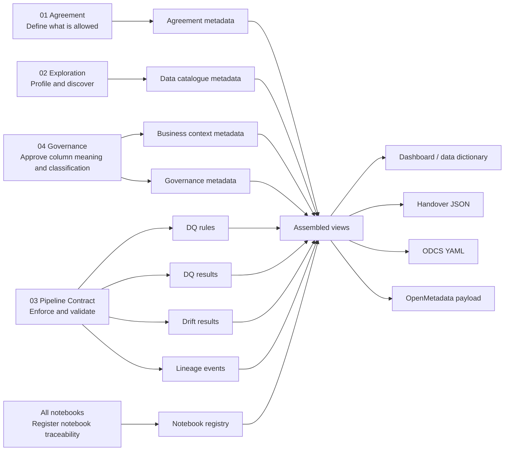

# Metadata architecture

FabricOps metadata is notebook-driven. The notebooks are the source of truth for how agreement, discovery, approval, enforcement, runtime evidence, and handover happen in Microsoft Fabric.

```text
01 defines agreement.
02 profiles and discovers.
04 approves column business context and classifications.
03 enforces rules and produces runtime evidence.
All notebooks register traceability.
Handover assembles views and exports JSON/YAML payloads.
```

## Design rule

FabricOps keeps separate append-only metadata tables for workflow outputs that have different ownership, grain, and lifecycle.

The final handover is not another source table. It is a generated JSON or YAML artifact assembled from the latest approved metadata and run evidence.

!!! note "Views are not source tables"
    The agreement, table, and column views are assembled from the nine source metadata tables. They are not bridge tables or competing sources of truth. Projects may materialize them later for performance or audit, but the governed source evidence remains in the nine metadata tables.

## Source metadata tables

FabricOps uses exactly nine source metadata tables. They are governed source evidence for agreement, catalogue, approval, enforcement, runtime evidence, and traceability.

The table names below are the physical source metadata tables. The diagram then shows which notebook family writes each type of metadata.

| No. | Table                              | Grain                                                        | Why it exists                                                                                 |
| --: | ---------------------------------- | ------------------------------------------------------------ | --------------------------------------------------------------------------------------------- |
|   1 | `METADATA_AGREEMENT`               | One row per agreement version                                | Defines scope, owner, usage, restrictions, SLA, and contract anchor.                          |
|   2 | `METADATA_DATA_CATALOGUE`          | One row per table per profiling run or latest table snapshot | Captures table-level catalogue and profile evidence from exploration or pipeline profiling.   |
|   3 | `METADATA_COLUMN_BUSINESS_CONTEXT` | One row per table-column per approved version                | Stores approved business meaning, description, units, source/derivation, and glossary terms.  |
|   4 | `METADATA_COLUMN_GOVERNANCE`       | One row per table-column per approved version                | Stores approved classification, PII, sensitivity, confidentiality, and handling requirements. |
|   5 | `METADATA_DQ_RULES`                | One row per rule version                                     | Stores approved executable data quality expectations.                                         |
|   6 | `METADATA_NOTEBOOK_REGISTRY`       | One row per notebook tied to an agreement                    | Links workflow notebooks to agreement, table, workspace, and URL.                             |
|   7 | `METADATA_DQ_RESULTS`              | One row per rule execution per run                           | Stores runtime result of approved DQ rules.                                                   |
|   8 | `METADATA_DRIFT_RESULTS`           | One row per table per drift check                            | Stores schema, profile, and data drift evidence over time.                                    |
|   9 | `METADATA_LINEAGE_EVENTS`          | One row per source-target table event                        | Stores source-to-target lineage and transformation evidence.                                  |

## Notebook-driven model

The notebooks drive the metadata model. Each notebook writes the metadata that matches its workflow responsibility, and FabricOps assembles the nine metadata tables into agreement-level, table-level, and column-level views for dashboarding and export.



## Notebook responsibilities

02 discovers. 04 approves. 03 enforces. Handover assembles.

| Notebook         | Responsibility                                                                 | Writes or updates                                                                                                             |
| ---------------- | ------------------------------------------------------------------------------ | ----------------------------------------------------------------------------------------------------------------------------- |
| `00_env_config`  | Sets reusable environment context and supports notebook registration           | `METADATA_NOTEBOOK_REGISTRY` through `register_current_notebook()`                                                            |
| `01_agreement_*` | Defines agreement scope, owners, usage, restrictions, and SLA expectations     | `METADATA_AGREEMENT`, `METADATA_NOTEBOOK_REGISTRY`                                                                            |
| `02_ex_*`        | Profiles data, discovers structure, and suggests context/rules                 | `METADATA_DATA_CATALOGUE`, `METADATA_NOTEBOOK_REGISTRY`                                                                       |
| `04_gov_*`       | Approves column-level business context and classifications                     | `METADATA_COLUMN_BUSINESS_CONTEXT`, `METADATA_COLUMN_GOVERNANCE`, `METADATA_NOTEBOOK_REGISTRY`                                |
| `03_pc_*`        | Enforces approved DQ rules, validates pipeline outputs, captures drift/lineage | `METADATA_DQ_RULES`, `METADATA_DQ_RESULTS`, `METADATA_DRIFT_RESULTS`, `METADATA_LINEAGE_EVENTS`, `METADATA_NOTEBOOK_REGISTRY` |

## Table-by-table details

Each source table owns one kind of metadata. Join keys may repeat across tables so the views can assemble evidence later, but descriptive fields should not be duplicated. For example, data_owner belongs to METADATA_AGREEMENT, row_count belongs to METADATA_DATA_CATALOGUE, approved_business_context belongs to METADATA_COLUMN_BUSINESS_CONTEXT, and pii_classification belongs to METADATA_COLUMN_GOVERNANCE.

### `METADATA_AGREEMENT`

**Why it exists:** This is the agreement-level contract anchor. It defines what the data product or data-sharing scope is, who owns it, what it can be used for, what restrictions apply, and what downstream metadata belongs to.

**Grain:** One row per agreement version.

**Primary key:** `agreement_id`, `agreement_version`.

**Main foreign keys:** None required. Other tables reference `agreement_id`.

**Main writer notebook:** `01_agreement_*`.

**Main downstream use:** Scopes every catalogue, context, governance, rule, result, drift, lineage, and handover output.

**Columns:**

| Column | Example value | Writer notebook/function | Status | Purpose |
| --- | --- | --- | --- | --- |
| agreement_id | lyra_deid_v1 | 01_agreement_* | Planned / partial | Stable agreement scope key |
| agreement_version | 1 | 01_agreement_* | Planned | Version of the agreement |
| agreement_name | LYRA De-identified Output Agreement | 01_agreement_* | Planned | Human-readable agreement name |
| business_domain | Student analytics | 01_agreement_* | Planned | Domain or business area |
| owning_team | ODI | 01_agreement_* | Planned | Team accountable for the agreement |
| data_owner | Registrar Office | 01_agreement_* | Planned | Accountable business owner |
| data_steward | Analytics Steward | 01_agreement_* | Planned | Operational data steward |
| approved_usage | Reporting and governed analytics | 01_agreement_* | Planned / partial | Allowed use of the dataset |
| access_boundaries | Internal approved users only | 01_agreement_* | Planned | Access constraint summary |
| restrictions | No re-identification | 01_agreement_* | Planned | Usage restrictions |
| sla_expectation | Monthly refresh | 01_agreement_* | Planned | Expected delivery or refresh SLA |
| agreement_status | approved | 01_agreement_* | Planned | Current lifecycle status |
| approved_by | user@org.com | 01_agreement_* | Planned / partial | Approver |
| approved_at | 2026-05-29T10:30:00Z | 01_agreement_* | Planned / partial | Approval timestamp |
| effective_from | 2026-06-01 | 01_agreement_* | Planned | Agreement start date |
| effective_to | null | 01_agreement_* | Planned | Agreement end date |
| created_at | 2026-05-29T10:00:00Z | metadata writer | Planned | Row creation timestamp |
| updated_at | 2026-05-29T10:30:00Z | metadata writer | Planned | Row update timestamp |

### `METADATA_DATA_CATALOGUE`

**Why it exists:** This is the table-level catalogue created from profiling and discovery. It records what table was profiled, basic table health, schema summary, row count, column count, and when the table was observed.

**Grain:** One row per agreement, table, and profiling run. A latest view can expose one current row per table.

**Primary key:** `catalogue_id` or `metadata_table_key` plus `profile_run_id`.

**Main foreign keys:** `agreement_id`.

**Main writer notebook:** `02_ex_*` through `profile_dataframe()` or profiling writer.

**Main downstream use:** Feeds table-level contract summary, column catalogue, dashboard, and handover JSON.

**Columns:**

| Column | Example value | Writer notebook/function | Status | Purpose |
| --- | --- | --- | --- | --- |
| catalogue_id | cat_lyra_output_20260529 | profiling writer | Planned | Unique catalogue observation row |
| agreement_id | lyra_deid_v1 | 02_ex_* | Planned / partial | Parent agreement key |
| profile_run_id | run_20260529_091000 | profile_dataframe() | Planned | Profiling run identifier |
| metadata_table_key | hash value | metadata helper / profiling writer | Planned / partial | Stable table join key |
| environment_name | prod | 00_env_config / runtime context | Partial | Environment context |
| dataset_name | lyra | 02_ex_* | Partial | Dataset or data product name |
| table_name | res_output_lyra_deid_all_v1 | profile_dataframe() | Collected | Governed table name |
| source_system | student_records | 02_ex_* | Planned | Source system name |
| table_type | lakehouse_table | 02_ex_* | Planned | Asset type |
| row_count | 10000 | profile_dataframe() | Collected | Profiled row count |
| column_count | 48 | profile_dataframe() | Planned / derivable | Profiled column count |
| schema_hash | a91f... | profiling writer | Planned | Detect schema changes |
| profile_status | complete | profiling writer | Planned | Profiling completion status |
| profiled_at | 2026-05-29T09:10:00Z | profile_dataframe() | Collected as run timestamp | Profiling timestamp |
| profile_payload_json | {"columns":[...]} | profiling writer | Planned | Extended table and column profile payload |

Do not put approved descriptions, PII labels, or DQ rule definitions here. This table owns observed catalogue and profiling evidence only.

### `METADATA_COLUMN_BUSINESS_CONTEXT`

**Why it exists:** This stores approved column-level business meaning. It is separate because descriptions, units, derivation, semantic meaning, and glossary mapping are human-reviewed context, not raw profiling output.

**Grain:** One row per agreement, table, column, and approved business-context version.

**Primary key:** `business_context_id`.

**Main foreign keys:** `agreement_id`, `metadata_table_key`, `metadata_column_key`.

**Main writer notebook:** `04_gov_*` through `review_business_context()` and `write_business_context()`.

**Main downstream use:** Feeds the column catalogue, handover JSON, ODCS schema descriptions, and OpenMetadata column descriptions.

**Columns:**

| Column | Example value | Writer notebook/function | Status | Purpose |
| --- | --- | --- | --- | --- |
| business_context_id | bc_student_id_v1 | write_business_context() | Planned | Unique business context row |
| agreement_id | lyra_deid_v1 | 04_gov_* | Planned / partial | Parent agreement key |
| metadata_table_key | hash value | metadata helper | Implemented helper | Stable table join key |
| metadata_column_key | hash value | metadata helper | Implemented helper | Stable column join key |
| table_name | res_output_lyra_deid_all_v1 | review_business_context() | Collected | Parent table |
| column_name | student_id | review_business_context() | Collected | Column being described |
| ai_suggested_business_context | Identifier for student record | review_business_context() | Collected | AI suggested meaning |
| approved_business_context | Unique de-identified student identifier | write_business_context() | Collected | Human approved meaning |
| approved_description | Unique de-identified student identifier | write_business_context() | Planned / partial | Export friendly description |
| units | days | 04_gov_* business review | Planned | Unit of measure |
| source_derivation | Hashed from source student number | 04_gov_* business review | Planned | Business derivation note |
| semantic_domain | identity | 04_gov_* business review | Planned | Business grouping |
| glossary_term | Student Identifier | 04_gov_* business review | Planned | Glossary mapping |
| business_context_notes | Use only for matching | review_business_context() | Collected | Reviewer notes |
| approval_status | approved | write_business_context() | Collected | Review state |
| reviewer_notes | Approved with wording change | review_business_context() | Collected | Review comment |
| approved_by | user@org.com | review context / metadata runtime | Partial | Approver |
| approved_at | 2026-05-29T10:30:00Z | write_business_context() | Collected | Approval timestamp |
| version | 1 | metadata writer | Planned | Version of approved context |
| is_active | true | metadata writer | Planned | Current active context |

Do not put PII, sensitivity, confidentiality, row count, or DQ result fields here.

### `METADATA_COLUMN_GOVERNANCE`

**Why it exists:** This stores approved column-level classification and sensitivity decisions. It is separate from business context because governance has a different review purpose, risk profile, and audit requirement.

**Grain:** One row per agreement, table, column, and approved governance version.

**Primary key:** `governance_context_id`.

**Main foreign keys:** `agreement_id`, `metadata_table_key`, `metadata_column_key`.

**Main writer notebook:** `04_gov_*` through `review_governance()` and `write_governance()`.

**Main downstream use:** Feeds sensitivity labels, PII flags, confidentiality metadata, dashboard filters, ODCS custom properties, and OpenMetadata tags/classifications.

**Columns:**

| Column | Example value | Writer notebook/function | Status | Purpose |
| --- | --- | --- | --- | --- |
| governance_context_id | gov_student_id_v1 | write_governance() | Planned | Unique governance row |
| agreement_id | lyra_deid_v1 | 04_gov_* | Planned / partial | Parent agreement key |
| metadata_table_key | hash value | metadata helper | Implemented helper | Stable table join key |
| metadata_column_key | hash value | metadata helper | Implemented helper | Stable column join key |
| table_name | res_output_lyra_deid_all_v1 | review_governance() | Collected | Parent table |
| column_name | student_id | review_governance() | Collected | Column being classified |
| ai_suggested_personal_identifier_classification | direct_identifier | review_governance() | Collected | AI suggested classification |
| approved_personal_identifier_classification | de_identified_identifier | write_governance() | Collected | Human approved PII classification |
| field_classification | identifier | 04_gov_* governance review | Planned / partial | Field category |
| confidentiality_label | restricted | write_governance() | Collected | Confidentiality level |
| sensitivity_label | high | 04_gov_* governance review | Planned | Sensitivity summary |
| handling_requirement | Do not export outside approved workspace | 04_gov_* governance review | Planned | Handling instruction |
| masking_requirement | hash before sharing | 04_gov_* governance review | Planned | Masking instruction |
| retention_requirement | 7 years | 04_gov_* governance review | Planned | Retention requirement |
| reviewer_notes | Treat as restricted | review_governance() | Collected | Governance reviewer notes |
| approval_status | approved | write_governance() | Collected | Review state |
| approved_by | user@org.com | write_governance() | Collected | Approver |
| approved_at | 2026-05-29T10:30:00Z | write_governance() | Collected | Approval timestamp |
| version | 1 | metadata writer | Planned | Version of governance decision |
| is_active | true | metadata writer | Planned | Current active classification |

Do not put business description, units, source derivation, row count, or DQ execution results here.

### `METADATA_DQ_RULES`

**Why it exists:** This stores approved executable data quality expectations. It must be separate from DQ results because the rule is the contract expectation, while the result is evidence from one run.

**Grain:** One row per rule version.

**Primary key:** `rule_key`.

**Main foreign keys:** `agreement_id`, `metadata_table_key`, `metadata_column_key`.

**Main writer notebook:** `03_pc_*` through `write_dq_rules()`, with candidates possibly suggested by `02_ex_*`.

**Main downstream use:** Used by `03_pc_*` to enforce quality and by assembled views to describe business rules and allowed values.

**Columns:**

| Column | Example value | Writer notebook/function | Status | Purpose |
| --- | --- | --- | --- | --- |
| rule_key | hash value | metadata.build_dq_rule_key | Implemented helper | Stable DQ rule key |
| rule_id | student_id_not_null | write_dq_rules() | Collected | Human readable rule ID |
| agreement_id | lyra_deid_v1 | 03_pc_* | Planned | Parent agreement key |
| metadata_table_key | hash value | _attach_rule_metadata_keys() | Partial | Table affected by rule |
| metadata_column_key | hash value | _attach_rule_metadata_keys() | Partial | Column affected by rule when applicable |
| table_name | res_output_lyra_deid_all_v1 | write_dq_rules() | Collected | Table affected by rule |
| column_name | student_id | write_dq_rules() | Collected / conditional | Column affected by rule |
| rule_type | not_null | write_dq_rules() | Collected | Rule type |
| severity | error | write_dq_rules() | Collected | Enforcement severity |
| description | Student ID must not be null | write_dq_rules() | Collected | Rule description |
| allowed_values | ["active","inactive"] | accepted_values rule payload | Conditional | Accepted value list |
| lower_bound | 0 | value_range rule payload | Conditional | Minimum accepted value |
| upper_bound | 100 | value_range rule payload | Conditional | Maximum accepted value |
| regex_pattern | ^[A-Z0-9]+$ | regex_format rule payload | Conditional | Required pattern |
| rule_json | {"type":"not_null","columns":["student_id"]} | write_dq_rules() | Collected | Full executable rule payload |
| is_active | true | write_dq_rules() | Collected | Active rule flag |
| action_type | approved | write_dq_rules() | Collected | Rule lifecycle action |
| action_by | user@org.com | write_dq_rules() | Collected | User who approved or changed rule |
| action_ts | 2026-05-29T10:40:00Z | write_dq_rules() | Collected | Rule action timestamp |
| action_reason | Approved after governance review | write_dq_rules() | Collected | Approval/change reason |
| rule_source | ai_widget_approval | write_dq_rules() | Collected | How rule was created |
| version | 1 | metadata writer | Planned / derivable | Rule version |

Do not put pass or fail counts here. Those belong in METADATA_DQ_RESULTS.

### `METADATA_NOTEBOOK_REGISTRY`

**Why it exists:** This ties notebooks to the agreement. It records which notebook plays which role, where it lives in Fabric, which workspace it belongs to, and who registered it.

**Grain:** One row per agreement and notebook registration.

**Primary key:** `notebook_registry_key` or composite notebook identity plus `registered_at`.

**Main foreign keys:** `agreement_id`.

**Main writer notebook:** All notebooks through `register_current_notebook()`.

**Main downstream use:** Lets the handover point back to the notebooks that produced or approved the evidence.

!!! important "Notebook registry function"
    Use `register_current_notebook()`, not `register_notebook_metadata()`.

**Columns:**

| Column | Example value | Writer notebook/function | Status | Purpose |
| --- | --- | --- | --- | --- |
| notebook_registry_key | hash value | register_current_notebook() enhancement | Planned | Stable notebook registry key |
| agreement_id | lyra_deid_v1 | register_current_notebook() | Collected | Agreement this notebook supports |
| environment_name | prod | register_current_notebook() | Collected | Environment context |
| dataset_name | lyra | register_current_notebook() | Collected | Dataset or data product |
| table_name | res_output_lyra_deid_all_v1 | register_current_notebook() | Collected | Table context if applicable |
| topic | profiling | register_current_notebook() | Collected | Notebook topic |
| pipeline_name | lyra_pipeline | register_current_notebook() | Collected | Pipeline or workflow name |
| notebook_type | 04_gov | register_current_notebook() | Collected | Notebook family |
| workspace_id | Fabric workspace ID | register_current_notebook() | Collected | Fabric workspace ID |
| workspace_name | ODI Dev | register_current_notebook() | Collected | Fabric workspace name |
| notebook_id | Fabric notebook ID | register_current_notebook() | Collected | Fabric notebook ID |
| notebook_name | 04_gov_lyra_column_review | register_current_notebook() | Collected | Fabric notebook name |
| notebook_url | https://fabric.microsoft.com/... | register_current_notebook() | Collected | Link to notebook |
| user_name | Voyce | register_current_notebook() | Collected | Registering user |
| user_id | user-guid | register_current_notebook() | Collected | Registering user ID |
| registered_at | 2026-05-29T10:30:00Z | register_current_notebook() | Collected | Registration timestamp |

Do not put profiling metrics, business context, classification, or DQ results here. This table owns traceability only.

### `METADATA_DQ_RESULTS`

**Why it exists:** This stores runtime evidence from executing approved DQ rules. It shows whether each rule passed, failed, or quarantined rows for a specific run.

**Grain:** One row per rule execution per run.

**Primary key:** `dq_result_id`.

**Main foreign keys:** `agreement_id`, `rule_key`, `metadata_table_key`, `metadata_column_key`, `run_id`.

**Main writer notebook:** `03_pc_*` through `enforce_dq()` and DQ result writer.

**Main downstream use:** Feeds the quality section of dashboards, assembled views, and handover exports.

**Columns:**

| Column | Example value | Writer notebook/function | Status | Purpose |
| --- | --- | --- | --- | --- |
| dq_result_id | dqres_20260529_student_id_not_null | DQ result writer | Planned | Unique DQ result row |
| run_id | run_20260529_110000 | 03_pc_* runtime context | Partial | Execution run key |
| agreement_id | lyra_deid_v1 | 03_pc_* | Planned | Parent agreement key |
| rule_key | hash value | enforce_dq() | Partial | Rule that was executed |
| rule_id | student_id_not_null | enforce_dq() | Partial | Human readable rule ID |
| metadata_table_key | hash value | metadata helper | Planned | Affected table |
| metadata_column_key | hash value | metadata helper | Planned | Affected column when applicable |
| table_name | res_output_lyra_deid_all_v1 | enforce_dq() | Partial | Table checked |
| column_name | student_id | enforce_dq() | Partial | Column checked when applicable |
| status | passed | enforce_dq() | Partial | Rule result status |
| passed_count | 9997 | DQ result enhancement | Planned | Passing row count |
| failed_count | 3 | DQ result enhancement | Planned | Failing row count |
| quarantine_count | 3 | enforce_dq() / DQ writer | Partial | Quarantined row count |
| failure_sample_path | Tables/dq_failures/student_id_not_null | DQ result enhancement | Planned | Pointer to failed sample |
| evaluated_at | 2026-05-29T11:00:00Z | DQ result writer | Planned | Evaluation timestamp |
| result_payload_json | {"failed_count":3,"quarantine_count":3} | DQ result writer | Planned | Extended DQ result payload |

Do not put rule definition details here except IDs needed to join back to METADATA_DQ_RULES.

### `METADATA_DRIFT_RESULTS`

**Why it exists:** This stores drift evidence over time. It records whether the current table differs from the approved or previous baseline in schema, profile, or expected structure.

**Grain:** One row per agreement, table, and drift check run.

**Primary key:** `drift_result_id`.

**Main foreign keys:** `agreement_id`, `metadata_table_key`, `run_id`, `baseline_run_id`.

**Main writer notebook:** `03_pc_*` or `04_gov_*` drift monitoring step.

**Main downstream use:** Feeds contract validity checks, dashboard warnings, and handover action items.

**Columns:**

| Column | Example value | Writer notebook/function | Status | Purpose |
| --- | --- | --- | --- | --- |
| drift_result_id | drift_lyra_20260529 | drift writer | Planned | Unique drift result row |
| run_id | run_20260529_110000 | runtime context | Planned | Execution run key |
| agreement_id | lyra_deid_v1 | 03_pc_* or 04_gov_* | Planned | Parent agreement key |
| metadata_table_key | hash value | metadata helper | Planned | Table checked for drift |
| table_name | res_output_lyra_deid_all_v1 | drift check | Partial | Table checked |
| baseline_run_id | run_20260429_110000 | drift check | Planned | Baseline run |
| current_run_id | run_20260529_110000 | drift check | Planned | Current comparison run |
| drift_type | schema | drift check | Partial | Drift category |
| status | warning | drift check | Partial | Drift outcome |
| can_continue | true | drift check | Partial | Whether pipeline can continue |
| added_columns_json | ["new_status"] | drift enhancement | Planned | Added columns |
| removed_columns_json | [] | drift enhancement | Planned | Removed columns |
| changed_columns_json | ["status_code"] | drift enhancement | Planned | Changed columns |
| metric_changes_json | {"row_count_delta_pct":4.2} | drift enhancement | Planned | Profile metric changes |
| drift_summary | 1 new nullable column detected | drift check | Planned | Human readable summary |
| checked_at | 2026-05-29T11:05:00Z | drift writer | Planned | Drift check timestamp |

Do not put DQ pass or fail counts here. Those belong in METADATA_DQ_RESULTS.

### `METADATA_LINEAGE_EVENTS`

**Why it exists:** This stores source-to-target movement and transformation evidence. It explains where the table came from and how it was produced.

**Grain:** One row per source-target table relationship or transformation event.

**Primary key:** `lineage_event_id`.

**Main foreign keys:** `agreement_id`, `source_metadata_table_key`, `target_metadata_table_key`, `run_id`, `notebook_registry_key`.

**Main writer notebook:** `03_pc_*` lineage capture or transformation summary step.

**Main downstream use:** Feeds handover, OpenMetadata lineage payloads, and operational traceability.

**Columns:**

| Column | Example value | Writer notebook/function | Status | Purpose |
| --- | --- | --- | --- | --- |
| lineage_event_id | lin_lyra_raw_to_output_20260529 | lineage writer | Planned | Unique lineage event |
| run_id | run_20260529_110000 | runtime context | Planned | Execution run key |
| agreement_id | lyra_deid_v1 | 03_pc_* | Planned | Parent agreement key |
| source_metadata_table_key | hash value | metadata helper | Planned | Upstream table key |
| target_metadata_table_key | hash value | metadata helper | Planned | Downstream table key |
| source_table | raw_lyra_students | lineage capture | Partial | Upstream table |
| target_table | res_output_lyra_deid_all_v1 | lineage capture | Partial | Downstream table |
| transformation_type | hash, filter, aggregate | lineage enhancement | Planned | Transformation category |
| transformation_summary | De-identified student records and filtered active population | lineage capture | Partial | Human readable transformation note |
| columns_used_json | ["student_no","status_code"] | lineage enhancement | Planned | Source columns used |
| columns_created_json | ["student_id","active_flag"] | lineage enhancement | Planned | Output columns created |
| notebook_registry_key | hash value | register_current_notebook() | Planned | Producing notebook link |
| captured_at | 2026-05-29T11:10:00Z | lineage writer | Planned | Capture timestamp |
| lineage_payload_json | {"source":"raw_lyra_students","target":"res_output_..."} | lineage writer | Planned | Extended lineage payload |

Do not put governance labels, DQ results, or profiling metrics here.

## Assembled views and exports

FabricOps assembles the nine source metadata tables through three views:

| View                            | Grain                                    | Purpose                                                                 |
| ------------------------------- | ---------------------------------------- | ----------------------------------------------------------------------- |
| `VW_AGREEMENT_CONTRACT_SUMMARY` | One row per agreement                    | Agreement-level contract status, handover summary, and export readiness |
| `VW_TABLE_CONTRACT_SUMMARY`     | One row per agreement and table          | Table-level contract health, dashboarding, and handover table section   |
| `VW_COLUMN_CATALOGUE`           | One row per agreement, table, and column | Column dictionary and column-level export detail                        |

The handover JSON should be assembled from these views:

```text
VW_AGREEMENT_CONTRACT_SUMMARY -> handover summary section
VW_TABLE_CONTRACT_SUMMARY -> handover tables section
VW_COLUMN_CATALOGUE -> handover columns section
```

ODCS YAML and OpenMetadata-compatible payloads are generated exports from those assembled views. Handover is generated JSON/YAML/payload output, not another metadata source table.
