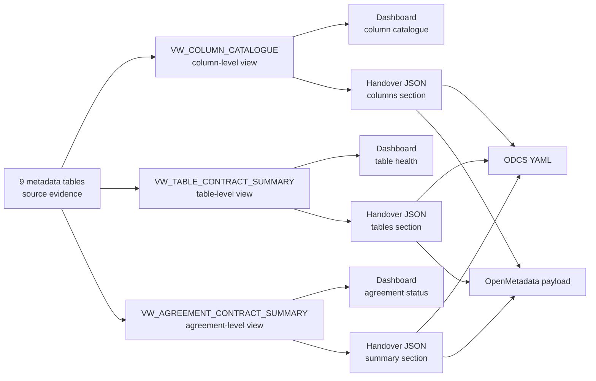

# Assembled views

This page describes the agreement-level, table-level, and column-level views assembled from the nine source metadata tables. These views are not source tables. They are reproducible outputs used for dashboarding, handover JSON, ODCS YAML, and OpenMetadata-compatible payloads.

The nine metadata tables are governed source evidence. The assembled views join and summarize that evidence at the grains that dashboards and handover exports need. A project may choose to materialize a view later for audit or performance, but the view itself is not a new source metadata table.

## View overview

| View                            | Grain                                    | Purpose                                                                 |
| ------------------------------- | ---------------------------------------- | ----------------------------------------------------------------------- |
| `VW_AGREEMENT_CONTRACT_SUMMARY` | One row per agreement                    | Agreement-level contract status, handover summary, and export readiness |
| `VW_TABLE_CONTRACT_SUMMARY`     | One row per agreement and table          | Table-level contract health, dashboarding, and handover table section   |
| `VW_COLUMN_CATALOGUE`           | One row per agreement, table, and column | Column dictionary and column-level export detail                        |

## View grain and non-overlap rule

The assembled views are separated by grain so they do not become three copies of the same contract. Agreement-level fields stay in the agreement view. Table-level health and evidence stay in the table view. Column-level definitions and rules stay in the column catalogue. Lower-grain views may include parent keys for joining, but they should not repeat parent-level descriptive fields unless needed for export convenience.

| View | Grain | Owns | Should not own |
| --- | --- | --- | --- |
| `VW_AGREEMENT_CONTRACT_SUMMARY` | One row per agreement | Agreement ownership, usage, readiness, overall status, counts | Per-table row counts, per-column descriptions |
| `VW_TABLE_CONTRACT_SUMMARY` | One row per agreement and table | Table profile, DQ status, drift status, lineage status, table health | Agreement policy text, per-column business definitions |
| `VW_COLUMN_CATALOGUE` | One row per agreement, table, and column | Column description, data type, classification, rules, examples, missingness | Agreement-level ownership summary, table-level overall health narrative |

## `VW_AGREEMENT_CONTRACT_SUMMARY`

**Grain:** One row per `agreement_id`.

**Purpose:** Agreement-level contract status, handover summary, and export readiness.

**Sources:** All nine metadata tables.

**Example fields:** `agreement_id`, `agreement_name`, `business_domain`, `data_owner`, `data_steward`, `approved_usage`, `agreement_status`, `table_count`, `column_count`, `classified_column_count`, `pii_column_count`, `dq_rule_count`, `latest_dq_status`, `latest_drift_status`, `lineage_coverage_status`, `notebook_count`, `last_evidence_at`, `overall_contract_status`, `can_generate_handover`.

This view summarizes whether the agreement has enough approved metadata and runtime evidence to generate a useful handover or standards export.

### Output-column mapping

| Output column | Example value | Source table | Source notebook/function | Purpose |
| --- | --- | --- | --- | --- |
| `agreement_id` | `lyra_deid_v1` | `METADATA_AGREEMENT` | `01_agreement_*` | Stable contract scope key |
| `agreement_version` | `1` | `METADATA_AGREEMENT` | `01_agreement_*` | Identifies the approved agreement version |
| `agreement_name` | `LYRA De-identified Output Agreement` | `METADATA_AGREEMENT` | `01_agreement_*` | Human-readable agreement name |
| `business_domain` | `Student analytics` | `METADATA_AGREEMENT` | `01_agreement_*` | Business/domain context |
| `data_owner` | `Registrar Office` | `METADATA_AGREEMENT` | `01_agreement_*` | Accountable owner |
| `data_steward` | `Analytics Steward` | `METADATA_AGREEMENT` | `01_agreement_*` | Operational steward |
| `approved_usage` | `Reporting and governed analytics` | `METADATA_AGREEMENT` | `01_agreement_*` | Allowed usage |
| `access_boundaries` | `Internal approved users only` | `METADATA_AGREEMENT` | `01_agreement_*` | Access constraint summary |
| `agreement_status` | `approved` | `METADATA_AGREEMENT` | `01_agreement_*` | Current agreement state |
| `table_count` | `3` | `METADATA_DATA_CATALOGUE` | assembled view aggregation | Number of governed tables under the agreement |
| `column_count` | `48` | `METADATA_DATA_CATALOGUE` | assembled view aggregation | Number of governed columns under the agreement |
| `classified_column_count` | `48` | `METADATA_COLUMN_GOVERNANCE` | `04_gov_*` aggregation | Coverage of column classification |
| `pii_column_count` | `5` | `METADATA_COLUMN_GOVERNANCE` | `04_gov_*` aggregation | PII exposure summary |
| `dq_rule_count` | `21` | `METADATA_DQ_RULES` | `03_pc_*` aggregation | Number of approved DQ rules |
| `latest_dq_status` | `passed` | `METADATA_DQ_RESULTS` | `03_pc_*` aggregation | Latest agreement-level DQ status |
| `latest_drift_status` | `warning` | `METADATA_DRIFT_RESULTS` | `03_pc_*` or `04_gov_*` aggregation | Latest drift status across tables |
| `lineage_coverage_status` | `complete` | `METADATA_LINEAGE_EVENTS` | `03_pc_*` aggregation | Whether lineage exists for governed tables |
| `notebook_count` | `5` | `METADATA_NOTEBOOK_REGISTRY` | `register_current_notebook()` aggregation | Number of linked workflow notebooks |
| `last_evidence_at` | `2026-05-29T10:30:00Z` | multiple tables | assembled max timestamp | Last metadata/evidence update |
| `overall_contract_status` | `ready` | assembled logic | handover/metadata view logic | Overall readiness status |
| `can_generate_handover` | `true` | assembled logic | handover/metadata view logic | Whether enough evidence exists for export |

## `VW_TABLE_CONTRACT_SUMMARY`

**Grain:** One row per `agreement_id`, `table_name`.

**Purpose:** Table-level contract health, dashboarding, and handover table section.

**Sources:** `METADATA_AGREEMENT`, `METADATA_DATA_CATALOGUE`, `METADATA_DQ_RULES`, `METADATA_DQ_RESULTS`, `METADATA_DRIFT_RESULTS`, `METADATA_LINEAGE_EVENTS`, and `METADATA_NOTEBOOK_REGISTRY`.

**Example fields:** `agreement_id`, `table_name`, `dataset_name`, `row_count`, `column_count`, `profile_status`, `dq_rule_count`, `latest_dq_status`, `failed_rule_count`, `latest_drift_status`, `lineage_status`, `source_tables`, `target_table`, `last_profiled_at`, `last_validated_at`, `last_drift_checked_at`, `pipeline_notebook_url`, `overall_table_status`.

This view summarizes whether each table has the expected catalogue evidence, approved rules, runtime validation, drift status, lineage evidence, and notebook traceability.

### Output-column mapping

| Output column | Example value | Source table | Source notebook/function | Purpose |
| --- | --- | --- | --- | --- |
| `agreement_id` | `lyra_deid_v1` | `METADATA_AGREEMENT` | `01_agreement_*` | Parent agreement key |
| `dataset_name` | `lyra` | `METADATA_DATA_CATALOGUE` | `02_ex_*` | Dataset or data product name |
| `table_name` | `res_output_lyra_deid_all_v1` | `METADATA_DATA_CATALOGUE` | `profile_dataframe()` | Governed table name |
| `metadata_table_key` | hash value | `METADATA_DATA_CATALOGUE` | metadata helper / profiling writer | Stable table join key |
| `source_system` | `student_records` | `METADATA_DATA_CATALOGUE` or `METADATA_LINEAGE_EVENTS` | `02_ex_*` / `03_pc_*` | Source system summary |
| `row_count` | `10000` | `METADATA_DATA_CATALOGUE` | `profile_dataframe()` | Latest profiled row count |
| `column_count` | `48` | `METADATA_DATA_CATALOGUE` | `profile_dataframe()` | Latest profiled column count |
| `schema_hash` | `a91f...` | `METADATA_DATA_CATALOGUE` | profiling writer | Detects schema change |
| `profile_status` | `complete` | `METADATA_DATA_CATALOGUE` | `profile_dataframe()` | Whether table profiling completed |
| `last_profiled_at` | `2026-05-29T09:10:00Z` | `METADATA_DATA_CATALOGUE` | `profile_dataframe()` | Latest profiling timestamp |
| `dq_rule_count` | `8` | `METADATA_DQ_RULES` | assembled aggregation | Number of active rules for table |
| `latest_dq_status` | `passed` | `METADATA_DQ_RESULTS` | `enforce_dq()` aggregation | Latest table-level DQ outcome |
| `failed_rule_count` | `0` | `METADATA_DQ_RESULTS` | `enforce_dq()` aggregation | Number of failed rules in latest run |
| `latest_drift_status` | `warning` | `METADATA_DRIFT_RESULTS` | drift check aggregation | Latest table drift result |
| `drift_summary` | `1 new nullable column detected` | `METADATA_DRIFT_RESULTS` | drift check | Human-readable drift summary |
| `lineage_status` | `provided` | `METADATA_LINEAGE_EVENTS` | lineage capture | Whether lineage evidence exists |
| `source_tables` | `raw_lyra_students` | `METADATA_LINEAGE_EVENTS` | lineage capture | Upstream table summary |
| `target_table` | `res_output_lyra_deid_all_v1` | `METADATA_LINEAGE_EVENTS` | lineage capture | Downstream/output table |
| `pipeline_notebook_url` | Fabric notebook URL | `METADATA_NOTEBOOK_REGISTRY` | `register_current_notebook()` | Link to producing/enforcing notebook |
| `overall_table_status` | `ready` | assembled logic | handover/metadata view logic | Table-level readiness |

## `VW_COLUMN_CATALOGUE`

**Grain:** One row per `agreement_id`, `table_name`, `column_name`.

**Purpose:** Column dictionary and column-level export detail.

**Sources:** All relevant source tables, especially `METADATA_DATA_CATALOGUE`, `METADATA_COLUMN_BUSINESS_CONTEXT`, `METADATA_COLUMN_GOVERNANCE`, `METADATA_DQ_RULES`, `METADATA_DQ_RESULTS`, `METADATA_DRIFT_RESULTS`, `METADATA_LINEAGE_EVENTS`, `METADATA_NOTEBOOK_REGISTRY`, and `METADATA_AGREEMENT`.

**Example fields:** `agreement_id`, `table_name`, `column_name`, `data_type`, `description`, `units`, `source_derivation`, `field_classification`, `pii_classification`, `confidentiality_label`, `sensitivity_label`, `allowed_values`, `business_rules`, `latest_dq_status`, `latest_drift_status`, `lineage_summary`, `profiled_at`, `approved_by`, `approved_at`, `evidence_notebook_url`.

This view is the column catalogue used by dashboards, data dictionaries, the handover columns section, ODCS schema detail, and OpenMetadata column detail.

### Output-column mapping

| Output column | Example value | Source table | Source notebook/function | Purpose |
| --- | --- | --- | --- | --- |
| `agreement_id` | `lyra_deid_v1` | `METADATA_AGREEMENT` | `01_agreement_*` | Parent agreement key |
| `table_name` | `res_output_lyra_deid_all_v1` | `METADATA_DATA_CATALOGUE` | `profile_dataframe()` | Parent table |
| `column_name` | `student_id` | `METADATA_DATA_CATALOGUE` | `profile_dataframe()` | Column name |
| `metadata_column_key` | hash value | `METADATA_DATA_CATALOGUE` / metadata helper | profiling writer | Stable column join key |
| `ordinal_position` | `1` | `METADATA_DATA_CATALOGUE` | profile/schema enhancement | Column order |
| `data_type` | `string` | `METADATA_DATA_CATALOGUE` | `profile_dataframe()` | Observed or declared data type |
| `description` | `Unique de-identified student identifier` | `METADATA_COLUMN_BUSINESS_CONTEXT` | `review_business_context()` / `write_business_context()` | Approved column description |
| `units` | `days` | `METADATA_COLUMN_BUSINESS_CONTEXT` | `04_gov_*` business review | Unit of measure |
| `source_derivation` | `Hashed from source student number` | `METADATA_COLUMN_BUSINESS_CONTEXT` / `METADATA_LINEAGE_EVENTS` | `04_gov_*` / lineage capture | Business derivation |
| `semantic_domain` | `identity` | `METADATA_COLUMN_BUSINESS_CONTEXT` | `04_gov_*` business review | Business grouping |
| `glossary_term` | `Student Identifier` | `METADATA_COLUMN_BUSINESS_CONTEXT` | `04_gov_*` business review | Business glossary mapping |
| `field_classification` | `identifier` | `METADATA_COLUMN_GOVERNANCE` | `review_governance()` / `write_governance()` | Field category |
| `pii_classification` | `de_identified_identifier` | `METADATA_COLUMN_GOVERNANCE` | `review_governance()` / `write_governance()` | PII classification |
| `confidentiality_label` | `restricted` | `METADATA_COLUMN_GOVERNANCE` | `review_governance()` / `write_governance()` | Confidentiality level |
| `sensitivity_label` | `high` | `METADATA_COLUMN_GOVERNANCE` | `04_gov_*` governance review | Sensitivity summary |
| `handling_requirement` | `Do not export outside approved workspace` | `METADATA_COLUMN_GOVERNANCE` | `04_gov_*` governance review | Handling instruction |
| `allowed_values` | `["active", "inactive"]` | `METADATA_DQ_RULES` | `write_dq_rules()` | Accepted values rule |
| `business_rules` | `Must not be null; must be unique` | `METADATA_DQ_RULES` | `write_dq_rules()` | Active rules affecting column |
| `latest_dq_status` | `passed` | `METADATA_DQ_RESULTS` | `enforce_dq()` | Latest rule outcome for column |
| `null_count` | `0` | `METADATA_DATA_CATALOGUE` | `profile_dataframe()` | Missing data count |
| `null_percent` | `0.0` | `METADATA_DATA_CATALOGUE` | `profile_dataframe()` | Missing data percentage |
| `example_values` | `["S001", "S002"]` | `METADATA_DATA_CATALOGUE` | profile enhancement | Example observed values |
| `top_values` | `[{"value":"active","count":932}]` | `METADATA_DATA_CATALOGUE` | profile enhancement | Most frequent values |
| `low_frequency_count` | `3` | `METADATA_DATA_CATALOGUE` | profile enhancement | Count of rare values |
| `latest_drift_status` | `no_change` | `METADATA_DRIFT_RESULTS` | drift check | Latest drift status affecting column/table |
| `lineage_summary` | `Derived from raw_lyra_students.student_no` | `METADATA_LINEAGE_EVENTS` | lineage capture | Source-to-target trace |
| `evidence_notebook_url` | Fabric notebook URL | `METADATA_NOTEBOOK_REGISTRY` | `register_current_notebook()` | Link back to evidence notebook |

Some keys repeat across views because they are required for joining and export. Descriptive ownership fields stay in the agreement view, table health fields stay in the table view, and column definitions stay in the column catalogue.

## Handover assembly

The handover JSON is assembled from the three views. The agreement view provides the summary section, the table view provides the table health section, and the column catalogue provides the schema/column section. ODCS YAML and OpenMetadata-compatible payloads are generated from the same assembled views.

Planned function boundaries include:

| Planned boundary | Module | Purpose |
| --- | --- | --- |
| `metadata.load_agreement_contract_summary` | `metadata` | Load agreement-level contract status and export readiness evidence. |
| `metadata.load_table_contract_summary` | `metadata` | Load table-level contract health and handover table evidence. |
| `metadata.load_column_catalogue` | `metadata` | Load the row-per-column catalogue assembled from profiling, business context, governance, DQ, drift, lineage, and notebook evidence. |
| `handover.build_contract_json` | `handover` | Build the final FabricOps handover JSON artifact from the assembled views. |
| `handover.export_odcs_yaml` | `handover` | Render an ODCS YAML export from the assembled views. |
| `handover.export_openmetadata_payload` | `handover` | Render OpenMetadata-compatible payloads from the assembled views. |

These names are architecture guidance when they are not already available. Do not rename existing production functions to force this shape.
