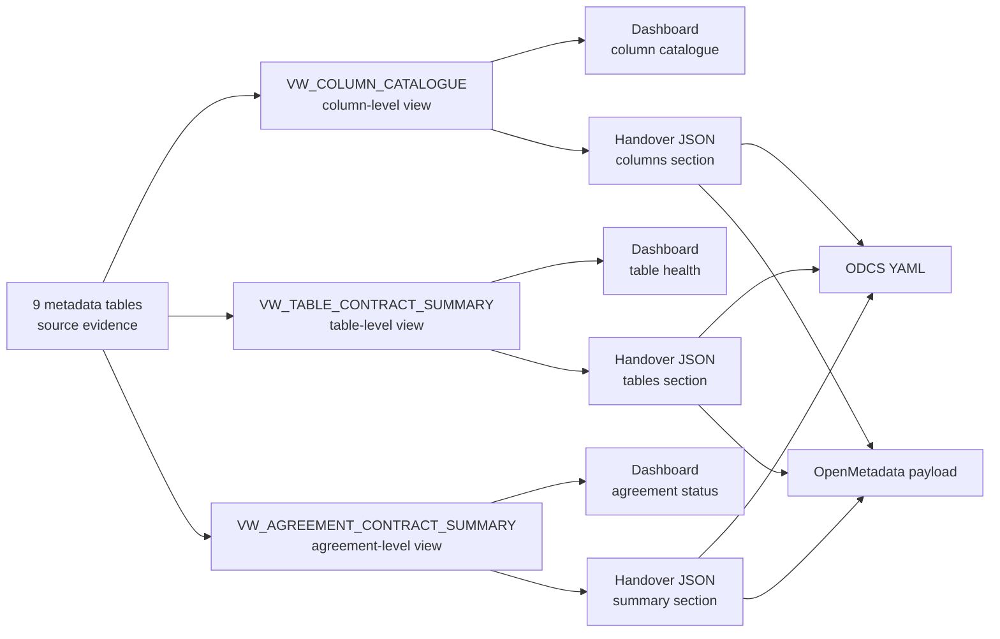

# Assembled views

This page describes the agreement-level, table-level, and column-level views assembled from the nine source metadata tables. These views are not source tables. They are reproducible outputs used for dashboarding, handover JSON, ODCS YAML, and OpenMetadata-compatible payloads.

The nine metadata tables are governed source evidence. The assembled views join and summarize that evidence at the grains that dashboards and handover exports need. A project may choose to materialize a view later for audit or performance, but the view itself is not a new source metadata table.

## View overview

| View                            | Grain                                    | Purpose                                                                 |
| ------------------------------- | ---------------------------------------- | ----------------------------------------------------------------------- |
| `VW_COLUMN_CATALOGUE`           | One row per agreement, table, and column | Column dictionary and column-level export detail                        |
| `VW_TABLE_CONTRACT_SUMMARY`     | One row per agreement and table          | Table-level contract health, dashboarding, and handover table section   |
| `VW_AGREEMENT_CONTRACT_SUMMARY` | One row per agreement                    | Agreement-level contract status, handover summary, and export readiness |

## `VW_COLUMN_CATALOGUE`

**Grain:** One row per `agreement_id`, `table_name`, `column_name`.

**Purpose:** Column dictionary and column-level export detail.

**Sources:** All relevant source tables, especially `METADATA_DATA_CATALOGUE`, `METADATA_COLUMN_BUSINESS_CONTEXT`, `METADATA_COLUMN_GOVERNANCE`, `METADATA_DQ_RULES`, `METADATA_DQ_RESULTS`, `METADATA_DRIFT_RESULTS`, `METADATA_LINEAGE_EVENTS`, `METADATA_NOTEBOOK_REGISTRY`, and `METADATA_AGREEMENT`.

**Example fields:** `agreement_id`, `table_name`, `column_name`, `data_type`, `description`, `units`, `source_derivation`, `field_classification`, `pii_classification`, `confidentiality_label`, `sensitivity_label`, `allowed_values`, `business_rules`, `latest_dq_status`, `latest_drift_status`, `lineage_summary`, `profiled_at`, `approved_by`, `approved_at`, `evidence_notebook_url`.

This view is the column catalogue used by dashboards, data dictionaries, the handover columns section, ODCS schema detail, and OpenMetadata column detail.

## `VW_TABLE_CONTRACT_SUMMARY`

**Grain:** One row per `agreement_id`, `table_name`.

**Purpose:** Table-level contract health, dashboarding, and handover table section.

**Sources:** `METADATA_AGREEMENT`, `METADATA_DATA_CATALOGUE`, `METADATA_DQ_RULES`, `METADATA_DQ_RESULTS`, `METADATA_DRIFT_RESULTS`, `METADATA_LINEAGE_EVENTS`, and `METADATA_NOTEBOOK_REGISTRY`.

**Example fields:** `agreement_id`, `table_name`, `dataset_name`, `row_count`, `column_count`, `profile_status`, `dq_rule_count`, `latest_dq_status`, `failed_rule_count`, `latest_drift_status`, `lineage_status`, `source_tables`, `target_table`, `last_profiled_at`, `last_validated_at`, `last_drift_checked_at`, `pipeline_notebook_url`, `overall_table_status`.

This view summarizes whether each table has the expected catalogue evidence, approved rules, runtime validation, drift status, lineage evidence, and notebook traceability.

## `VW_AGREEMENT_CONTRACT_SUMMARY`

**Grain:** One row per `agreement_id`.

**Purpose:** Agreement-level contract status, handover summary, and export readiness.

**Sources:** All nine metadata tables.

**Example fields:** `agreement_id`, `agreement_name`, `business_domain`, `data_owner`, `data_steward`, `approved_usage`, `agreement_status`, `table_count`, `column_count`, `classified_column_count`, `pii_column_count`, `dq_rule_count`, `latest_dq_status`, `latest_drift_status`, `lineage_coverage_status`, `notebook_count`, `last_evidence_at`, `overall_contract_status`, `can_generate_handover`.

This view summarizes whether the agreement has enough approved metadata and runtime evidence to generate a useful handover or standards export.

## Handover assembly

The handover JSON is assembled from the three views. The agreement view provides the summary section, the table view provides the table health section, and the column catalogue provides the schema/column section. ODCS YAML and OpenMetadata-compatible payloads are generated from the same assembled views.

Planned function boundaries include:

| Planned boundary | Module | Purpose |
| --- | --- | --- |
| `metadata.load_agreement_contract_summary` | `metadata` | Load agreement-level contract status and export readiness evidence. |
| `metadata.load_table_contract_summary` | `metadata` | Load table-level contract health and handover table evidence. |
| `metadata.load_column_catalogue` | `metadata` | Load the row-per-column catalogue assembled from profiling, business context, governance, DQ, drift, lineage, and notebook evidence. |
| `handover.build_contract_json` | `handover` | Build the final FabricOps handover JSON artifact from the assembled views. |
| `handover.export_odcs_yaml` | `handover` | Render an ODCS YAML export from the assembled views. |
| `handover.export_openmetadata_payload` | `handover` | Render OpenMetadata-compatible payloads from the assembled views. |

These names are architecture guidance when they are not already available. Do not rename existing production functions to force this shape.
