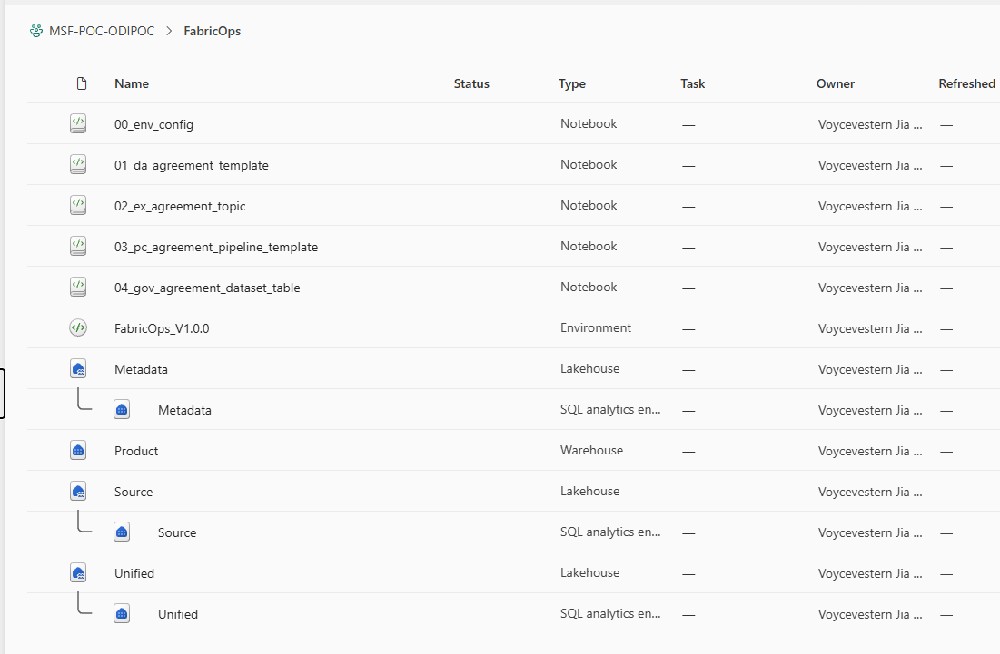
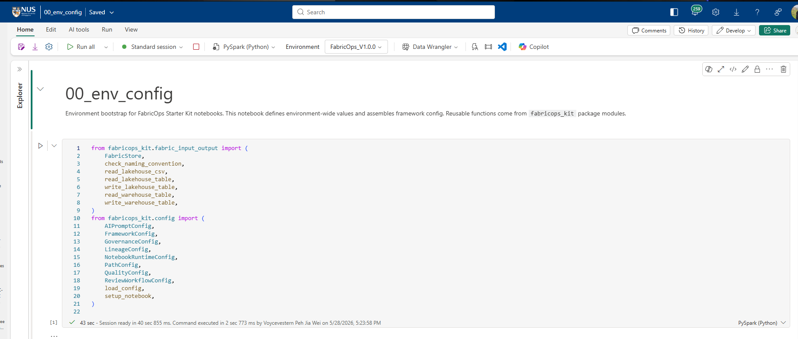
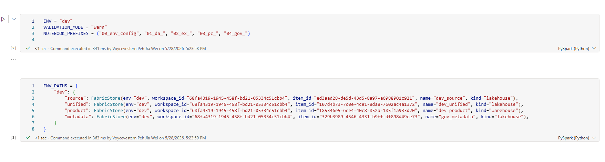
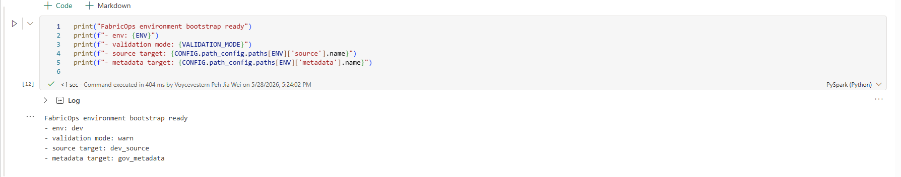

# `00_env_config` runbook

## 1. Purpose

`00_env_config` is the **workspace/environment bootstrap notebook** for FabricOps Starter Kit. It is the first plug-and-play validation checkpoint.

Use this notebook only to validate workspace/environment wiring:
- Fabric environment + wheel availability,
- environment-level settings,
- Fabric item mappings,
- shared `CONFIG` creation and startup checks.

> <a href="https://github.com/Voycepeh/FabricOps-Starter-Kit/blob/main/templates/notebooks/00_env_config.ipynb">Open template notebook</a>

## 2. When to run this notebook

Run `00_env_config`:
- during first-time workspace setup,
- after changing the attached Fabric environment or uploaded wheel,
- before running any `01_da_`, `02_ex_`, `03_pc_`, or `04_gov_` notebook,
- when troubleshooting bootstrap/config issues.

## 3. Expected Fabric workspace setup

Before execution, confirm your workspace has:
- the `00_env_config` notebook,
- a Fabric environment (tested with `FabricOps_V1.0.0`),
- mapped Fabric items for the target environment (example: `dev_source`, `dev_unified`, `dev_product`, `gov_metadata`).

*Caption: Example workspace layout expected before running `00_env_config`.*

## 4. Step 1 — Attach the FabricOps environment

1. Open `00_env_config` in Microsoft Fabric.
2. Attach `FabricOps_V1.0.0`.
3. Restart the notebook session if Fabric prompts for it.

Expected result: notebook kernel runs with the environment that includes the uploaded FabricOps wheel.

*Caption: Environment attachment and setup context in the notebook.*

## 5. Step 2 — Confirm package imports

Run the imports cell for `fabricops_kit` modules.

Expected result: imports succeed from the uploaded wheel (no `ModuleNotFoundError`).

## 6. Step 3 — Set environment values

Set the environment-level values:
- `ENV = "dev"`
- `VALIDATION_MODE = "warn"`
- `NOTEBOOK_PREFIXES = ("00_env_config", "01_da_", "02_ex_", "03_pc_", "04_gov_")`

Expected result: runtime values reflect your workspace policy and notebook naming pattern.

## 7. Step 4 — Map Fabric items

Set `ENV_PATHS` to map runtime targets. Tested mapping:
- `source` target = `dev_source` lakehouse
- `unified` target = `dev_unified` lakehouse
- `product` target = `dev_product` warehouse
- `metadata` target = `gov_metadata` lakehouse

Expected result: all required targets are mapped once and by role.

*Caption: Example `ENV_PATHS` mapping used in the validated run.*

## 8. Step 5 — Load framework config

Create `CONFIG` through `FrameworkConfig`, then run `setup_notebook`.

Expected result: shared configuration initializes and startup validation succeeds.

## 9. Step 6 — Validate notebook naming

Run notebook naming validation (for example, `check_naming_convention`) for notebook name `00_env_config`.

Expected result: check returns **comply** with configured prefixes.

## 10. Step 7 — Confirm successful bootstrap

Confirm the final output includes:
- `FabricOps environment bootstrap ready`
- `env: dev`
- `validation mode: warn`
- `source target: dev_source`
- `metadata target: gov_metadata`

*Caption: Successful bootstrap output for the tested `dev` run.*

## 11. Pass criteria

Treat the run as pass only when all checks complete:
- `FabricOps_V1.0.0` is attached,
- `fabricops_kit` imports succeed from the uploaded wheel,
- `ENV = "dev"` and `VALIDATION_MODE = "warn"` are set,
- `NOTEBOOK_PREFIXES = ("00_env_config", "01_da_", "02_ex_", "03_pc_", "04_gov_")` is applied,
- target mapping includes `source target = dev_source` and `metadata target = gov_metadata`,
- naming convention check returns comply,
- final output prints `FabricOps environment bootstrap ready`.

## 12. What not to put in this notebook

`00_env_config` should contain **only workspace/environment-level settings**.

Do not put domain execution logic here:
- agreement-specific metadata belongs in `01_da_` notebooks,
- dataset exploration belongs in `02_ex_` notebooks,
- executable pipeline contract logic belongs in `03_pc_` notebooks,
- governance mapping/consolidation belongs in `04_gov_` notebooks.

## 13. Next notebook: `01_da_agreement_template`

After this bootstrap passes, continue to `01_da_agreement_template`.
