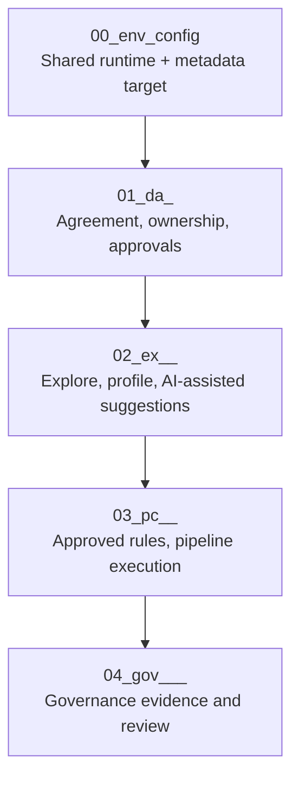

# Quick Start

Use this page to get the FabricOps notebook templates running quickly in Microsoft Fabric.

For conceptual context, start on the [Homepage](index.md). For notebook definitions, use [Notebook Structure](notebook-structure.md).

## What you will build

You will run the FabricOps notebook template sequence:

`00_env_config` → `01_da_<agreement>` → `02_ex_<agreement>_<topic>` → `03_pc_<agreement>_<pipeline>` → `04_gov_<agreement>_<dataset>_<table>`

By the end, you should have:

- reusable environment configuration,
- agreement and governance scope,
- profiled source metadata and reviewed suggestions,
- operational pipeline outputs,
- governance review artifacts.

## Pre-requisites

Before you begin, confirm:

- you have a Microsoft Fabric workspace with notebook and Lakehouse access,
- your Fabric environment can install and run the FabricOps wheel,
- your target workspace has the permissions needed for metadata and output writes,
- if using AI-assisted suggestions, tenant-level Copilot/Azure OpenAI settings are approved and enabled.

## Recommended workflow

## Step 1 — Install and configure FabricOps

- Install the package wheel in your Fabric environment.
- Confirm notebook runtime and dependency availability.
- Run a quick notebook smoke test in your target workspace.

Use:

- [Run in Fabric](setup/run-in-fabric.md)
- [Installation](setup/installation.md)

## Step 2 — Create `00_env_config`

Create or copy `00_env_config.ipynb` and set shared runtime values first.

Focus on:

- workspace/lakehouse references,
- metadata target routing,
- reusable config used by downstream notebooks.

Reference:

- [Notebook Structure: `00_env_config`](notebook-structure/00-env-config.md)
- [Template notebook](../templates/notebooks/00_env_config.ipynb)

## Step 3 — Define agreement context with `01_da_<agreement>`

Create `01_da_<agreement>.ipynb` to capture governance scope before technical execution.

Focus on:

- business purpose and approved usage,
- data ownership and accountability,
- reviewer/approver context and boundaries.

Reference:

- [Notebook Structure: `01_da`](notebook-structure/01-data-sharing-agreement.md)

## Step 4 — Explore and profile with `02_ex_<agreement>_<topic>`

Create `02_ex_<agreement>_<topic>.ipynb` for exploratory and profiling work.

Focus on:

- source profiling and metadata capture,
- AI-assisted rule/classification suggestions (optional),
- preparation for human review and approvals.

Reference:

- [Notebook Structure: `02_ex`](notebook-structure/02-exploration.md)
- [Template notebook](../templates/notebooks/02_ex_agreement_topic.ipynb)

## Step 5 — Operationalize with `03_pc_<agreement>_<pipeline>`

Create `03_pc_<agreement>_<pipeline>.ipynb` for approved, repeatable pipeline execution.

Focus on:

- enforcing approved rules,
- running pipeline-ready transformations and checks,
- producing curated outputs and operational artifacts.

Reference:

- [Notebook Structure: `03_pc`](notebook-structure/03-pipeline-contract.md)
- [Template notebook](../templates/notebooks/03_pc_agreement_pipeline_template.ipynb)

## Step 6 — Governance review with `04_gov_<agreement>_<dataset>_<table>`

Create `04_gov_<agreement>_<dataset>_<table>.ipynb` for governance review workflows.

Focus on:

- classification and policy review outputs,
- governance evidence and decision traceability,
- review-ready governance evidence for template-driven notebook execution.

Reference:

- [Notebook Structure: `04_gov`](notebook-structure/04-governance-enrichment.md)

## First-run outcome checklist

After one full cycle, confirm you have:

- `00_env_config` executed successfully,
- agreement scope documented in `01_da`,
- profile + metadata outputs from `02_ex`,
- operational outputs from `03_pc`,
- governance review artifacts in `04_gov`.

## Next links

- [Notebook Structure](notebook-structure.md)
- [Functions / Reference](reference/index.md)
