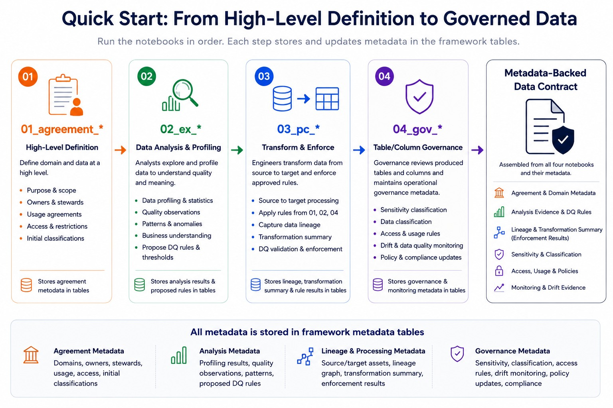

# Quick Start

Use this page to get from zero to a first FabricOps Starter Kit run in Microsoft Fabric.

## Get running quickly

Start by setting up one Fabric Environment and one shared `00_env_config` runtime path before running the execution notebooks. The first four steps get the helper wheel, copied templates, notebook runtime, and metadata routing ready.

### First run setup

| Step | Do this | Expected result | Read more |
| --- | --- | --- | --- |
| 1 | Install the FabricOps wheel in a Microsoft Fabric Environment. | Fabric notebooks attached to that Environment can import `fabricops_kit`. | [Fabric Wheel Install](install.md) |
| 2 | Copy the notebook templates from the GitHub templates folder into Fabric. | You have editable copies of `00_env_config`, agreement, exploration, pipeline contract, and governance templates in your Fabric workspace. | [Notebook templates](https://github.com/Voycepeh/FabricOps-Starter-Kit/tree/main/templates/notebooks), [Notebook Structure](notebook-structure.md) |
| 3 | Attach the same Fabric Environment to each copied notebook. | Every notebook uses the same installed helper wheel and compatible runtime configuration. | [Fabric Wheel Install](install.md) |
| 4 | Configure and run `00_env_config`. | Shared paths, environment settings, and metadata lakehouse routing are available to downstream notebooks. | [Template: `00_env_config`](notebook-structure/00-env-config.md) |

## Notebook flow at a glance

The notebook flow starts after `00_env_config` is ready. Each notebook adds or updates evidence in the framework metadata tables. The data contract is assembled from this approved metadata evidence rather than maintained as a separate notebook.



## Notebook flow

Use this table as the main navigation surface for the runnable notebooks. The Purpose column describes what each notebook owns; the Expected result column describes what it produces for downstream contract evidence.

| Step | Notebook | Purpose | Expected result | Notebook docs |
| --- | --- | --- | --- | --- |
| 4 | `00_env_config` | Owns environment bootstrap, Fabric paths, metadata lakehouse routing, and shared runtime configuration. | Runtime configuration that every downstream notebook reuses. | [Environment configuration notebook](notebook-structure/00-env-config.md) |
| 5.1 | `01_data_sharing_agreement_<agreement>` | Owns agreement scope, source context, purpose, owners, stewards, usage intent, access boundaries, and agreement boundary. | Agreement metadata and notebook registration evidence are written to metadata so downstream notebooks have business context. | [Data sharing agreement notebook](notebook-structure/01-data-sharing-agreement.md) |
| 5.2 | `02_ex_<agreement>_<topic>` | Owns source exploration, profiling, analyst observations, schema evidence, and quality rule suggestions. | Analysis/profiling evidence, reviewed candidate rules, and exploration findings are written to metadata. | [Exploration notebook](notebook-structure/02-exploration.md) |
| 5.3 | `03_pc_<agreement>_<pipeline>` | Owns source-to-target processing, approved rule enforcement, controlled outputs, lineage capture, and run evidence. | Curated outputs, validation results, lineage, transformation summaries, and enforcement evidence are written to metadata. | [Pipeline contract notebook](notebook-structure/03-pipeline-contract.md) |
| 5.4 | `04_gov_<agreement>_<topic>` optional | Owns governance review, sensitivity classification, stewardship notes, access rules, policy updates, and approvals when these are separated from the pipeline notebook. | Governance and classification evidence is available for audit, handover, and contract assembly. | [Governance notebook](notebook-structure/04-governance-operations.md) |

Recommended notebook order:

```text
00_env_config
01_data_sharing_agreement_<agreement>
02_ex_<agreement>_<topic>
03_pc_<agreement>_<pipeline>
04_gov_<agreement>_<topic> optional, if governance evidence is separated
```

Use `02_ex` notebooks for profiling, exploration, and rule suggestions. Use `03_pc` notebooks for approved enforcement and controlled outputs.

## Review the contract evidence

The notebooks write reusable evidence into framework metadata tables routed by `00_env_config`. Review that evidence after the notebook flow runs to confirm the agreement context, analysis findings, approved controls, runtime results, and governance decisions are ready for contract assembly.

| Evidence type | What to review |
| --- | --- |
| Agreement metadata | Agreement identity, scope, owners, stewards, usage intent, access boundaries, and initial classifications. |
| Analysis evidence | Schema observations, profiling statistics, quality observations, patterns, anomalies, and business understanding. |
| Data quality evidence | Proposed and approved rules, thresholds, validation outcomes, and enforcement results. |
| Lineage and processing evidence | Source and target assets, transformation summaries, run context, lineage, and processing evidence. |
| Governance evidence | Sensitivity, classification, access rules, stewardship notes, approvals, and policy updates. |
| Monitoring evidence | Drift signals, data quality monitoring context, operational observations, and follow-up evidence for review. |

The data contract is metadata backed because it is assembled from approved evidence produced by the notebook flow, not manually maintained as a separate fifth notebook.

## Optional: go deeper

- [Fabric Wheel Install](install.md): install or verify the reusable helper wheel.
- [Notebook Structure](notebook-structure.md): template boundaries, naming conventions, and per-notebook pages.
- [Metadata and Contracts](metadata-and-contracts/index.md): contract model and metadata ownership details.
- [Workflow](lifecycle-operating-model.md): role checkpoints, AI assistance, approvals, and deterministic enforcement.
- [Function Reference](reference/index.md): callable-level guidance.
