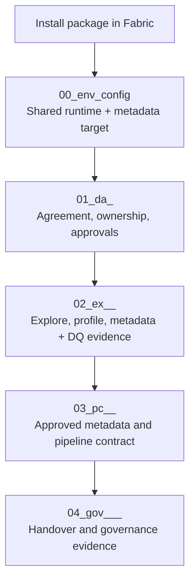

# Quick Start

Use this page to run FabricOps Starter Kit in Microsoft Fabric with a clear, governed path from setup through handover.

For the visual front door, start on the [Homepage](index.md).

## Path at a glance

`install → configure environment → define agreement → explore/profile → approve metadata and DQ → create pipeline contract → handover`

## Workflow sequence

## Step 1 — Install in Fabric

Install the wheel in your Fabric environment and confirm runtime dependencies.

- [Run in Fabric](setup/run-in-fabric.md)
- [Create Wheel](setup/create-wheel.md)
- [Installation](setup/installation.md)

## Step 2 — Configure environment (`00_env_config`)

Set shared runtime configuration, metadata target routing, and reusable paths before downstream notebooks.

- [Notebook Structure: `00_env_config`](notebook-structure/00-env-config.md)
- [Workflow lifecycle](workflow.md)

## Step 3 — Define agreement (`01_da_<agreement>`)

Capture business scope, ownership, usage boundaries, and approvals before technical implementation.

- [Notebook Structure: `01_da`](notebook-structure/01-data-sharing-agreement.md)
- [Workflow lifecycle](workflow.md)

## Step 4 — Explore and profile (`02_ex_<agreement>_<topic>`)

Profile source data, draft metadata context, and prepare evidence for review and approval.

- [Notebook Structure: `02_ex`](notebook-structure/02-exploration.md)
- [Metadata and contracts](api/modules/data_contract.md)
- [Quality helpers](api/modules/quality.md)

## Step 5 — Approve metadata and create pipeline contract (`03_pc_<agreement>_<pipeline>`)

Promote approved metadata and data quality decisions into repeatable, operational pipeline logic.

- [Notebook Structure: `03_pc`](notebook-structure/03-pipeline-contract.md)
- [Metadata and contracts](api/modules/data_contract.md)
- [Function Reference](reference/index.md)

## Step 6 — Handover and governance evidence (`04_gov_<agreement>_<dataset>_<table>`)

Produce governance outputs and handover-ready evidence for operational ownership.

- [Notebook Structure: `04_gov`](notebook-structure/04-governance-enrichment.md)
- [Workflow lifecycle](workflow.md)
- [Function Reference](reference/index.md)

## Repository starter examples

Notebook starter examples still exist in the repository under `templates/notebooks/` for local reference, but Quick Start navigation intentionally points to documentation pages under the published site.

## Go next

- [Workflow lifecycle operating model](workflow.md)
- [Notebook Structure](notebook-structure.md)
- [Run in Fabric](setup/run-in-fabric.md)
- [Create Wheel](setup/create-wheel.md)
- [Function Reference](reference/index.md)
- [Metadata and contracts](api/modules/data_contract.md)
