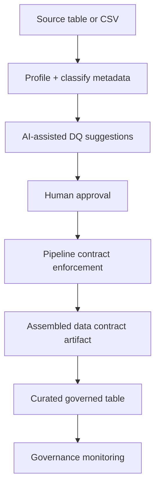
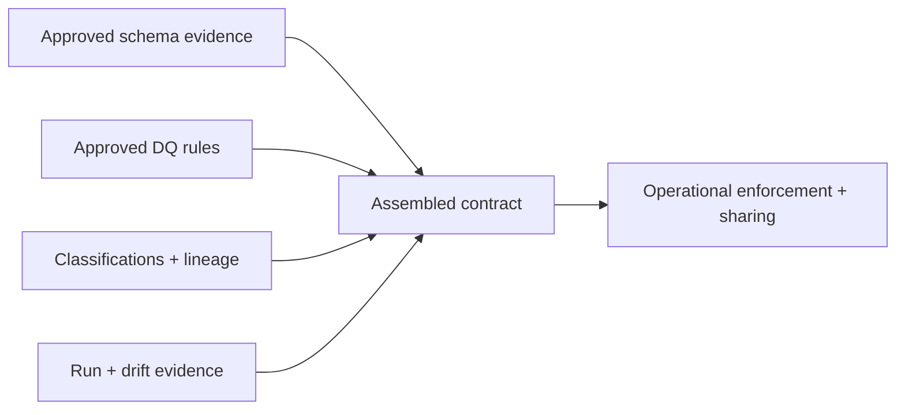
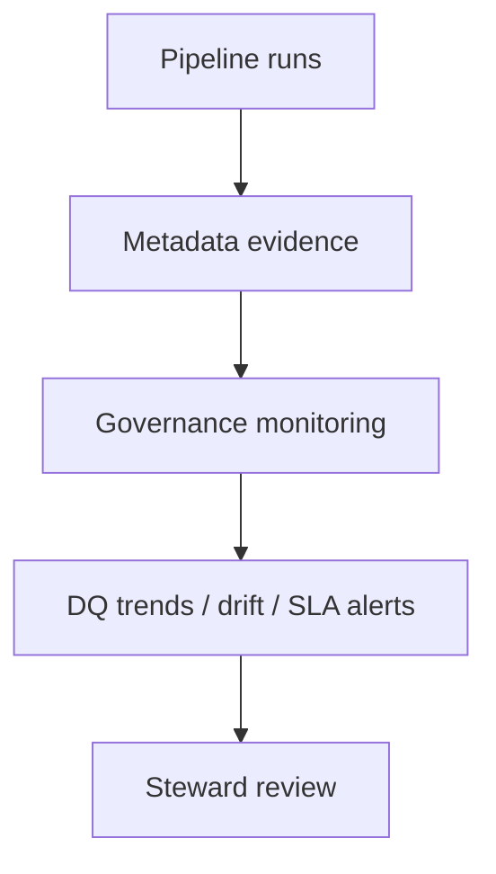

# Quick Start

Build your first governed Fabric data product in 10 minutes.

FabricOps Starter Kit gives you a lightweight, Fabric-first, notebook-native workflow for turning raw data into governed curated outputs. It is metadata-driven, AI-assisted, and operational by design: AI helps profile and suggest, while people approve and enforce.

For orientation, see the [Homepage](index.md).

## What you will build



Framework lifecycle identity:

```text
Discover → Approve → Operationalize → Govern
02_ex_*  → 03_pc_*  → 04_gov_*
```

## What you will see at the end

- **Profiling output:** row counts, completeness, distributions, type drift signals.
- **Sensitivity classification:** column-level tags for potentially sensitive fields.
- **AI-generated DQ suggestions:** draft checks for nulls, ranges, freshness, mappings.
- **Approved metadata evidence:** steward-approved rules and classifications.
- **Run summary:** pass/fail counts, exceptions, and execution metadata.
- **Contract artifact:** assembled contract view from approved evidence.
- **Governance monitoring outputs:** DQ trends, SLA/drift indicators, and review queues.

## Step 1 — Install FabricOps in Fabric

Keep setup minimal, then move quickly into notebooks:

- [Create Wheel](setup/create-wheel.md)
- [Run in Fabric](setup/run-in-fabric.md)

## Step 2 — Create your environment notebook (`00_env_config`)

`00_env_config` defines reusable, environment-scoped configuration for lakehouses, warehouses, and metadata paths used by downstream notebooks.

Use it to centralize:

- environment names and runtime settings
- reusable Lakehouse/Warehouse references
- reusable schemas and paths (including metadata target routing)

Example pattern:

```python
from fabricops_kit import load_config

CONFIG = load_config(env_name="dev")
ENV_NAME = "dev"

SOURCE_LAKEHOUSE = CONFIG.path_config.paths[ENV_NAME]["source"]
CURATED_LAKEHOUSE = CONFIG.path_config.paths[ENV_NAME]["curated"]
METADATA_LAKEHOUSE = CONFIG.path_config.paths[ENV_NAME]["metadata"]
```

## Step 3 — Define your agreement scope (`01_data_sharing_agreement_*`)

Create a business-and-operations alignment notebook before pipeline implementation.

Capture:

- steward and owner approvals
- scope of use
- retention expectations
- allowed operational usage boundaries

This step aligns people and responsibilities; it is not legal paperwork.

## Step 4 — Explore and profile your dataset (`02_ex_*`)

This is the first meaningful operational step. Use exploration notebooks to discover the dataset and generate evidence.

In this layer you typically:

- profile shape, quality, and column behavior
- discover schema and exploratory validation needs
- detect potential sensitivity/classification candidates
- produce initial metadata evidence for review

Example snippets/output style:

```python
profile_df = run_basic_profile(source_df)
classification_df = classify_sensitive_columns(profile_df)
metadata_evidence_df = build_metadata_evidence(profile_df, classification_df)
```

```text
profile_summary: rows=148230, columns=27, null_rate(email)=0.8%
classification: employee_id=InternalIdentifier, email=ContactSensitive
metadata_evidence: schema_version=2026-05-27T09:00Z, status=proposed
```

This layer is exploratory, iterative, and analyst-driven.

## Step 5 — Generate AI-assisted DQ suggestions

AI is used here to accelerate governance workflows. Humans remain responsible for approval and enforcement.

Typical AI-assisted suggestions include:

- non-negative values
- freshness expectations
- code mapping validity
- allowed numeric ranges
- null-rate thresholds
- referential consistency checks

Flow:

```text
AI drafts rules → steward/owner reviews → approved rules become enforceable metadata
```

## Step 6 — Approve and store metadata evidence

Promote reviewed evidence into persisted metadata tables in Fabric.

Evidence commonly includes:

- approved DQ rules
- sensitivity classifications
- schema evidence
- steward approvals
- lineage evidence
- operational metadata from runs

This metadata evidence is the enforceable input to operational workflows.

## Step 7 — Operationalize with pipeline contract notebooks (`03_pc_*`)

`03_pc_*` notebooks are executable pipeline contracts and operational handover artifacts.

They translate approved evidence into deployment-ready pipeline logic for:

- ingestion
- transformations
- validations
- drift enforcement
- curated writes
- run summaries

Separation is intentional:

```text
02_ex_* = discover and propose
03_pc_* = enforce and operationalize
```

## Step 8 — Generate assembled data contracts

Data contracts are assembled from approved metadata evidence, not maintained as one giant manual YAML file.

Contract assembly typically combines:

- schema evidence
- approved DQ rules
- lineage
- sensitivity classifications
- refresh expectations
- governance approvals
- operational run evidence
- drift expectations



## Step 9 — Govern continuously (`04_gov_*`)

`04_gov_*` notebooks run continuous operational governance, not static documentation.

Typical monitoring outcomes:

- DQ trend monitoring
- SLA monitoring
- drift detection
- stewardship review queues
- failed validation tracking
- unlabeled sensitive data monitoring
- audit/governance reporting views



## Recommended notebook structure

- `00_env_config` — shared environment config and metadata routing.
- `01_data_sharing_agreement_hr` — ownership, approvals, and usage boundaries.
- `02_ex_hr_employee_profiling` — exploratory profiling and proposed evidence.
- `03_pc_hr_employee_curated` — executable contract enforcement pipeline.
- `04_gov_hr_employee_monitoring` — continuous governance monitoring outputs.

## Core concepts

- **Agreements:** define ownership, stewardship, and scope before implementation.
- **Metadata evidence:** approved facts (schema, DQ, lineage, classification, run metadata).
- **Contracts:** assembled operationally from approved metadata evidence.
- **Drift:** divergence from approved schema/quality/expectations over time.
- **Governance:** continuous monitoring and action, not one-time documentation.
- **Lineage:** traceability from source to curated outputs and governance signals.
- **AI-assisted workflow:** AI profiles/suggests/drafts/classifies; humans approve/enforce/govern.

## Next steps

- [Metadata and contracts](api/modules/data_contract.md)
- [Workflow lifecycle operating model](lifecycle-operating-model.md)
- [Deployment workflow in Fabric](setup/run-in-fabric.md)
- [AI-assisted governance helpers](api/modules/data_quality.md)
- [Function Reference](reference/index.md)
- [Notebook structure and examples](notebook-structure.md)
