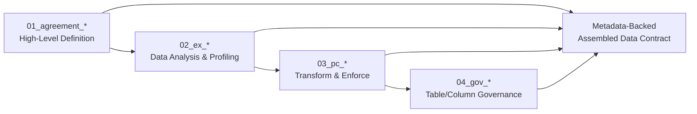
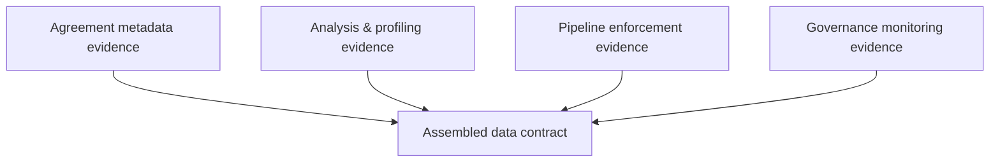

# Quick Start: From High-Level Definition to Governed Data

FabricOps Starter Kit uses a Fabric-first notebook workflow where each notebook updates framework metadata tables. The metadata-backed data contract is assembled from approved metadata evidence across the workflow—it is not hand-written first.

## Four-notebook flow (core model)

- **`01_agreement_*` = High-Level Definition**
- **`02_ex_*` = Data Analysis & Profiling**
- **`03_pc_*` = Transform & Enforce**
- **`04_gov_*` = Table/Column Governance**
- **Assembled data contract** = built from all four layers using approved metadata evidence

## What each notebook contributes

### `01_agreement_*` contributes

- agreement/domain metadata
- purpose and scope
- owners and stewards
- usage agreements
- access restrictions
- initial classifications

### `02_ex_*` contributes

- schema and column evidence
- profiling statistics
- quality observations
- patterns and anomalies
- proposed DQ rules
- AI-assisted insights

### `03_pc_*` contributes

- source-to-target processing
- transformation summary
- lineage
- DQ validation and enforcement results
- curated output expectations
- SLA / refresh expectations

### `04_gov_*` contributes

- sensitivity/classification updates
- access and usage policy maintenance
- drift and data quality monitoring
- governance review evidence
- compliance updates

> `03_pc_*` enforces operational rules and expectations. `04_gov_*` monitors outcomes and maintains governance continuously.

## Contract assembly from approved metadata evidence

## What the assembled data contract contains

- domain and ownership
- data assets
- schema and columns
- DQ rules and expectations
- lineage and sources
- stewards and responsibilities
- classifications and sensitivity
- access and usage
- policies and agreements
- SLA / refresh expectations
- monitoring and drift evidence

## Setup and navigation

- [Create Wheel](setup/create-wheel.md)
- [Run in Fabric](setup/run-in-fabric.md)
- [Notebook Structure](notebook-structure.md)
- [Metadata and Contracts](api/modules/data_contract.md)
- [Function Reference](reference/index.md)
