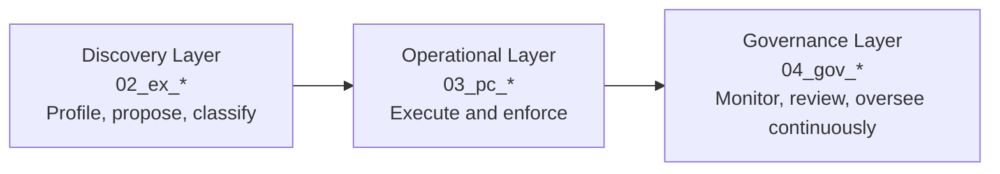
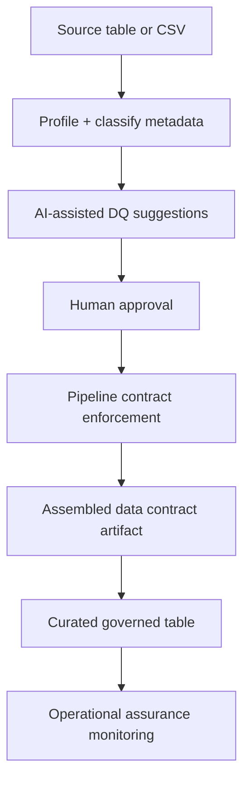
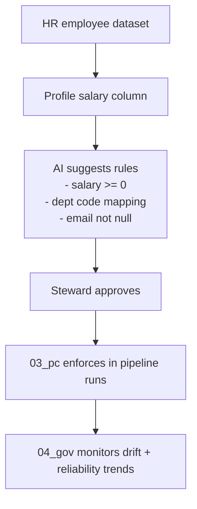
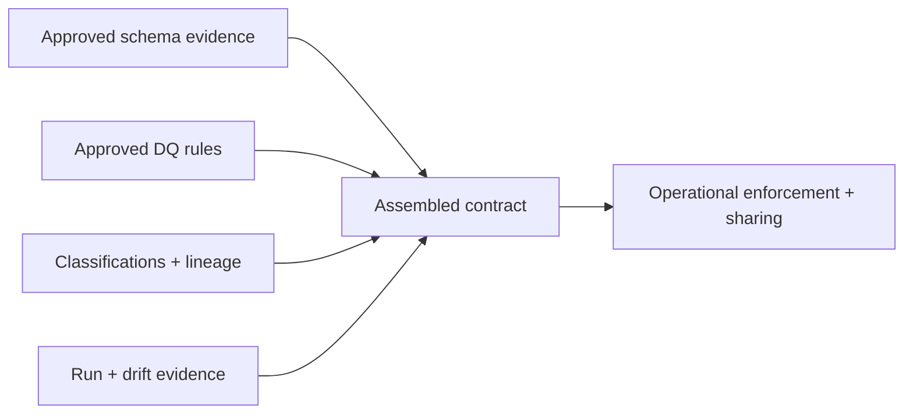
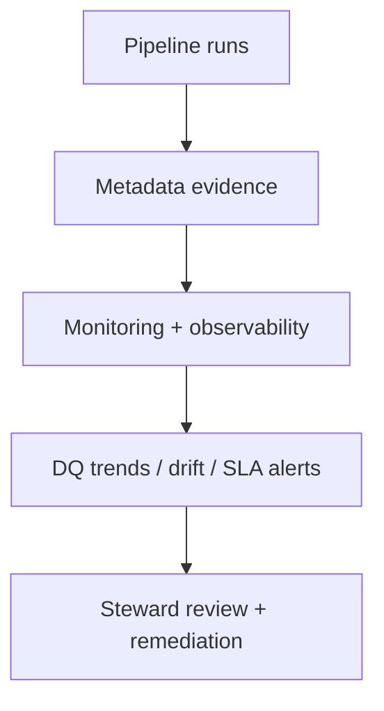

# Quick Start

Build a governed Fabric data product in 10 minutes.

FabricOps Starter Kit is a lightweight, Fabric-first, notebook-native onboarding path that turns source data into reliable curated outputs using metadata evidence and operational controls.

```mermaid
flowchart TD
    A[Source data] --> B[Explore (02_ex)]
    B --> C[Operationalize (03_pc)]
    C --> D[Govern (04_gov)]
```

**Core principles**

- Fabric-first execution with notebooks, Lakehouse, and Warehouse.
- AI accelerates metadata generation and governance workflows. Humans remain responsible for approval and enforcement.
- Contracts are assembled from approved metadata evidence, then enforced and monitored continuously.

For orientation, see the [Homepage](index.md).

## Notebook layers (primary mental model)



## What you will build (detailed view)



Framework lifecycle identity:

```text
Discover → Approve → Operationalize → Govern
02_ex_*  → 03_pc_*  → 04_gov_*
```

## Running example story (HR employees)



## What you will see at the end

- **Profiling output:** row counts, completeness, distributions, type drift signals.
- **Sensitivity classification:** column-level tags for potentially sensitive fields.
- **AI-generated DQ suggestions:** draft checks for ranges, null thresholds, freshness, mappings.
- **Approved metadata evidence:** steward-approved rules and classifications.
- **Run summary:** pass/fail counts, exceptions, and execution metadata.
- **Contract artifact:** assembled contract view from approved evidence.
- **Monitoring outputs:** DQ trends, SLA/drift indicators, and steward review queues.

## Step 1 — Install FabricOps in Fabric

- [Create Wheel](setup/create-wheel.md)
- [Run in Fabric](setup/run-in-fabric.md)

## Step 2 — Create your environment notebook (`00_env_config`)

Use `00_env_config` for environment-scoped configuration reused by all notebooks.

- reusable Lakehouse/Warehouse references
- reusable schemas and paths
- metadata target routing

```python
from fabricops_kit import load_config

CONFIG = load_config(env_name="dev")
ENV_NAME = "dev"

SOURCE_LAKEHOUSE = CONFIG.path_config.paths[ENV_NAME]["source"]
CURATED_LAKEHOUSE = CONFIG.path_config.paths[ENV_NAME]["curated"]
METADATA_LAKEHOUSE = CONFIG.path_config.paths[ENV_NAME]["metadata"]
```

## Step 3 — Define your agreement scope (`01_data_sharing_agreement_*`)

Align business and operations before build:

- steward + owner approvals
- scope of use
- retention expectations
- allowed operational usage boundaries

## Step 4 — Explore and profile your dataset (`02_ex_*`)

First meaningful operational step (exploratory, iterative, analyst-driven).

You typically:

- profile shape and quality
- discover schema + validation needs
- detect sensitivity candidates
- generate proposed metadata evidence

```python
profile_df = run_basic_profile(source_df)
classification_df = classify_sensitive_columns(profile_df)
metadata_evidence_df = build_metadata_evidence(profile_df, classification_df)
```

```text
profile_summary: rows=148230, columns=27, null_rate(email)=0.8%
classification: employee_id=InternalIdentifier, email=ContactSensitive
metadata_evidence: schema_version=2026-05-27T09:00Z, status=proposed
```

## Step 5 — Generate AI-assisted DQ suggestions

**AI accelerates metadata generation and governance workflows. Humans remain responsible for approval and enforcement.**

Common suggestion types:

- non-negative values
- freshness expectations
- code mapping validity
- allowed numeric ranges
- null-rate thresholds
- referential consistency checks

```text
AI drafts rules → steward/owner reviews → approved rules become enforceable metadata
```

## Step 6 — Approve and store metadata evidence

Approved evidence is persisted to metadata tables in Fabric:

- approved DQ rules
- sensitivity classifications
- schema evidence
- steward approvals
- lineage evidence
- run operational metadata

## Step 7 — Operationalize with pipeline contract notebooks (`03_pc_*`)

`03_pc_*` notebooks are executable pipeline contracts and operational handover artifacts.

They execute and enforce:

- ingestion and transformations
- validation checks and drift enforcement
- curated writes and run summaries

**Layer boundary (important):**

- `03_pc_*` = execute and enforce
- `04_gov_*` = monitor, review, and oversee continuously

## Step 8 — Generate assembled data contracts

### Why this is different

| Traditional approach | FabricOps approach |
|---|---|
| ❌ Static, manually maintained contract files | ✅ Contracts assembled from approved metadata evidence |

Contracts are assembled from:

- schema evidence
- approved DQ rules
- lineage and classifications
- refresh + drift expectations
- approvals + run evidence



## Step 9 — Govern continuously (`04_gov_*`)

`04_gov_*` notebooks provide operational assurance and observability over time.

Typical outputs:

- DQ trend monitoring
- SLA monitoring
- drift detection
- failed validation tracking
- unlabeled sensitive data monitoring
- stewardship review queues
- audit and trust operations reporting



## Recommended notebook structure

- `00_env_config` — shared environment config + metadata routing.
- `01_data_sharing_agreement_hr` — ownership, approvals, and usage boundaries.
- `02_ex_hr_employee_profiling` — discovery profiling + proposed evidence.
- `03_pc_hr_employee_curated` — execute and enforce operational contract.
- `04_gov_hr_employee_monitoring` — monitor reliability, drift, and stewardship.

## Core concepts (quick reference)

- **Agreement:** who owns, approves, and can use data.
- **Metadata evidence:** approved facts used by operations.
- **Assembled contract:** enforced view built from approved evidence.
- **Drift:** deviation from expected schema/quality/freshness.
- **Lineage:** trace from source to curated outputs and monitors.
- **AI-assisted workflow:** AI suggests and drafts; humans approve and enforce.

## Next steps

- [Metadata and contracts](api/modules/data_contract.md)
- [Workflow lifecycle operating model](lifecycle-operating-model.md)
- [Deployment workflow in Fabric](setup/run-in-fabric.md)
- [AI-assisted governance helpers](api/modules/data_quality.md)
- [Function Reference](reference/index.md)
- [Notebook structure and examples](notebook-structure.md)
