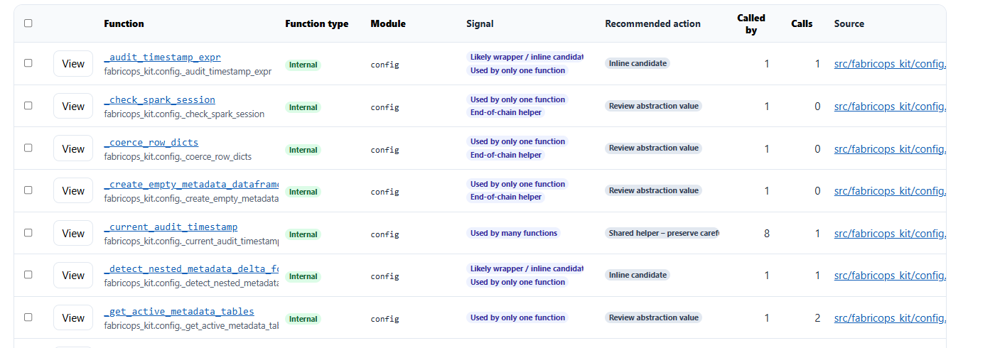
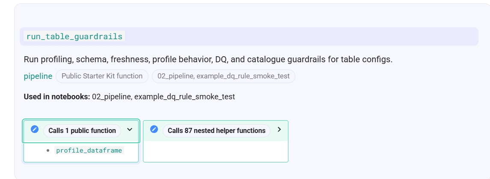
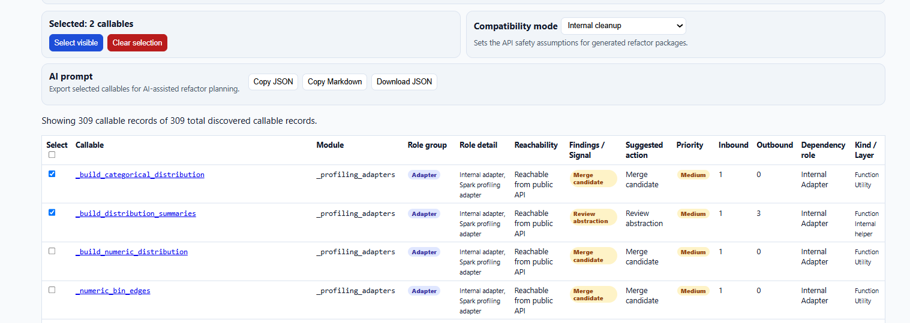
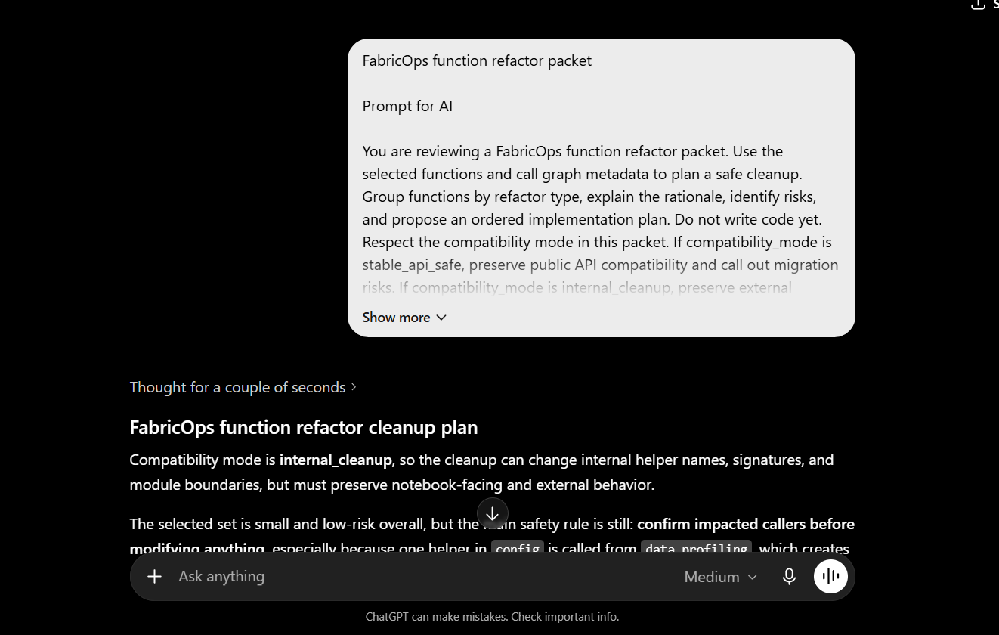

# Callable Flow Dashboard

AI coding tools make it easy to add callables quickly. That speed is useful, but it can also create too many entry points, thin wrapper callables, nested helpers, and uncontrolled dependencies. The Callable Flow Dashboard exists to make those relationships visible before the codebase becomes hard to maintain.

<div align="center" markdown="1">

[Architecture](../assets/callable-functions-dashboard.html){ .md-button .md-button--primary }
[Inventory](../assets/callable-functions-inventory.html){ .md-button }

</div>


## Why callable flow matters

FabricOps keeps notebook-facing APIs small and explainable. A callable should have a clear role in the role-aware callable model:

```text
Public API entrypoints → Internal workflows/adapters/validators/resolvers/services → Utilities/models/lifecycle helpers
```

Callable review is role-aware. Internal-to-internal calls are valid when the roles and direction are clear. Callable review is no longer based on a blanket "internal calls internal is bad" rule. The current classifier distinguishes public API entrypoints, internal workflows, adapters, validators, resolvers, normalizers, services, utilities, model classes, lifecycle methods, property accessors, reachability kinds, dependency roles, and allowed internal role calls.

The intent is:

- Public API entrypoints should remain stable notebook-facing surfaces.
- Internal workflows may orchestrate lower-level implementation roles.
- Validators, resolvers, normalizers, adapters, and services may support workflows when their direction is intentional.
- Utilities and model/lifecycle helpers should stay low-level and avoid depending upward on workflows.

This keeps public callables stable, lets purposeful internal implementation roles collaborate, and still flags dependency direction that makes the architecture harder to maintain.

## How the dashboard is generated

The dashboard is built from repository scans that inspect callable definitions and relationships. The scan produces compact dashboard contract data in [`_data/callable-flow.json`](_data/callable-flow.json), containing only fields used by the Architecture and Inventory dashboards for caller and callee relationships, roles, reachability, reuse, layer consistency, and refactor recommendations.

Because the dashboard is generated from the codebase, it is a maintenance aid rather than a separate source of truth. Use it to decide where to inspect source code, update docstrings, flatten helper chains, or preserve shared helpers carefully.

## What the dashboard detects

Use the dashboard signals to find patterns that deserve review:

- workflow-to-workflow coupling
- utilities depending on project workflows
- validators/resolvers/models depending upward on workflows
- unknown or classification-pending roles
- unreachable or orphan candidates
- thin wrapper or inline candidates
- single-use helpers that need abstraction review
- high fanout helpers that should be protected
- implicit lifecycle and property accessor methods that should not be treated as ordinary orphans

## Refactor signals

Refactor signals are warnings generated from the callable graph. They do not automatically mean the code is wrong. Instead, they help guard against architecture drift from the role-aware callable model and identify where cleanup should be reviewed before changes are made.

### EG. Pointless wrapper



*Guardrail: Warn when a helper appears to add little abstraction value. Single-use or thin wrapper callables may still be valid, but they should earn their place through clearer naming, validation, readability, or reuse.*

### EG. Large dependency surface


*Guardrail: Warn when a public callable depends on many nested helpers. This may be valid orchestration, but it increases the chance that a small helper change breaks a wider workflow.*

### EG. Messy callable dependency



*Guardrail: Warn when one public callable depends on another public callable. Public callables should usually be entry points. Shared logic should usually move into an internal workflow, service, adapter, validator, resolver, normalizer, or utility according to its role.*

### EG. Nested helper chain


*Guardrail: Repeated workflow-to-workflow chains or upward dependency patterns need review because they make orchestration harder to reason about. Allowed internal role calls can be valid when validators, resolvers, normalizers, adapters, services, utilities, models, lifecycle hooks, or property accessors support the intended lower-level direction.*

## Selecting refactor candidates



*Selecting a focused cleanup set.*

The dashboard supports selecting callables with refactor signals so users can build a focused cleanup set. This narrows review to specific architecture guardrails instead of asking AI tools to reason over the whole codebase at once.

## Exporting an AI refactor prompt



*Exporting a structured AI refactor packet.*

Selected callables can be exported as a structured AI refactor packet. The export keeps callable_role_detail, dependency_role, callable kind, counts, raw classifications, compatibility mode, safety constraints, batch accounting, completion accounting, and expected output available for advanced review so AI tools can reason from architecture context instead of guessing from isolated code snippets.

## Inventory terms

- Role group = broad job of the callable.
- Role detail = specific detected purpose.
- Reachability = whether it can be reached from public or notebook-facing API.
- Findings / Signal = review hints or actions, not automatic refactor commands.
- Priority = triage order, not a guarantee something must be changed.

??? example "Example exported AI refactor packet"

    ```text
    FabricOps callable refactor packet

    Prompt for AI

    Review the assigned layer against the usage evidence. Do not assume that a Utility layer is correct when inbound count is low. Do not assume that a highly reused Internal helper must remain internal. Do not treat all internal-to-internal calls as violations. Only flag role-aware upward dependencies, workflow-to-workflow coupling, or project-callable dependencies from utility/model layers. Protect public APIs, lifecycle hooks, property accessors, model classes, and high-fanout shared services unless tests and caller review justify changes. Respect compatibility mode, batch accounting, and completion accounting.

    Refactor context

    Compatibility mode: Internal cleanup

    Batch accounting

    Selected callables: 1
    Planned batch count: 1
    Completed/refactored count: fill in after implementation
    Remaining selected count: fill in after implementation

    Selected callables

    Callable 1: _audit_timestamp_expr

    Qualified name: fabricops_kit.config._audit_timestamp_expr
    Module: config
    Kind: function
    Layer: Internal helper
    Callable role: internal_adapter, shared_internal_service
    Architectural role: shared_internal_service
    Reachability kind: public_api_reachable
    Dependency role: shared_internal_service
    Change risk: Medium
    Refined recommended action: Review role-aware dependency direction
    Used by count: 1
    Calls count: 1
    Layer consistency: Role-aware review needed
    Layer consistency key: role_review
    Review status: Classified
    Review status key: classified
    Recommended action: Architecture violation
    Architecture signals: workflow_calls_workflow
    Review signals: allowed_internal_role_call
    Callers:
    - profile_dataframe (data_profiling)
    Callees:
    - _get_audit_timezone (config)
    Direct internal helpers:
    - _get_audit_timezone (config)
    ```

## Conclusion

The Callable Flow Dashboard is not only a dependency viewer. It is an architecture guardrail for keeping FabricOps maintainable as the kit grows. The main rule is role-aware: public API entrypoints should remain stable notebook-facing surfaces; internal workflows may orchestrate lower-level implementation roles; validators, resolvers, normalizers, adapters, and services may support workflows when their direction is intentional; and utilities plus model/lifecycle helpers should stay low-level and avoid depending upward on workflows. Repeated workflow-to-workflow chains, upward dependencies, or project-callable dependencies from utility/model layers should be reviewed, but allowed internal role calls can be valid.

The exported refactor packet gives AI tools enough context to reason safely from the call graph instead of guessing from isolated code snippets. This makes the workflow useful for planned refactors, code review, and future architecture governance.
