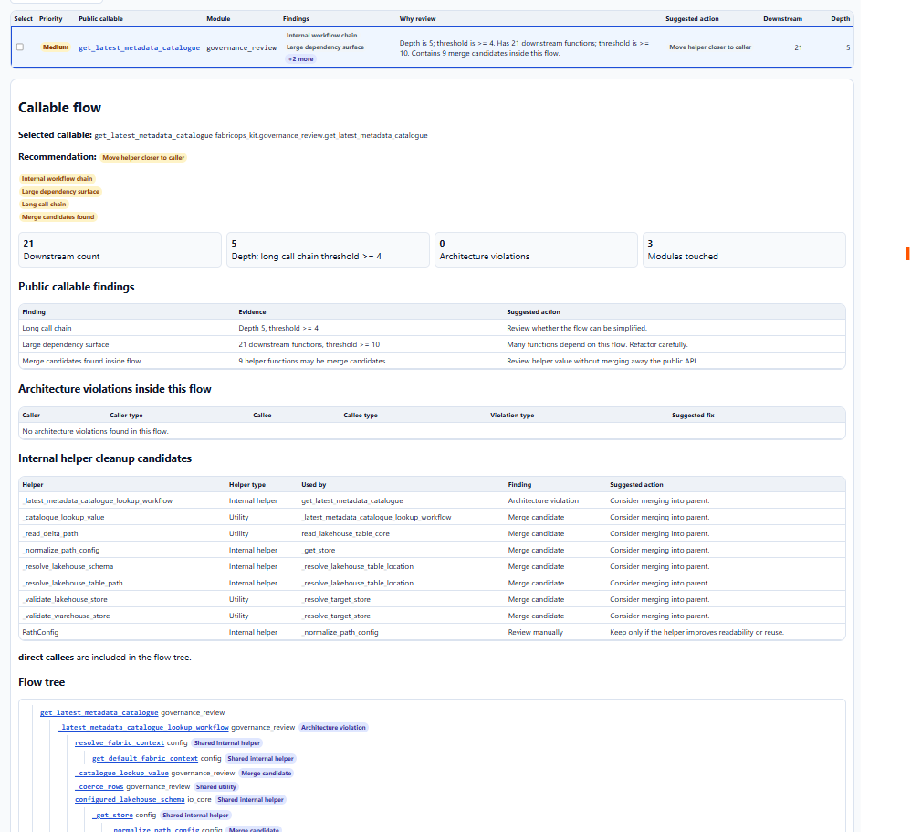

# Callable Flow

Callable Flow is the generated review surface for keeping FabricOps notebook-facing APIs small, explainable, and safe to maintain. Open the dashboard to review public callable architecture, inspect supporting implementation assets, and export focused cleanup packets when needed.

<div align="center" markdown="1">

[Open Dashboard](../assets/callable-functions-dashboard.html){ .md-button .md-button--primary }

{ loading=lazy }

</div>

## Overview

Use Callable Flow as a maintenance aid, not as a replacement for source code review. The generated pages summarize caller/callee relationships, source files, reachability, function layers, health signals, and cleanup recommendations from repository scans.

The main workflow is:

1. Start in **Callable Architecture** to review public callable flows.
2. Select one public callable flow and inspect its compact flow tree.
3. Export a flow cleanup packet when you want Codex or another AI tool to make a focused, safe change.
4. Move to **Code Inventory** when you need to inspect or batch-select lower-level support code assets.

## Callable Architecture

Callable Architecture is the public callable review page. It shows a **Public callable overview** with two top metrics: public callables scanned and public callables with architecture violations.

Use it to:

- search public callables by callable, module, finding, or recommendation;
- inspect one selected public callable flow at a time;
- review the selected callable name, qualified name, recommendation, health, key signals, and suggested next step;
- read the flow tree in compact order: function name, layer, source `.py` file, optional `end` chip, then a compact review or warning indicator;
- expand flow tree rows for details such as callers, callees, usage counts, source, architecture result, warning or violation reason, and merge-candidate context;
- export `fabricops_public_callable_flow_cleanup_packet` for the selected public callable flow.

Architecture selection is intentionally single-select. One selected public callable already carries its direct callees, transitive callees, flow tree, findings, risks, merge candidates, and suggested next step, so batching unrelated public flows would make the cleanup prompt less actionable.

## Code Inventory

Code Inventory is the support/codebase inspection page. It complements the Architecture page by showing individual implementation assets that may not be obvious from a public flow summary.

Use it to:

- inspect helpers, private functions, methods, classes, supporting objects, and orphaned or unreached assets;
- filter by inventory focus, item type, and health;
- identify whether an asset is reached from a public callable flow;
- multi-select one or more code assets for batch review;
- export `fabricops_support_inventory_cleanup_packet` for selected code assets.

Inventory selection remains multi-select because support cleanup often benefits from batching related lower-level assets, such as several private helpers or orphan candidates in the same area.

## Architecture rules

Callable Flow uses a function-layer model focused on public entry points and helper ownership:

```text
Public callable → shared helper → owner-local private helper
```

The important private-helper rule is file ownership:

- **Same-file private dependency = warning only.** A shared helper calling a private helper in the same `.py` file is acceptable, but it may still be reviewed for possible simplification or clearer placement.
- **Cross-file private dependency = architecture violation.** Directly calling a private helper from another `.py` file breaks ownership boundaries and should be resolved first.
- Public callables should remain stable notebook-facing surfaces.
- Shared helpers should remain reusable and should not casually reach into another module's private implementation details.
- Classes, dataclasses, enums, constants, protocols, config objects, lifecycle methods, and property accessors provide supporting context; they are not treated as public/internal function layers by themselves.

## AI cleanup packets

Both pages export action-ready Markdown and JSON packages for Codex or another AI implementation tool.

### Architecture export: `fabricops_public_callable_flow_cleanup_packet`

Use **Export flow cleanup packet** after reviewing a public callable flow. The package includes:

- selected public callable name, qualified name, source file, and source URL when available;
- recommendation, overall health, suggested next step, and key signals;
- downstream count, max depth, architecture violation count, merge candidate count, modules touched, and external/shared impact count;
- direct callees, transitive callees, architecture findings, merge candidates, public callable findings, and flow tree context;
- compatibility mode, requested work, safety constraints, and expected output.

The prompt tells the AI to preserve public callable behavior and external API compatibility, inspect the selected callable and its dependencies, resolve true cross-file private dependency violations first, treat same-file private dependencies as warnings only, and avoid casual public signature changes.

### Inventory export: `fabricops_support_inventory_cleanup_packet`

Use **Export support cleanup packet** after selecting one or more Code Inventory rows. The package includes:

- selected code asset name, qualified name, item type, code role, source file, and source URL when available;
- whether the asset is reached from public callable flows;
- health, finding, codebase note, suggested cleanup action, callers, callees, related public flows, and signals;
- compatibility mode, requested work, safety constraints, and expected output.

The prompt tells the AI to open the selected code asset, check callers and public-flow reachability, verify orphaned assets before removal, merge single-use helpers only when readability improves, preserve public callable behavior, and update tests where needed.

## When to use which page

| Need | Use |
| --- | --- |
| Review notebook-facing API health | Callable Architecture |
| Inspect one public callable's full call flow | Callable Architecture |
| Export one focused public-flow cleanup prompt | Callable Architecture |
| Find private helpers, methods, classes, or orphaned utilities | Code Inventory |
| Batch-select support assets for cleanup review | Code Inventory |
| Confirm whether a support asset is reached from public flows | Code Inventory |

## Generated outputs

Callable Flow is generated from repository scans. The generated outputs are:

- [Callable Architecture](../assets/callable-functions-dashboard.html)
- [Code Inventory](../assets/callable-functions-inventory.html)
- [`callable-flow.json`](_data/callable-flow.json)

Because these outputs are generated, update source inputs and the generator first, then regenerate the reference artifacts when intentionally refreshing this page.
