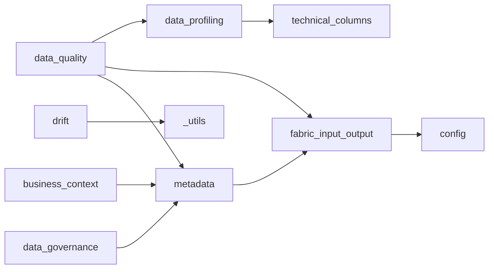

# Callable Map

This page is generated from FabricOps source code using static AST parsing.

## 1. Module dependency graph

## 2. Module relationship summary

| Module | Calls modules | Called by modules | Public callables |
|---|---|---|---:|
| `_utils` | — | — | 0 |
| `business_context` | `metadata` | — | 6 |
| `config` | — | `fabric_input_output` | 2 |
| `data_agreement` | — | — | 3 |
| `data_governance` | `metadata` | — | 6 |
| `data_lineage` | — | — | 2 |
| `data_profiling` | `technical_columns` | `data_quality` | 1 |
| `data_quality` | `data_profiling`, `fabric_input_output`, `metadata` | — | 9 |
| `docs_metadata` | — | — | 0 |
| `drift` | `_utils` | — | 4 |
| `fabric_input_output` | `config` | — | 8 |
| `handover` | — | — | 2 |
| `metadata` | `fabric_input_output` | `business_context`, `data_governance`, `data_quality` | 2 |
| `technical_columns` | — | — | 1 |

## 3. Public callables grouped by module

- `business_context`: `draft_business_context`, `extract_column_business_context_suggestions`, `get_reviewed_business_context_rows`, `prepare_business_context_profile_input`, `review_business_context`, `write_business_context`
- `config`: `load_config`, `setup_notebook`
- `data_agreement`: `get_selected_agreement`, `load_agreements`, `select_agreement`
- `data_governance`: `draft_governance`, `extract_governance_suggestions`, `load_governance`, `prepare_governance_input`, `review_governance`, `write_governance`
- `data_lineage`: `build_lineage_handover_markdown`, `build_lineage_records`
- `data_profiling`: `profile_dataframe`
- `data_quality`: `assert_dq_passed`, `draft_dq_rules`, `enforce_dq`, `get_dq_review_results`, `load_dq_rules`, `review_dq_rule_deactivations`, `review_dq_rules`, `validate_dq_rules`, `write_dq_rules`
- `drift`: `check_partition_drift`, `check_profile_drift`, `check_schema_drift`, `summarize_drift_results`
- `fabric_input_output`: `FabricStore`, `read_lakehouse_csv`, `read_lakehouse_excel`, `read_lakehouse_parquet`, `read_lakehouse_table`, `read_warehouse_table`, `write_lakehouse_table`, `write_warehouse_table`
- `handover`: `build_handover`, `render_handover_markdown`
- `metadata`: `load_notebook_registry`, `register_current_notebook`
- `technical_columns`: `standardize_columns`

## 4. Notes

This callable map intentionally stays concise.
Per-function callable flows and helper/callee details are generated on each public callable page.
