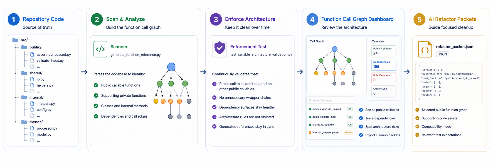
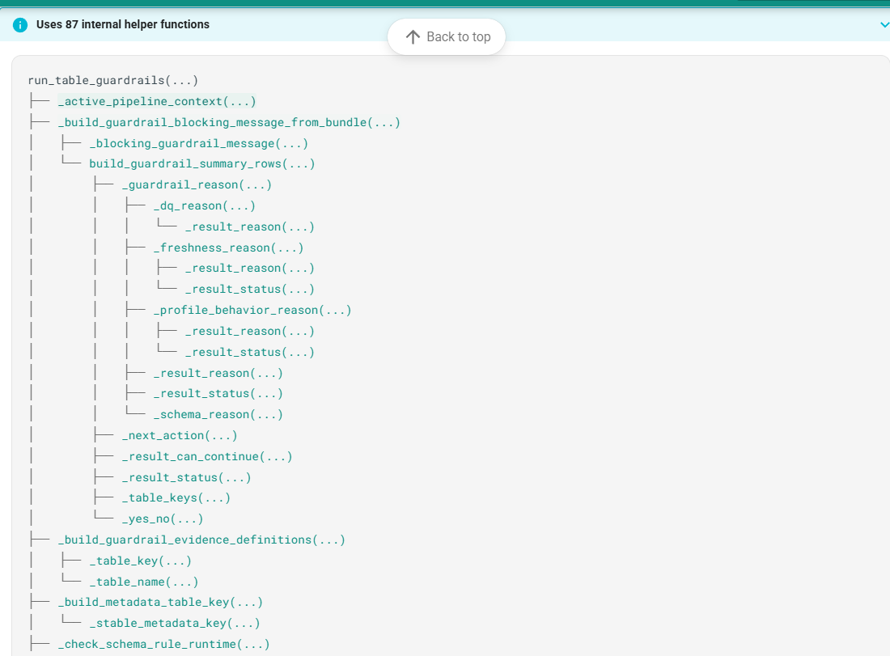
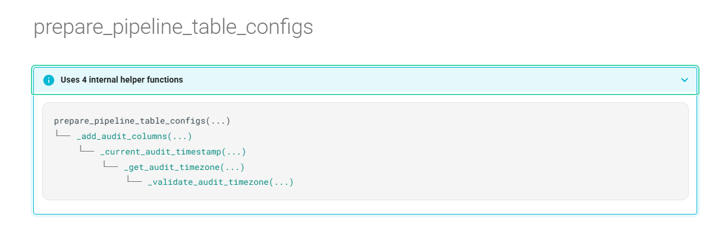
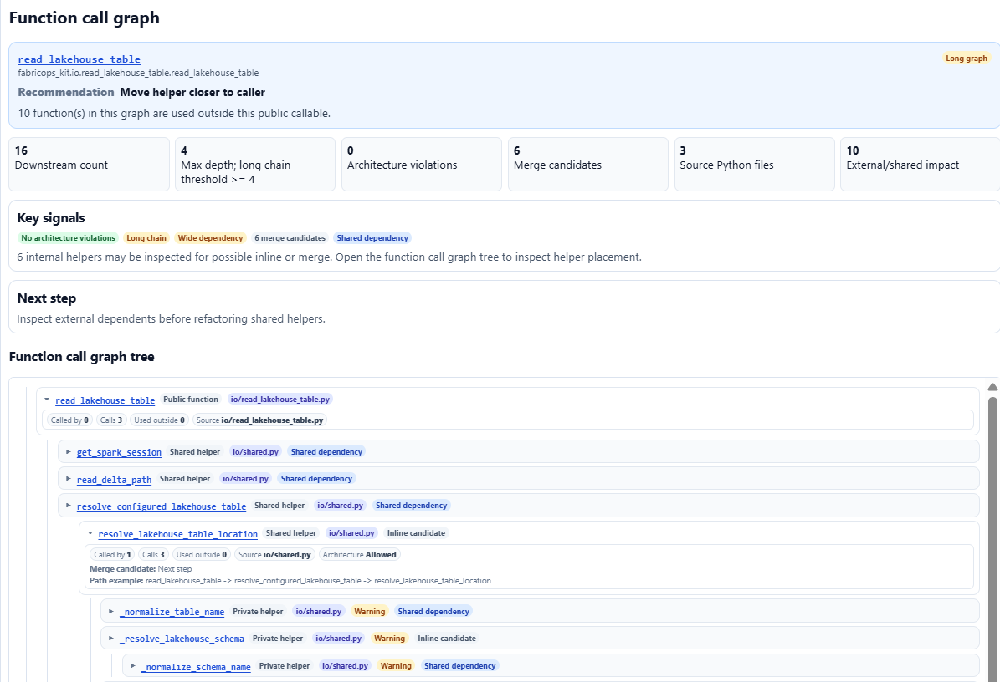
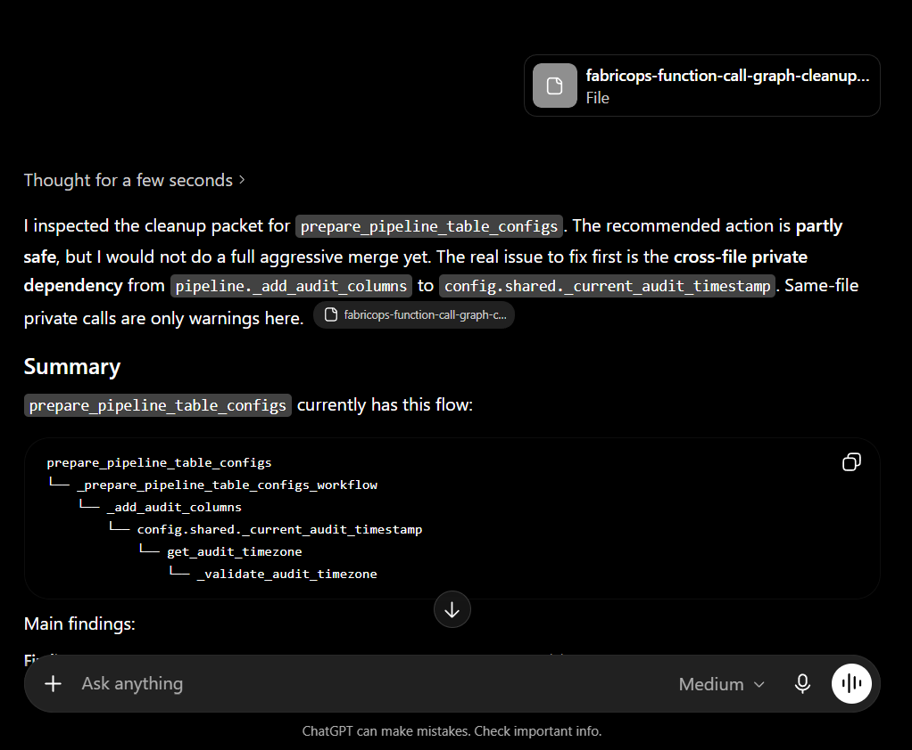

# Function Call Graph

> **First make it exist. Then make it good.**
>
> AI helps FabricOps move quickly from idea to working public callable function:
>
> * create the function quickly
> * test whether the behaviour is useful
> * keep it if the behaviour is worth preserving
> * clean the architecture before the prototype becomes permanent
>
> The Function Call Graph is the maintainability checkpoint that helps us decide whether the implementation is clean enough to keep.

The Function Call Graph helps reviewers inspect public callable functions, understand review signals, and decide the next cleanup step before refactoring.

## How it works

The Function Call Graph follows a simple flow:

```text
Repository Code → Scan & Analyze → Enforce Architecture → Dashboard → AI Refactor Packets
```



## 1. Repository code

The repository is the source of truth.

FabricOps public callable functions, shared helpers, private functions, classes, and internal methods all live in the codebase. The Function Call Graph starts by scanning this code structure instead of relying on manually maintained documentation.

## 2. Scan and analyze

The Function Call Graph is generated from repository scans.

The source scanner is:

* [`scripts/generate_function_reference.py`](https://github.com/Voycepeh/FabricOps-Starter-Kit/blob/main/scripts/generate_function_reference.py)

The scanner reads the codebase and identifies:

* public callable functions
* supporting private functions
* shared helpers
* classes
* internal methods
* dependency edges between functions and modules

The scanner then produces generated review artifacts that make the callable architecture easier to inspect.

The generated review outputs are:

* [Function Call Graph Dashboard](../assets/function-call-graph-dashboard.html)
* [Function Inventory](../assets/function-inventory.html)
* [function-call-graph.json](_data/function-call-graph.json)

## 3. Enforce architecture

AI generated code can work correctly but still leave behind messy integration patterns:

* duplicated helpers
* private functions used across files
* wide dependency surfaces
* public callables depending on other public callables
* long chains of thin wrapper functions

The question is not only whether the code works.

The question is whether the structure is still simple enough to keep.

The Function Call Graph is protected by an enforcement test that keeps the callable architecture intentional as the codebase changes.

The enforcement test makes sure public callables, shared helpers, and generated reference outputs do not drift silently.

The enforcement test is:

* [`tests/contract/test_callable_architecture_validation.py`](https://github.com/Voycepeh/FabricOps-Starter-Kit/blob/main/tests/contract/test_callable_architecture_validation.py)

This helps prevent accidental architecture violations from becoming permanent.

### What the dashboard signals

The Function Call Graph Dashboard is a review surface for public callable cleanup.

It does not treat every signal as a failure. Some signals are architecture issues, while others are maintainability hints that help reviewers decide where to inspect next.

| Signal | What it means | Reviewer action |
|---|---|---|
| Architecture violation | The call graph contains a boundary break that should not be kept. For example, a shared helper calling a public function, or a helper reaching into a private helper owned by another file. | Fix this first before helper cleanup. |
| Long chain | The public callable reaches through a deep helper chain. | Check whether the chain can be flattened or made easier to follow. |
| Many dependencies | The public callable depends on many downstream helpers. | Check whether the function has become too wide or hard to reason about. |
| Shared dependency | The callable uses helper logic that is also used elsewhere. | Check whether the helper belongs in `shared.py` or should stay as local implementation detail. |
| Review for merge | The graph found helper candidates that may be too small, too specific, or only useful to one caller. | Decide whether to keep the helper, move it to shared logic, or merge it into the caller. |

The key distinction is:

| Type | Meaning |
|---|---|
| Architecture violation | A boundary rule is broken and should be fixed. |
| Maintainability signal | The code may still be valid, but it deserves review before refactoring. |

The preferred public callable shape is still:

```text
public owner file → shared.py → internal implementation details
```

The pattern that usually needs review is:

```text
public callable → helper → helper → helper
```

Public callables should remain clean entry points. Shared logic belongs behind them, and private implementation details should not leak across owner boundaries.

This matches what the dashboard actually shows: `Architecture violation`, `Long chain`, `Many dependencies`, `Shared dependency`, and `Review for merge`. The dashboard code builds those exact signals in `flowSignals()`.

### Many dependencies

A public callable can become hard to reason about when it pulls in too many downstream helpers.



### Long nested chains

Long nested chains make it harder to understand where the real work happens.



Because these outputs are generated, update the scanner and architecture rules first, then regenerate the reference artifacts when intentionally refreshing this page.

## 4. Function Call Graph Dashboard

The Function Call Graph Dashboard is the review surface for deciding whether a public callable is clean enough to keep.

After the scanner identifies public callables, supporting private functions, shared helpers, classes, internal methods, and dependency edges, the dashboard turns that scan into something reviewers can inspect.



<div align="center" markdown>

[Open architecture dashboard](../assets/function-call-graph-dashboard.html){ .md-button .md-button--primary }

</div>

The dashboard helps reviewers:

* see all public callable functions in one place
* understand what supports each public callable
* trace where dependencies go
* spot architecture violations and dependency chains that deserve a closer look

## 5. AI refactor packets

When a function is worth refactoring, the Function Call Graph Dashboard can export focused cleanup packets as JSON or YAML.

The Function Call Graph Dashboard exports `fabricops_public_callable_flow_cleanup_packet` for one selected public function graph.

The Function Inventory exports `fabricops_support_inventory_cleanup_packet` for selected function level code assets.

The packet keeps the AI refactor focused on:

* the selected function
* the supporting code assets
* the identified architecture risks
* the compatibility mode
* the relevant test expectations




The cleanup packet gives AI a focused review surface so it can improve the implementation without losing the original intent.

<!-- Test compatibility breadcrumbs: [Function Call Graph Dashboard](../assets/function-call-graph-dashboard.html) [Function Inventory](../assets/function-inventory.html) -->
