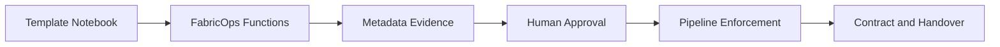

# Function Usage Guide

Use this page when you want to run **real Fabric notebook workflows** with FabricOps Starter Kit.

- **Notebook Structure** is the canonical operating model and template-stage source of truth.
- **Function Usage Guide** explains which FabricOps functions usually support each notebook stage.
- **Callable Function Reference** provides detailed API signatures, parameters, and return behavior.

For notebook ownership, naming, and stage boundaries, use the [Notebook Structure](../notebook-structure/) section as the source of truth. This guide only explains which FabricOps functions usually support each stage.

## Start from the notebook model

Use notebook stages as your entry point, then select functions that support that stage.

- `00_env_config` → environment and workspace setup. ([Notebook Structure: 00_env_config](../notebook-structure/00-env-config/))
- `01_da` → agreement and business context. ([Notebook Structure: 01_da](../notebook-structure/01-data-sharing-agreement/))
- `02_ex` → exploration, profiling, AI-assisted discovery. ([Notebook Structure: 02_ex](../notebook-structure/02-exploration/))
- `03_pc` → pipeline contract, enforcement, run summary. ([Notebook Structure: 03_pc](../notebook-structure/03-pipeline-contract/))
- `04_gov` → governance review and approval evidence. ([Notebook Structure: 04_gov](../notebook-structure/04-governance-enrichment/))

Need notebook-to-function mapping detail? Use the [Template Function Map](template-function-map.md).

## Workflow story: evidence to governed handover

## Function layers in practice

### Setup and config
Use this when starting a notebook and validating environment/runtime context.

### Profiling and metadata capture
Use this when generating structured evidence from source data and writing metadata records.

### AI-assisted suggestions
Use this when drafting candidate DQ rules or governance/business context suggestions.

### Human approval and review widgets
Use this when accepting/rejecting/deactivating suggestions before enforcement.

### Data quality enforcement
Use this when applying approved rules in `03_pc` pipeline execution.

### Drift and schema checks
Use this when comparing current outputs against contract expectations and prior baselines.

### Run summary and handover evidence
Use this when publishing auditable run summaries and handover outputs.

For low-level callable behavior and exact signatures, use the [Callable Function Reference](index.md).

## Which function should I use?

- **I want to set up a notebook** → start from `00_env_config` in [Notebook Structure](../notebook-structure/00-env-config/), then apply setup/config helpers.
- **I want to profile a table** → start from `02_ex` in [Notebook Structure](../notebook-structure/02-exploration/), then apply profiling + metadata capture functions.
- **I want AI-suggested DQ rules** → in `02_ex`, use AI drafting functions, then route to approval.
- **I want to approve/reject rules** → use review/approval functions in the governance review stages.
- **I want to enforce rules in a pipeline** → use `03_pc` contract flow with approved metadata and enforcement functions.
- **I want to produce a handover summary** → use handover/run-summary functions after pipeline checks.

## Practical guidance

- Functions are **not** intended to be run randomly in isolation.
- Templates/notebook stages are the recommended entry point.
- Use this page for practitioner sequence and decision guidance.
- Use [Callable Function Reference](index.md) for API-level detail.
- Use [Developer Reference](../developer-reference/) for internal mechanics.
